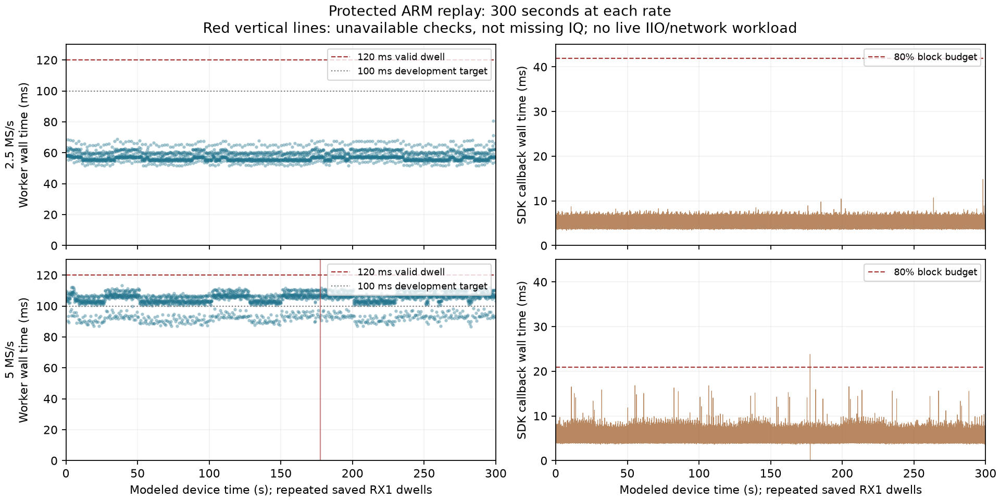
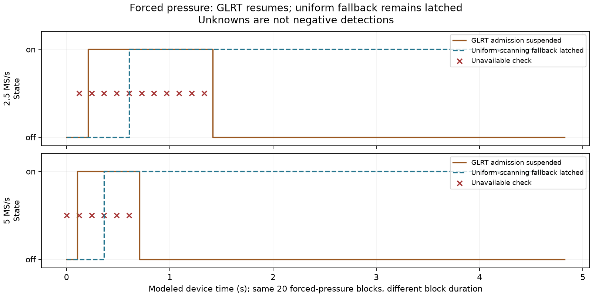

# Capture-first scanner: protected ARM qualification

2026-09-09. Both protected 300-second saved-IQ ARM replays pass. This closes the
protected SDK/queue/scheduler replay gate, not live capture-duty qualification,
independent detection quality, a remote merge or deployment.

## Results

The real RX1 numerical worker, SDK, feedback queue and scheduler thread execute
on the spare Cortex-A9. Every computed fractional result agrees with its frozen
desktop reference. All unavailable records remain explicit UNKNOWN observations;
every scheduling choice agrees with the independent policy model.

| Full 300 s protected ARM replay | 2.5 MS/s | 5 MS/s |
| --- | ---: | ---: |
| Results / observations / choices | 2,479 each | 2,479 each |
| Computed checks | 2,479 | 2,477 |
| Unavailable checks | 0 | 2 |
| Worker wall mean / p99 / maximum | 57.79 / 67.49 / 80.69 ms | 103.20 / 111.01 / 113.28 ms |
| SDK callback wall p99 / maximum | 7.67 / 14.84 ms | 9.43 / 23.83 ms |
| Nominal source block period | 52.429 ms | 26.214 ms |
| Callback pressure threshold | 41.943 ms | 20.972 ms |
| Callbacks over nominal block period | 0 | 0 |
| Source-end feedback age at decision, maximum | 242 ms | 242 ms |
| Sampled peak occupied slots / terminal slots | 2 / 0 | 2 / 0 |
| Worker watchdog trips / clock faults | 0 / 0 | 0 / 0 |

At 5 MS/s, one callback crossed the 80% admission budget. Visit 1467, starting
at modeled source time 177.508 s, became `incomplete_search`; the following visit
became `invalid_input` because recovery did not have its complete history. Both
have zero search coverage and unhealthy UNKNOWN observations, not an invented
miss or positive. Four advisory history blocks were omitted, and admission
resumed once. Neither this interruption nor the two unavailable records are
missing-IQ measurements. The replay retains all result and scheduling records.

The 5 MS/s worker remains above the 100 ms development target at p99. Average
worker numerical CPU is 98.92 ms per computed check (52.79 ms at 2.5 MS/s).
Acquisition and worker execution are asynchronous; their percentiles must not
be summed into a serial hop budget. Full production contention is still untested.

## Deliberate overload and recovery

Each rate also passes a 4.840 s normal preflight with all 40 checks computed and
a separate 4.840 s forced-pressure test. The latter asserts pressure on blocks
4 through 23; the same block count lasts twice as long at 2.5 MS/s.

| Forced-pressure replay | 2.5 MS/s | 5 MS/s |
| --- | ---: | ---: |
| Results / observations / choices | 40 each | 40 each |
| Computed / unavailable | 29 / 11 | 34 / 6 |
| `incomplete_search` / `invalid_input` | 10 / 1 | 6 / 0 |
| Omitted advisory history blocks | 23 | 23 |
| Pressure entries / resumptions | 1 / 1 | 1 / 1 |

Three consecutive unhealthy observations latch uniform scanning for the rest
of the capture. GLRT subsequently resumes and produces positives, but does not
unlatch uniform fallback. Unknowns break miss streaks without refreshing the
last-positive epoch. The independent verifier reconstructs pressure, four-block
recovery and every policy choice from the actual receipt stream.

These tests inject the pressure hint, not a stopped worker or saturated network.
The earlier desktop exact-clock tests cover stopped-worker/watchdog boundaries;
this ARM matrix does not newly qualify that fault on the device.

## Exact scope and device provenance

The runtime implementation is Leo `5bcd3d56` and libiio `a1088b6`. This follow-up
adds an explicit protected research replay mode, typed diagnostics verification
and component-owned integration tests. Old replay modes remain strict and reject
the new protected schema unless opted in. No detector threshold, IQ, golden
fixture, 120 ms valid dwell or production default changes.

As in the [earlier threaded ARM replay](2026_09_09_scanner_threaded_arm_checkpoint.md),
16 already-opened, positive-rich saved RX1 dwells per rate repeat in original
target order. The producer models a 1 ms guard, 131,072-sample blocks, two-block
metadata delay and 40 ms jitter every fourth block. Recall hardware is mocked;
adaptive proposals do not select or relabel saved IQ. The normal saved sequences
never demote targets, so adaptive allocation benefit is not demonstrated here.
Callback timing covers SDK calls, not full provider/network/IRQ/DMA processing.
Neither modeled timing coverage nor detector completion percentage is RF duty.

Only serial `winbond-db620818a328172c`, physical LAN `192.168.1.14`, was accessed.
The first ownership attempt encountered another task's live 60 MS/s canary and
did not interrupt it. After that process ended, exact serial/MAC/boot/LAN identity,
idle buffers and client absence were verified under the shared radio lock.
The user-accepted per-boot SSH key was pinned locally with strict checking.

The device already had `glrt-eth-r60000000-v1` firmware and a new boot before our
uploads. That differs from the previous qualification environment; do not
attribute timing differences solely to this software change. This task did not
flash firmware or FPGA, reboot the device or change installed software.
USB enumeration no longer exposed the spare locally. The CPU-only replay used
current LAN identity plus a recorded historical physical-USB mapping, and makes
no claim that USB recovery is currently available.

Runs were sequential at inherited affinity on two cores, nice 10, with one
read-only process/memory snapshot each. SSH transport and snapshots add load;
outliers are retained. Snapshot parent/worker RSS was 31,200/11,104 KiB at
2.5 MS/s and 50,752/19,192 KiB at 5 MS/s. These include shared pages and research
pack storage, not unique incremental production memory. Available memory in
those snapshots was 345,880/322,280 KiB, not a minimum-headroom guarantee.

## Tests, evidence and cleanup

The new protected and original threaded integration selection passes 33 tests;
the final original SDK replay regression passes 122 tests. Neither selection is
added to previous checkpoint totals as if all were independent. Early integration
attempts exposed reused fixture output paths and an incorrect no-pressure timing
assumption on the shared desktop. The fixture now uses a unique directory;
functional verification permits measured pressure only with exact accounting.
Failed JUnit receipts are retained. Numerical expectations were not weakened.
Ruff, formatting and warning-as-error desktop/ARM builds pass.

The [evidence index](evidence/2026_09_09_scanner_protected_arm/index.json) retains
163 compressed recipes, builds, raw streams, identities, successful and failed
test receipts, snapshots and cleanup. Publication reruns all six stream verifiers
and checks build/source/input hashes. Two figures and derived timings are hashed.
IQ, executables, libraries, credentials and SSH key files are not committed.

All eight uploaded RAM-only artifacts and their exact owned directory
`/tmp/leo-protected-bench.z1coxD` were removed after inventory, hash and idle
checks; local originals remain. Cleanup has no errors or retained remote scratch.
Installed iiOD and dependency hashes are unchanged; the ownership lock is released.

Next: qualify independent saved-RF quality, including misses and recovery; build
and test the exact compatible protected provider/host release under full streaming
load; then, with separate bounded RF authorization, compare detector off/on and
fixed/adaptive live duty. Remote merges, opt-in deployment, real recording/UI,
20-minute-cadence analysis capacity and rollback verification remain open.
