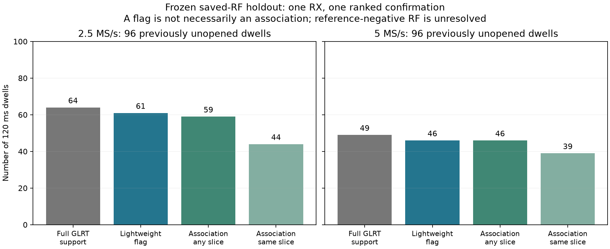
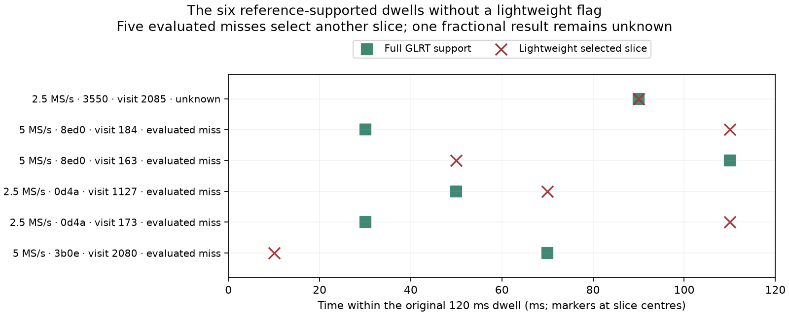

# RX1 lightweight GLRT: independent saved-RF dwell evaluation

2026-09-09. A frozen, previously unopened split of **192 full 120 ms dwells**
supports proceeding to bounded operational testing. It does not establish
satellite truth, operational false-alarm probability or live capture duty.
No thresholds or detector implementation changed during or after this evaluation.

## Results

| Evidence across complete dwells | 2.5 MS/s | 5 MS/s |
| --- | ---: | ---: |
| Saved dwells evaluated | 96 | 96 |
| Full fractional GLRT support in at least one slice | 64 | 49 |
| Lightweight flag on a reference-supported dwell | 61/64 (95.3%) | 46/49 (93.9%) |
| CFO/epoch association to a reference anywhere in that dwell | 59/64 (92.2%) | 46/49 (93.9%) |
| Association in the selected slice / reference-supported selected slices | 44/48 | 39/39 |
| Evaluated miss despite reference support elsewhere | 2 | 3 |
| Unknown despite reference support | 1 | 0 |
| Total lightweight flags, including unresolved RF | 66 | 47 |
| Flags without any full-GLRT support in the dwell | 5 | 1 |
| Flags without a within-dwell reference association | 7 | 1 |

Flag recall is not association recall: a detector can flag a dwell but select
a different CFO/epoch candidate. Likewise, reference-negative RF is unresolved,
not proven absent. The eight flags without a within-dwell association remain
unresolved disagreements; this experiment must not call them eight false alarms.
The four sessions and adjacent dwells are correlated observations, not 192
independent signal trials suitable for a binomial operational-confidence claim.

## Frozen selection and method

The [protocol](../config/analysis/arm-presence-dwell-rf-holdout-v1.json) selects
the four newest complete qualified captures published before 17:50 UTC in the
metadata-only history inspection. These sessions had not been used by this
task's detector-development reports/configurations before selection:

| Capture UTC, 2026-09-09 | Session | Rate |
| --- | --- | --- |
| 17:40 | `scan-hop-24351823e2483b0e` | 5 MS/s |
| 17:20 | `scan-hop-571d32dfad9a0d4a` | 2.5 MS/s |
| 17:00 | `scan-hop-8fce993bbb5c8ed0` | 5 MS/s |
| 16:40 | `scan-hop-22e58b4e4dcc3550` | 2.5 MS/s |

Each session contributes sweeps 20, 21, 22, 23, 140 and 260, all eight targets.
The first four provide adjacent visits for miss-streak checks; the other two
sample middle/late capture conditions. Selection does not use signal strength,
detector outcomes or reference scores. Protocol, exact source manifests,
numerical sources, tool and library are hashed before the first IQ read/scoring.

`PersistentHopAnalysisInputStore` and `PersistentHopIqStore.open_read_only` supply
original valid CI16. The archive is not modified. Local group access was used
after the initial unprivileged metadata read hit filesystem permissions; no
archive ownership or permissions changed. Both receivers remain recorded, but
only original RX1 is copied into this analysis. Counters remain exact decimal
strings; fractional epochs and local within-dwell offsets stay separate.

The detector is the existing `amplitude-diverse-symbol-supported` variant:
512-bin whole-dwell screening, one blindly selected 20 ms confirmation, complete
fractional estimate, exact score at least 0.175 and exact-minus-control margin
at least 0.025. The reference independently performs eight-candidate acquisition
and fractional GLRT in **all six 20 ms slices** (1,152 reference windows total).
Reference support uses its existing margin threshold 0.025, without adopting
the lightweight detector's extra exact-score cutoff.

The primary same-slice association uses the existing 8 kHz CFO / 2 microsecond
circular epoch tolerances. A separate descriptive post-processing check compares
against every reference slice in the same dwell, adding original local slice
offsets before the circular comparison. It does not join channels, infer a
satellite ID or use a fitted Doppler trajectory as an acquisition seed.

## What the misses tell us

All five evaluated misses choose a slice different from the one carrying full
GLRT support. This is a ranking/coverage opportunity, not evidence that a lower
score threshold is the right fix. The sixth missing flag is an incomplete
fractional estimate on CH2U at 2.5 MS/s; it correctly remains UNKNOWN.

There are seven overlapping three-miss runs in the contiguous selected sweeps.
None of their constituent dwells has full-GLRT reference support. Unread sweeps,
positives and unknowns break these descriptive sequences. This is encouraging
for the three-miss rule, but it is not an executed adaptive policy trial: the
test does not reconstruct unseen history, actual feedback arrival or cooldown
state across the gaps, nor does it invent the IQ a different schedule would
have captured. Source-supported individual misses remain a reason to retain
cooldown, exploration and conservative unknown handling.

The six reference-negative flags and two other unassociated flags need continued
monitoring during shadow verification. Full GLRT itself is not a perfect oracle.
The earlier synthetic controls remain the evidence with actual model truth;
these RF recordings add an independent reference-relative comparison, not an
operational false-alarm certificate.

## Runtime, tests and reproducibility

Desktop native whole-dwell median/p99 is 0.982/1.137 ms at 2.5 MS/s and
1.860/2.134 ms at 5 MS/s in this run. These measurements do not replace actual
ARM timing or include full reference processing, archive decompression, IIO,
networking or recording. The [protected 300-second ARM checkpoint](2026_09_09_scanner_protected_arm_checkpoint.md)
provides the separate real-device timing and overload evidence.

The new component-owned accounting selection passes **22 tests**. It checks
fixed geometry/thresholds, rate balance, fractional association, selected versus
any-window support, inclusive boundaries, unknown versus miss and streak breaks
at unread data. No hardware/database requirement is silently skipped.

The [evidence index](evidence/2026_09_09_scanner_rf_dwell_holdout/index.json) retains
the freeze, complete results, build receipt, tests and post-processing recipe,
plus two hashed PNGs and derived associations. The audit rechecks all 192 IQ
hashes, original ordering/source identities, every comparison, summary and
source/build hash. Approximately 333 MB of generated local artifacts, mostly
192 original RX1 excerpts, remain at `/tmp/leo-rf-dwell-holdout.nGW0uq/evaluation`.
No IQ, executable or secret is committed. No new RF was collected.

This split is now opened. Future detector tuning must treat it as evaluation/
diagnostic evidence, not continue calling it a fresh holdout. The results support
a bounded live shadow/fixed-on test with unchanged acquisition geometry before
adaptive rollout. They do not close live-duty, deployment or rollback gates.
