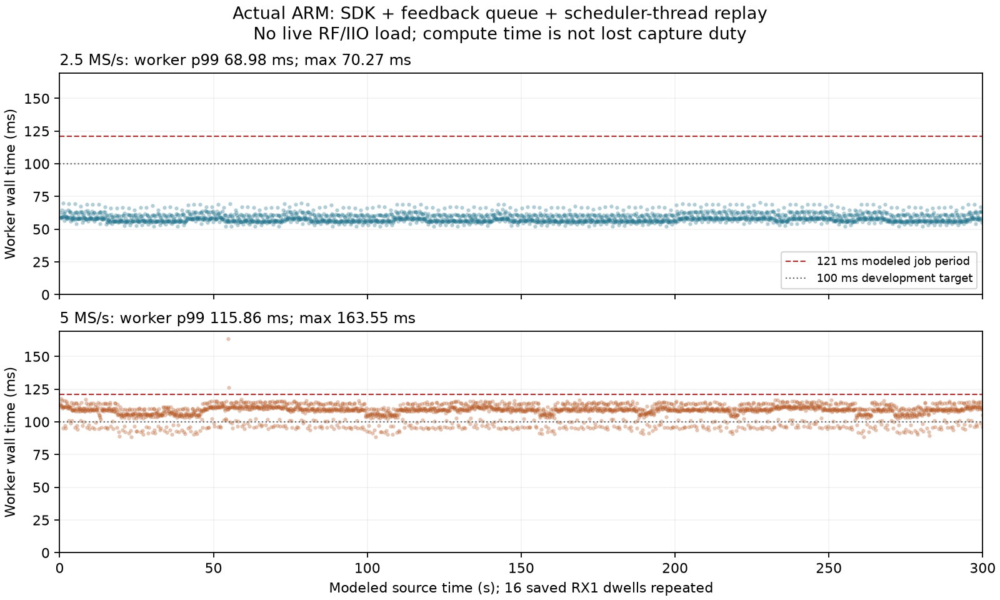

# RX1 scanner: full-duration ARM feedback integration

2026-09-09. Implementation `ad55e313`. **Both 300-second saved-IQ ARM replays
pass**, with 2,479 complete results, observations and scheduler choices per
rate. This is userspace research qualification, not live RF, a production
package deployment, an independent detector holdout or a live-duty result.

## Outcome

The [desktop checkpoint](2026_09_09_scanner_threaded_shadow_checkpoint.md)
now has a corresponding real Cortex-A9 execution: the current numerical worker,
SDK collector, libiio feedback queue, native policy and scheduler thread run
together on the exact spare. Every fractional wire result and scheduling
observation matches the frozen desktop reference, and every scheduler decision
matches the independent Python policy model. No numerical thresholds or
production code changed in this follow-up.

| Full 300 s ARM replay | 2.5 MS/s | 5 MS/s |
| --- | ---: | ---: |
| Complete results / observations / choices | 2,479 each | 2,479 each |
| Worker wall mean / p99 / maximum | 58.71 / 68.98 / 70.27 ms | 107.50 / 115.86 / 163.55 ms |
| Worker numerical CPU mean | 53.76 ms | 103.71 ms |
| SDK callback wall p99 / maximum | 8.00 / 11.90 ms | 9.59 / 19.59 ms |
| Nominal producer block period | 52.429 ms | 26.214 ms |
| SDK callbacks exceeding block period | 0 | 0 |
| Scheduler choice wall p99 / maximum | 0.0398 / 0.1762 ms | 0.0450 / 0.1422 ms |
| Input-ready callback to observation p99 / maximum | 152.65 / 154.28 ms | 176.12 / 192.25 ms |
| Source-end feedback age at decision p99 / maximum | 242 / 242 ms | 242 / 242 ms |
| Worker calls exceeding 121 ms | 0 | 2 |

The 5 MS/s run preserves every result despite two long worker calls, at visits
452 and 453: 163.55 and 126.42 ms. Average processing stays below the 121 ms
modeled job period, and the asynchronous pipeline absorbs these particular
outliers without growing source-time feedback age. This does not mean arbitrary
overload is safe. No busy, failed, dropped, duplicated or misbound result is
accepted by the strict successful-run verifier.

**5 MS/s headroom remains the principal runtime concern.** Its measured numerical
CPU averages about 86% of one core over the replay, before counting other worker
overhead, production acquisition, retuning or networking. The 115.86 ms worker
wall p99 exceeds the 100 ms development target; approximately 14% lower p99 would
reach that target on this workload. There is no basis yet for claiming that
live acquisition fits the remaining margin.

The worker and acquisition callback execute asynchronously on an available
two-core CPU set; their percentiles must not be added as a serial hop budget.
Callback wall time totals about 10.2%/21.9% of modeled elapsed time at 2.5/5 MS/s.
That is not CPU utilization or lost RF duty. The mean numerical CPU figures and
raw per-call CPU clocks are retained separately; per-call CPU timing is not an
independently qualified precision clock.

## Exact workload and scope

Use the same positive-rich development packs as the desktop checkpoint: 16
original saved RX1 dwells per rate, including nine positives at 2.5 MS/s and ten
at 5 MS/s, with positive examples on both edges. Their original targets and
fractional reference candidates remain unchanged. These selected dwells repeat;
2,479 results are not 2,479 independent signal trials or new recordings.

The current ARM worker is freshly built with the same frozen numerical flags.
The previously cross-built SDK and threaded replay binaries are reused only
after checking their binary and current source hashes. The numerical worker
uses the hash-pinned ARM FFTW library staged alongside it. Algorithm identity
binds this ARM binary, not the different desktop executable; configuration
identity retains the same frozen workload/profile.

The sequence is a 4.840 s preflight at each rate, then 300 s at 5 MS/s followed
by 300 s at 2.5 MS/s. All four executions pass: **5,038 complete results,
observations and choices total**, of which 4,958 belong to the long runs.
The runs are sequential, at nice level 10 with inherited affinity, not randomized
thermal trials. One read-only process/CPU/memory snapshot is taken during each
long run. SSH control, result transport and these diagnostic snapshots contribute
some load; the outliers are retained, not filtered. The large 5 MS/s outlier is
near the snapshot interval, but this is not a controlled causal attribution.

The producer still models 120 ms valid dwells plus a synthetic 1 ms guard,
131,072-sample blocks, two-block metadata delay and 40 ms delivery jitter every
fourth block. RX0/guard padding, dummy recall frequencies, quantized clock and
recall callbacks are synthetic. No IIO receive buffer, RF retune, production
OPENM/provider/network composition or counterfactual adaptive IQ is exercised.
Neither this model's visit count nor its synthetic guard proves radio duty.

SDK/policy allocation setup took 85.06/121.34 ms in the long 2.5/5 MS/s runs.
This excludes initial saved-pack loading and the later scheduler-thread launch;
it is not complete cold-start latency. Terminal receipts arrive at 300.187 and
300.222 s, including final drain/output, respectively.

## Feedback and policy behavior

Every offered observation is recorded exactly once. At each rate, 2,476
observations are applied before the last choice; the final three have no later
hop to influence and remain fully recorded. No phantom hop is created to consume
them. The maximum offered-but-not-in-basis prefix at choice-end snapshots is
zero; this is a logical prefix measurement, **not direct maximum queue occupancy**.
All consumed feedback remains inside the one-second source-end limit.

The long-run outcomes match the desktop: detected/miss/healthy-unknown counts
are 1,394/775/310 at 2.5 MS/s and 1,550/465/464 at 5 MS/s. As explained in the
desktop report, these repeated sequences never accumulate enough consecutive
misses to demote a target. Proposals therefore match fixed order throughout.
The separate desktop synthetic integration and policy tests exercise weighting
and cooldown; **this ARM workload does not demonstrate adaptive RF allocation
benefit or qualify all transition/fault paths under ARM load**.

## Identity, memory and cleanup

The user confirmed that the spare's SSH key rotates on reboot. A new task-local
key file pins this boot with strict checking still enabled. Historical pins
were not overwritten, and host checking was not disabled globally. The exact
serial `winbond-db620818a328172c` is checked both at USB path `5-1` and over
physical LAN `192.168.1.14`, under the public shared ownership lock.

An initial read-only preflight stopped on the old Ethernet MAC expectation.
The serial matched; the current MAC is `00:0a:35:00:01:22`. Subsequent checks
pin that current value alongside the serial, USB attachment, LAN address and
SSH key. The failed preflight receipt is retained. Buffers, network clients,
competing processes and resource availability are checked before execution
and again before cleanup. Other radios and excluded serials remain untouched.

One-shot process RSS was 30,544/50,476 KiB for the replay parent and
11,052/19,188 KiB for the worker at 2.5/5 MS/s. Available memory was
347,188/322,768 KiB. These are snapshots, not minimum-headroom measurements.
The parent holds saved IQ and research receipts; parent and child also map
shared pages, so RSS values must not be summed as unique production memory.
Separate lifetime high-water receipts are retained and must not be confused
with these snapshots or isolated collector allocation.

All eight staged files and their exact private RAM-only directory
`/tmp/leo-threaded-bench.goNbew` were removed after idle, inventory and SHA checks.
Their original local inputs remain available. Cleanup reports no errors or
retained remote scratch, and the radio lock is released. Installed iiOD, FFTW
and core-library hashes are unchanged before/after. No firmware, FPGA, kernel,
installed package, production service, persistent configuration or RF state was
changed by the test. The new local SSH pin is retained for this task.

## Evidence and next gates

The [evidence index](evidence/2026_09_09_scanner_threaded_arm/index.json)
retains 119 compressed recipes/receipts, exact build and input identities,
short/long raw streams, strict verification results, snapshots and cleanup.
The figure and derived timing table are separately hashed. IQ, executables,
templates and host-key files are not committed. Raw work is retained under
`/tmp/leo-threaded-arm.XOCIEB2H`. Publication re-verifies all four streams,
build/source/dependency identities, unchanged inputs and successful cleanup.

No runtime implementation changed, so the earlier 1,009 portable and five
libiio integration tests are previous-checkpoint evidence, not a newly rerun
suite here. This follow-up adds four actual ARM execution/parity checks.

Next: address 5 MS/s headroom without changing the 120 ms signal coverage or
quiet/unknown semantics; measure the exact installed userspace composition's
queue/memory and startup behavior; qualify an independent saved-data quality
split; then obtain separate bounded RF authorization for live fixed/adaptive
comparisons. Compatible merge, opt-in deployment, real recording/UI checks and
rollback verification remain open. Nothing was pushed to remote main or deployed
by this checkpoint.
