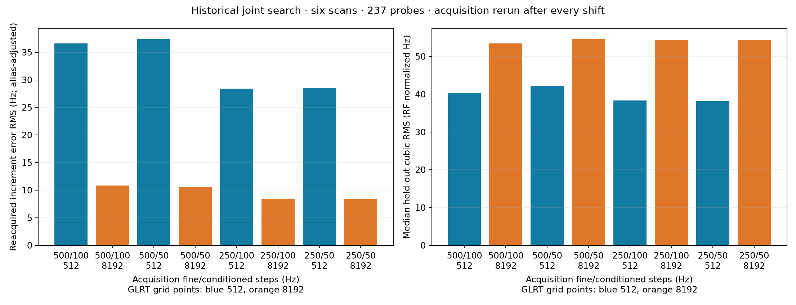

# Joint acquisition and GLRT replay on historical IQ

Eight configurations were replayed on six stored nominal 300-second scans,
using 237 probes on six 32–50 second candidate tracks. Acquisition was rerun
after every imposed frequency shift. The raw replay completed in 496 seconds;
no new RF recording or production configuration change was made.

**The finer acquisition step is worth following up.** At the 512-point GLRT
grid, changing the acquisition fine step from 500 to 250 Hz while retaining
the 100 Hz conditioned step improved held-out cubic consistency on five of
six tracks. Increasing GLRT to 8192 again improved known-shift recovery, but
did not consistently improve real-track cubic residuals. Neither measurement
establishes absolute Doppler accuracy.

## Results

The same 237 unshifted probes and 96 shifted comparisons were recovered by all
eight settings. There was no error clipping and no missing-probe advantage.
Every row uses a 20 ms input window, 64 pilot symbols per frame, and eight
retained acquisition candidates. Fine and conditioned steps below are
acquisition frequency-search spacings, in Hz.

| Fine step | Conditioned step | GLRT points | Known-shift RMS, Hz | Median held-out cubic RMS, Hz | Paired cubic RMS ratio to baseline (95% interval) |
|---:|---:|---:|---:|---:|---:|
| 500 | 100 | 512, baseline | 36.59 | 40.23 | 1.000 |
| 500 | 100 | 8192 | 10.85 | 53.43 | 1.001 (0.656–1.470) |
| 500 | 50 | 512 | 37.41 | 42.23 | 1.040 (0.959–1.114) |
| 500 | 50 | 8192 | 10.57 | 54.61 | 1.010 (0.671–1.478) |
| 250 | 100 | 512 | 28.42 | 38.34 | 0.936 (0.895–0.982) |
| 250 | 100 | 8192 | 8.42 | 54.39 | 1.016 (0.675–1.479) |
| 250 | 50 | 512 | 28.55 | 38.17 | 0.964 (0.904–1.031) |
| 250 | 50 | 8192 | 8.38 | 54.35 | 1.017 (0.677–1.479) |

Known-shift RMS pools all 96 paired increments in native CFO Hz. Cubic RMS is
normalized to 11.2 GHz RF. Its median is over six separate tracks; the paired
ratio is the geometric mean of six within-scan ratios, so it need not equal
the ratio of the two medians. Intervals use 2,000 scan-cluster bootstrap draws,
with no correction for testing multiple configurations. These are exploratory
intervals on a small, selected cohort.



The grid-only change lowers known-shift RMS by 70.4%, from 36.59 to 10.85 Hz.
The paired scan-level increment ratio is 0.367 (95% interval 0.242–0.524).
Combining the 250 Hz acquisition fine step with 8192 gives 8.42 Hz, but this
does not translate into lower median cubic residuals. Halving the conditioned
step adds little to the 8192 result and does not demonstrate a consistent
benefit on tracks.

## Track-by-track comparison

These are the longest primary receiver/edge lanes selected from each scan,
not multi-lane stitched versions of the three earlier highlighted satellites.
All values below are held-out cubic RMS in RF-normalized Hz. Candidate
association and the original unwrapped frequency branch remain conditional
on the baseline analysis.

| Scan suffix | Rate, Msps | Span, s | Probes | 500/100/512 | 500/100/8192 | 250/100/512 | 250/100/8192 |
|---|---:|---:|---:|---:|---:|---:|---:|
| fb52971f6bb09c12 | 2.5 | 32.2 | 33 | 119.98 | 51.74 | 109.16 | 52.34 |
| 24581756098baa21 | 2.5 | 34.2 | 35 | 35.17 | 55.13 | 30.56 | 56.45 |
| 8a1c00acfc8fbc31 | 2.5 | 42.2 | 43 | 36.66 | 59.52 | 35.38 | 59.84 |
| 432b03933b8c76bf | 5.0 | 40.3 | 41 | 43.81 | 45.58 | 41.30 | 48.95 |
| cabca9c4f49c5a27 | 5.0 | 50.3 | 51 | 118.15 | 72.08 | 123.16 | 74.64 |
| 862a183b8ab422da | 5.0 | 33.2 | 34 | 30.38 | 43.98 | 27.24 | 41.51 |

The grid-only change helps two relatively noisy tracks and worsens four
quieter tracks. The 250/100/512 setting improves five tracks, with an
exploratory geometric mean RMS reduction of 6.4%. A lower cubic residual can
also reflect estimator smoothing or correlated error; the cubic is not
independent ground truth.

## What was frozen and replayed

The source cohort is the existing September 9 00:40 through September 10
00:40 UTC survey. Before reading IQ for this experiment, the plan excluded
scans used in the previous 12-track raw sweeps and the three highlighted
long trajectories. It selected three evenly time-spaced eligible scans per
sample rate, choosing each scan's longest primary lane of at least 30 seconds
and retaining all its source probes. The saved plan contains full scan and
track IDs, evidence hashes, configurations and imposed shifts.

These six scans had already been seen in the original baseline survey. They
are new raw replays, not a fully untouched validation set, and the longest
baseline-selected tracks may favor successful detections. One primary lane
per scan is analyzed; this is not an exhaustive rerun of every historical
probe or a new window/stride sweep.

For each scan, the probes at one-third and two-thirds of its selected lane
received eight deterministic, probe-specific stratified offsets over
[-2000, 2000) Hz. Complex rotation was applied to the stored IQ before fresh
acquisition. There are 12 source probes and 96 imposed-shift comparisons per
configuration. Those 96 comparisons are not 96 independent radio recordings.
The shift offsets are spread across the range, rather than repeating the
earlier ±137 and ±301 Hz values.

Four acquisition configurations were run for each of the 333 original or
shifted IQ inputs. Both GLRT grids then independently refined fractional
timing from each acquisition result. This gives 1,332 acquisition runs and
2,664 profile observations. The unchanged controls include the 80 kHz coarse
step, ±80 kHz fine radius, ±2 kHz conditioned radius, five-sample candidate
epoch separation, 10 kHz candidate CFO separation, and 0.025 GLRT margin.
Acquisition uses the same zero calibration convention as the prior replay.

Target association selects the passing candidate with maximum exact GLRT
score within two integer samples of the original target epoch, accounting for
the circular frame boundary. It uses neither an expected shifted frequency
nor a fitted trajectory. Thus acquisition is fresh, but target identity still
uses baseline timing. All candidates and the unrestricted maximum-score
candidate are also retained. At the baseline settings, all 237 persisted
original CFO values are reproduced somewhere in the candidate lists; choosing
the maximum score in the timing neighborhood can select a different candidate.

## References, failures and alias handling

For the imposed-shift test, the exact reference is the applied change:

```text
increment error = CFO(shifted IQ, fresh acquisition)
                - CFO(original IQ, fresh acquisition) - imposed shift
```

This measures translation consistency of the full acquisition/GLRT path for
the associated target. It is still differential: shared bias, interference,
timing errors and receiver effects can cancel. It does not create an absolute
frequency or orbit reference.

Both raw errors and errors adjusted by the known 227,272.727 Hz pilot alias
period are saved. No target or unrestricted-winner comparison changes alias
branch in this run, so the raw and alias-adjusted RMS values are identical.
All 96 target comparisons pass for every configuration; none has an absolute
increment error above 500 Hz. No errors are removed from the RMS.

The unrestricted winner lies outside the selected target timing neighborhood
on 15/237 unshifted probes at grid 512 and 14/237 at grid 8192, for all four
acquisition settings. That is an association ambiguity, not a verified switch
to another satellite. Unrestricted winners also support all 96 shifted
comparisons; their RMS values, in table order, are 36.66, 10.63, 37.91, 10.31,
28.43, 9.59, 28.55 and 9.55 Hz. Those results do not establish target identity.

For track consistency, each setting fits its own cubic to the other four
folds and predicts the held-out fold. Five folds comprise whole three-second
blocks, assigned with the original probe support-center times identically
across configurations. Evaluation uses each setting's independently refined
support-center timestamps. Changes from the original CFO are put on the
nearest original pilot-alias branch and normalized to 11.2 GHz. All 237 points
are shared; there is no frequency-error gate, robust clipping or trajectory
feedback into candidate selection. Smooth model mismatch and real transmitter
variability remain part of these residuals.

The earlier 181.6 → 6.8 Hz experiment held acquisition and timing fixed while
shifting the IQ. This experiment changes the cohort, offset distribution,
timing refinement and acquisition policy. In particular, the GLRT residual
frequency grid is centered on the acquisition estimate; fresh acquisition
moves that center with the shift. The acquisition fine peak is quadratically
interpolated, so final CFO is not confined to one fixed absolute 443.9 Hz grid.
Consequently the new 36.6 Hz baseline is not directly comparable to the earlier
181.6 Hz baseline. Both experiments show a gain in shift response at 8192,
while neither proves equivalent gains in absolute track accuracy.

## Compute cost and next step

At the baseline acquisition settings, median timings per unshifted probe were:

| Sample rate | Acquisition | GLRT 512, all candidates | GLRT 8192, all candidates |
|---|---:|---:|---:|
| 2.5 Msps | 109.8 ms | 34.1 ms | 40.1 ms |
| 5 Msps | 414.3 ms | 47.4 ms | 52.8 ms |

Both grids share the same acquisition run in this experiment. These are local
single-thread measurements in a fixed execution order, with warm-cache and
machine-load effects; they are not a randomized performance benchmark. The
8192 grid adds about 5–6 ms to the measured GLRT stage. Fine/conditioned
acquisition timings for every profile are retained in `summary.json`; the
observed ordering does not justify claiming that finer acquisition is faster.

The next bounded historical validation should freeze three configurations:
500/100/512, 250/100/512, and 250/100/8192. Test those on another day and include
weak or short detections, with a declared association policy and failure
denominator. Keep absolute-frequency validation separate: use a synthetic
known-pilot signal with exact CFO/rate/timing in historical noise, or a suitably
calibrated independent reference. The present evidence supports investigating
250 Hz acquisition and retaining 8192 as a precision candidate; it does not
support changing the production default on cubic RMS alone.

## Artifacts and reproduction

- [Frozen plan](plan.json), including source-evidence hashes and full configurations.
- [Summary CSV](summary.csv) and [full numerical summary](summary.json).
- [Comparison PNG](joint-comparison.png).
- `raw/*.json`: all candidates, margins, estimates, selections, timings and storage manifest bindings.
- [Analysis receipt](analysis-receipt.json) and [artifact hashes](SHA256SUMS).

From the repository root, with read access to the existing stored captures:

```sh
PYTHONPATH=src:tools OPENBLAS_NUM_THREADS=1 python tools/replay_historic_glrt_joint.py \
  --source reports/2026_09_10_scan_24h_glrt_rms \
  --previous reports/2026_09_10_scan_glrt_search \
  --output reports/2026_09_10_historic_glrt_joint --max-seconds 900
PYTHONPATH=src:tools OPENBLAS_NUM_THREADS=1 python tools/summarize_historic_glrt_joint.py \
  --output reports/2026_09_10_historic_glrt_joint
```

The plan binds absolute local evidence paths and rejects a changed selection.
Completed raw scan files are reused. Use a separate output directory to
perform a fresh replay or bind the source files in another checkout. Storage
is opened through its read-only adapter; no raw IQ is copied into this report.

Validation: the nine new selection/increment/inventory tests and 37 existing GLRT
experiment tests pass (46 total). Ruff lint and format checks pass for the new
tools and tests. Inventory checks require all six scans and every unshifted
profile/probe pair before aggregation; artifact checks additionally verify
the frozen shift cases, selected candidates and source hashes.
