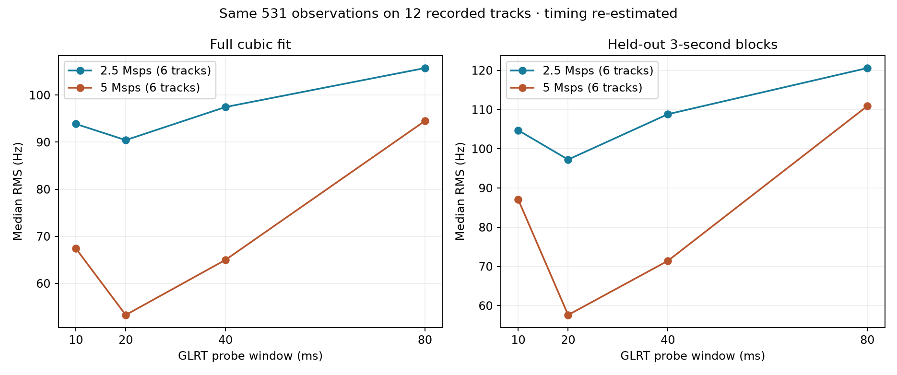
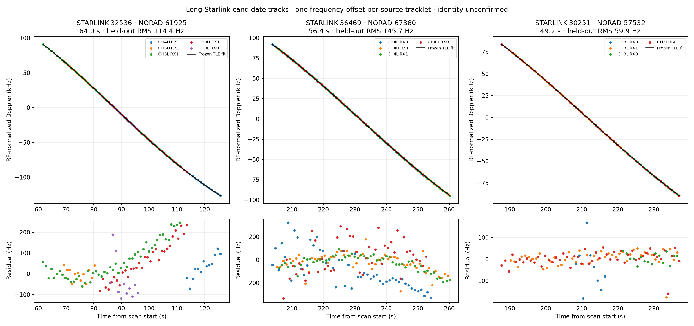

# Last 24 hours of 300-second scans: long Starlink candidates and GLRT RMS

**Keep the 20 ms probe window as the current default.** In a paired replay of
12 recorded tracks, 20 ms gives the lowest median cubic-fit RMS and lowest
median error on held-out time blocks among 10, 20, 40, and 80 ms windows.
Longer integration does not improve this sample. A 4096-point frequency grid
has some promising chronological prediction results, but does not establish
a consistent improvement in track RMS over the current 512-point grid.

The most consequential fitting choice is allowing the long Doppler curve to
bend: across 252 episodes of at least 30 seconds, median full-fit RMS is
738.5 Hz for a line, 340.6 Hz for a quadratic, and **99.7 Hz for a cubic**.
The best supported longer handoff candidate spans **64.0 seconds** and fits
STARLINK-32536 / NORAD 61925 with **114.4 Hz chronological held-out RMS**.
It is a candidate association, not a confirmed identity.

## What was actually analyzed

The cohort was frozen at the beginning of the task:

| Item | Coverage |
|---|---:|
| Selection interval, UTC | 2026-09-09 00:40:00 through 2026-09-10 00:40:00, end excluded |
| Completed nominal 300-second recordings | 67 |
| 2.5 Msps / 5 Msps recordings | 34 / 33 |
| Nominal recorded duration | 5 h 35 min spread across the day |
| Median valid acquisition duty | 95.49% |
| Published receiver/probe observations examined | 319,856 |
| Passing fractional GLRT candidates projected | 223,789 |
| Primary source tracklets reconstructed | 2,722 |
| Grouped channel episodes | 1,439 |
| Episodes spanning at least 30 s | 252, across 66 scans |
| Raw-IQ sensitivity replay | 537 source probes on 12 tracks |

All 67 selected recordings have qualified timing, completed capture receipts,
and a complete set of published fractional GLRT analysis chunks. The generic
capture-history field still says `pending_backpressure` for some sessions;
the analysis coverage above comes from inspecting the actual published
analysis manifests and chunks, not that stale status field.

The scans hop across four channel edges, lower and upper, with two receivers.
They are not 300 seconds of uninterrupted observation of a single satellite.
No supported 300-second satellite track was established. The two sample rates
alternate in time, so their differences are not a controlled hardware A/B test.

## What “20 ms GLRT window” means

Every selected persisted configuration specifies:

```text
probe_ms: 20
probe_stride_ms: 120
maximum_acquisition_candidates: 8
glrt64_margin_gate: 0.025
fractional timing: circular five-cell log parabola + Lanczos16 interpolation
```

The deployed scorer uses **64 pilot symbols per frame** and a **512-point
frequency grid**. These are separate controls from the 20 ms input duration.
The 64-symbol coherent portion spans about 0.282 ms; the score combines the
repeated frame contributions within the input probe. A 20 ms probe therefore
does not mean 20 ms of uninterrupted coherent carrier integration.

The raw experiment varies the input duration to **10, 20, 40, and 80 ms**,
using valid IQ already stored within each 120 ms receiver visit. Both the
published timing held fixed and timing re-estimated for each duration were
tested. The re-estimated results are the main window comparison below.

## Window-size result: same observations, same fit

Six scans were chosen at evenly spaced positions in time in each sample-rate
group. The longest primary lane in each selected scan was replayed, retaining
the original candidate's acquisition epoch and acquired CFO as the search seed.
Each window got a fresh fractional timing refinement around that seed.

Of 537 input probes, six 80 ms refinements were unbracketed, spread over five
5 Msps tracks. This means the local timing search failed to locate a supported
peak; it does not mean the raw signal disappeared. No shorter-window
refinement failed. The following table uses **the same 531 available
observations on all 12 tracks**, excluding those six observations from every
window. It applies identical time-block fold assignments to all settings.

| GLRT input window | Median full cubic-fit RMS | Median held-out block RMS | Paired block-RMS ratio to 20 ms, 95% bootstrap interval |
|---|---:|---:|---:|
| 10 ms | 82.7 Hz | 95.7 Hz | 1.255 [1.061, 1.563] |
| **20 ms** | **70.9 Hz** | **78.6 Hz** | **1.000** |
| 40 ms | 85.0 Hz | 92.2 Hz | 1.107 [0.997, 1.246] |
| 80 ms | 105.6 Hz | 120.6 Hz | 1.432 [1.196, 1.773] |



The ratio is a paired geometric mean across scans; it is not the ratio of the
two displayed medians. The 40 ms result is inconclusive at the 95% level but
provides no evidence for replacing 20 ms. The 10 ms and 80 ms windows are worse
on this sample under the block test. All four sizes also have complete
unclipped residual plots in the output artifacts.

Scoring with timing refinement took roughly 5.3 ms at 2.5 Msps and 8.1 ms at
5 Msps for a 20 ms input. A 40 ms input cost about 1.7 times as much; 80 ms
cost roughly three times as much. These are observed Python scorer timings,
excluding acquisition and disk I/O, not a controlled production-throughput
benchmark. The 10 ms input costs less but sacrifices track precision here.

The window experiment is conditional on acquisition seeds and track membership
found with the production 20 ms configuration. It does not rerun blind
acquisition or measure discovery of weak new tracks. Re-estimating fractional
timing reduces the bias from keeping the 20 ms timing fixed, but it does not
remove all seed-selection effects. These results support keeping the existing
default; they do not prove that 20 ms is universally optimal.

## Other GLRT hyperparameters

### Frequency grid and coherent symbol count

These results use all 537 replay probes, with the original fractional timing
held fixed to isolate the frequency-grid or symbol-count change. GLRT-64 means
64 symbols throughout the grid experiment; FFT size is zero-padding/search
resolution, not the number of milliseconds or the coherent observation length.

| Frequency-grid points | Approximate grid spacing | Median full-fit RMS | Median held-out block RMS |
|---|---:|---:|---:|
| 128 | 1775.6 Hz | 239.0 Hz | 257.6 Hz |
| 256 | 887.8 Hz | 128.7 Hz | 148.4 Hz |
| **512, current** | **443.9 Hz** | **70.9 Hz** | **78.6 Hz** |
| 1024 | 221.9 Hz | 77.4 Hz | 89.6 Hz |
| 2048 | 111.0 Hz | 72.3 Hz | 86.4 Hz |
| 4096 | 55.5 Hz | 68.9 Hz | 78.3 Hz |

Refining timing separately at 1024 and 4096 points gives essentially the same
conclusion. The 4096-point variant has lower median chronological tail error,
approximately 479 Hz versus 714 Hz, but its paired block-RMS interval includes
both improvement and regression. A finer grid is not an established cohort-wide
precision improvement. The 128- and 256-point reductions clearly cost precision.

Using **32 symbols instead of 64**, with a 512-point grid and 20 ms input,
raises median full-fit RMS to **183.5 Hz** and held-out block RMS to
**220.3 Hz**. Keep the 64-symbol support for this use case.

**Alias accounting matters.** Finer grids can wrap an estimate between the two
ends of the GLRT frequency interval. At 4096 points, nine of the 537 probes
cross that boundary. Comparing the stored numbers without accounting for the
known 227.273 kHz alias period produces spurious errors of tens of kilohertz.
The comparison retains the baseline physical branch by subtracting only the
nearest integer multiple of the known alias spacing, before/with RF scaling.
It removes no observations and does not use a fitted residual to reject points.
Unadjusted results and wrap counts are preserved in the raw summary.

### Margin gate, candidate retention, and weighting across the full cohort

These are **refits of the same 252 frozen long episodes**, not fresh track
discovery. Every profile predicts the same baseline held-out observations,
even when its training gate discards points. An inability to fit a retained
segment is counted as a failure rather than silently removing that episode.

| Setting | Fits retained | Median observation retention | Median full-fit RMS on retained points | Median common block RMS |
|---|---:|---:|---:|---:|
| Baseline: margin 0.025, eight candidates, equal fit weights | 252/252 | 100% | 99.7 Hz | 111.8 Hz |
| Margin 0.05 | 252/252 | 100% | 99.7 Hz | 111.8 Hz |
| Margin 0.10 | 252/252 | 100% | 99.7 Hz | 111.8 Hz |
| Margin 0.20 | 247/252 | 100% | 97.6 Hz | 112.3 Hz |
| Only top acquisition candidate | 181/252 | 43.8% | 68.2 Hz | 116.2 Hz |
| Top four acquisition candidates | 244/252 | 89.8% | 90.4 Hz | 112.0 Hz |
| Bounded GLRT-quality fit weights | 252/252 | 100% | 99.9 Hz | 111.2 Hz |
| Production-style GLRT-quality fit weights | 252/252 | 100% | 100.3 Hz | 111.2 Hz |
| Integer timing, equivalent alias branches aligned | 252/252 | 100% | 101.2 Hz | 112.0 Hz |

Median retention of 100% does not mean every episode retained every point.
The per-episode CSV preserves exact counts and failed fits. The long tracks
are already strong detections, so raising the margin threshold usually does
nothing. This is not a threshold-calibration experiment on weak signals or
noise-only probes, and cannot establish a new false-alarm operating point.

Keeping only the top candidate makes the RMS on surviving points look much
better, while losing support and worsening paired common-block RMS by about
5.6%. It is a poor way to improve usable long tracks. The top-four truncation
offers no clear common-support precision gain and loses eight fits.

Quality weights use `q = min(margin / max(control_score, 0.02), 16)`.
The bounded form clips `q / median(training q)` to 0.5–2.0. Least squares
receives `sqrt(q)`, and evaluation RMS remains unweighted. Their block-RMS
improvement is only about **0.3–0.4%**. This is a small secondary effect;
the score is not a calibrated inverse variance.

## Long-track and orbital fits

The orbit search examined the longest channel episode from every scan, all
additional episodes at least 45 seconds long, and all 58 proposed pair joins
spanning at least 60 seconds: **142 hypotheses in total**. It used archived
causal Starlink TLEs, selected without looking at these CFO measurements.
Satellite and time-offset choices used the earlier 60% of each fixed source
tracklet; the later 40% was scored without reselecting those choices.

The repository's exploratory screen accepts **31 standalone episodes and one
join**. The same screen accepts **0 of 284 ±600-second controls**. These are
useful specificity checks, not a calibrated family-wise false-association
probability over all hypotheses or an independent verification of identity.

| Candidate | Scan | Span | Later-observation orbital RMS |
|---|---|---:|---:|
| STARLINK-32536 / NORAD 61925, CH3 → CH4 handoff | `scan-hop-1b3fce30254553e0` | 64.0 s | 114.4 Hz |
| STARLINK-36469 / NORAD 67360, CH4 lower/upper, RX0+1 | `scan-hop-12a4736937c06530` | 56.4 s | 145.7 Hz |
| STARLINK-30251 / NORAD 57532, CH3 lower/upper, RX0+1 | `scan-hop-ec12164d9eaf2027` | 49.2 s | 59.9 Hz |



For the 64-second candidate, the original geometry-only join screen rejected
the handoff, so this report does not present it as an existing production
track. Additional orbital checks strengthen it:

- The first 51.8-second CH3 episode independently selects NORAD 61925, with
  a fitted time shift of -0.75 s and 121.6 Hz held-out RMS.
- The following 12.1-second CH4-upper RX1 segment independently selects the
  same NORAD number, at -0.50 s. Its short span limits its standalone evidence.
- Fixing the satellite and time shift from the left segment, fitting only a
  frequency offset from the right segment's first five observations, predicts
  its remaining eight observations at **84.3 Hz RMS**. A cubic extrapolated
  from the left segment gives **813.2 Hz** on the same right-side test.
- The right segment has one receiver and one edge. This remains a post-hoc
  candidate handoff, with no second right-side receiver corroboration.

The longest attempted join spans 91.8 seconds. **57 of 58 joins of at least a
minute fail the orbital screen.** Connecting arbitrary fragments merely to
make a longer track would be misleading.

## RMS definitions and model checks

Every RMS here is **frequency RMS in Hz normalized to an 11.2 GHz RF
reference**. It is not timing RMS, range error, or positioning accuracy.
Fits allow one constant frequency offset per frozen source tracklet. They do
not introduce a free slope for every receiver or channel segment.

- **Full-fit RMS:** ordinary residual RMS on the fit's stated observations.
- **Block-held-out RMS:** five folds of whole 3-second time blocks, with
  receiver/edge observations assigned together. This tests interpolation and
  local prediction without counting adjacent frames as independent trials.
- **Chronological held-out RMS:** fit the first 60% within each source tracklet
  and predict the final 40%. This is more sensitive to extrapolation and
  trajectory-model mismatch, and is reported separately.
- Bootstrap intervals resample scans, averaging log ratios within scan first.
  Episodes and receiver replicas are not treated as independent sample units.

The orbital screen gives each source tracklet equal weight when combining
mean squared residuals. The GLRT cohort tables use ordinary observation RMS
within each episode, followed by a median across episodes. These are distinct
aggregations; their absolute values should not be treated as interchangeable.

| Fit model over the 252 long episodes | Median full-fit RMS | Median chronological held-out RMS |
|---|---:|---:|
| Linear | 738.5 Hz | 2011.7 Hz |
| Quadratic | 340.6 Hz | 2076.8 Hz |
| Cubic | 99.7 Hz | 321.0 Hz |

The cubic pattern also holds in the chronological scan split: the first
44 scans have median cubic tail RMS 332.5 Hz, and the last 23 have 307.9 Hz;
quadratic tail errors are 1998.2 Hz and 2192.7 Hz respectively. This is a
retrospective consistency check, not a preregistered model-selection trial.

For 2.5 Msps scans, median cubic full/block/tail RMS is
97.3 / 107.3 / 277.2 Hz; for 5 Msps, it is 104.1 / 120.2 / 381.6 Hz.
Different pass geometry, signal strength, and capture times prevent assigning
that difference to sample rate alone. The raw replay's lower RMS reflects its
selected long lanes and must not be substituted for the all-episode cohort RMS.

Track discovery, alias-path selection, and edge/receiver grouping used the
whole recording. Thus even the held-out fitting metrics are conditional on
retrospectively chosen membership, and are not blind end-to-end tracking
validation. Catalogues, settings, source IDs, errors, and rejected joins are
retained for audit.

In the raw replay, observation time was recomputed from the device counter and
the centers of complete 64-symbol blocks actually consumed by the scorer.
The persisted projection helper includes some partial trailing support; its
original timestamps remain in the cohort export, and previous projected raw
timestamps are preserved for comparison. The raw replay corrects this small
support-centering discrepancy locally without changing published products.

## Reproduction and artifacts

The scientific source is pinned to deployed commit
`39146ee83d00523fbd37ba02179c87a5c241a017`. The analysis lives in the isolated
worktree `/home/mouse9911/gits/leo-tracker-scan-24h-glrt-rms`, branch
`codex/scan-24h-glrt-rms`. It uses read-only capture/analysis/TLE adapters.
No RF collection or production configuration change was made.

The six analysis scripts in this worktree are:

1. `tools/report_scan_24h_glrt_rms.py`: freeze and export the 24-hour cohort.
2. `tools/evaluate_scan_glrt_rms.py`: polynomial and common-support GLRT refits.
3. `tools/evaluate_scan_24h_orbits.py`: causal TLE fits and wrong-time controls.
4. `tools/replay_scan_glrt_hyperparameters.py`: raw grid/window/symbol replay;
   run once normally and once with `--refine-timing`.
5. `tools/summarize_scan_raw_replay.py`: raw paired metrics and diagnostic plots.
6. `tools/render_scan_24h_results.py`: common-window support and orbital figures.

All accept `--output reports/2026_09_10_scan_24h_glrt_rms`. Use this worktree's
`src` on `PYTHONPATH` and the deployed release's Python environment for data
access; export and raw replay require an account with read access to the
`leo` storage. Pure-array analysis and plotting run as the workspace user.

Key machine-readable artifacts:

- [Frozen cohort](frozen-cohort.json) and [qualified inventory](inventory.json).
- [All per-episode RMS results](rms-study.csv) and [summaries, intervals, models](rms-study.json).
- [Raw replay selection](raw-replay-refined-plan.json), [raw summaries](raw-replay-summary.json),
  and [identical-support window results](window-common-support.json).
- [Orbit outcomes and accepted candidates](orbit-summary.json), complete
  `orbit-results/`, and [handoff transfer test](handoff-transfer.json).
- [All twelve window residual plots](window-residuals-12-tracks.png).
- `evidence/`: source-bound observations and digest-bound archived catalogues.

The raw baseline reproduced the persisted 512-point, 20 ms CFO within
1e-5 Hz and margin within 1e-8 for all 537 selected probes. Eleven component-owned
numerical tests cover held-out support, weighting, failed fits, scan-level
bootstrap clustering, alias handling, and complete-frame support timing.
