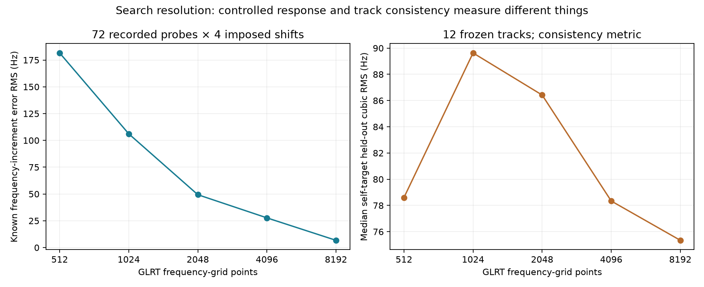

# GLRT timing and frequency search resolution

**Frequency-grid coarseness makes a measurable difference.** Finer grids
recover known frequency increments applied to recorded IQ more faithfully,
even though the earlier cubic-fit metric barely distinguishes the settings.
This establishes improved conditional frequency response, not absolute
Doppler accuracy or a validated production default.

## Scope and reference

The source is the same frozen 24-hour cohort in
[the original study](../2026_09_10_scan_24h_glrt_rms/README.md), using deployed
release `39146ee83d00523fbd37ba02179c87a5c241a017` in an isolated worktree.
The [reference audit](../2026_09_10_glrt_reference_audit/README.md) still applies:
cubic residuals are consistency metrics, and the original track identities
and acquisition seeds are not independent truth.

This bounded offline study contains:

- 537 recorded 20 ms probes on 12 selected tracks, six scans per sample rate.
- Five GLRT frequency grids and three finer timing searches on all 537 probes.
- Known frequency increments on 72 probes, six evenly spaced observations
  within each track: four increments per probe and five grids, 1,440 comparisons.
- Fresh acquisition under nine configurations on 48 probes, four evenly spaced
  observations within each track: 432 acquisitions, retaining all eight
  candidate outputs and their fractional GLRT refinements.

Storage was opened read-only. No RF recording or deployed configuration change
was made. Each baseline GLRT replay reproduces the published CFO within
0.00001 Hz and margin within 0.00000001. All 48 baseline reacquisitions contain
the original CFO among their candidate refinements within 0.00001 Hz.

## Frequency grid: a controlled response test

The current scorer chooses the largest FFT frequency bin; it does not
interpolate between neighboring frequency bins. For 4.4 microsecond pilot
symbol spacing, the 512-point grid has about 443.9 Hz spacing. Acquisition
supplies a separate CFO estimate, so this is the spacing of the residual
GLRT search, not an absolute 444 Hz grid shared by all final measurements.

For each selected recorded probe, multiply the IQ by
`exp(2j*pi*delta_f*n/Fs)` with `delta_f` = −301, −137, +137, +301 Hz.
Keep the acquired CFO and original fractional timing fixed. Measure
`GLRT(shifted IQ) - GLRT(original IQ) - delta_f`, allowing only the known
227.273 kHz GLRT alias equivalence. No fit, TLE, or cubic supplies the expected
increment; the applied digital rotation does. No errors are filtered out.

| Frequency-grid points | Residual bin spacing | Known-increment error RMS, pooled | 95th percentile absolute increment error |
|---|---:|---:|---:|
| 512, current | 443.9 Hz | 181.6 Hz | 306.9 Hz |
| 1024 | 221.9 Hz | 106.2 Hz | 142.9 Hz |
| 2048 | 111.0 Hz | 49.3 Hz | 84.9 Hz |
| 4096 | 55.5 Hz | 27.7 Hz | 31.9 Hz |
| 8192 | 27.7 Hz | 6.8 Hz | 23.6 Hz |

Each row uses the same 288 increment comparisons on 72 probes. Scan-level
paired bootstrap ratios also favor finer grids; their per-scan results and
2,000-draw intervals are in `search-summary.json`.

This is a **relative response test with frozen acquisition**, not a claim that
8192 gives 6.8 Hz absolute frequency accuracy. The digital rotation shifts
the entire observed mixture, including other signals and noise. It tests the
estimator's response to a common imposed offset, not separation of satellites.
The four chosen offsets sample only part of the possible offsets and happen
to lie fairly close to some 8192-grid increments; the magnitude of the gain
must not be generalized to all offsets. An independent acquisition rerun on
each shifted signal could change the ranking or size of the gain.

## Why 181.6 to 6.8 Hz does not mean 27 times better track precision

The large reduction primarily measures frequency-grid quantization in the
controlled shift experiment. Its error is

```text
increment error = estimated CFO(shifted IQ) - estimated CFO(original IQ) - imposed shift
```

Both estimates use the same recording, so errors shared by the two estimates
can cancel. An estimator could be 100 Hz wrong on both copies and still recover
their frequency difference perfectly. This does not establish its absolute
frequency error on either copy.

The grid directly limits how accurately the estimator can report a change.
For an illustrative 137 Hz imposed shift:

| Residual frequency grid | Possible reported change | Increment error magnitude |
|---|---:|---:|
| 512 points, 443.9 Hz bins | Same bin: 0 Hz | 137.0 Hz |
| 8192 points, 27.7 Hz bins | Five bins: 138.7 Hz | 1.7 Hz |

This is an example of quantization, not a prediction for every observed probe;
the result also depends on where the original peak lies relative to the bins.
The chosen 137 and 301 Hz shifts are close to multiples of the 8192-grid
spacing, making the exact 6.8 Hz result specific to this tested offset set.

Acquisition CFO and timing were held fixed while the IQ frequency changed.
Normally acquisition also updates the CFO around which GLRT searches. The
experiment deliberately exposes the residual search grid's limitations; it
does not measure the complete independently reacquired pipeline's response.

The [plotted-trajectory RMS table](../2026_09_10_long_glrt_rms_table/README.md)
instead measures scatter and model mismatch across different observations.
Finer bins do not remove acquisition errors, timing effects, interference, or
departures from a cubic. A coarse grid can also hide fluctuations, so a
smoother curve does not by itself prove greater frequency accuracy.

The cohorts differ as well: the increment test uses 72 probes from 12 tracks;
the latest trajectory table uses 447 probes on three highlighted trajectories.
In that table, pooled held-out cubic RMS changes from 106.9 to 98.8 Hz, with
one trajectory improving and two worsening. These are RF-normalized model
consistency errors, not directly comparable to the native-frequency increment
errors of 181.6 and 6.8 Hz.

The supported conclusion is that **8192 responds more faithfully to imposed
frequency changes with acquisition fixed**. Its improvement in actual Doppler
precision remains unproven. A stronger next comparison must rerun acquisition
on shifted probes and separately measure absolute error against known-frequency
signals, using untouched scans for final validation.

## Real-track consistency and estimate changes

The frequency-grid comparison holds the original timing fixed. Every variant
fits its own CFO measurements, with the same whole three-second held-out
blocks. The same 537 observations are available in every variant; none falls
below the 0.025 margin threshold. All errors below are RF-normalized to 11.2 GHz,
whereas the imposed-increment table above is in native input-frequency Hz.

| Grid | Median full cubic RMS | Median self-target held-out RMS | CFO estimates changed by more than 0.00001 Hz |
|---|---:|---:|---:|
| 512 | 70.9 Hz | 78.6 Hz | 0 / 537 |
| 1024 | 77.4 Hz | 89.6 Hz | 117 / 537 |
| 2048 | 72.3 Hz | 86.4 Hz | 274 / 537 |
| 4096 | 68.9 Hz | 78.3 Hz | 400 / 537 |
| 8192 | 64.8 Hz | 75.3 Hz | 468 / 537 |

At 8192, the median absolute change across the 537 native CFO estimates is
55.5 Hz, and the 95th percentile is 194.2 Hz. These changes are not known errors.
Despite its lower displayed median cubic RMS, the paired geometric held-out
ratio for 8192 versus 512 is 1.031 with a 95% scan-bootstrap interval
[0.812, 1.319]. There is no established cohort-wide consistency improvement.
The summary also preserves results scored against the original measurements,
so reference sensitivity remains visible.



## Timing grid: finer searches are hidden by the current CFO bins

The default timing procedure evaluates five integer cells at offsets
−2, −1, 0, +1, +2 native samples, fits a local log parabola, and evaluates
the resulting fractional position using the existing Lanczos sampler.

The new experiment keeps that ±2-sample extent and replaces the integer
spacing with 0.5, 0.25, or 0.125 sample spacing. Each search still performs a
local log-parabolic peak fit and evaluates its resulting fractional position.
These are experimental procedures using the public scorer, not new exposed
production configuration fields. Native sample widths correspond to different
physical durations at 2.5 and 5 Msps.

All 537 timing refinements bracket successfully at all three spacings. The
median absolute timing change is approximately 0.029 sample; at 0.125 spacing,
the 95th percentile is 0.080 sample. However, **zero of the 537 CFO estimates
changes by more than 0.00001 Hz with the 512-point frequency grid**. Cubic RMS
therefore remains 78.6 Hz, apart from small timestamp corrections.
The finer searches slightly change likelihood scores and timing estimates;
this is not evidence that the original timing is physically exact.

The research implementation evaluates each fractional cell through the public
scalar scorer. Median scan-level costs are approximately 34, 77, and 161 ms
per probe for the three timing grids. These are naive research costs and do
not establish the speed of a batched implementation. Frequency-grid-only
scoring was approximately 5–6 ms per probe, but cache/order effects and
concurrent work make these timings unsuitable for declaring one grid faster.

## Acquisition search: separate controls that also move the output

Acquisition searches ±400 kHz using an 80 kHz coarse step, a 500 Hz fine step
within ±80 kHz, then a 100 Hz conditioned step within ±2 kHz. The scanner
retains eight candidates with coarse candidate separation of five epoch
samples and 10 kHz CFO. This test changes one acquisition control at a time
and then runs the unchanged 512-grid fractional GLRT on every candidate.

For conditional track coverage, a passing refinement must remain within two
integer epoch samples and 2.5 kHz of the original track's CFO, accounting for
the known alias period. Among eligible candidates, select the largest exact
GLRT score. This matches an existing track; it is not blind truth or a new
satellite identification. Missing matches would be counted as failures.

| Change from current acquisition settings | Original-track matches | Median absolute final-CFO change versus baseline match | 95th percentile absolute change |
|---|---:|---:|---:|
| Coarse step 40 kHz | 48 / 48 | 0.0 Hz | 0.0 Hz |
| Coarse step 160 kHz | 48 / 48 | 0.0 Hz | 5.1 Hz |
| Fine step 250 Hz | 48 / 48 | 16.0 Hz | 27.6 Hz |
| Fine step 1000 Hz | 48 / 48 | 37.8 Hz | 128.8 Hz |
| Conditioned step 50 Hz | 48 / 48 | 0.0 Hz | 50.0 Hz |
| Conditioned step 200 Hz | 48 / 48 | 0.0 Hz | 65.0 Hz |
| Conditioned radius ±1 kHz | 48 / 48 | 0.0 Hz | 191.4 Hz |
| Conditioned radius ±4 kHz | 48 / 48 | 0.0 Hz | 65.0 Hz |

Some individual changes reach several hundred Hz, preserved in the JSON.
Frequency changes alone establish sensitivity, not which setting is correct.
The 48-probe sample is insufficient for a new long-track RMS comparison and
was selected from existing strong tracks; it does not measure weak-track yield.

The finer coarse search raises the number of passing candidate entries from
148 to 262, but 141 and 252 respectively remain within the same original
track basin. Most additional entries repeat that basin. More candidates must
not be reported as more satellites. The 160 kHz grid is also offset relative
to the 80 kHz grid because it starts at −400 kHz; it does not include zero.

## Next comparison supported by this evidence

Prioritize **4096/8192 frequency grids together with 250/500 Hz acquisition
fine steps and 50/100 Hz conditioned steps**, using independently reacquired
shifted probes and untouched scans. A timing-resolution interaction test
should use a finer CFO grid, because the current bins suppress its measurable
frequency effect. Sub-bin frequency peak interpolation is another possible
algorithm experiment; it has not been implemented or tested here.

## Artifacts and validation

`glrt-plan.json` and `acquisition-plan.json` preserve settings and selected scan
IDs. The `glrt/` and `acquisition/` directories preserve all per-probe outputs,
candidate sets, runtimes, and source-manifest hashes. `search-summary.json`
contains per-track values, paired intervals, failures, and coverage.

Reproduce with `tools/replay_scan_glrt_search.py --source <original-report>
--output <new-output> --mode glrt`, then `--mode acquisition`, using an
environment with read access to the stored corpus and `PYTHONPATH=src:tools`.
Run `tools/summarize_scan_glrt_search.py --output <new-output>` for the summary
and figure. Cached scan outputs are reused only under the same saved plan.

Eleven component-owned tests pass. They check the frequency rotation's sign
and power preservation at both sample rates, off-grid timing recovery,
unbracketed peaks, alias handling, missing-basin accounting, and the fact that
a smooth bias can have zero self-fit RMS but nonzero reference error. Ruff
passes for the new tools and tests. The receipt and checksum file bind the
source study, code, and generated artifacts.
