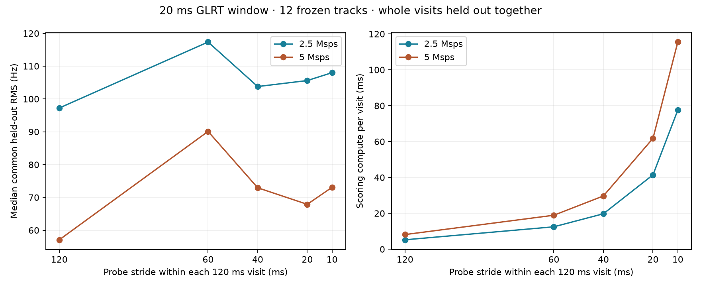

# GLRT stride, probe position, and further hyperparameters

**Keep the current 20 ms window and 120 ms stride for now.** A bounded replay
of the previous study's 12 tracks finds no held-out RMS improvement from
denser, acquisition-seeded probes. Timing search width and reacquisition policy
are the highest-priority follow-up, followed by acquisition CFO resolution.
These results do not establish the best stride for blind discovery of new tracks.

## Data and evaluation

This extends the frozen 2026-09-09 00:40 through 2026-09-10 00:40 UTC cohort
in [the original report](../2026_09_10_scan_24h_glrt_rms/README.md). It reuses
537 receiver visits on 12 primary tracks: six scans per sample rate, selected
at evenly spaced positions in time. Raw stored IQ was read through the
read-only storage adapter. No new recording or deployed configuration change
was made. Source release: `39146ee83d00523fbd37ba02179c87a5c241a017`.

Each 120 ms visit supplies eleven possible 20 ms probes, starting at
0, 10, ..., 100 ms: **5,907 probes per timing-search variant**. GLRT retains
64 symbols per frame and a 512-point frequency grid. The first probe's
acquired CFO and frame epoch seed every probe; the epoch is advanced by the
known frame period, then fractional timing is refitted independently.
The scorer receives no fitted trajectory or orbital prediction.

All 537 zero-offset replays reproduce the published CFO within 0.00001 Hz
and margin within 0.00000001. Frequencies retain the original physical alias
branch and are normalized to 11.2 GHz. Timestamps use the center of the
complete frames actually scored, as in the corrected original replay.

Every profile predicts the **same first-probe observations**, using cubic fits
with equal total training weight per visit. Five folds hold out whole 3-second
time blocks. All probe offsets of a held-out visit are excluded together;
overlapping windows never cross the train/test boundary. A 0.025 margin gate
affects training only. Chronological prediction trains on the first 60% of
visits and predicts the last 40%. Track selection is still conditional on the
original full capture; this is not independent end-to-end validation.

## Stride results after widening the timing search

For nonzero probe offsets, the wider variant searches 17 integer epochs
at ±8 native samples around the propagated seed, selects the largest exact
GLRT score, then applies the existing five-cell fractional refinement.
Zero-offset probes retain the original refinement for an identical baseline.
This is an experimental search procedure, not an existing configuration knob.

| Stride | Probes scored per visit | Median held-out block RMS | Paired RMS ratio, 95% scan-bootstrap interval | Median scoring time per visit |
|---|---:|---:|---:|---:|
| **120 ms, current** | **1** | **78.6 Hz** | **1.000** | **6.8 ms** |
| 60 ms | 2 | 102.5 Hz | 1.365 [1.160, 1.611] | 15.7 ms |
| 40 ms | 3 | 87.6 Hz | 1.173 [1.068, 1.318] | 24.6 ms |
| 20 ms | 6 | 90.3 Hz | 1.145 [1.037, 1.297] | 51.4 ms |
| 10 ms, all probes used | 11 | 92.2 Hz | 1.187 [1.059, 1.356] | 96.4 ms |
| 10 ms, current overlap projection | 11 scored, 6 eligible | 90.3 Hz | 1.145 [1.037, 1.297] | 96.4 ms |

All profiles fit all 12 tracks. Ratios are paired geometric means across
scans, not ratios of the displayed medians; intervals use 2,000 scan bootstrap
draws and are exploratory, without multiple-comparison adjustment. Runtime
excludes acquisition and disk I/O, and includes the wider search for added
probes. It is not a production-throughput benchmark.

The 10 ms schedule overlaps adjacent 20 ms inputs. The current observation
projection retains nonoverlapping probes, leaving starts 0, 20, ..., 100 ms:
the same usable positions as a 20 ms stride while paying for eleven scores.
The all-probes row instead allows all eleven into the research fit with visit
weighting and grouped validation.

Chronological tail RMS is much larger and does not order the settings the same
way: medians are 714.0, 823.8, 762.1, 674.0, and 774.2 Hz for strides
120, 60, 40, 20, and 10 ms respectively. This reinforces that better sampling
density alone has not established better long-range prediction.

## Timing width and probe position

Propagating the first probe's epoch and applying only the existing ±2-sample
fractional search becomes unreliable late in a visit:

| Probe start | Narrow-search timing availability | Wider-search timing availability |
|---|---:|---:|
| 0 ms | 537 / 537 | 537 / 537 |
| 20 ms | 536 / 537 | 537 / 537 |
| 40 ms | 503 / 537 | 537 / 537 |
| 60 ms | 437 / 537 | 537 / 537 |
| 80 ms | 377 / 537 | 537 / 537 |
| 100 ms | 321 / 537 | 537 / 537 |

The wider search brackets all 5,907 refinements, with no integer-search
boundary hits. Its winning integer corrections range from −4 to +5 samples.
Four probes remain below the margin gate. Recovered timing availability is
useful evidence for recentering the search, but it does not establish improved
frequency precision: the wider 20 ms-stride result still exceeds baseline RMS.
The narrow-search 20 ms-stride block RMS was 91.7 Hz.

**The deployed detector independently runs acquisition for each probe.**
These late-probe failures concern this cheaper propagated-seed experiment;
they are not evidence that the deployed detector would fail at those offsets.
The next stride experiment should compare independent acquisition with causal
seed updates and periodic reacquisition.

Moving just one probe later also fails to improve the common block metric:
50 ms and 100 ms starts give 154.0 and 103.5 Hz respectively with wider timing.
The first-probe acquisition and track-selection conditioning favor the
baseline. An independently acquired, common future test set is needed before
claiming that the start of a visit is intrinsically more precise.

## Other controls worth checking

These are proposed experiments unless explicitly described as measured above.
Acquisition and trajectory settings are separate from the GLRT input window.

| Priority | Control and current value | Bounded next comparison | What to measure |
|---|---|---|---|
| 1 | Fractional timing: five cells, ±2 native samples | Recenter over ±2, ±4, ±8 samples; also compare equal physical widths across sample rates | Bracketing, margin, common held-out RMS and cost |
| 1 | Acquisition policy: independent acquisition on every scheduled probe | Independent acquisition versus updating the previous successful seed, with periodic/failure-triggered reacquisition; pair with 120/40/20 ms stride | Recovery, new-track yield, RMS and acquisition cost |
| 2 | Acquisition fine CFO step: 500 Hz; conditioned step: 100 Hz within ±2 kHz | Fine steps 250/500/1000 Hz; conditioned steps 50/100/200 Hz; local radii 1/2/4 kHz | Wrong frequency-branch selections, held-out RMS and compute |
| 3 | Scanner candidate separation: 5 epoch samples and 10 kHz CFO; retain 8 candidates | Epoch separation 3/5/9 samples, CFO separation 5/10/20 kHz; inspect distinct candidate basins | Candidate diversity and weak-track coverage, rather than only surviving-track RMS |
| 3 | Trajectory residual gate: 2.5 kHz; maximum gap: 2 s; minimum support/span: 8 points/8 s | Residual gates 1/2.5/5 kHz and gaps 1/2/4 s | Track completeness, common held-out error and incorrect joins |
| 4 | Coherent pilot support: 64 symbols; frame contributions combined by current scorer | Longer coherent support or within-probe frequency-rate compensation require scorer experiments | RMS, timing sensitivity, control scores and cost |

The original study already tested 10/20/40/80 ms windows, frequency grids
128–4096, 32 versus 64 symbols, margin gates, top-candidate filtering, and fit
weights. None established a reason to replace the current 20 ms / 64-symbol /
512-grid default. Acquisition-grid and candidate-separation experiments must
rerun acquisition: refiltering the existing eight candidates cannot measure
whether another setting would discover a missing candidate.

## Reproduction and checks

`plan.json` and `wide-timing/plan.json` identify the source study, scan IDs,
window, grid, probe schedule, and seed policy. The narrow plan predates adding
the explicit timing-radius field and uses the default radius of two samples.
Both `raw/` directories preserve per-probe outputs, failures, timings, and
source-manifest hashes. Both `stride-summary.json` files contain every track
and rate-specific summary, including complete, passing, and fitted counts.

Run `tools/replay_scan_glrt_stride.py --source <original-report> --output
<new-output> --timing-radius 2` and repeat with radius `8` in a separate output
directory. Raw replay requires access to the existing stored IQ; it opens the
store read-only. Run `tools/evaluate_scan_glrt_stride.py --output <output>` to
regenerate each summary and plot. Use `PYTHONPATH=src:tools` and the repository
scientific Python environment. Existing output scan files are reused, so use
separate directories for different replay plans.

Validation: **15 component-owned tests passed**, covering schedule bounds,
epoch propagation at both sample rates, exclusion of every probe in a held-out
visit, invariant visit weighting, and compute charged for discarded overlap.
Ruff passed for both new tools and the test module. `analysis-receipt.json`
records source and code hashes; `checksums.sha256` seals the extension artifacts.
