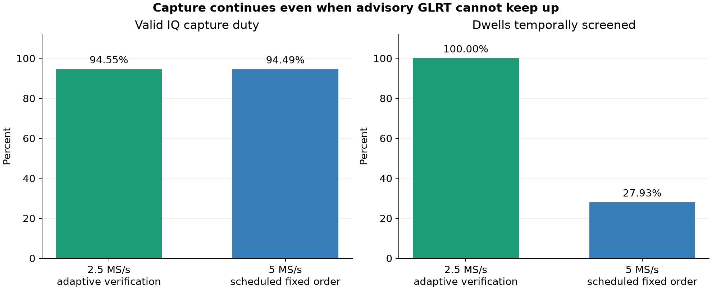
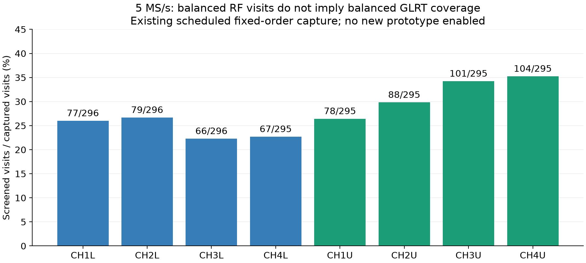
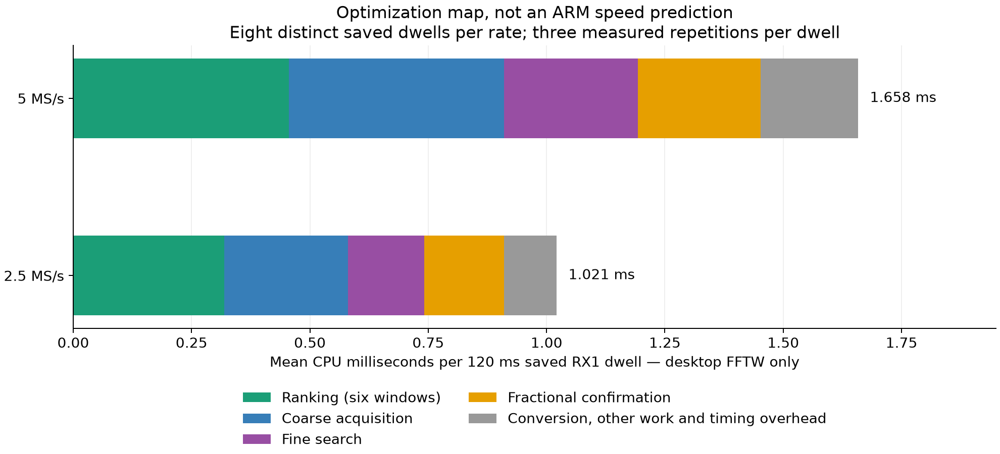

# Scanner follow-up: preserve capture duty while improving 5 MS/s screening

## Outcome and deployment boundary

The [2.5 MS/s production rollout](2026_09_10_scanner_production_rollout.md) is
complete: 300-second verification, **94.5483% valid-IQ duty**, all 2,364 dwells
temporally screened, successful UI/API checks, and scheduled captures resumed
as requested. Acquisition was still running at **01:20 UTC on September 10**,
generation 222, PID 2738154, with zero restarts since 00:51:42 UTC.

API and acquisition still select release
`c60438c5fd096e884a0c523a73097299d1a2f5ba`. The existing immutable ARM bundle,
algorithm and configuration are unchanged. The 20-minute, 300-second, equal
2.5/5 MS/s cadence remains enabled; adaptive hopping is enabled only at 2.5 MS/s.

This follow-up adds an **offline, opt-in SDK prototype**, compatibility tests,
and saved-data profiling. It does **not** deploy or qualify adaptive 5 MS/s,
claim an ARM speedup, or change firmware/FPGA. No new RF was initiated for this
work: the new operational evidence below came from the already-authorized
production schedule. No prohibited radio was accessed.

The report and evidence are published to `main`; the unqualified SDK prototype
and its new tests remain on `codex/scanner-5m-cooperative-skips`. Publishing this
report is not a source or runtime promotion of that prototype.

### Web-published figures

The same three reviewed PNGs are packaged as static assets for the production
web service at these paths (relative to the scanner UI's origin):

- `/reports/scanner-2026-09-10/capture-vs-screening.png`
- `/reports/scanner-2026-09-10/desktop-stage-profile.png`
- `/reports/scanner-2026-09-10/screening-by-target.png`

The web-owned asset test requires byte-for-byte agreement with this report and
its SHA-256 index. These are dated report snapshots, not automatically refreshed
per-scan GLRT/CFO products. Publishing them needs only an API/UI deployment;
acquisition, its selected release and the detector bundle are unchanged.

## An unassisted scheduled 5 MS/s capture completed

**`scan-hop-b5521c5e306d0bd3`** started at **01:00:07.982 UTC** and finalized at
01:05:13.445 UTC. Unlike the controlled 2.5 MS/s rollout canary, this was an
ordinary scheduled start. The production API reports complete capture,
qualified continuity, restored radio settings and **94.4875% valid-IQ duty**.
The stored input-manifest identity is
`sha256:4358c3cbf3cbaacc52ec80476ea6e8f9c8727d18a58cf992229ca31cc0c6a52a`.

| Measurement | Scheduled 5 MS/s result |
| --- | ---: |
| Rate / RF bandwidth | 5 MS/s / 5 MHz |
| Complete 120 ms visits | 2,363 |
| All-six-window temporal screens | 660 / 2,363 (**27.9306%**) |
| Zero-coverage visits | 1,703 |
| Positive / unavailable public results | 316 / 2,047 |
| Visits with a confirmation interval | 528 |
| GLRT delivery | Complete; zero dropped results |
| CPU over the 660 screened visits, mean / p99 / maximum | 136.11 / 172.62 / 175.63 ms |

These are different denominators: capture duty measures valid IQ versus the
capture's source-counter span; screening coverage measures screened visits
versus recorded visits. A delivered unavailable record is not a performed
check. A full temporal screen ranks all six 20 ms windows, but the positive-only
detector confirms at most one window. It is not dense GLRT64 analysis or a
satellite identification. That separate desktop analysis remains pending.

The CPU cohort above includes screened visits with no confirmation interval;
it is not restricted to positive results or successful confirmations. No new
full IQ read/hash verification was performed on this scheduled 5 MS/s capture.
The earlier 2.5 MS/s rollout *did* include that stronger stored-IQ verification.

Fixed-order RF visits are balanced at 295–296 per target. Screening is not:
66–104 visits were screened per target, approximately 22–35%. This is an
important constraint for a future sparse admission policy: an every-other-visit
rule must not repeatedly select only one parity of an eight-target schedule.
The observed coverage is not a measurement of channel activity or sensitivity.

## Cooperative skipping: a narrow change, not a hidden negative

The [earlier LNB qualification](2026_09_10_scanner_lnb_live_checkpoint.md) found
that three deliberate pressure/admission skips could latch the adaptive
scheduler's capture-long uniform fallback. The original SDK represented those
skips as unhealthy unknown feedback, just like genuine failures.

The additive startup call `leo_scanner_glrt_enable_cooperative_skips()` requires
both positive-feedback mode and capture protection. Only the two explicit
owner decisions—pressure suspension and bounded queue/age admission—produce
**healthy unknown** feedback under this opt-in. Here, healthy means a valid
intentional-skip notification, not that a signal was detected or the detector
completed a search.

| Event | Opt-in scheduler feedback | Public evidence |
| --- | --- | --- |
| Deliberate pressure/admission skip | Healthy unknown; no new miss or positive | Unavailable, zero search coverage and compute |
| Completed below-threshold check | Existing decision behavior, unchanged | Existing positive-only public semantics |
| Worker timeout, clock fault, invalid input or cancellation | Existing unhealthy unknown/fault behavior | Existing unavailable/failure record |
| Previously latched scheduler fallback | Remains latched | No fabricated recovery |

Unknown feedback does not refresh last-positive time or extend cooldown. It
breaks a consecutive-miss streak because no check occurred. A real worker
watchdog still disables the worker; repeated genuine failures still trigger
uniform fallback. Source/visit binding and missing/stale-feedback protection
are unchanged. The classification's reason string alone never authorizes this
new interpretation: the acquisition-owner branch must have explicitly shed work.

The opaque SDK gained a private flag and an additive function, not a changed
configuration layout or persisted/wire contract. Existing callers do not opt in
simply by linking the new library. Before production use, the caller and a new
immutable bundle configuration must explicitly select and qualify this policy.

### Tests and build checkpoint

- **896 native/component tests passed**: actual native SDK, real isolated
  numerical worker and C scheduler, at both sample rates across seven worker
  build variants, plus existing scheduler and frame tests.
- Pressure and backlog skips remain unknown, never invented detections/misses;
  recovery leaves prior activity timestamps unchanged and cannot clear an
  already-latched fault. Actual 500 ms watchdog, clock, invalid-input and
  cancellation failures retain their fault behavior.
- Startup-only opt-in rejects unsupported modes, repeat calls, and calls after
  visits, history, finish or failure. Caller dual-RX data and legacy metadata
  remain unchanged in the fixtures.
- **155 separate replay/integration tests passed** with the existing libiio
  source integration and independent policy verifier. These exercise unchanged
  legacy behavior with the new SDK linked but the new opt-in disabled.
- Cortex-A9/NEON hard-float SDK cross-compilation passed with warnings as errors.
  This is a build check, **not execution on ARM or a performance result**.
- Ruff and whitespace checks passed for the changed test code.

The new cooldown test initially sampled queued policy state before the next
decision boundary. Correcting that test expectation produced the final passing
run; no golden scientific fixture was changed. Threaded replay of the *new*
opt-in and provider/bundle activation are still outstanding, not covered by the
155 legacy compatibility tests.

## Saved-LNB profiling: where to investigate CPU next

The fixed selection was the first retained visit at or after 30 source seconds
for each of the eight targets, separately in the earlier 2.5 and 5 MS/s LNB
canaries. That gives **16 distinct RX1 dwells**, not 48 independent detections.
Each dwell had one warm-up and three measured repetitions: 24 measured runs
per rate. Both edge templates, current numerical defines, six-window ranking,
one blind confirmation and the desktop FFTW backend were retained.

The selected 20 ms confirmation was also run independently. Numerical outputs
matched within the existing comparison tolerances, and caller IQ hashes stayed
unchanged. The retained recipe and build receipt identify source, compiler and
FFTW dependency hashes. This check does not independently qualify sensitivity.

| Desktop mean CPU, ms | 2.5 MS/s | 5 MS/s |
| --- | ---: | ---: |
| Whole 120 ms dwell | 1.021 | 1.658 |
| Six-window ranking | 0.319 | 0.456 |
| Confirmation coarse acquisition | 0.262 | 0.455 |
| Fine search | 0.161 | 0.282 |
| Fractional confirmation | 0.168 | 0.259 |
| Whole-dwell p99 | 1.294 | 1.836 |

Ranking plus coarse acquisition comprise about **54.9%** of the measured
5 MS/s desktop total. Even halving those two stages would save only about
27.5% of that total under this measured desktop decomposition. Moving the
scheduled ARM p99 from 172.62 ms below a 100 ms compute target would require
approximately **42.1%** reduction in that ARM cohort.

Those calculations are optimization targets, **not transferable desktop-to-ARM
speed factors**. Different processors, FFT backends and stage costs require
matched ARM profiling. The two rates also use different RF recordings, so this
comparison is not a controlled sensitivity-versus-rate experiment. Timing
subcomponents such as nuisance evaluation are nested; they must not be added
again to their parent stage totals.

Existing rotation caching, bounded magnitude and conditioned block-rotation
optimizations are already present in the baseline. Plausible new experiments
include reusing selected-window coarse proposals, reducing repeated data passes,
and cheaper proposals followed by the same fractional confirmation. Seeded
confirmation is not automatically equivalent to the currently qualified blind
path; any change requires held-out numerical and detection-quality checks.

## Remaining checkpoints, in order

1. Integrate the cooperative opt-in into an explicitly identified provider and
   bundle configuration; add threaded opt-in replay and independent causal
   verification of skips, recovery, cooldown and real faults. Do not reinterpret
   every unavailable wire result as a healthy skip.
2. Measure screening freshness by target, and compare bounded fair admission
   with current pressure-driven shedding on saved data. A skipped dwell stays
   unknown. CPU relief must not come from permanently starving selected targets.
3. Profile matched saved RX1 cases on an allowed, available ARM radio before
   choosing a numerical optimization. Compare all changes against the current
   baseline and separate positive/negative controls and held-out recordings;
   retain fractional timing/CFO and source-binding guarantees.
4. Only after those gates, qualify the new immutable userspace bundle in a
   separately authorized bounded live check. Require capture continuity and
   at least 90% duty, bounded result age, honest coverage, and no capture-blocking
   detector path. Every-dwell screening below 100 ms is a stronger goal than
   maintaining capture duty with safe skips.

Until then, keep the verified 2.5 MS/s adaptive / 5 MS/s fixed-order deployment.
The ordinary 25 MS/s path's reported missing samples remain a separate known
issue; this checkpoint does not claim to fix them.

The [artifact index](evidence/2026_09_10_scanner_cooperative_skips_checkpoint/index.json)
binds the public metrics, API snapshot, test receipts, build receipts, exact
profiling recipe and three PNGs. No IQ, binaries or credentials are committed.
The original profiling recipe is retained byte-for-byte as `profile_saved.py.gz`;
its adjacent Python copy is formatting-clean. This housekeeping changes no
measurement or figure and does not rerun the RF-verification recipes.
`render_figures.py` rebuilds figures from retained metrics without radio or HTTP
access; `collect_snapshot.py` is a separate read-only production API snapshot.
