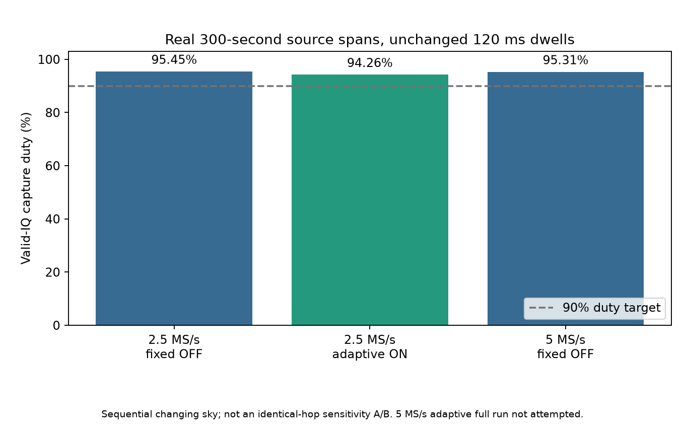
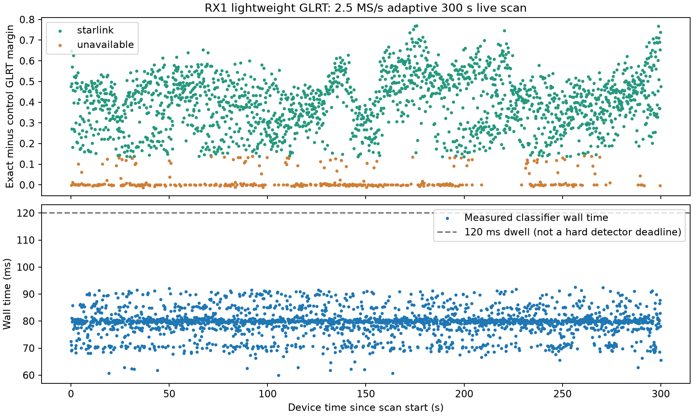

# Live scanner qualification: capture first, bounded RX1 detection

## Result

The September 10 authorized maintenance established **94.2621% valid-IQ duty
over a real 300.0567-second source span at 2.5 MS/s with adaptive RX1 GLRT on**.
All 2,357 classifications were delivered, without dropped results, a warning,
or an adaptive fallback latch. All eight channel/edge targets remained available.
The same-build fixed detector-off baseline measured 95.4473% over 300.1026 s.
The observed difference is **1.1852 percentage points**. Both exceed 90%.

The 5 MS/s fixed baseline also completed: **95.3070%** over 300.0408 s,
2,383 complete dwells. The 5 MS/s adaptive smoke test is only 6.443 source
seconds, **not a 300-second qualification**. A full adaptive run was not started
because it no longer fit the original maintenance budget. Do not enable
5 MS/s adaptive production on the basis of this report.

## Method and limits

We used the already staged `40de667b` application and exact candidate ARM bundle
`5ff6ea2eb861cbdba02f89744a7f6d42e86825ed2e5f4b1ab5e60d11526ebf72`.
Only `.20`, serial `1040005e0b100007100010000bf33a5d4d`, was opened, under
the production paused-maintenance lease and PPU serial lock. No firmware,
FPGA, boot environment, `.14`, or excluded USB radio was changed. Boot ID stayed
`442b22ea-9ec8-4e90-8c71-8add30d3fc3a`. PPU verified exact daemon identity,
stock endpoint recovery, alternate-port closure and RF attribute restoration.

Both rates retained 120 ms dwells, RF bandwidth equal to sample rate,
rate-correct IF centres, a 1 ms guard, eight kernel buffers and unchanged
capture transport/storage settings. Detector-off uses a fixed schedule;
detector-on uses adaptive scheduling. These sequential captures see a changing
sky and different target allocation. The duty comparison is operational
evidence, **not an identical-hop-order sensitivity A/B** or a false-alarm study.
Full IQ was decompressed and manifest-hash verified for every retained case.

At 2.5 MS/s, 1,991 classifications were positive; 366 were `unavailable`.
All had a six-window mask of 63. The latter are not automatically negative
evidence: this positive-only mode preserves uncertainty. Policy decisions were
24 warm-up, 2,328 weighted and five exploration visits, with no fallback.
Classifier wall time was **79.8 ms median, 89.0 ms p95, 91.0 ms p99 and
92.6 ms maximum** during this full live run.
At 5 MS/s the short smoke emitted 51 records: ten positive/full-mask and
41 unavailable/zero-mask. This demonstrates deliberate overload skipping and
complete result delivery, but not sustained 300-second screening coverage.

## Failures and operational repairs retained

The first harness stopped after the successfully completed 2.5 MS/s adaptive
capture because it incorrectly expected the fixed receipt's terminal spelling
`complete`; the adaptive public contract reports `completed`. Production
automatically resumed. The original harness, traceback and successful scan
receipts are retained unchanged. Only the unattempted 5 MS/s cases were resumed,
under the **original absolute deadline**, after correcting that harness check.
One service launch failed at `CHDIR` before Python, pause or RF; fixing the
temporary directory's group allowed the continuation. Its budget check then
declined the final full adaptive capture and resumed scheduled recording at
**15:22:03 UTC**, generation 226, ahead of the original 15:27 maintenance limit.

Two production blockers were repaired while acquisition was paused:

1. `.20` had a changed SSH host key. PPU bounded network identity plus strictly
   pinned SSH serial readback verified the radio before replacing only its
   credential entry. Strict host checking remains enabled; the original
   credential has a recoverable local backup.
2. Deployment had substituted the plain scanner daemon while retaining an
   older GLRT bundle manifest and algorithm/configuration pins. We restored
   that previously qualified matching daemon. The new deployment-owned binding
   policy and component tests preserve explicit GLRT pins across app releases
   and reject mismatched daemon paths. This repair is not candidate activation.

The ordinary staging front door defaults to the non-GLRT host transport.
The software-fix revision `b90d2978` was staged that way and is **not the
scanner promotion candidate**. It was not activated or modified in place.
Any successor scanner candidate must be staged with the existing explicit
`--scanner-glrt` option, then requalified under its new immutable revision.

## PNG publication and remaining gates

For `scan-hop-125ccf74f6736019`, the production API reports `figures_ready`,
2,365/2,365 analyzed visits, with coverage, fractional GLRT64 and CFO trajectory
PNGs. Hash-bound HTTP requests for both GLRT and trajectories returned 200 with
`image/png` on September 10 at 15:20 UTC. These are desktop analysis products,
not the lightweight ARM classifier plot above.

The isolated canaries intentionally use separate stores. Their canonical slot
IDs repeat across cases; **case path plus manifest digest**, not session ID
alone, identifies each recording. Do not copy them over a production recording
with the same ID. This report publishes their evidence and figures, without
claiming they were ingested into the scanner UI.

Source-change gates and 168 focused deployment tests passed for `b90d2978`.
The already-qualified `40de667b` runtime supplied live verification. Remaining
promotion gates are the final immutable software qualification, exact runtime
binding selection and deployment verification. A fresh bounded authorization is
needed for the unattempted full 5 MS/s adaptive RF test; it must stay disabled
until that test passes. Scheduled capture has resumed on the repaired existing
release. This report does not assert that the new candidate is activated.

[Reproduction script and hash-indexed original receipts](evidence/2026_09_10_scanner_live/index.json).
