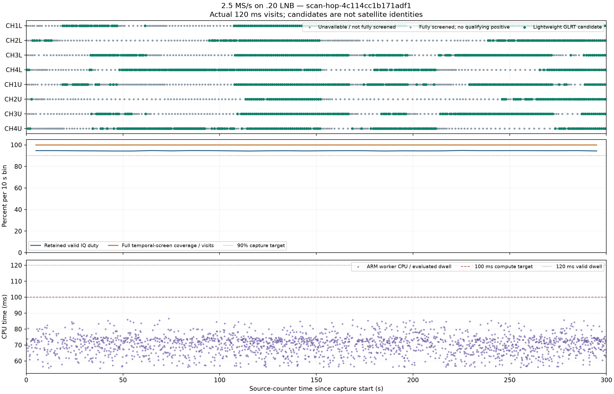
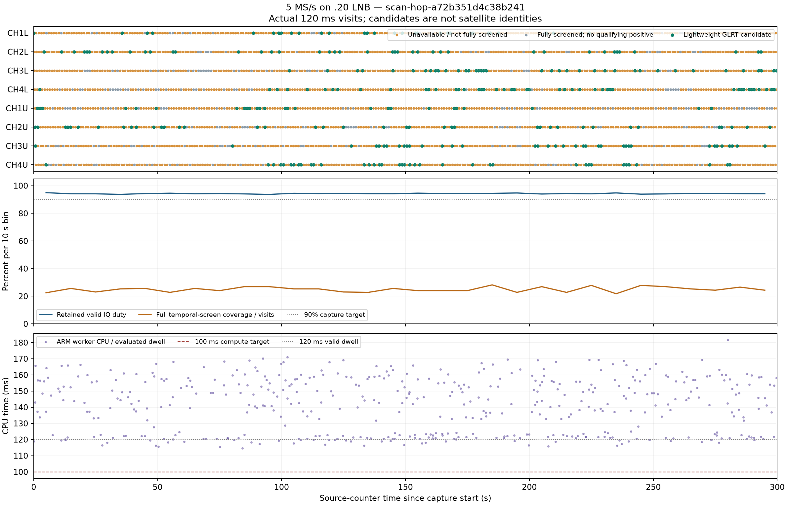

# Live LNB scanner verification: capture protected, 5 MS/s adaptation still limited

September 10, 2026, UTC. Two real 300-second receive-only scans on
`192.168.1.20` completed with fully verified IQ and restored radio settings.
**2.5 MS/s demonstrated live positive-signal adaptive operation. At 5 MS/s,
capture stayed above 94% duty, but detector overload caused equal-scan fallback.**
This is a bounded canary checkpoint, not production activation or a main merge.

## Results

| Measurement | 2.5 MS/s | 5 MS/s |
| --- | ---: | ---: |
| Session | `scan-hop-4c114cc1b171adf1` | `scan-hop-a72b351d4c38b241` |
| Source-counter span | 300.0895712 s | 300.0083676 s |
| Retained valid IQ | 283.68 s | 282.84 s |
| Capture duty | **94.5317%** | **94.2773%** |
| Complete 120 ms visits | 2,364 | 2,357 |
| Full temporal-screen coverage | 2,364/2,364 (100%) | 588/2,357 (24.94697%) |
| Visits reaching confirmation | 2,007 | 469 |
| Qualifying lightweight candidates | 1,452 | 297 |
| Dropped classification records | 0 | 0 |
| ARM CPU, confirmation-bearing jobs: mean / p99 | 70.21 / 84.49 ms | 141.57 / 169.34 ms |
| ARM wall time, same jobs: p99 / maximum | 89.22 / 95.41 ms | 189.76 / 203.39 ms |
| Actual choice reasons | 24 warmup, 2,339 weighted, 1 exploration | 4 warmup, 2,353 fault fallback |

Duty is retained valid samples divided by the attested source-counter span,
including transitions. It is **not** the entire maintenance-job wall time or
the 20-minute production cadence. Both receipts have zero unclassified samples
and zero unreceived tail; their remaining source time is attested transition
invalid time. All IQ chunks were decompressed and their aggregate digest checked.

Full screening means lightweight ranking covered all six temporal slices of
the 120 ms dwell. It does **not** mean full GLRT64 was run in all six slices:
the lightweight worker selects a bounded confirmation window. Jobs rejected
by the initial screen need not reach confirmation. The CPU statistics above
are conditional on reaching that stage, not an average over skipped jobs.
All original dual-RX IQ remains recorded; live classification uses RX1 only.

The 2.5 MS/s allocation responds to positive episodes while retaining quiet-target
exploration. Actual visit counts range from 214 for CH2U to 332 for CH1L. Maximum
observed start-to-start revisit interval across all targets is 2.920142 s.
The persisted decisions include 103 instances of nonzero misses and cooldown;
74 also retain the basis target as active. There are 35 active-mask demotions,
none within two seconds of the latest public positive included in its decision
basis; the minimum observed age is 2.0237328 s.

This is an observable-state audit, not a complete independent policy replay.
Public `unavailable` does not preserve every private evaluated-miss/health
observation, and these captures do not establish the counterfactual allocation
or detection yield of a fixed-order scan of the same changing sky.

At 5 MS/s, 1,769 visits have zero search mask. The first visit produces a positive;
visits 1–3 are unavailable with zero search mask and zero recorded CPU time.
The decision for visit 4, based on visit 3, enters `fault_fallback`, which remains
latched for the rest of the scan. The resulting visit counts are 294–295 per
target. Later positives continue to arrive, but do not clear the equal-scan latch.

This sequence is consistent with the current SDK/policy treatment of unperformed
work as unhealthy unknown and its three-unhealthy-result latch. The public
`incomplete_search` reason does not uniquely identify the private cause of every
skip; do not claim a worker crash or a per-skip source-pressure diagnosis from
that field alone. In total there are 2,050 `incomplete_search`, 10 `worker_busy`
and 297 `complete` records. Record delivery is complete even though detector
coverage is sparse. **Unavailable is not evidence of an empty channel.**

## Hop timing

Steady-state events, excluding startup:

| Stage | 2.5 MS/s mean / p99 | 5 MS/s mean / p99 |
| --- | ---: | ---: |
| Scheduler lateness | 0.740 / 1.745 ms | 0.757 / 1.664 ms |
| Retune | 5.202 / 11.474 ms | 5.527 / 17.549 ms |
| Guard | 1.000 / 1.000 ms | 1.000 / 1.000 ms |
| Retained valid dwell | 120 ms | 120 ms |

These are source-counter measurements. ARM detector CPU overlaps acquisition;
it must not be added to the hop stages as though it were a synchronous wait.
Bandwidth equals the requested 2.5 or 5 MHz, with the unchanged 9.75 GHz LNB
LO, eight lower/upper IF targets, 40 dB manual gain, 131,072-sample blocks,
eight kernel buffers, eight-visit read-ahead and 64-visit storage queue.

## Small score-blind saved-IQ reference check

For each rate, select the first visit at or after 30 source seconds for every
target, without consulting detector scores. Analyze all six non-overlapping
20 ms windows on both saved receivers with eight acquisition candidates and
the existing complete-fractional-margin threshold 0.025. This is 16 dwells and
192 receiver/windows, not another RF campaign or an operational sensitivity trial.

At 2.5 MS/s, the two selected lightweight positives both have RX1 fractional
GLRT support. The other six selected dwells have none on either receiver.
At 5 MS/s, three selected dwells have RX1 reference support, but all eight live
results are unavailable: two supported dwells were wholly skipped, and the third
was screened without a qualifying lightweight positive. Two supported dwells
also have RX0 support. The different times/scenes prevent a rate-sensitivity
comparison. No satellite truth, CFO/epoch association accuracy, or general
false-alarm/recall percentage is claimed from this small check.

The first reference run failed while serializing a nested model after analysis;
its partial output is retained. The corrected recipe serializes before opening
the result file and writes a new output directory. It completed in 29.0 s for
2.5 MS/s and 37.6 s for 5 MS/s, under one-CPU, low-priority offline limits.

## Ownership, restoration and exact build

The user explicitly authorized `.20` or `.21` for LNB testing. Both were verified
as LAN-only, superseding the earlier USB-only restriction narrowly for these
targets. Only `.20`, serial `1040005e0b100007100010000bf33a5d4d`, was used.
No `.14` or excluded-serial access occurred.

Each run held the actual production paused-maintenance global/per-radio lease
and PPU serial lock. Strict SSH pinned the expected radio; the boot ID was
unchanged throughout. Pre/post checks required idle buffers and no competing
TCP connection. Both runs restored the original 25 MS/s, 25 MHz bandwidth,
30 dB gains, manual gain modes, A-balanced port and 1,217,500,000 Hz RX LO.
PPU removed only its owned volatile daemon/companion assets, verified the
alternate port closed and checked the untouched stock endpoint. The exact
immutable bundle remains available to recreate those temporary files.

Firmware remained `v0.49-plutoplus-spf-iq-direct-async-v4`. **No firmware, FPGA,
bootloader, production configuration, service selector or capture-control state
changed in this checkpoint.** Production remains at paused generation 215;
API/acquisition PIDs and their September 7 start times are unchanged. `.21` was
not used for capture. The two enclosing jobs took about 327 and 337 seconds,
within a conservative 960-second reservation of the new 1,200-second budget.
No additional RF is planned under this recipe.

The installed non-editable release is
`987e1e46a0fcc88973538ce846432738957033cf`, with PPU
`664fa85cdde35050c0293a1dab90d2cc8b99eef9`, native host libiio
`a1088b61de3c57762cfed5533e1baf8076a7b726`, and the unchanged live-tested
ARM bundle `19c3650480a8386b12384b0f9a0c5d49e237b04ad98f474d3f820ddd7c`.
Frozen staging/sealing passed, as did 144 installed-package scanner/radio/API
tests. The new host cleanup diagnostics preserve the primary failure separately
from released-client cleanup diagnostics; they do not fabricate a successful
receipt or weaken source-continuity qualification. Related source suites passed
50 Leo integration, 282 deployment, and 3,413 PPU offline tests with one explicit
transmitter-oracle skip. These overlapping suites are not additive.

The real sealed recordings pass GET and HEAD through the installed adaptive
history, detail and GLRT routes, including manifest binding. This is ASGI
verification, **not a deployed-browser test**. They are isolated canary stores,
so are not automatically listed in the production web UI. Current production
selectors remain on `39146ee83d00523fbd37ba02179c87a5c241a017`.

Two preparatory checks failed before any RF: the generic diagnostic SSH helper
required a private-mode host-key copy rather than systemd's read-only credential
mode, and the radio uses `/22`, not the spare's `/24` network mask. The final
preflight retains the exact key and verifies the exact interface address without
assuming a netmask. No password was copied into reports or local test artifacts.

## Next priorities

1. Distinguish an explicitly intentional overload skip from actual worker,
   transport or missing-feedback failures. Keep the former unknown for signal
   state, without automatically treating it as a broken worker. Preserve the
   fault latch for genuine failures, cooldown, freshness and exploration. Replay
   this exact observed sequence before any policy/bundle revision or new RF.
2. Profile and reduce the 5 MS/s work. Its measured p99 needs about **41% less
   CPU time** to meet 100 ms. Evaluate cheaper screening and optimized native
   correlation against these saved dwells, retaining native-rate fractional
   confirmation where needed. Merely changing the fallback latch cannot supply
   missing observations or make the detector faster.
3. Finish matched same-build detector-off comparisons and broader candidate
   association/holdout checks. These two sequential scans are not a matched
   A/B no-regression proof. New full-length RF needs a separately bounded plan.
4. Close dependency CI/main integration and deployed-browser/rollback gates
   before promotion. The [latest PPU CI](https://github.com/misko/pluto-plus-utils/actions/runs/34418979120)
   passes Python 3.12/3.13 and browser, but repeats the same three Python 3.11
   paired-capture failures documented on pre-existing main in the
   [frozen-build checkpoint](2026_09_09_scanner_frozen_release_checkpoint.md).
   They have not been waived or hidden.

The [hashed evidence index](evidence/2026_09_10_scanner_lnb_live/index.json)
contains receipts, tests, figures, recipes and failure logs; no IQ or credentials.
Original IQ and analysis remain under
`/srv/bulk/leo/scanner-lnb-live-20260910.vajIwK`.
