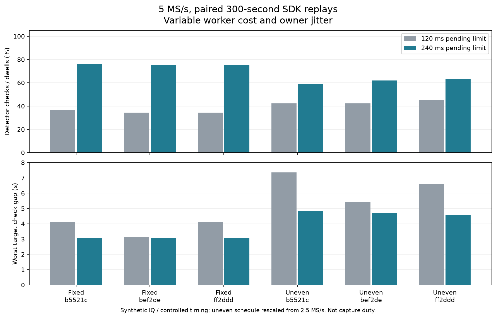
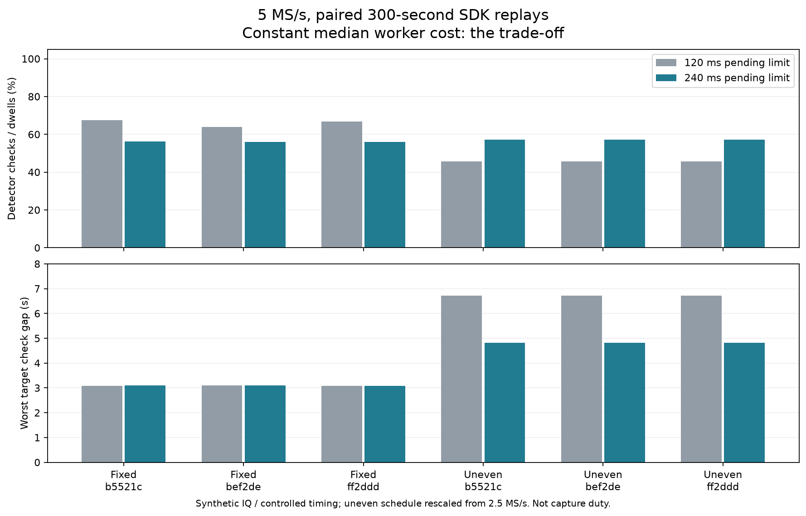
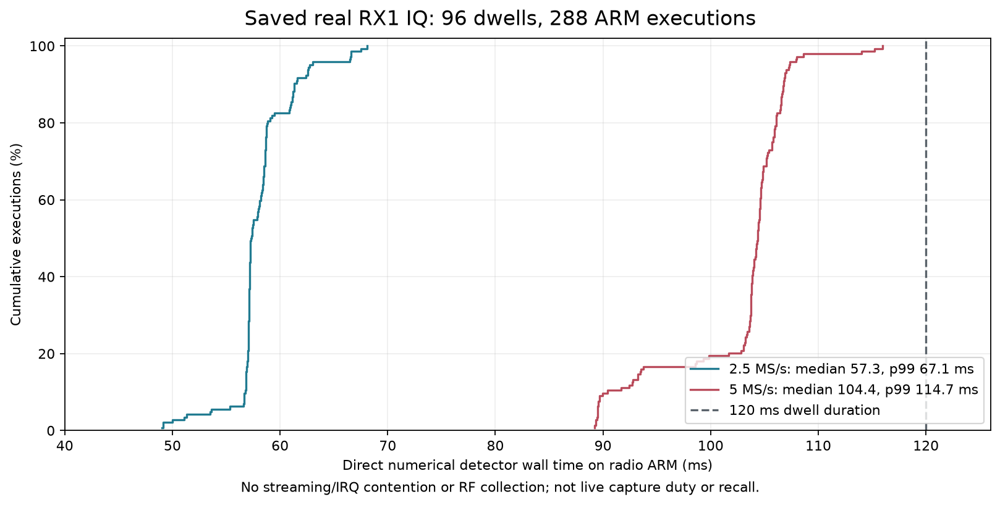

# Bounded detector admission: full-schedule and ARM qualification

## Outcome

The SDK supports an explicitly selected **1–240 ms pending-work age**, with
the existing 120 ms provider default unchanged. The 240 ms candidate passed
738 SDK/scientific regressions, 47 provider configuration tests, 42 paired
300-second schedule replays, desktop provider overload and ASan/UBSan checks,
and the actual provider/worker on the ARM processor in `.18`.

This is **not a production deployment or live RF duty qualification**. No
firmware, FPGA, boot configuration, installed daemon or capture schedule was
changed. No new RF was collected. The candidate is not a universal throughput win.

## Method and implementation

One worker runs while one completed dwell waits and a third buffer collects.
With a 120 ms pending age, useful work can expire just before worker completion.
Earlier controlled SDK tests found a **10.40 s** gap between checks on one
target under uneven 5 MS/s timing.

The change extends only the explicit pending-age ceiling. It adds no buffers
or detector waits in the capture callback and changes no scientific thresholds.
Skipped checks remain healthy UNKNOWN, never negative evidence or renewed
activity/cooldown. Both monotonic host time and integer source-sample age enforce
the limit. Separate 450 ms admission-age and 500 ms watchdog guards remain.

Each paired comparison preserves saved visit order, source timing and per-visit
worker-cost assignment, changing only pending age. SDK, shared pool and numerical
subprocess are real. RX1 IQ is synthetic zero IQ; publication timing is controlled.
This tests admission, not original RF verdicts or physically paced capture duty.

Four saved schedules comprise one 2.5 MS/s adaptive scan and three 5 MS/s fixed
scans. The uneven stress shape preserves adaptive timing/order while exactly
rescaling counters to 5 MS/s and applying each 5 MS/s cost distribution. It is
counterfactual, not observed closed-loop adaptive behavior. Cost profiles are
constant median, constant p99, and seeded resampling with owner-delivery jitter.

## Paired 300-second results

| Comparison across three 5 MS/s timing sources | 120 ms pending | 240 ms pending |
| --- | ---: | ---: |
| Fixed schedules, variable-cost detector coverage | 34.4–36.6% | 75.4–75.9% |
| Uneven schedules, variable-cost detector coverage | 42.2–45.3% | 58.9–63.3% |
| Worst uneven check gap, all cost profiles | 10.40 s | 4.96 s |
| Fixed schedules, constant-median detector coverage | 63.8–67.5% | 56.1–56.3% |
| 2.5 MS/s schedule, all tested profiles | 100% | 100% |

All 42 runs matched the independent model exactly on dispatched visit IDs,
times and skip counts. Every retained visit had a result; no target went wholly
untested; occupancy stayed within three slots; terminal drain completed without
worker/watchdog/clock faults. The 2.5-second freshness trigger is **not a revisit
guarantee**: roughly five-second gaps remain. End-of-dwell-to-dispatch latency
includes delivery overhead and can exceed the internal pending-age setting.

The constant-median regression is real. Admission depends on arrival/worker
phase and the pressure-qualified freshness rule, not just queue capacity.
Do not choose configuration using only the favorable workload.

## Component and actual ARM verification

The 738-test gate includes both rates and pending limits, exact host/source
expiry boundaries, UNKNOWN skips, genuine faults, recovery, original IQ
integrity, terminal ordering and direct-oracle fractional GLRT/CFO agreement.
Provider builds reject ambiguous/out-of-range ages and require explicit fair
mode for nondefault age.

Desktop delayed-worker and ASan/UBSan provider runs passed. Sanitizers cover
SDK/provider/policy, not the isolated numerical worker. An initial failed fixture
log is retained: fixed-frame fault injection killed pending work before the
recovery it asserted. The failure-after-recovery scenario now observes a real
completed check before injecting failure, within the same four-second bound.
It still requires recovery, injection, latched fallback and complete drain.

PPU attested local USB serial `1040007c4a94000211000b009186843ef2` at `3-11` and
Ethernet `192.168.1.18`, held the shared radio lock, checked idle buffers and
pinned SSH identity, and staged hash-verified userspace companions. The fixture
substitutes hardware operations: no receive buffer, ioctl or network IIO context
is opened. The actual ARM SDK and isolated numerical worker execute normally.

All 14 adaptive/shadow scenarios and the fixed-path/terminal checks passed.
Ordinary synthetic cases checked **34/34 dwells** at each rate; pressure-only
cases checked **26/34** and recovered; genuine failures latched fallback. These
easy synthetic inputs do not establish real-IQ runtime tails or RF sensitivity.
Owned temporary files were removed; idle buffers, unchanged installed-daemon
PID/executable/start time, and unchanged USB device number were verified.

## Follow-up: real saved-IQ execution on ARM

All **96 saved RX1 dwells** (48 per rate, each 120 ms) were replayed on the
USB-attested `.18` ARM processor, three times each. **All 288 executions matched
the current desktop algorithm**, including fractional epochs/CFO, candidate
scores, rank order, confirmation-window selection and nuisance estimates.
The existing comparison tolerances were unchanged. All original dwells were
used; none were selected or discarded using the new detector's output.

| Rate | Wall-time median | p95 | p99 | Maximum |
| --- | ---: | ---: | ---: | ---: |
| 2.5 MS/s | 57.30 ms | 62.71 ms | 67.12 ms | 68.09 ms |
| 5 MS/s | 104.39 ms | 107.29 ms | 114.70 ms | 115.99 ms |

These are **direct numerical execution times**, not streaming-worker latency.
No IIO receive context was opened: live transport/interrupt contention, queue
handoff and capture callback costs are absent. At 5 MS/s, the measured p99
leaves only 5.3 ms before the next 120 ms dwell. This supports keeping advisory
checks skippable; it does not establish that every live dwell can be checked.
Repeated execution on 48 inputs per rate does not characterize rare tails or
all RF conditions. Wall time is preferable to the coarsely quantized ARM CPU
timer. Comparing these numbers to earlier live tests would confound workload
and contention with the admission change.

An initial preflight compared the current detector configuration to older
frozen references and rejected a confirmation-window mismatch. The references
were **not changed**: the older configuration was rebuilt separately and
reproduced all 96 frozen results. The current desktop configuration then
provided a separate ARM comparand. Its numerical source bytes and compiler
defines match the already-deployed detector; this candidate changes admission,
not detector settings. Positive-gate counts differ between configurations
(old/current: 22/21 at 2.5 MS/s, 11/12 at 5 MS/s); these are not new-admission
sensitivity changes, nor are these counts ground-truth recall.

The exact candidate bundle is integrated into the development release assets
with matching validator pins. All 286 deployment tests passed. An initial
scanner run passed 1,659 tests but had 61 setup errors because the explicitly
required libiio source path was missing; its original receipt is retained
alongside the configured rerun, which **passed all 1,720 scanner tests**.
All 176 provider source files match the candidate's recorded hashes. The
cross-build receipt names the pre-commit checkout revision; its per-file hashes
match the subsequently committed libiio candidate `74035ef4` exactly.
No firmware, installed daemon or scheduled
capture was changed by this qualification.

## Evidence and remaining gates

[Receipts, source snapshots and figures](evidence/2026_09_10_scanner_pending240/index.json)
include all 42 original replay outputs, failed/corrected provider logs, ARM
build identities, hardware execution and cleanup. The
[initial 120 ms replay](evidence/2026_09_10_scanner_fair_long_replay/index.json)
retains its tested source snapshots separately from subsequent edits.

ARM candidate configuration digest:
`05f1d964ec5d505dcf2abd41c670c47e04772c7b92564458a9ba86e59937d8e3`.
Release manifest digest:
`5ff6ea2eb861cbdba02f89744a7f6d42e86825ed2e5f4b1ab5e60d11526ebf72`.
The synthetic test envelope adds only its executable/input fixtures and is not
the production release manifest.

Remaining: final release qualification/publication, an explicitly authorized
bounded same-build live off/on duty
comparison, deployment/rollback and UI verification. A new 300-second RF test
requires fresh authorization. The PNG repair is separate and already on main;
this candidate does not resolve previously reported intermittent 5 MS/s transport
failures.
