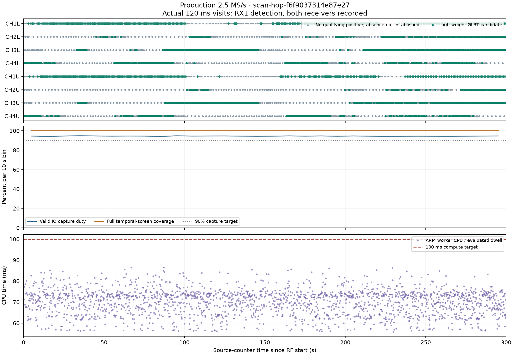
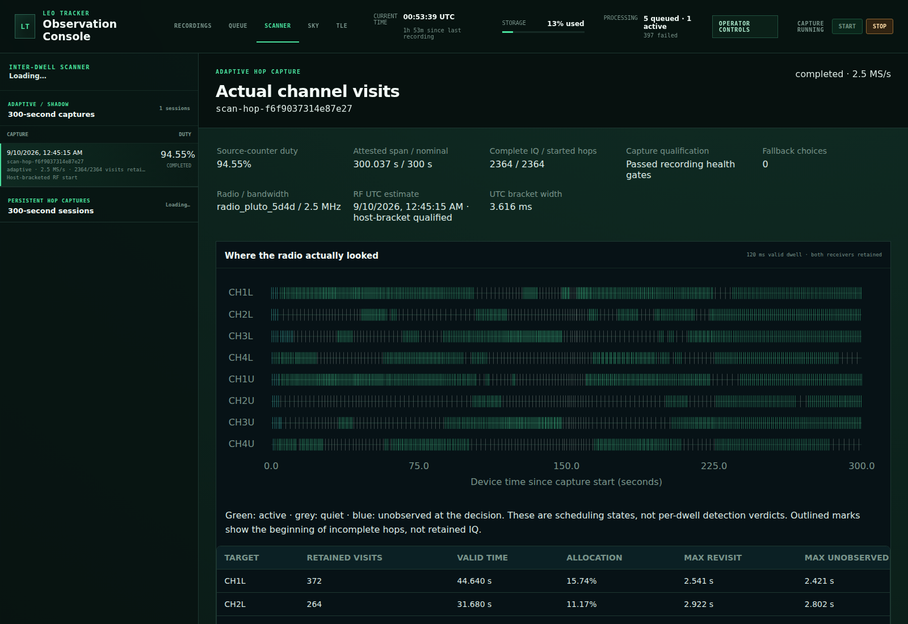
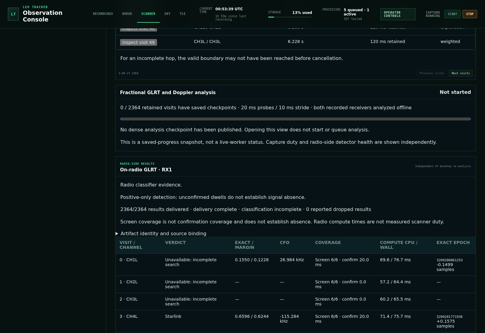

# Scanner production rollout: qualified 2.5 MS/s adaptive hopping

## Scope and measured basis

Deploy the receive-only host/ARM-userspace scanner and its UI, preserving the
300-second capture, 120 ms valid dwell, 20-minute cadence and 50/50 rate cycle.
The [bounded LNB report](2026_09_10_scanner_lnb_live_checkpoint.md) contains the
figures, exact bundle identities and retained evidence: 94.53% duty at 2.5 MS/s
with all visits screened, versus 94.28% capture duty but only 24.95% screening
coverage and a latched uniform policy at 5 MS/s. No firmware or FPGA update is
part of this deployment.

## Rate-specific promotion

`LEO_SCANNER_HOP_POLICY=adaptive` selects weighted hopping only for rates in
`LEO_SCANNER_ADAPTIVE_SAMPLE_RATES_HZ`. Set the latter to `2500000` for this
rollout. Other scheduled rates retain fixed-order hopping. GLRT remains advisory
and unavailable results never assert that a channel is empty. The default
allowlist is both supported rates, preserving existing opt-in behavior; the
default policy remains fixed. Invalid, empty or duplicate rates fail validation.

This is runtime policy selection, not a change to published intent contracts or
the canonical sample-rate/bandwidth schedule. Existing recordings cannot be
relabelled across hopping kinds on retry. The immutable live-tested ARM bundle
is unchanged. Adaptive 5 MS/s promotion remains deferred pending CPU and
intentional-skip health work; this rollout does not claim that limitation fixed.

## Paused-cadence queue collision

Read-only inspection found the old acquisition service repeatedly restarting
while the web UI's capture authority remained paused. Its scanner enqueue used
`coalesce_pending_kind=False`, unlike ordinary cadence enqueue. A second due
scanner intent violated the catalog's one-pending-cadence-kind unique index.

Scanner enqueue now uses the catalog's existing transactional coalescing port.
Superseded pending intent records remain in history as cancelled; the newest
pending intent is retained, and leased work is not displaced. No database
constraint is weakened and no production row is manually deleted or rewritten.

## Pre-deployment checks

- 199 CLI, radio, scanner, storage and API tests passed, including real fixture
  captures through both rate-specific runtime paths and read-only retry.
- 14 explicitly PostgreSQL-marked acquisition-operation tests passed in unique
  schemas in `leo_qualification`, including concurrent scanner enqueue.
- The supervisor fixture now enforces the same one-pending-kind invariant as
  production, and the paused multi-slot regression preserves cancelled history.
- Ruff and whitespace checks passed.

The dependency's hosted Python 3.11 paired-recorder failures are pre-existing on
its remote main; they are not reported as passing. Production uses Python 3.14
and must additionally pass frozen installed-runtime checks before activation.

## Production verification: completed

The real production-store recording is **`scan-hop-f6f9037314e87e27`**, on `.20`
with the LNB, RF start approximately **2026-09-10 00:45:15 UTC**. The first-sample
host-clock bracket is qualified and 3.616 ms wide. Its requested duration is
300 seconds; the source-counter span is **300.0369976 seconds**.

| Measurement | Observed result |
| --- | ---: |
| Valid retained IQ | 283.68 seconds, **94.5483% duty** |
| Complete 120 ms visits | **2,364 / 2,364** |
| Receiver data | RX0 and RX1 retained; full stored IQ verified |
| Rate / RF bandwidth | 2.5 MS/s / 2.5 MHz |
| Full six-window temporal screening | **2,364 / 2,364** |
| GLRT result delivery | Complete; zero dropped results |
| Positive / unavailable results | 1,475 / 889 |
| Confirmation evaluations | 2,043 |
| Evaluated ARM CPU mean / p99 / maximum | 70.03 / 83.88 / 86.52 ms |
| Evaluated wall time p99 / maximum | 88.75 / 94.15 ms |
| Fault-fallback choices | **0** |
| Unclassified source samples / unreceived tail | **0 / 0** |

Full temporal screening does not mean every window received full confirmation,
nor does it establish signal absence. The positive-only profile confirms at most
one 20 ms window in a dwell; unavailable is not a negative classification.
Candidates are not satellite identities. Retuning averaged 5.178 ms, scheduler
lateness 0.742 ms and the guard 1.000 ms, alongside 120 ms valid data. ARM work
overlaps acquisition rather than adding a synchronous wait to each hop.

The policy made 24 warmup, 2,309 weighted, one exploration and 30 none-active
choices. Target counts were 372, 264, 301, 287, 351, 216, 290 and 283 in
CH1L–CH4L then CH1U–CH4U order. Both uniform scanning when none are active and
weighted allocation subsequently occurred without latching fault fallback.

## Production browser and API

Open the production UI, select **Scanner → Adaptive / Shadow → 300-second
captures**, then select `scan-hop-f6f9037314e87e27`. Unlike the earlier isolated
LNB canaries, this recording is in the actual production store.

A real Chromium browser was opened before publication and observed the new
recording through normal automatic history refresh. Selecting it displayed the
qualified 300-second source span, 94.55% duty, actual visit timeline, and bound
radio-side GLRT. GLRT pagination passed. A second browser check passed against
the final selected release. All observed adaptive HTTP responses were 200, with
no page errors. Independent deployed GET and HEAD checks passed for history,
detail and GLRT, including exact capture-manifest binding.

Dense desktop fractional-GLRT/Doppler re-analysis was not run by this verification;
the UI correctly showed it as not started. The radio-side panel is independent.
These checks do not certify unrelated legacy analysis pages or ordinary captures.

## Deployment record and setup issues retained

Remote Leo `main` was fast-forwarded first to `a27315510de90ceddcb43d43ff40f6f1e26de046`
and then to `c60438c5fd096e884a0c523a73097299d1a2f5ba`. Both were staged as sealed,
non-editable Python 3.14 releases. The latter adds deployment preflight/runbook
checks for the three scanner namespaces, not a detector change. **475 Python
source and ARM bundle files were byte-identical** between the RF-verified and
final releases; `src`, `web`, `runtime`, dependency declarations and lockfile
had no Git diff. Both installed releases passed the 199-test selected suite.
The final operational checks passed all **285 deployment tests**, and the web
suite passed **139 tests**. These overlapping suites are not additive.

The relevant API and acquisition selectors now point to `c60438c5`; the global
and worker selectors remain unchanged. PPU `main` was fast-forwarded to
`664fa85cdde35050c0293a1dab90d2cc8b99eef9`, and libiio's default `master` to
`4323b93a17ff2a0e8954fc5ffd9367a40540bebe`. No force pushes were used. The report
and earlier LNB figures were published with the source, and this final report
update adds the resulting public evidence.

Two setup attempts preceded the one RF recording:

1. The bounded queue attempt spent about a minute reconciling existing history.
   It was explicitly cancelled before radio setup to avoid a watchdog cutting
   short the requested 300 seconds. Its cancellation and timing are retained.
2. The direct application retry staged the temporary daemon but failed before
   stream capture because the new adaptive-recording namespace did not exist and
   the service cannot write the bulk root. Cleanup ran. The three new namespaces
   were installed explicitly; no broad bulk-root permission change was made.
   Preflight now checks them, with tests for missing and incorrect permissions.

The final bounded application retry used the same immutable scheduled intent,
the production capture authority and production stores, and completed in about
324 enclosing seconds. It is a controlled verification, **not evidence of an
unassisted scheduled RF start**. No firmware, FPGA or bootloader was changed,
and no additional verification RF was collected. No prohibited radio was used.

The first queue operation remained retryable. After resume, the supervisor
closed operation 9573 as a late skipped slot (`lateness_seconds=771.620`), without
another RF capture. Its `succeeded` queue state means that skip was handled;
the qualified RF evidence is the separately verified recording above. A helper
attempt to reconcile the recording to the queue failed configuration validation
before any catalog mutation; no direct database correction was made.

## Resumed operation and remaining limitations

Per the user's explicit answer, capture resumed at generation **222** around
00:52 UTC. API and acquisition were active on the final release, and acquisition
remained PID 2738154 with **zero restarts** through 00:55 UTC, beyond the old
roughly 70-second crash cycle. An ordinary scheduled operation was leased and
recording. The 20-minute scanner cadence and equal 2.5/5 MS/s allocation remain
unchanged; adaptive weighting is enabled only at 2.5 MS/s.

The resumed **ordinary 25 MS/s** path reported missing-sample events on `.21`.
The pre-deployment ordinary 25 MS/s path also had degraded captures. This is
distinct from the clean 2.5 MS/s scanner verification and is not declared fixed
or qualified here. Adaptive 5 MS/s performance remains deferred as described
in the earlier LNB report. Neither issue is hidden by this scanner's successful
94.55% result.

The [artifact index](evidence/2026_09_10_scanner_production_rollout/index.json)
binds 22 public receipts, replay recipes and PNGs by size and SHA-256. Original
run recipes are preserved byte-for-byte as `analyze.py.gz` and
`verify_scanner.py.gz`; the adjacent Python copies are formatting/lint-clean
for deployment checks. No capture command was rerun during that cleanup. No IQ or
credentials are committed. Full local verification evidence remains beneath
`/srv/bulk/leo/qualification/scanner-a2731551/`, including the setup attempts.
