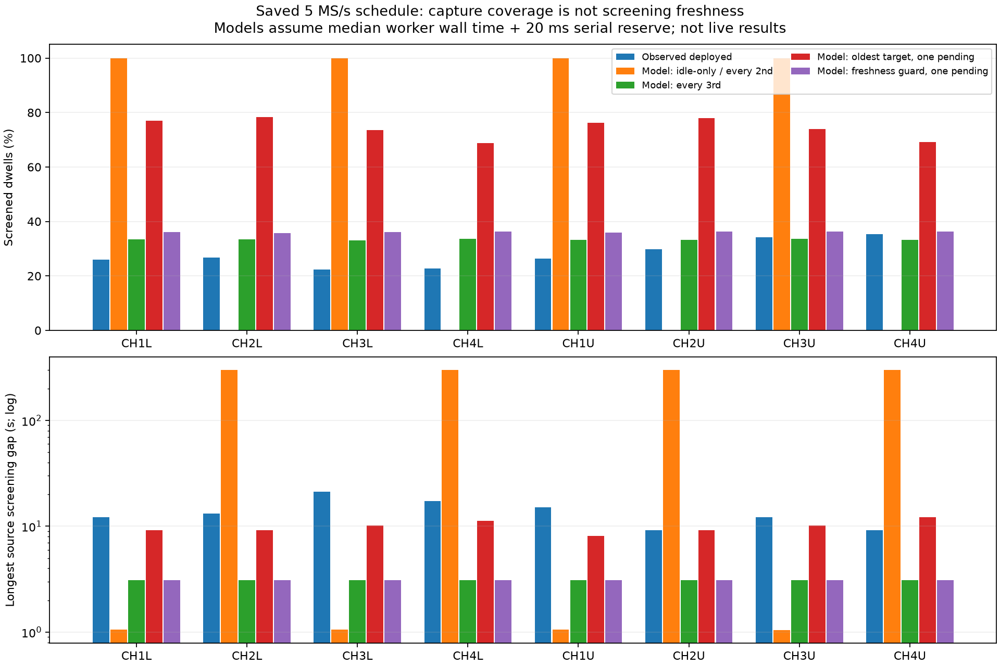
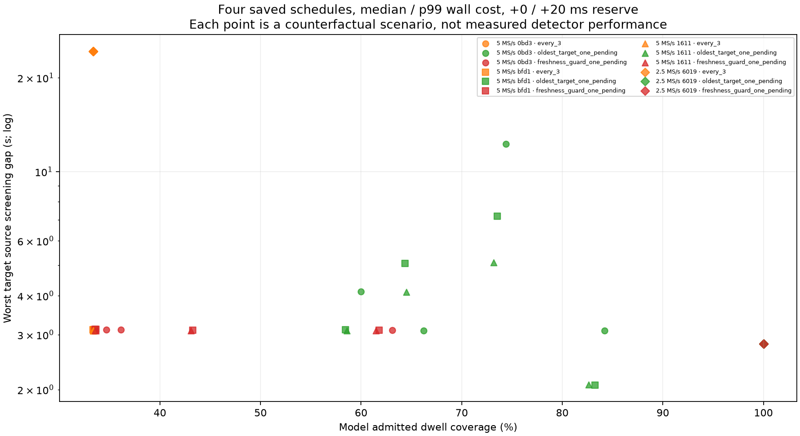

# Cooperative provider and fair screening admission: qualification checkpoint

## Outcome

The cooperative-skip SDK now passes the actual libiio provider and localhost
client paths, including full 300-second simulated streams at both sample rates.
Its ARM userspace bundle builds and passes local staging/hash verification, but
has **not** been installed or executed on a radio. There were no firmware/FPGA
changes and no new RF collection for this checkpoint.

A separate, tested admission model finds a real scheduling hazard: both fixed
every-other-dwell selection and a simple idle-only detector can repeatedly
exclude half the targets in an eight-target fixed schedule. Favoring older
targets increases modeled throughput, but aggregate coverage alone does not
ensure timely checks on every target. A freshness guard reduces long gaps at
the cost of deliberate detector idle time. Neither model is deployed.

This is a research checkpoint on `codex/scanner-5m-cooperative-skips`, not a
qualification or promotion of adaptive 5 MS/s. The deployed schedule remains
2.5 MS/s adaptive / 5 MS/s fixed order. The separately completed PNG repair is
on main at `6339e9018ffd36c86010ab9b2c5af781d85722a3`; scan
`scan-hop-125ccf74f6736019` has all three overview PNGs verified through HTTP and
the real browser. This checkpoint does not resolve the separate intermittent
5 MS/s transport failures observed earlier in the acquisition log.

## Provider and bundle evidence

The default-OFF provider option `IIOD_SCANNER_GLRT_COOPERATIVE_SKIPS` explicitly
requires positive-only GLRT, the SDK, and capture protection. Only intentional
owner pressure/admission skips become healthy UNKNOWN feedback. Genuine worker,
input and watchdog faults retain existing fault behavior. Unknown never means
signal present or absent and does not renew last-positive/cooldown timestamps.

Provider source is `17ee2cbdcf10660dc8a05cd8002b354b0da4b15d` in libiio; SDK
source is `5adeed570f728f89eba96c80e58b2783af1fb91a` in this repository.
No result, request, hop or persisted scientific contract layout changed.

| Check | Verified result |
| --- | --- |
| Provider build prerequisites and default-OFF behavior | 28 tests passed |
| Actual provider + SDK, cooperative OFF / ON / ASan+UBSan | All three configurations passed |
| Fixed localhost IIO client/storage integration | 16 tests passed |
| Adaptive localhost client/scheduled-storage integration | 46 tests passed, including 300-second cases |
| Admission-model component tests | 53 tests passed |
| ARM Cortex-A9/NEON/hard-float userspace bundle | Cross-build and ELF/dependency inspection passed |
| Actual ARM bytes through PPU's local portable-shell staging fixture | Eight companions verified, 12 script operations, zero remote calls |

At each rate, the adaptive provider fixture has seven scenarios: shadow,
adaptive, cancellation, genuine failure, shadow pressure, adaptive pressure,
and genuine failure after pressure. Pressure lasts 720 ms of simulated source
time. Cooperative pressure-only cases retain weighted scheduling, have zero
fault-fallback choices, and resume real numerical checks. Legacy OFF pressure
cases correctly latch fallback (22 choices in this fixture). A genuine failure
after cooperative recovery still latches fallback (10 choices). All results,
terminal drain, exact source gaps, RX0 sentinel integrity and restoration are
checked. The isolated numerical worker is **not** sanitizer-instrumented in
this provider configuration; provider, policy and SDK are.

The candidate bundle identity is
`efbb8eac150e93f06375042bd225f383be904c216832ba6d7a70a05ae0f8c72b`;
algorithm identity is
`e3f84a802e10ec7d598f413cce61ad72bdd75f064c4034911b57d328a6906e47`,
configuration identity is
`51950f672f3be7066aba1fff6c13f010309b9de60c4e15e3da6ed89e13eb7202`.
These identify the cooperative-skip candidate, **not** either fair-admission
model introduced here. System-library compatibility on the target, ARM
execution, live capture duty and detector quality remain open gates.

## What the saved scans actually show

All figures below use saved public RX1 result inventories. Capture source
counters are subtracted as integers before conversion to relative time. Full
inventory, receiver, sample-rate, 120 ms geometry, non-overlap and zero dropped
results are checked. No new IQ read/hash or signal-ground-truth assessment was
performed. Search mask 63 means all six temporal ranking windows were screened;
it does not mean six complete blind GLRT confirmations.

| Scan suffix | Rate | Observed screened dwells | Longest per-target source screening gap | Worker wall median / p99 |
| --- | --- | ---: | ---: | ---: |
| `b5521c5e306d0bd3` | 5 MS/s | 27.93% | 21.34 s | 150.49 / 191.63 ms |
| `bef2de33984fbfd1` | 5 MS/s | 28.54% | 18.27 s | 152.51 / 197.18 ms |
| `ff2ddd107a031611` | 5 MS/s | 27.14% | 16.23 s | 153.50 / 196.69 ms |
| `125ccf74f6736019` | 2.5 MS/s | 100.00% | 2.80 s | 76.72 / 88.82 ms |

Gaps are between screened dwell-end **source times**, including capture-start
and capture-end boundaries. They are not measured result-delivery latency or
periods proven free of signal. Unscreened dwells remain unknown. Worker timing
statistics include every temporally screened result, not only positives.



## Methods: five causal admission models

The models replay the recorded schedule without changing RF choices. Each
whole dwell becomes available at its retained end counter. There is one
non-preemptive worker; completions precede simultaneous arrivals. Service time
is held constant at that recording's measured median or p99 worker wall time,
with either zero or 20 ms additional serial reserve: 20 scenarios per scan,
80 total. This is a sensitivity study, not a reconstruction of actual service
time for uncomputed dwells or a stochastic performance guarantee.

1. **Idle-only:** admit the current dwell if the worker is idle; otherwise skip.
2. **Every second dwell:** fixed visit modulo two, still subject to worker availability.
3. **Every third dwell:** modulo three, still subject to availability.
4. **Oldest target, one pending:** keep at most one complete pending dwell.
   While busy, replace it only for a less recently dispatched target. In-flight
   work reserves its target. Pending age cannot exceed 120 ms at dispatch.
5. **Pressure-qualified freshness guard:** add a 2.5-second source-age trigger.
   While recently overloaded, decline fresh-target work if a previously seen
   target is overdue, reserving worker opportunities for overdue targets when
   they next arrive. The guard expires after 2.5 seconds without another busy
   arrival, and does not shed work when the worker keeps up. The 2.5-second
   trigger is **not** a guaranteed maximum gap; arrival geometry and work already
   running matter. Targets never observed cannot block the worker.

All shedding remains unknown. There are no modeled detections, misses, GLRT
scores, cooldown updates or RF-duty changes. A one-pending-dwell implementation
would need up to 2.4 MB for 120 ms of RX1 CI16 at 5 MS/s (1.2 MB at 2.5 MS/s),
unless existing owned pool storage can be reused. This model does not measure
the copy cost, scheduling overhead, pressure interference, watchdog behavior,
or whether current SDK result-order contracts permit the proposed replacement.

## Results and approaches that did not suffice

On all three 5 MS/s fixed schedules, idle-only and modulo two admit about 50%
overall but entirely neglect targets CH2L, CH4L, CH2U and CH4U for this start
phase and constant-cost range. This is a modeled aliasing counterexample,
**not** a claim that production neglected those four targets: the observed
inventories show checks on every target.

Modulo three avoids that fixed-order alias and checks about 33% with roughly
3.1-second worst gaps. It is not generally fair: on the saved 2.5 MS/s adaptive
schedule, modulo three produces a 24.30-second gap; modulo two produces a
40.66-second gap, despite sufficient modeled worker capacity to check all dwells.

Oldest-target pending admission gives about 58–84% coverage across the 5 MS/s
cost scenarios, without wholly starving a target. However, its first-scan
median+20 ms scenario still leaves a 12.25-second gap. Balanced totals are not
enough for timely reacquisition.

The pressure-qualified guard models about 33.5–63.1% coverage on the 5 MS/s
scans with worst gaps around 3.09–3.12 seconds. This is a deliberate trade:
lower total detector throughput for fresher per-target screening. At 2.5 MS/s
it keeps every dwell in all four cost scenarios, matching the observed complete
screening inventory. These are encouraging **model** results, not qualified
deployment gains. A simple static guard without overload qualification was
also tried; it unnecessarily shed 0.63% on the otherwise fast 2.5 MS/s case and
was replaced by the pressure-qualified variant.



## Next release gates

1. Implement bounded age-aware admission in the real SDK pool only after
   checking ownership, result ordering and pressure priority. Preserve the
   existing cooperative UNKNOWN/fault distinction. Do not deploy fixed modulo
   skipping or infer misses from unscreened visits.
2. Replay actual provider operation with uneven adaptive visit sequences,
   variable service costs, event delay/jitter, cancellation and genuine faults.
   Measure per-target maximum age as well as total screening coverage; an
   aggregate pass percentage is insufficient.
3. Profile the matched saved RX1 IQ on an allowed, available ARM device,
   including staging/copy cost. No new RF is needed for that measurement.
   Numerical optimizations need independent positive/negative and fractional
   timing/CFO equivalence checks before altering the detector.
4. After those gates, obtain explicit authorization for a bounded live check
   of a newly identified userspace bundle. Require at least 90% valid-IQ duty,
   honest coverage, bounded result age, clean restoration and verified UI/API
   products. Then promote, deploy and verify the qualified candidate.

## Reproduction and evidence

The [artifact index](evidence/2026_09_10_scanner_provider_admission/index.json)
hashes saved metadata, full modeled check inventories, summaries, figures,
component tests, original provider recipes and build/staging receipts. No IQ,
ARM binary, password or private key is committed. Archived `.py.gz` recipes are
byte-preserving historical build recipes with environment-specific paths, not
portable installation commands.

Run `uv run pytest tests/scanner/test_scanner_admission_model.py` for the model
tests. They check single-worker serialization, queue expiry, identities,
exact completion boundaries, causal prefix equivalence, counter translation
above 2^53, input immutability, metadata rejection and explicit alias examples.
From the repository root, rerender offline into fresh output directories with:

```bash
uv run python -m reports.evidence.2026_09_10_scanner_provider_admission.collect_and_render \
  --offline --output-root /tmp/admission-results-new --figure-root /tmp/admission-figures-new
```

Omit `--offline` only if a declared snapshot is missing and GET-only collection
from the local API is intended. This recipe never starts or changes recording.
