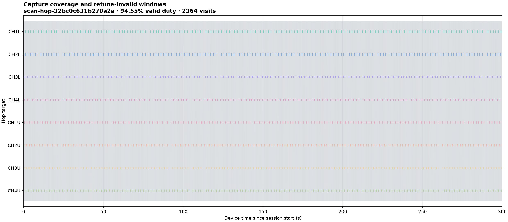
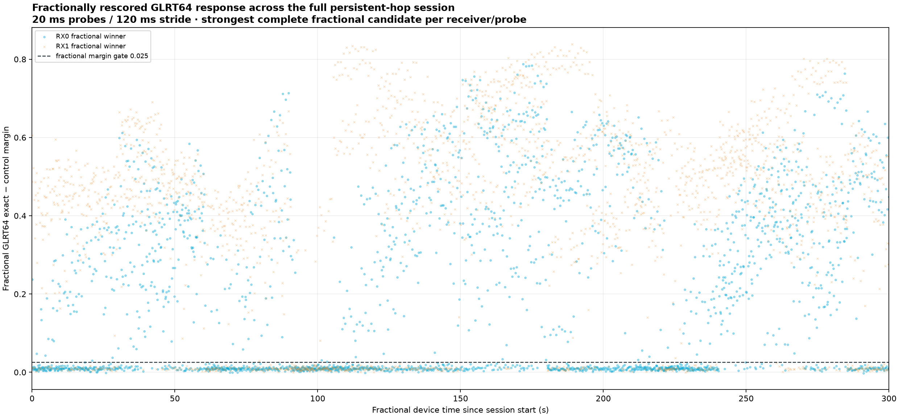
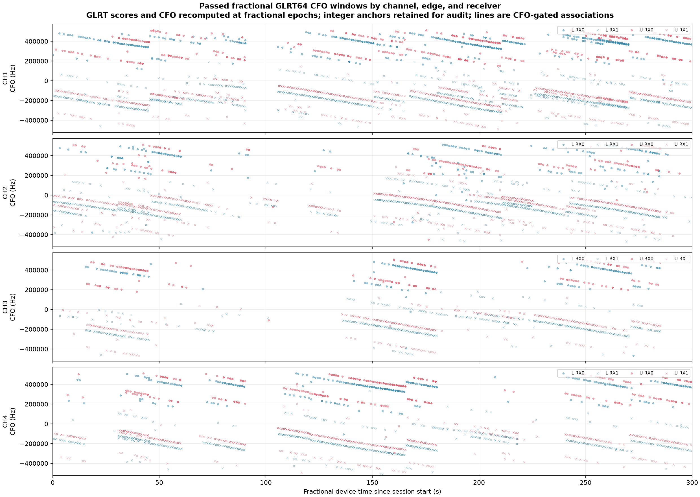
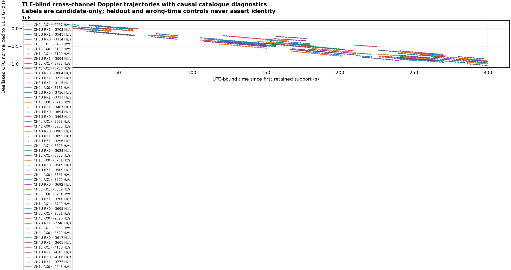
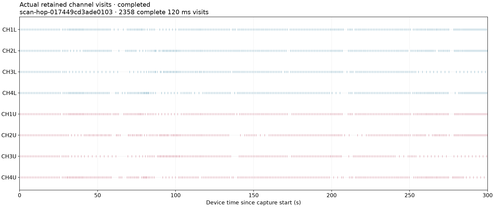
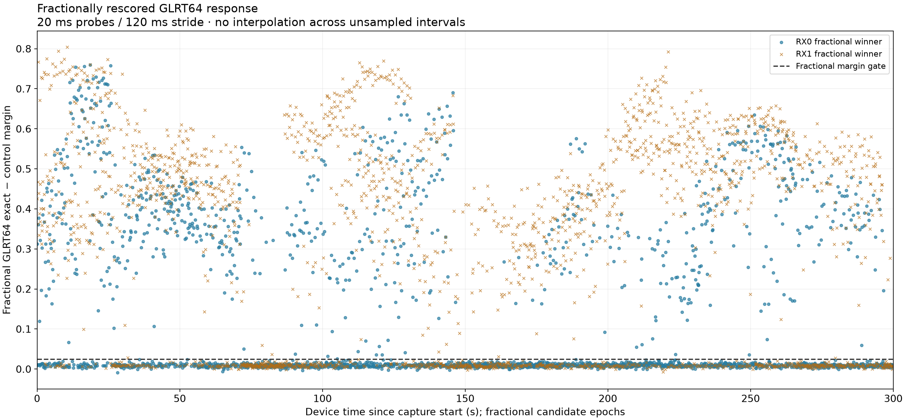
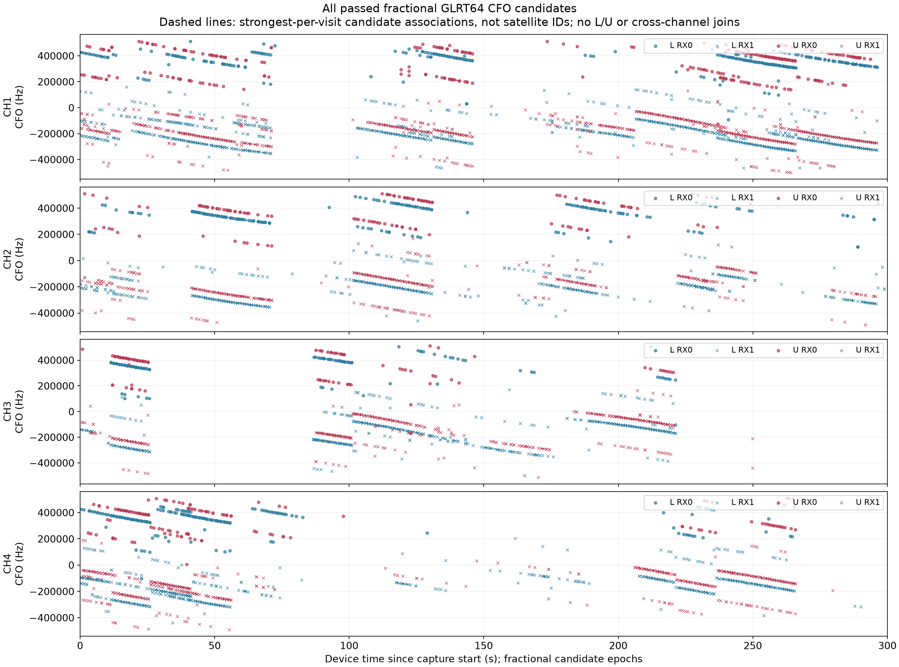

# Scanner-only production on radio .21

Production scanning is now confined to `.21`; standalone dwells are paused.
Live 300-second captures achieved **94.32% duty at 2.5 MS/s** and **94.55% at
5 MS/s**, with full IQ verification and restored RF state. No firmware, FPGA,
or radio-mode change was made during this cutover.
Both new scans have deployed, browser-verified fractional GLRT and CFO PNGs.

## Purpose and scope

Move production scanning to `192.168.1.21`, retain 300-second captures every
20 minutes, and stop standalone recording dwells. The internal 120 ms scanner
dwells remain unchanged. Current scheduling alternates **2.5, 5, 2.5, 5 MS/s**
on UTC-aligned slots: two slots, not the earlier four-slot proposal.

Only `.21`, serial `10400056f695001322002d0010ad1719f2`, is authorized for this
cutover. `.20` belongs to another hardware task. Neither that radio, `.14`,
`.165`, nor the excluded serial was probed during this cutover.

## Implementation

The acquisition service now uses its own immutable selector and a singleton
radio configuration. It runs `--scanner-only --max-scanner-runs 1`, with
`Restart=always`. Existing durable cadence de-duplication prevents successful
slots being recorded again after process restart. Ordinary queued recording
jobs are preserved but not claimed. This reuses the existing supervisor and
queue; it adds no new scheduler or persisted contract.

The runtime release is `d8dbe7723987ac222d18201ef175ca38e0951105`.
The API remains `732f1cdf`; the global/worker selection remains `9948c311`.
The API process was not restarted by this deployment. Analysis continues
through the existing fixed/adaptive backfill timer independently of capture.

The scanner-capable host libiio is `a1088b61`; staging explicitly used
`--scanner-glrt`. The ARM companion bundle is pinned to manifest
`5ff6ea2eb861cbdba02f89744a7f6d42e86825ed2e5f4b1ab5e60d11526ebf72`,
preserved independently of the acquisition app revision. This is a temporary
userspace iiOD/worker lifecycle, **not a firmware or FPGA update**. PPU readback
identified AD9361, two receive paths, and existing firmware
`v0.49-plutoplus-spf-iq-direct-async-v4`. No device-mode change was necessary.

Both rates retain RF bandwidth equal to sample rate, the existing compiled
Starlink channel/IF geometry, eight kernel buffers, a 1 ms transition guard,
131,072-sample blocks, eight visits of read-ahead and a 64-visit storage queue.
Adaptive hopping is allowlisted only at 2.5 MS/s. The fixed 5 MS/s path may
publish independent RX1 classification evidence, but does not make adaptive
hop choices from it. Missed/overloaded classification remains unavailable,
not evidence of signal absence.

## Failures found and retained

1. The first narrow cutover correctly stopped at a shared scanner-radio default
   still pointing to `.20`. Only that default was aligned to `.21`; the shared
   historical radio inventory and other service settings were preserved.
2. Scanner-only startup synchronously reconciled the legacy standard-scan
   corpus before admitting its next slot. The bounded persistent scanner now
   omits that legacy reconciliation; its fixed/adaptive products continue through
   the already separate background analysis path. Other modes retain their
   existing reconciliation behavior.
3. PPU requires a credential file containing keys for **only the exact target
   host**. Preserving `.20` and appending `.21` in that active scanner credential
   therefore failed before RF. The active file now contains only the previously
   identity-verified `.21` key. All original keys remain in a root-only archive;
   strict host checking was not disabled. No password or raw environment backup
   is included in this report.

The 16:20 automatic attempts failed during credential validation without
recording RF. After repair, one explicitly bounded recovery
called the public scheduled-capture entry point for that **same still-valid
UTC-aligned slot**, with the normal radio authority, identity checks, admission,
PPU lifecycle and capture store. It first required both fixed and adaptive
stores to contain no evidence for that session. It did not reset the durable
operation, overwrite evidence, invent an unaligned slot, or alter timestamps.
The failed attempts were not rewritten as successes. Recovery began at 16:23:42 UTC,
within the existing five-minute start-lateness limit.

## Software verification

The startup fix passed the source-selected mypy, pytest, Ruff and formatting
gates. Two overlapping test selections passed: **217 deployment/supervisor tests**
and **69 focused CLI tests**, using the explicitly configured qualification
database where required and bulk scratch space. An initial manual
run without that environment failed because the database was unspecified and
`/tmp` exceeded the test's 80% storage limit; neither assertion was weakened.

The exact immutable release has a passing five-lane sealed qualification:
protected real corpus, current native science, PostgreSQL, production web build,
and Chromium E2E. All five were reused under matching input hashes from the
preceding sealed release, not misrepresented as new executions. The changed
CLI tests ran separately. Component cutover preflight passed before activation.

## Live verification and figures

The check requires a completed 300-second source span, full-IQ digest verification,
correct `.21` identity, restored RF state, capture duty above 90%, and separately
verified desktop analysis/PNG publication. Service activity alone is not success.

| Capture | Mode | Source span | Valid IQ | Duty | Complete dwells |
| --- | --- | ---: | ---: | ---: | ---: |
| `scan-hop-32bc0c631b270a2a` | 5 MS/s fixed recovery | 300.019228 s | 283.68 s | 94.5539% | 2,364 |
| `scan-hop-017449cd3ade0103` | 2.5 MS/s automatic adaptive | 300.005514 s | 282.96 s | 94.3182% | 2,358 |

All 11,347,200,000 uncompressed IQ bytes in the 5 MS/s capture were checked
through the storage verifier; compressed storage is 7,609,246,568 bytes.
Counter continuity and restoration are attested. This is a manual recovery
through the production capture entry point, not a claim that its failed
automatic queue operation succeeded.

The independent 5 MS/s RX1 classifier delivered all 2,364 results without a
dropped result or publication warning. Of these, 549 searched all six windows;
1,815 had a zero search mask. Verdicts were 462 positive and 1,902 unavailable.
The zero-mask records represent explicit overload skipping, not negative
detections. Across all records, including zero-work records, wall-time p95 was
178.21 ms, p99 193.32 ms, and maximum 214.64 ms. Do not interpret the zero median
as detector compute speed, or this capture as full-coverage 5 MS/s adaptive
qualification. The preserved 94.55% capture duty is the important capture-first
operational result.

### New 5 MS/s products

The automatic desktop worker completed all 2,364 visits at 16:38:09 UTC,
about nine minutes after capture publication. These are saved **fractional**
GLRT64/CFO products, not interpolated integer estimates or the ARM detector's
lightweight result stream. Automatic analysis uses one 20 ms probe per 120 ms
dwell on both receivers; the full IQ remains available for denser analysis.

The existing fixed-scan tracking worker also finished its four bounded physical
groups at 16:38:25 UTC. Its saved trajectory/TLE PNG is served by the deployed
UI. This operational check verifies publication, **not the scientific certainty
of the candidate satellite IDs**. The observer-site authority and causal TLE
policy were not changed.

All four API-served PNGs matched their local published bytes. A fresh browser
session selected the new capture, loaded all three analysis tabs, decoded their
images, and received HTTP 200 for the tracking PNG as well. No page errors were
observed. Source PNGs are archived here unchanged, with hashes in the evidence.

### Automatic 2.5 MS/s capture

The 16:40 UTC operation was claimed once, with no queue error. Its host-bracketed
RF start was 16:40:15.740701 UTC (0.973 ms bracket width), and publication completed
at 16:45:20.607682 UTC. The supervisor exited successfully after its one allowed
scanner run, restarted normally, and waited for the next durable slot without
duplicating the recording. The original standalone dwell remained pending with
zero attempts throughout.

All 5,659,200,000 uncompressed IQ bytes were verified; compressed storage is
3,654,214,549 bytes. The receipt reports restored RF state and **zero adaptive
fallback choices**. Every one of the 2,358 RX1 classifications had a full
six-window mask; all results were delivered, with zero drops and no publication
warning. Verdicts were 1,933 positive and 425 unavailable. Wall time was
79.05 ms median, 80.79 ms p95, 82.45 ms p99 and 88.56 ms maximum. Full search
coverage is not the same as certain classification of every dwell.

Policy decisions were 24 warm-up, 2,302 weighted, and 32 `none_active` visits.
The last case is the intended ordinary scan when no target is active, not an
error fallback. All eight channel/edge targets retained IQ, with 248–319 visits
per target and maximum start-to-start revisit gaps no larger than 2.811 seconds.

This establishes real 300-second, capture-first operation at both deployed
rates on `.21`, and actual automatic scheduling at 2.5 MS/s. It is not a
same-sky/matched-hop-order comparison of detector sensitivity between rates.

The first bounded analysis pass saved 1,854 visits and stopped for its
five-minute time budget. A second pass resumed those checkpoints; all 2,358
visits and all three overview PNGs were published at 16:52:42 UTC, roughly
7 minutes 22 seconds after capture publication. The deployed UI decoded all
three images at 16:53:35 UTC; every scan-specific request returned HTTP 200,
with no browser page errors. Each HTTP PNG matched the local published bytes.

The adaptive overview contains 260 associations from 2,255 strongest-per-visit
observations, without truncation. These are separate target/receiver candidate
associations, not cross-channel satellite IDs. The fixed-scan TLE product shown
above must not be mistaken for an adaptive TLE publication.

The read-only browser check already loaded coverage, fractional GLRT64 and CFO
figures for the existing `scan-hop-8b0f07e35b51d6fd` through the deployed UI,
with no page errors. The previously reported `scan-hop-125ccf74f6736019` also
has `figures_ready`, with 2,365/2,365 analyzed visits. A browser check at 16:28:39
UTC navigated to that exact scan and decoded all three PNGs successfully;
every session-specific request returned HTTP 200, with no page errors. These
existing examples are distinct from the new `.21` capture above.

## Reproduction and limits

[`verify_capture.py`](evidence/2026_09_10_scanner_r21/verify_capture.py) reads a
published session through the component-owned storage ports and hashes all IQ.
[`verify_ui.mjs`](evidence/2026_09_10_scanner_r21/verify_ui.mjs) uses the deployed
browser UI, decodes all three displayed PNGs, and records response statuses.
Neither script opens a radio or changes capture/analysis products.

[The evidence index](evidence/2026_09_10_scanner_r21/index.json) hashes the
original manifests, classifier publications, UI/API checks, deployment receipts
and all seven unchanged source PNGs. The RF verification ran from the recovered
5 MS/s capture through the next automatic 2.5 MS/s capture, within a 22-minute
span; only two five-minute recordings were taken. No further RF was needed for
the analysis and publication checks. Scheduled scanner-only acquisition remains
enabled for subsequent 20-minute slots. The API process stayed unchanged
throughout; the ordinary dwell's zero-attempt pending state is archived.

See the [preceding live qualification report](2026_09_10_scanner_live.md) for
the earlier isolated 2.5 MS/s adaptive and 5 MS/s fixed comparison. That work
used `.20` before reassignment; it is not a replacement for this production
`.21` verification. These two scans establish bounded operational evidence,
not long-term satellite-ID accuracy or detector false-alarm performance.
