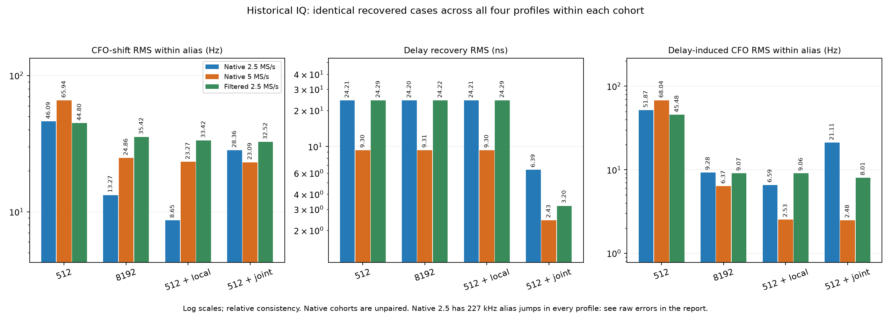
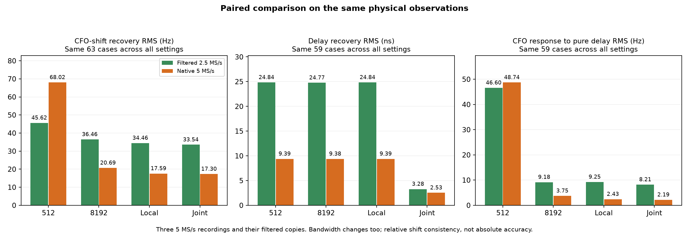

# Continuous-frequency and joint timing/CFO GLRT prototype

The local frequency prototype reduces frequency-grid error on stored IQ at
both native rates. The joint timing/CFO prototype improves delay recovery at
both rates, but worsens CFO consistency on one native 2.5 MS/s scan. Neither
prototype changes production behavior. Local frequency refinement is the
better candidate for the next validation step; unconditional joint iteration
is not ready for adoption.

These are exploratory results on previously studied recordings, not a new
holdout campaign. No RF was collected. No cubic fit supplies ground truth.

## Native recording results

The same successfully recovered cases are used across all four profiles within
each rate and test. The native 2.5 and native 5 MS/s cohorts contain different
physical observations; their numbers do not isolate a sample-rate effect.

| Estimator | Native 2.5 CFO-shift RMS, within alias (Hz) | Native 5 CFO-shift RMS (Hz) | Native 2.5 delay RMS (ns) | Native 5 delay RMS (ns) |
|---|---:|---:|---:|---:|
| Current 512 | 46.09 | 65.94 | 24.21 | 9.30 |
| Current 8192 | 13.27 | 24.86 | 24.20 | 9.31 |
| 512 + local frequency | **8.65** | **23.27** | 24.21 | 9.30 |
| 512 + local + joint iteration | 28.36 | 23.09 | **6.39** | **2.43** |

**The native 2.5 CFO column folds the known 227,272.7 Hz symbol-frequency
ambiguity. Two frequency-shift cases and one delay case switch aliases in
every profile, including the baseline. Those are real unresolved errors in
the reported absolute CFO.** They are retained in all summaries, with the raw
errors reported separately below. No alias switches occurred in the native
5 or filtered 2.5 cases.

| Estimator | Native 2.5 raw CFO-shift error RMS (Hz) | Raw delay-induced CFO RMS (Hz) | CFO-shift alias switches | Delay alias switches |
|---|---:|---:|---:|---:|
| Current 512 | 39,564.75 | 28,192.79 | 2 | 1 |
| Current 8192 | 39,564.73 | 28,192.74 | 2 | 1 |
| Local frequency | 39,563.32 | 28,190.06 | 2 | 1 |
| Joint iteration | 39,591.46 | 28,210.00 | 2 | 1 |

Thus the 8.65 Hz result establishes better estimation *within the selected
alias*, not reliable absolute CFO recovery across acquisition alias changes.

| Cohort | Baselines recovered | Delay comparisons recovered | CFO comparisons recovered |
|---|---:|---:|---:|
| Native 2.5 MS/s | 17/18 | 65/72 | 66/72 |
| Native 5 MS/s | 17/18 | 68/72 | 68/72 |
| Filtered 2.5 MS/s | 17/18 | 62/72 | 67/72 |

Recovery masks are identical across the four profiles within each cohort and
test. A missing baseline makes all its shift comparisons failures. This
prototype did not increase detection recovery. Every failure remains in the
denominators. Candidate rank can change between profiles and transformations;
all candidates and choices are preserved in `raw/`.



## Paired rate comparison on the same physical observations

The native-rate table is not a controlled rate comparison. In the local-only
5 MS/s cohort, the three scans have CFO-shift RMS of 0.051, 0.036 and 39.16 Hz;
the last scan contributes more than 99.99% of the squared error. Pooling these
different observations makes 5 appear worse than the native 2.5 cohort. The
paired comparison below instead favors 5 once frequency refinement is enabled.

The native 5 MS/s recordings were also low-pass filtered and decimated to
2.5 MS/s using the earlier 81-tap, delay-compensated FIR. These are paired
digital versions, not independent 2.5 MS/s hardware captures. Filtering changes
the retained bandwidth as well as the rate.

The table uses the same 63 frequency-shift comparisons and 59 delay comparisons
across both rates and all four estimators. No alias folding changes any error
in this paired table.

| Input | Estimator | CFO-shift RMS (Hz) | Delay-recovery RMS (ns) | CFO-change RMS under pure delay (Hz) |
|---|---|---:|---:|---:|
| Filtered 2.5 | Current 512 | 45.62 | 24.84 | 46.60 |
| Filtered 2.5 | Current 8192 | 36.46 | 24.77 | 9.18 |
| Filtered 2.5 | Local frequency | 34.46 | 24.84 | 9.25 |
| Filtered 2.5 | Joint iteration | 33.54 | **3.28** | 8.21 |
| Native 5 | Current 512 | 68.02 | 9.39 | 48.74 |
| Native 5 | Current 8192 | 20.69 | 9.38 | 3.75 |
| Native 5 | Local frequency | 17.59 | 9.39 | 2.43 |
| Native 5 | Joint iteration | **17.30** | **2.53** | **2.19** |

This supports the value of improved timing, especially once the residual
frequency grid is refined. It does not establish that timing alone explains
the bandwidth/rate difference. Relative translation errors can cancel shared
absolute biases.



## The previously observed 33 ns failure

This is the same post-hoc example previously selected as the largest
delay-induced CFO change in the supported native 5 MS/s cases. It is an
illustration, not a representative sample or an independent validation set.
Source: `scan-hop-cabca9c4f49c5a27`, probe 20; imposed delay 32.97710095 ns;
no imposed frequency shift.

| Estimator | Unintended CFO change (Hz) | Delay-recovery error (ns) |
|---|---:|---:|
| Current 512 | +343.6249 | -8.2601 |
| Current 8192 | -17.0374 | -7.2286 |
| Local frequency | +0.5214 | -8.2601 |
| Joint iteration | +0.2141 | -0.0163 |

## Outliers and the joint regression

Local frequency refinement lowers CFO-shift RMS versus 512 in each of the six
native scans. On four scans, its relative CFO-shift RMS is 0.04–0.10 Hz. The
remaining errors are concentrated in acquisition/selection changes:

| Native scan | Current 512 CFO-shift RMS (Hz) | 8192 | Local | Joint |
|---|---:|---:|---:|---:|
| 2.5: `24581756098baa21` | 30.34 | 11.11 | 0.100 | 0.041 |
| 2.5: `8a1c00acfc8fbc31` | 19.90 | 10.70 | 0.072 | 0.046 |
| 2.5: `fb52971f6bb09c12` | 77.68 | 18.13 | 16.56 | 54.30 |
| 5: `432b03933b8c76bf` | 18.81 | 10.82 | 0.051 | 0.075 |
| 5: `862a183b8ab422da` | 25.42 | 11.68 | 0.036 | 0.060 |
| 5: `cabca9c4f49c5a27` | 106.90 | 38.98 | 39.16 | 38.87 |

The table uses alias-folded errors for the affected native 2.5 scan; its raw
errors remain in the table above and the CSV files.

In native 2.5 probe `a5764326...`, the local baseline selects rank 4 near
433,683 Hz, while two shifted observations select rank 2 on the neighboring
alias near 207 kHz. Joint iteration accepts a CFO reconditioning step for the
baseline and moves it another approximately 161 Hz, while rejecting the
corresponding step in the shifted cases. Its exact score increases, but
frequency consistency worsens. This demonstrates that increasing this
normalized GLRT score is not sufficient to certify a correct joint update.

In native 5 `cabca...` probe 0, the baseline and shifted inputs retain different
acquisition CFOs and ranks. The local frequency errors include approximately
-90 Hz and -132 Hz despite sub-bin refinement. Finer optimization cannot
recover a candidate that acquisition has failed to retain in the same basin.
These outcomes were not removed or used to tune a new quality gate.

Joint refinement improves delay-recovery RMS in every native scan, but it can
increase unintended timing changes under pure frequency shifts: pooled native
2.5 RMS grows from 0.53 to 4.47 ns, and native 5 from 7.24 to 8.49 ns. The
summary JSON/CSVs include both cross-effects, p95, maximum error, and all
recovered-case RMS rather than only selected headline metrics.

## What the prototype implements

1. **Grid 512 / grid 8192:** existing acquisition and fractional timing paths.
2. **Local frequency:** retain each candidate's grid-512 fractional timing;
   use a 512-bin FFT to locate the three strongest distinct spectral maxima;
   maximize the exact summed-autocorrelation polynomial over ±one coarse bin
   around each, using bounded golden-section search to a 0.25 Hz interval.
   Circular frequency boundaries are handled explicitly. Exact and control
   pilot spectra are both independently refined. The 0.25 Hz number is a
   numerical search tolerance, not an accuracy claim. Searching three coarse
   maxima is a bounded approximation to the global continuous maximum.
3. **Joint iteration:** start from the local result, attempt to recondition
   the IQ correlations using its estimated total CFO, then refine fractional
   timing. Run two coordinate passes with 200 ns and 100 ns timing steps,
   three-point log-parabolic proposals, and direct rescoring. Timing remains
   within 800 ns of the original anchor. Proposed resulting CFOs are kept on
   the current symbol-alias branch and must be within 2 kHz of the previous
   estimate. Accept only nondecreasing exact scores. The conditioning CFO
   itself can move much farther than 2 kHz when replacing the acquired CFO.

This is a heuristic coordinate prototype using the existing normalized GLRT,
not a newly derived joint maximum-likelihood estimator. The joint step is
bounded local refinement; it does not resolve aliases across independently
acquired observations. It starts only when the existing fractional refiner
has a bracketed solution. The acquisition search and its sample-based
candidate separation are held fixed for this comparison; only the joint
refinement steps/radius use equal physical time units.

## Corpus and reproducibility

- Six historical 300 s recordings: three native captures per rate, using the
  same long lanes selected in the prior historical joint study. Six evenly
  indexed probes per lane. The three 5 MS/s scans also supply the filtered
  versions, giving 54 probe/version combinations.
- Each probe has one baseline, four deterministic off-grid delays spanning
  -300 to +300 ns, and four frequency shifts spanning -2 to +2 kHz. Seeds,
  exact shifts, source evidence hashes and probe identities are in `plan.json`.
- Read 21 ms of stored IQ, transform it, then crop 0.5 ms from each end to score
  20 ms. The delay uses the Fourier translation of the bandlimited waveform.
  The frequency shift uses exact complex rotation. Fresh acquisition for
  every transformed input; fine/conditioned steps 500/100 Hz.
- Candidate selection uses maximum exact score among candidates with margin
  at least 0.025 and integer phase within 800 ns of the original target phase.
  Neither the true frequency nor the imposed shift selects a candidate. This
  measures recovery of preselected long-trajectory targets, not blind search
  recall or a calibrated false-positive rate.
- 486 acquisitions, 1,944 profile observations; all candidate outputs retained.
  Historical replay took approximately 273 seconds across the smoke and full
  runs. The inventory audit rejects missing and duplicate cases. All 648
  overlapping baseline-grid observations exactly reproduce the previous
  paired experiment, including every retained candidate and target choice.
- 5,810 joint coordinate passes, 1,568 accepted CFO reconditioning proposals;
  no accepted exact-score decrease. These count all retained candidates.

Run from the isolated worktree, with its `src:tools` on `PYTHONPATH`:

```bash
python tools/prototype_glrt_local_joint.py --output reports/2026_09_11_glrt_refinement_prototype --plan-only
python tools/prototype_glrt_local_joint.py --output reports/2026_09_11_glrt_refinement_prototype --max-seconds 900
python tools/summarize_glrt_refinement_prototype.py --output reports/2026_09_11_glrt_refinement_prototype
python tools/check_glrt_refinement_synthetic.py --output reports/2026_09_11_glrt_refinement_prototype
```

The raw replay requires read access to the historical persistent IQ store.
Existing per-probe output files are reused; use a new output directory when
changing the estimator or plan. The prototype is an isolated analysis module;
there are no production callers or persisted-contract changes.

## Runtime

Median milliseconds per 20 ms input, scoring all retained candidates. Total
includes acquisition plus the stages needed for that profile; shared work is
accounted for in local/joint timings. These are sequential Python timings on
a shared host, not a production throughput qualification.

| Estimator | 2.5 scoring ms | 2.5 total ms | 5 scoring ms | 5 total ms |
|---|---:|---:|---:|---:|
| Current 512 | 30.3 | 114.5 | 43.6 | 415.4 |
| Current 8192 | 34.6 | 119.1 | 50.3 | 422.9 |
| Local frequency | 58.0 | 141.5 | 82.3 | 455.0 |
| Joint iteration | 303.1 | 385.9 | 442.4 | 806.2 |

The prototype local search is slower than 8192. Its total overhead relative
to 512 is about 24% at 2.5 MS/s and 10% at 5 MS/s. Joint iteration is roughly
3.4× and 1.9× the total baseline cost, respectively. Batch evaluation and
derivative-based peak refinement are candidates for later optimization, but
no speedup is assumed in these results.

## Independent absolute sanity check

A separate matched known-pilot simulation uses fresh acquisition, known
fractional delays and CFOs, and complex Gaussian noise. There are six cases at
each of 0 and 10 dB average waveform SNR per rate. All 24 cases are recovered
by every profile. Frequencies and delays differ between SNR groups, so this
small experiment does not establish an SNR response curve.

| Rate | SNR | 512 absolute CFO RMS (Hz) | 8192 | Local | Joint |
|---|---:|---:|---:|---:|---:|
| 2.5 MS/s | 0 dB | 17.23 | 24.42 | 19.76 | 16.35 |
| 2.5 MS/s | 10 dB | 19.12 | 12.67 | 9.68 | 4.77 |
| 5 MS/s | 0 dB | 15.34 | 9.98 | 10.00 | 9.80 |
| 5 MS/s | 10 dB | 19.29 | 7.26 | 3.01 | 3.14 |

These absolute errors are much larger than the best sub-hertz historical
*relative* errors. Noise, timing bias and model error remain after removing
the grid. The simulation uses a matched transmitter model; it does not
calibrate absolute real-signal accuracy. Complete timing and CFO outputs are
in `synthetic.json`.

Validation: 33 focused tests passed, including independent direct-DTFT and
dense-grid oracles, known off-grid tones, frequency seams, known-pilot timing
and CFO at both rates, alias/error accounting, and existing batch/scalar GLRT
equivalence. The 10 prototype-specific tests passed again after preserving
the residual/total CFO identity when a joint proposal wraps an alias. That
bookkeeping correction does not change the replay's serialized measurements.
Ruff checks passed. Original scientific fixtures were not changed.

## Recommendation

Proceed with local frequency refinement as a candidate for broader validation
and runtime optimization. Keep 8192 as an inexpensive comparison. Treat the
joint timing result as promising but experimental: resolve alias/basin
consistency and the meaning of the normalized objective under reconditioning
before enabling it. A follow-up should also separate timing-only iteration
from CFO reconditioning, since this prototype changes both together.

Artifacts: [summary](summary.json), [native/filtered metrics](summary.csv),
[paired metrics](paired.csv), [per-scan metrics](per-scan.csv),
[runtime](runtime.csv), [synthetic check](synthetic.json), [audit](audit.json),
[PNG](comparison.png), [checksums](SHA256SUMS).
