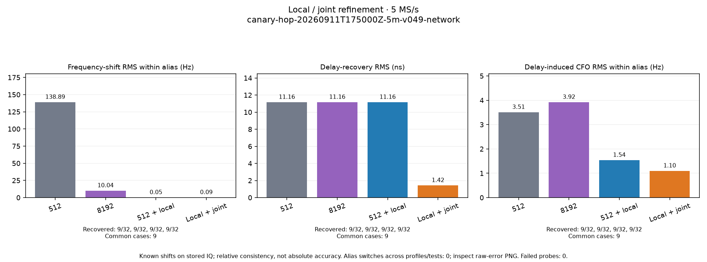
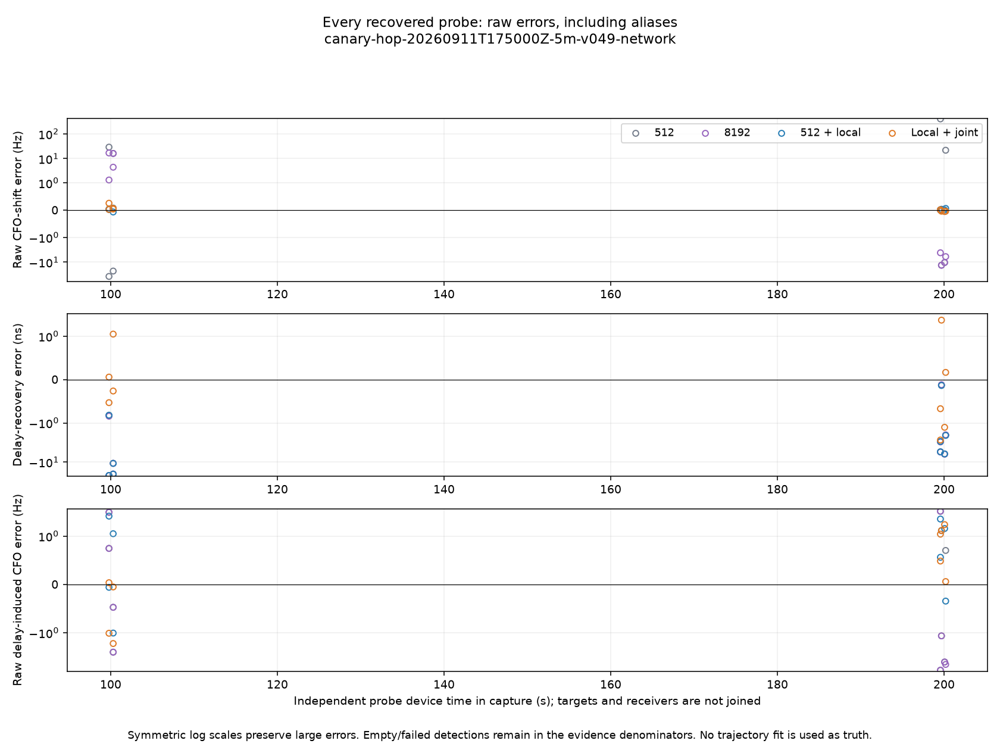

# Radio `.20`: PPU network restore to the latest release

On 2026-09-11, the user authorized a PPU network firmware update of
`192.168.1.20`, serial `1040005e0b100007100010000bf33a5d4d`. GitHub's latest
published release was
[v0.49-plutoplus-spf-iq-direct-async-v4](https://github.com/misko/plutosdr-fw/releases/tag/v0.49-plutoplus-spf-iq-direct-async-v4).
PPU `firmware flash-lan` completed successfully, including firmware readback
before and after reboot, exact serial and AD9361 identity, two-receiver layout,
metadata ABI 3, tandem capability, TX-safe readback, and attested SSH-key rotation.

The [PPU receipt](evidence/ppu-flash-receipt.json) is
`a34691c3-3562-4366-9596-23f7dfcc6bad`. Its DFU SHA-256 is
`f45524f4765d5743144703ff6f4541084ff1ab9b1ce20a77f3f6fa820a1f84b6`;
the exact 12,825,815-byte FIT read back from `/dev/mtd3` matches
`77f899610548d486aab2c83c4dc7170532d470b115d2bd0e8fc43e72b3bfca67`.
The firmware update used only the qualified firmware DFU/FRM, preserving the
Pluto+ bootloader. The old firmware partition and boot environment were backed
up privately before mutation.

## Compatibility and networking

The standard promotion dry run rejected the custom
`glrt-native-exact-r60000000-stripped-v1` source because it has a GLRT IQ device
and no ordinary RX scan elements. A separate PPU transition profile now binds
that exact source firmware and observed RX-only layout to the unchanged,
qualified v0.49 target bytes and all existing return checks. The ordinary
promotion profile remains unchanged. The
[PPU patch](evidence/ppu-transition.patch) is local commit `77fc87e`, based on
PPU main `664fa85`; 119 firmware, LAN CLI, and transition tests passed, as did
Ruff checks and formatting. This is the first hardware execution of the new
transition, rather than a new firmware qualification claim.

The old source shared Ethernet MAC `00:0a:35:00:01:22` with `.21`. Before reboot,
only boot-environment key `ethaddr` was changed to `02:00:00:33:a5:4d`; all other
keys were compared and preserved. V0.49 retained that setting and exposed runtime
MAC `fe:0d:21:f8:eb:bd`. Network return and serial identity were verified. No
mutation was sent to `.21`. The scanner credential now uses the post-reboot key
verified by PPU, with strict host checking retained.

`/dev/tandem-agc-events`, absent on the old firmware, is present after the update.
This resolves the firmware blocker documented in the
[earlier rollout](../2026_09_11_scanner_refinement_rollout/README.md).

## Scanner verification

Capture control was resumed at generation 236 and the existing acquisition
service restarted on `.20`. Its configuration retains scanner-only operation,
300-second runs, the 20-minute cadence, and alternating 2.5 / 5 MS/s slots.
The initial resume command created a root-owned control file; its ownership was
corrected to the service account before capture admission. No failed attempt
was rewritten as a successful capture.

The first scheduled 5 MS/s attempt, `scan-hop-0ed046195793fa67`, failed after
899 visits, approximately 114 seconds. Native libiio returned `ESTALE`; cleanup
also rejected exact host-settings restoration. Its
[failure log](evidence/scanner-first-run.log) is retained. Neither this attempt
nor its partial IQ is represented as a qualified 300-second capture.

The post-flash radio was in `slow_attack` AGC mode. The restoration helper
correctly treats AGC gain as a changing observation, but the caller additionally
compares the full snapshot for equality, including those changing gains. Before
one bounded retry, the PPU radio API established the scanner's configured manual
40 dB baseline on both receivers, preserving LO, sample rate, and bandwidth.
This avoids that AGC comparison while keeping exact restoration checks enabled;
it does not establish the cause of the separate `ESTALE` error.

The retry uses the public durable canary, production radio-ownership locks,
the same installed acquisition runtime, eight kernel buffers, and the same
temporary scanner iiOD bundle. It is capped at 300 seconds of RF and retains
the iiOD log before daemon cleanup. The service wrapper also has a nine-minute
wall-time bound.

The [retry passed](evidence/canary.json) as
`canary-hop-20260911T175000Z-5m-v049-network`: 2,385 retained visits, **95.3683%
valid duty**, zero missing samples, zero overflows, and zero hop-event gaps.
Continuity was attested and host/device restoration succeeded. All 299 stored
chunks (11.448 GB uncompressed IQ) were independently re-read and verified.
Capture plus cleanup took 305.45 seconds; full verification took another 18.77
seconds. The [iiOD log](evidence/iiod.log),
[manual-gain baseline](evidence/manual-gain-baseline.json), and
[successful daemon cleanup](evidence/lifecycle-stop.json) are retained.

The ordinary acquisition service was restarted after the canary, with capture
control running at generation 236. Its existing cadence remains active on `.20`.
One successful retry does not establish the cause or long-term absence of the
earlier `ESTALE`; that failure remains part of this result.

## Automatically published local/joint comparison

The deployed analysis timer picked up the new capture and published both PNGs
and [all 384 numerical rows](canary-hop-20260911T175000Z-5m-v049-network/evidence.json).
All 32 scheduled probes completed processing. Nine recovered cases per
transformation are shared across all four settings; the other 23 remain in the
denominator. No alias changes occurred among the recovered cases.

| Setting | Frequency-shift RMS (Hz) | Delay-shift RMS (ns) |
| --- | ---: | ---: |
| 512 | 138.890 | 11.157 |
| 8192 | 10.044 | 11.161 |
| 512 + local | 0.047 | 11.157 |
| Local + joint | 0.094 | 1.417 |

The reference is a known change imposed on stored IQ. These values measure
relative shift recovery, **not absolute Doppler or timing accuracy**. Local
refinement has the lowest frequency-shift RMS here; joint refinement has the
lowest delay-shift RMS. Joint refinement is not presented as winning every
metric. The [historical paired-rate study](../2026_09_11_glrt_refinement_prototype/README.md)
provides the 2.5 versus 5 MS/s comparison.

Open **Scanner → canary-hop-20260911T175000Z-5m-v049-network → Local and joint
refinement** in the web UI. Both PNG tabs and their session-bound evidence
download were verified in Chromium; the
[browser record](canary-hop-20260911T175000Z-5m-v049-network/web-ui-verification.json)
and screenshots accompany the saved images. `SHA256SUMS` binds this report's
supporting artifacts. Credentials, raw boot-environment backups, and firmware
partition backups remain private.
