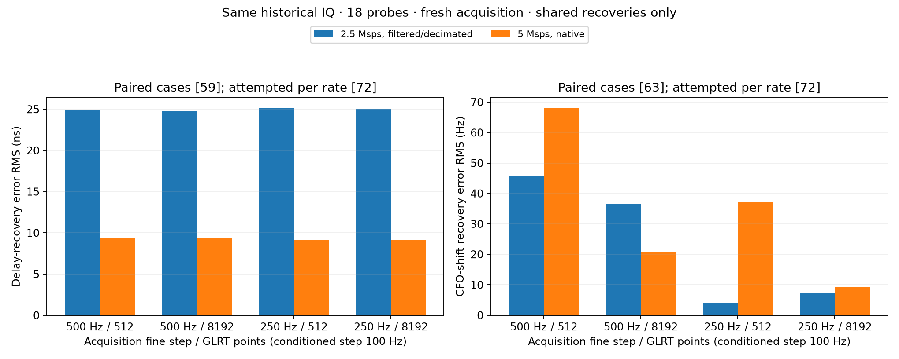

# 2.5 versus 5 Msps: frame timing and CFO/Doppler

**The paired test supports materially better frame-timing shift recovery at
5 Msps, but not a consistent improvement in CFO or long-track Doppler accuracy.**
The residual GLRT frequency grid is identical in Hz at both sample rates.

A bounded replay of the same physical IQ observations gives **24.8 ns versus
9.4 ns delay-recovery RMS** at the baseline acquisition/GLRT settings, about
2.6 times lower error at 5 Msps. This is a differential timing test, not a claim
of 9 ns absolute frame-time accuracy. The comparison changes both retained
bandwidth and digital sample spacing; it does not isolate those two effects.

## What changes in the estimator

| Quantity | 2.5 Msps | 5 Msps |
|---|---:|---:|
| Native IQ sample spacing | 400 ns | 200 ns |
| Samples in a 20 ms probe | 50,000 | 100,000 |
| Historical configured receiver bandwidth | 2.5 MHz | 5 MHz |
| Pilot symbols used per frame | 64 | 64 |
| Pilot-symbol interval | 4.4 µs | 4.4 µs |
| Residual GLRT bin spacing, grid 512 | 443.892 Hz | 443.892 Hz |
| Residual GLRT bin spacing, grid 8192 | 27.743 Hz | 27.743 Hz |

The GLRT operates on symbol correlations, not an FFT of every raw IQ sample.
Its residual CFO bin spacing is `1 / (N × 4.4 µs)`, where `N` is the GLRT grid
size. The symbol interval occupies exactly 11 samples at 2.5 Msps and 22 at
5 Msps. Doubling the input rate leaves the physical symbol spacing, 64-symbol
support and number of frame repetitions in the same-duration probe unchanged.
Thus it does not halve the frequency bins or double coherent observation time.

The production path already estimates fractional timing using a five-cell
log-parabolic peak and Lanczos interpolation. Its estimates are not limited
to 400 or 200 ns increments. Conversely, smaller sample spacing alone is not
a measurement of absolute timing uncertainty. Acquired CFO is also interpolated;
the final CFO is an acquisition estimate plus a residual GLRT grid estimate,
not a value on one fixed absolute 443.9 Hz lattice.

These statements follow the current `pilot_methods.py` symbol correlation,
fractional refinement and `fftfreq(..., d=symbol_step_s)` implementation. The
source digests are recorded in the analysis receipt.

## Paired test on the same historical IQ

Eighteen probes were selected before observing these outcomes: six evenly
indexed probes from each of the three 5 Msps tracks in the earlier historical
joint replay. Source scan IDs are:

- `scan-hop-432b03933b8c76bf`
- `scan-hop-cabca9c4f49c5a27`
- `scan-hop-862a183b8ab422da`

Each source produces a native 5 Msps version and a filtered, decimated 2.5 Msps
version. Four deterministic, probe-specific delay offsets span [-300,300) ns,
and four frequency offsets span [-2000,2000) Hz. Both versions use the same
physical offsets. Acquisition and fractional timing are rerun for each input,
at acquisition fine steps 500/250 Hz, conditioned step 100 Hz and grids 512/8192.

The tables use only the **same cases recovered at both rates** within each
configuration. No estimate is removed according to its error.

| Fine acquisition step | GLRT grid | Delay RMS, 2.5 Msps | Delay RMS, 5 Msps | Shared delay comparisons |
|---:|---:|---:|---:|---:|
| 500 Hz | 512 | 24.84 ns | 9.39 ns | 59 |
| 500 Hz | 8192 | 24.77 ns | 9.38 ns | 59 |
| 250 Hz | 512 | 25.13 ns | 9.12 ns | 59 |
| 250 Hz | 8192 | 25.08 ns | 9.13 ns | 59 |

The baseline per-scan delay RMS values are 29.04/9.95, 23.84/8.79 and
19.53/9.12 ns, respectively, for 2.5/5 Msps. All three scans favor 5 Msps.
The paired geometric ratio, 5 divided by 2.5 Msps, is 0.389, with an exploratory
three-scan bootstrap interval of 0.343–0.467. Three scans are too few to treat
that interval as a broadly calibrated uncertainty bound. Increasing the GLRT
grid has very little effect on timing-shift recovery in this experiment.

| Fine acquisition step | GLRT grid | CFO-shift RMS, 2.5 Msps | CFO-shift RMS, 5 Msps | Shared CFO comparisons |
|---:|---:|---:|---:|---:|
| 500 Hz | 512 | 45.62 Hz | 68.02 Hz | 63 |
| 500 Hz | 8192 | 36.46 Hz | 20.69 Hz | 63 |
| 250 Hz | 512 | 4.00 Hz | 37.26 Hz | 63 |
| 250 Hz | 8192 | 7.44 Hz | 9.38 Hz | 63 |

The CFO ranking depends on acquisition and GLRT settings. In particular, the
baseline 5 Msps result is worse in the second scan; the other two scans have
almost identical CFO-shift RMS between rates. Large errors in the second scan
are retained. This gives no basis for saying that 5 Msps has uniformly better
CFO accuracy, or that the lowest value here is an absolute Doppler precision.
At baseline, no recovered shift changes pilot-alias branch, so adjusted and
raw CFO increment RMS agree.



Recovery is part of the result:

| Coverage per acquisition/grid setting | 2.5 Msps | 5 Msps |
|---|---:|---:|
| Associated unshifted baselines | 17/18 | 17/18 |
| Delay comparisons with baseline and shifted target available | 62/72 | 68/72 |
| CFO comparisons with baseline and shifted target available | 67/72 | 68/72 |

Those failures occur on different inputs, leaving 59 paired delay cases and
63 paired CFO cases. Both rate baselines lose a different probe; additional
shifted-input failures occur at 2.5 Msps. These are failures to recover the
target under the declared acquisition/association policy, not proof that all
signal energy disappeared. Failed cases contribute to coverage counts and
never become zero-error measurements. Available-only statistics and every
candidate are also saved.

## What the real native-rate scans show

The mixed-rate survey from September 9 00:40 through September 10 00:40 UTC
contains 34 native 2.5 Msps scans and 33 native 5 Msps scans, all on radio
`5d4d`. Its configured receiver bandwidth changes with sample rate. The two
groups alternate in time and observe different satellite/noise conditions.
The later 12-hour report contains only 5 Msps scans and cannot supply a native
rate A/B comparison.

| Existing evidence, baseline settings | Native 2.5 Msps | Native 5 Msps |
|---|---:|---:|
| Long episodes in full survey | 110 | 142 |
| Median full cubic RMS, all long episodes | 97.3 Hz | 104.1 Hz |
| Median held-out block cubic RMS, all long episodes | 107.3 Hz | 120.2 Hz |
| First raw-replay subset: median block RMS, six tracks/rate | 97.2 Hz | 57.1 Hz |
| Later raw-replay subset: median block RMS, three tracks/rate | 36.7 Hz | 43.8 Hz |
| Original fixed-acquisition shift test, 144 comparisons/rate | 182.3 Hz | 180.9 Hz |

Cubic errors are Hz normalized to 11.2 GHz RF; shift errors are native CFO Hz.
The first small raw subset favors 5 Msps, but the full cohort and the later
subset do not. The original fixed-acquisition shift error is almost identical
at the two rates. These are descriptive, unpaired comparisons, not a claim
that 2.5 Msps is inherently more accurate. The higher count of long episodes
at 5 Msps is also not a controlled detection-efficiency estimate.

The earlier finer-timing search changes the baseline epoch by median absolute
12.5 ns at 2.5 Msps and 5.3 ns at 5 Msps (263 and 274 probes, respectively),
with 95th percentiles 31.8 and 15.7 ns. These are sensitivities to another
interpolated search, not errors against timing truth. None of those 537
changes alters CFO beyond 0.00001 Hz at grid 512. They are consistent with
the need to assess timing and CFO separately.

## Reference and processing limitations

The exact differential references are:

```text
delay error = circular_frame_time(shifted) - circular_frame_time(original)
              - imposed delay
CFO error   = CFO(shifted) - CFO(original) - imposed frequency shift
```

The original radio waveform, noise, clocks and unknown biases are shared.
Common errors can cancel. No cubic, orbit fit or expected shifted CFO is used
as the reference for these injected differences. Frame phase is compared
modulo 1/750 second; the experiment does not establish absolute frame numbering,
UTC timestamp accuracy or propagation delay.

Target selection is the highest exact GLRT score passing margin 0.025 within
±800 ns of the original target's integer phase. This physical association
radius is the same at both rates and is not shifted using the imposed delay.
Acquisition retains its production five-native-sample candidate separation and
the GLRT uses its existing native-cell timing search. The full target-candidate
lists and failure statuses remain available for auditing.

The decimator uses an 81-tap symmetric Kaiser-windowed sinc FIR, cutoff
1.1 MHz at 5 Msps, with its group delay compensated before taking even samples.
Low-pass filtering before downsampling suppresses high-frequency content that
would otherwise fold into the lower-rate band; this is the filtering principle
described in the [SciPy polyphase-resampling documentation](https://docs.scipy.org/doc/scipy/reference/generated/scipy.signal.resample_poly.html).
This experiment implements the short FIR with NumPy and adds no dependency.

Twenty-one milliseconds of each visit are read. A Fourier phase ramp creates
the imposed delay in the periodic bandlimited interpolant; a centered 20 ms
window excludes 0.5 ms at either end. That avoids wrap/boundary contamination
from the sub-microsecond shifts and the FIR. The unshifted controls use the same
crop. This differs from the original first-20-ms replay and is another reason
not to compare its CFO RMS directly with earlier tables.

The 2.5 Msps copy is **not an independent native 2.5 Msps hardware recording**.
Its filtering is not an exact reproduction of the receiver's analog filter.
This paired experiment controls the observed pass, receiver and source IQ, while
changing retained bandwidth and digital sampling together. A same-bandwidth
5 Msps control or calibrated native-rate recordings would be needed to separate
those effects. The small, baseline-selected sample also limits generalization
to weak tracks and other interference conditions.

The raw experiment took 189 seconds, with 648 fresh acquisitions and 1,296
profile observations. Local baseline medians were 81.6/337.4 ms for acquisition
and 30.2/43.0 ms for all-candidate GLRT scoring at 2.5/5 Msps. Fixed execution
order, cache and machine load prevent treating these as a controlled throughput
benchmark. At fixed format and duration, 5 Msps doubles raw IQ storage and I/O.

## Recommendation

Use 5 Msps when fractional frame alignment is the priority and the additional
storage/processing cost is acceptable: this test supplies evidence of a useful
timing benefit. Keep both rates in validation when the objective is low
CFO/Doppler RMS. Acquisition resolution, signal quality, association and model
consistency deserve separate checks; 5 Msps alone does not buy finer GLRT bins
or guarantee a lower Doppler error. No production setting was changed.

## Evidence and reproduction

- [Frozen paired plan](plan.json), binding source tracks, hashes and all shifts.
- [Paired summary and individual errors](paired-summary.json), [CSV](paired-summary.csv), and [PNG](paired-rate-comparison.png).
- [Historical native-rate summaries](historical-rate-summary.json).
- `raw/*.json`: all acquisition/refinement candidates, selected targets and timings.
- [Analysis receipt](analysis-receipt.json) and [artifact hashes](SHA256SUMS).

Run `tools/review_scan_sample_rates.py` with `--mode plan`, then `--mode replay`,
then `--mode summarize`, using `--output reports/2026_09_11_sample_rate_review`
and `PYTHONPATH=src:tools OPENBLAS_NUM_THREADS=1`. Plan creation refuses to
overwrite an existing plan. Replay reuses completed scan artifacts, binds
source evidence by hash, uses public read-only storage adapters and enforces
`--max-seconds 600`. No new recording or raw-data mutation occurs.

Validation: six new tests check exact off-grid delay phase at both rates,
energy preservation, antialias rejection, circular timing units and a physical
association gate independent of CFO. Those and 21 existing search/replay tests
pass (27 total). Complete case-inventory checks precede summary generation;
all candidate choices, source bindings and shared-case RMS are audited. Ruff
lint and format checks pass.
