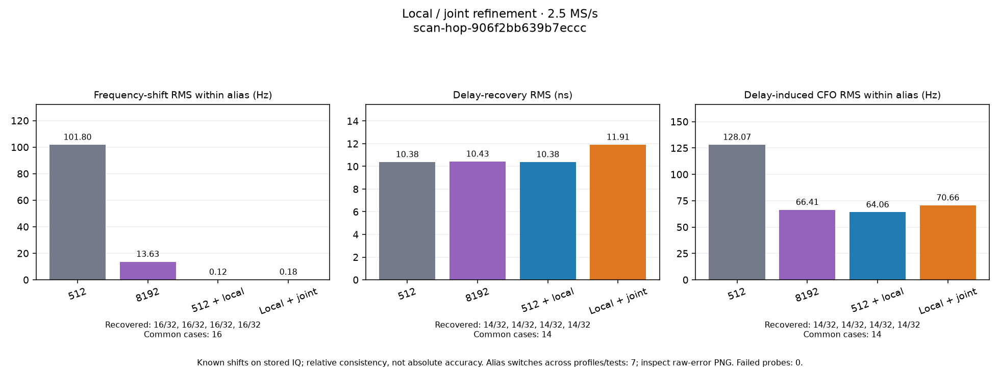
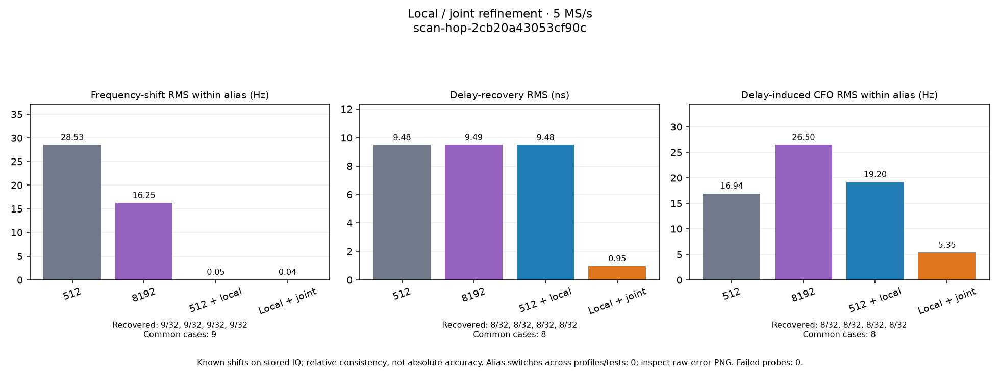
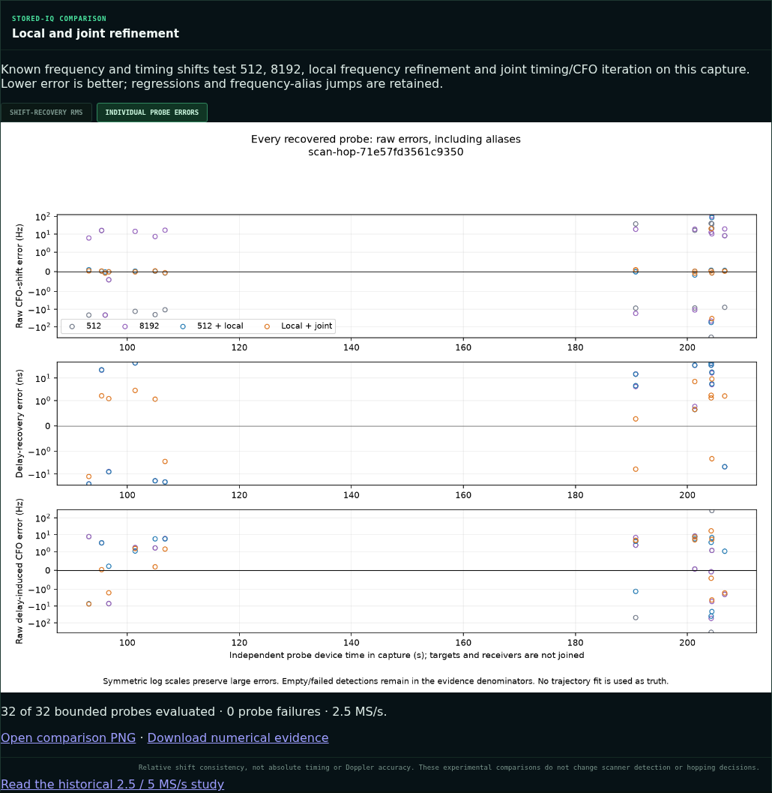

# Scanner local and joint refinement comparisons

**Later update:** `.20` was successfully flashed over the network using PPU to
the latest published v0.49 release. The
[firmware follow-up](../2026_09_11_radio20_v049_network_restore/README.md) records
the flash receipt and subsequent scanner verification. The observations below
preserve the earlier, pre-flash rollout state.

**Published and deployed:** the comparison worker and web UI serve saved PNGs
and numerical evidence. **Live restart blocked:** `.20` currently runs
`glrt-native-exact-r60000000-stripped-v1`; its kernel lacks the
`tandem-agc-events` device required by the existing persistent-hop scanner.
Capture was left explicitly paused after failed preflight, before any receive
buffer opened. This is not a successful live-capture verification.

The [historical 2.5 / 5 MS/s study](../2026_09_11_glrt_refinement_prototype/README.md)
contains the paired-rate results, supporting PNGs, raw probe outputs, and SHA-256
inventory. Local frequency refinement usually reduces frequency-grid error;
joint timing/CFO iteration substantially improves delay-shift recovery. Neither
method wins on every probe, and neither resolves the 227 kHz alias ambiguity.

This companion adds two downloadable PNGs to each fixed or adaptive scan's web
detail: **Shift-recovery RMS** and **Individual probe errors**. The four settings
are 512, 8192, local refinement initialized from 512, and joint refinement
initialized from the local result. The existing detector, hop decisions, and
published scan products retain their behavior.

## What the live figures measure

The worker selects two interior visits per observed channel target and both
receivers, at most 32 probes. Selection does not depend on signal strength or
whether refinement helps. Each 21 ms stored-IQ read supplies a 20 ms analysis
window after symmetric cropping. Both native 2.5 and 5 MS/s inputs are supported.

Each probe receives one reproducible signed frequency shift of 100–2,000 Hz and
one signed delay of 30–300 ns, independently. Acquisition is rerun on the original
and both transformed inputs. All eight retained candidates are recorded for all
four profiles. Association uses the strongest passing baseline 512 candidate's
frame phase, an 800 ns gate, and exact GLRT score; it does not use the imposed
frequency shift to pick the correct answer.

The known imposed change is the reference. This measures relative shift
consistency, **not absolute Doppler or timing accuracy**, and does not use a cubic
track as ground truth. RMS bars use the same successfully recovered cases across
all four profiles. Recovery denominators, processing failures, and alias changes
remain visible. The individual-probe PNG preserves raw frequency errors, including
large alias jumps, on a symmetric logarithmic axis. Empty support is shown as
unavailable, never as zero error.

## Publication and operation

The existing analysis timer runs a companion worker before ordinary scanner
backfill. An invocation has a 180-second budget checked between probes and saves
a checkpoint after each probe. Later invocations resume pending work. Evidence
and both PNGs are published before the final immutable manifest. The API serves
only digest-verified saved bytes and never performs analysis on a page request.
The evidence binds the capture manifest, implementation files, deterministic
probe schedule, selected and rejected candidates, and measured runtime.

## Results from installed-runtime replays

These are two different historic captures, selected for deployment validation,
not a paired sample-rate experiment. Each scheduled 32 probes, completed all 32
without processing errors, and retained every detection failure in its
denominator. For a rate comparison, use the paired study linked above.

| Setting | 2.5 MS/s frequency-shift RMS (Hz) | 5 MS/s frequency-shift RMS (Hz) | 2.5 MS/s delay RMS (ns) | 5 MS/s delay RMS (ns) |
| --- | ---: | ---: | ---: | ---: |
| 512 | 101.798 | 28.528 | 10.383 | 9.482 |
| 8192 | 13.630 | 16.252 | 10.425 | 9.492 |
| 512 + local | 0.124 | 0.051 | 10.383 | 9.482 |
| Local + joint | 0.180 | 0.039 | 11.907 | 0.951 |
| Common recovered / scheduled | 16 / 32 | 9 / 32 | 14 / 32 | 8 / 32 |

Frequency-shift cases had no alias changes in these two captures. The 2.5 MS/s
pure-delay cases did: one under 512 and two under each other setting. Their raw
delay-induced CFO RMS is 60,811 Hz under 512 and 85,967 Hz under joint refinement.
The within-alias values are 128.072 and 70.661 Hz respectively. Folding away an
alias must not be mistaken for recovering the correct frequency branch.

Joint refinement improved all eight recovered 5 MS/s delay cases. It improved
seven of fourteen at 2.5 MS/s. The two largest joint delay errors at 2.5 MS/s
were −30.47 ns and +27.53 ns; both also changed frequency alias. The table
therefore supports local frequency refinement strongly, while preserving a real
counterexample to treating joint refinement as universally better.

### 2.5 MS/s validation capture

`scan-hop-906f2bb639b7eccc`:
[numerical evidence](scan-hop-906f2bb639b7eccc/evidence.json),
[published status and metrics](scan-hop-906f2bb639b7eccc/status.json),
[Chromium verification](scan-hop-906f2bb639b7eccc/web-ui-verification.json).

### 5 MS/s validation capture

`scan-hop-2cb20a43053cf90c`:
[numerical evidence](scan-hop-2cb20a43053cf90c/evidence.json),
[published status and metrics](scan-hop-2cb20a43053cf90c/status.json),
[Chromium verification](scan-hop-2cb20a43053cf90c/web-ui-verification.json).

### Final web UI and raw-error layout

The first validation publications above contain the initial two-panel raw-error
figure. Their original saved bytes remain immutable. The final renderer adds a
third panel for raw delay-induced CFO, including alias jumps. It is demonstrated
by `scan-hop-71e57fd3561c9350`:
[evidence](scan-hop-71e57fd3561c9350/evidence.json),
[Chromium verification](scan-hop-71e57fd3561c9350/web-ui-verification.json).

Open the web UI's **Scanner** view, choose a fixed or adaptive capture, and find
**Local and joint refinement**. Both tabs serve digest-verified PNGs; the evidence
link downloads all 384 profile/case rows for a completed 32-probe comparison.
Browser verification decoded both PNGs, checked HTTP 200 responses and the
session-bound evidence link, and recorded no page errors for all three captures.

## Deployment and `.20` restart evidence

The historical report was pushed in `d9482eed`. Comparison integration was
published in `4b9ca6bd` and its service-template test correction in `e18636f9`.
The final raw-error renderer is `7fd07bb9`. The receive-only host compatibility
fix is `bfc388d0`; it is staged and qualified, but has not been selected for
acquisition because the firmware capability gate still fails.

| Component | Selected immutable revision |
| --- | --- |
| API / web UI | `e18636f9577dae60072889d54625fba2ed88e457` |
| Scanner analysis service | `7fd07bb94663a6ea0e87e5d8ec1e53fb3f2d88b7` |
| Acquisition | `d8dbe7723987ac222d18201ef175ca38e0951105` (stopped) |
| Global / worker | `9948c31199bba4cb315d012ed8f439c763c5b3fe` |

The API and analysis timer are active. Capture control is paused at generation
235 with an explicit operator reason. The acquisition configuration and service
command now select `.20`, serial `1040005e0b100007100010000bf33a5d4d`.
The 300-second per-run bound and 20-minute cadence remain configured.

Three distinct startup findings were retained:

1. The current cadence slot already had an immutable `.21` intent. The initial
   `.20` switch was deferred to the next slot rather than rewriting that intent.
2. The receive-only firmware has no transmit DDS core. The new host facade uses
   the receive-only pyadi initializer when that core is absent, while retaining
   serial, metadata ABI, alternate-endpoint capabilities, and restoration gates.
   A buffer-free probe on `.20` then passed. Its 72 radio tests and exact-release
   qualification also pass.
3. Both radios advertised MAC `00:0a:35:00:01:22`, causing intermittent connections.
   `.20` was assigned runtime MAC `02:00:00:33:a5:4d`; its boot environment remains
   unchanged, so this correction is lost on radio reboot. With stable networking,
   the stock endpoint consistently passed. The staged scanner endpoint still
   failed its capability check because `/dev/tandem-agc-events` is absent, and
   neither `/proc/misc` nor `/sys/class/misc` registers that kernel device.

The userspace provider advertises persistent-hop support only after it can open
that device and read an advancing ADC counter. Starting a different iiOD cannot
supply the missing kernel device. Failed temporary-daemon starts cleaned up their
remote files; no receive buffer opened, and no firmware/FPGA image was changed.
The last documented working scanner firmware was
`v0.49-plutoplus-spf-iq-direct-async-v4`, as recorded in the
[previous successful scanner rollout](../2026_09_10_scanner_r21.md).
Restoring compatible firmware requires a separate decision because it replaces
the current receive-only firmware.

The [prepared restore option](evidence/firmware-restore-option.json) binds `.20`'s
exact serial to the previously working
[v0.49 release](https://github.com/misko/plutosdr-fw/releases/tag/v0.49-plutoplus-spf-iq-direct-async-v4).
Its 12,825,831-byte firmware DFU was downloaded and verified against the release
checksum inventory: SHA-256
`f45524f4765d5743144703ff6f4541084ff1ab9b1ce20a77f3f6fa820a1f84b6`.
This is preparation only; no restore has been performed. Any approved restore
must use the firmware-only PPU path, preserve the Pluto+ bootloader, and recheck
radio identity, unique networking, endpoint capabilities, restoration, and one
bounded 300-second scan before declaring the scanner healthy.

The [evidence directory](evidence/) contains the component cutovers, qualification
receipts, endpoint diagnostic, device inventories, final capture-control state,
and test receipts. Credential files and environment contents are excluded.
`SHA256SUMS` binds all supporting report artifacts.
