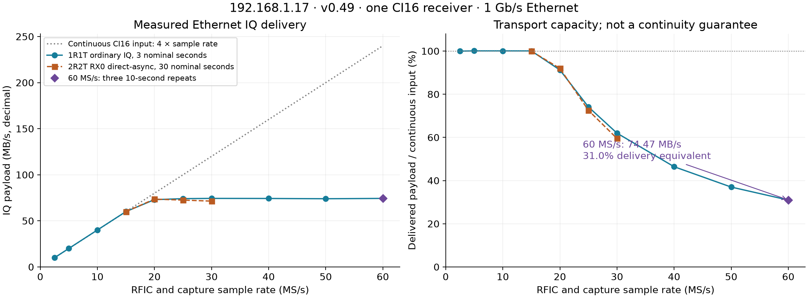
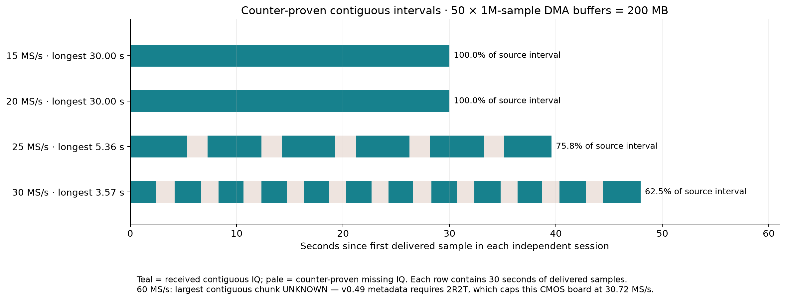
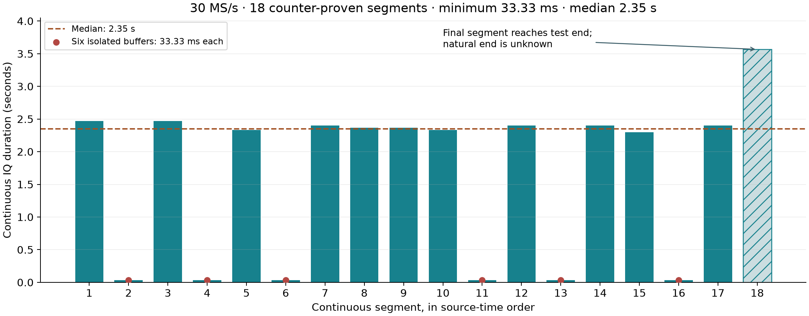

# Measured Ethernet capacity at 60 MS/s, and the v0.49 1R1T metadata blocker

12 September 2026. Follow-up to the [30/60 MS/s PSS engineering plan](2026_09_12_pss_30_60_fpga_path.md)
and [complete GLRT/PSS comparison](2026_09_12_three_lane_glrt_pss_tle_comparison.md).
These are transport and capture-continuity measurements. No new GLRT/PSS timing,
Doppler, or TLE-discrimination result is claimed.

**At 60 MS/s, `.17` delivered 74.40–74.50 MB/s in three longer ordinary-IQ
repeats: 31.00–31.04% of a continuous single-channel CI16 stream. The largest
contiguous 60 MS/s interval remains unproved because the current firmware's
metadata path cannot run in the required 1R1T configuration.**

The radio was successfully flashed through PPU to the latest inspected qualified
full-IQ release, [v0.49-plutoplus-spf-iq-direct-async-v4](https://github.com/misko/plutosdr-fw/releases/tag/v0.49-plutoplus-spf-iq-direct-async-v4).
This designation is specific to the full capture profile; experimental detector
branches and numerically higher tags are not interchangeable firmware upgrades.
The 1R1T failure and reproduction are filed as
[plutosdr-fw issue #97](https://github.com/misko/plutosdr-fw/issues/97).

## What was measured

One PlutoSDR Rev.C / Z7010 at `192.168.1.17`, serial
`104000bac4950008230026001b440a003a`, connected over 1 Gb/s full-duplex Ethernet,
MTU 1500. All transfers selected RX0 only, with four wire bytes per complex
sample. The reported AD9361 identity is the driver personality; this experiment
does not independently identify the physical RFIC die. TX remained muted and
no TX waveform was generated. IQ was consumed and discarded; counters, settings,
read latencies, failures, and summaries were saved.

Two capture modes were deliberately kept separate:

* **2R2T configuration, RX0-only direct-async:** metadata ABI 3, HOLD mode,
  exactly 50 allocated DMA buffers of 1,000,000 samples each (200,000,000 IQ
  bytes), RAM extension disabled, drop-backlog policy. Each delivered buffer's
  first/end source counters, missing-sample count and overflow flag were retained.
* **1R1T configuration, ordinary RX0 IQ:** four requested/read-back kernel
  buffers of 1,000,000 samples (16,000,000 bytes requested queue geometry), two
  warmup reads excluded, raw-complex64 host decoder. Ordinary mode does not expose
  the direct-async allocation attestation or per-buffer source timestamps.
  Its continuity and largest-contiguous fields remain `null`.

The fresh, isolated PPU host environment verified metadata ABI 3 libiio
`f6c450eada95ce99fe8756ebc244bfcf6ddcc72a`. The released radio IIOD is
`5cb2389719d46d12463daa0371d1fda19eb25fa7`. Current PPU documents the newer host as
compatible with this release. This is not a claim that an exact `5cb2389` host
pair was retested. The same verified host succeeded in 2R2T and failed in 1R1T.

Native rate and RF bandwidth were treated separately: RF bandwidth was
`min(sample_rate, 56 MHz)`. Ordinary-IQ cells additionally read back both the
RFIC and FPGA capture rates and proved the FPGA decimator was bypassed. At
60 MS/s both read back exactly 60,000,000 samples/s, with available capture
rates 60,000,000 and 7,500,000, and bypass selected. Global counter snapshots
also confirmed approximately 60 million increments per host second. Those
host-bracket snapshots are a cadence check, not sample timestamps or a calibrated
oscillator/Doppler measurement.

## Duty cycle: measured delivery versus guaranteed capture

Continuous 60 MS/s CI16 IQ requires **240 MB/s**. Measured delivered throughput
divided by 240 MB/s gives a *delivery-equivalent duty*. It does not establish that
we can already schedule lossless bursts at that duty. Current ordinary capture
runs continuously and drops an unlocated portion of source samples under load.

| Rate | Continuous input | Ordinary 1R1T delivery | Delivery equivalent |
|---|---:|---:|---:|
| 2.5 MS/s | 10 MB/s | 10.00 MB/s | approximately 100% |
| 5 MS/s | 20 MB/s | 20.02 MB/s | approximately 100% |
| 10 MS/s | 40 MB/s | 40.03 MB/s | approximately 100% |
| 15 MS/s | 60 MB/s | 60.04 MB/s | approximately 100% |
| 20 MS/s | 80 MB/s | 72.99 MB/s | 91.2% |
| 25 MS/s | 100 MB/s | 74.10 MB/s | 74.1% |
| 30 MS/s | 120 MB/s | 74.36 MB/s | 62.0% |
| 40 MS/s | 160 MB/s | 74.28 MB/s | 46.4% |
| 50 MS/s | 200 MB/s | 73.99 MB/s | 37.0% |
| 60 MS/s | 240 MB/s | 74.35 MB/s | 31.0% |

This ladder requests three seconds' worth of delivered samples per cell; the
2.5 MS/s cell rounds up to 3.2 seconds because it uses whole 1M-sample buffers.
Tiny measured values above 100% reflect finite timing/queue boundaries, not
samples being created or proven extra coverage. At 60 MS/s, three nominal seconds
of IQ took 9.683 seconds to deliver. The three longer repeats each delivered
600,000,000 complex samples (2.4 GB on the wire), taking respectively 32.258,
32.214 and 32.214 seconds, at 74.399, 74.502 and 74.502 MB/s. Their mean is
74.468 MB/s, equivalent to **18.617 MS/s delivered**, or **31.028%** of 60 MS/s.

The radio/network/software path reached about 595.7 Mb/s of IQ payload. That is
not a measurement of bare Ethernet line capacity, nor a guarantee under other
network traffic, host processing or disk-writing loads. No IQ disk-write load
was included. The short and long cells are not continuous across settings changes.

## Largest contiguous chunk

The longer metadata cells each requested **30 seconds of delivered samples**.
The source interval can be longer when samples are missing:

| Rate, 2R2T RX0 | Payload delivery | Observed source interval | Received fraction of that interval | Gaps / overflow frames | Longest observed contiguous run |
|---|---:|---:|---:|---:|---:|
| 15 MS/s | 59.97 MB/s | 30.000 s | 100% | 0 / 0 | 30.00 s, limited by test length |
| 20 MS/s | 73.58 MB/s | 30.000 s | 100% | 0 / 0 | 30.00 s, limited by test length |
| 25 MS/s | 72.52 MB/s | 39.600 s | 75.76% | 5 / 5 | 5.36 s |
| 30 MS/s | 71.41 MB/s | 47.967 s | 62.54% | 17 / 17 | 3.57 s |
| 60 MS/s, 1R1T | 74.40–74.50 MB/s, ordinary mode | not attributable to individual IQ buffers | unknown | unknown | **unknown** |

**30 MS/s segment distribution:** 18 observed continuous segments, minimum
**33.33 ms**, median **2.35 s**, mean 1.667 s, maximum observed 3.567 s.
Six segments are isolated 1M-sample buffers; together they contain 0.2 seconds,
only 0.67% of the 30 seconds of delivered IQ. Most longer runs last 2.30–2.47
seconds. The final 3.567-second run is truncated by the end of the test, so its
natural end is unknown. Excluding that final segment gives a median of **2.333 s**
and the same 33.33 ms minimum. These are observed statistics from this one session,
not guaranteed minimum burst lengths.

Coverage uses the interval from the first received sample to the end of the
last received sample. It excludes unobserved edges, setup and gaps between
independent sessions. A run extends only when adjacent counters meet exactly;
missing-sample metadata must agree with their difference. Runs have 1M-sample
granularity here: 40 ms at 25 MS/s and 33.33 ms at 30 MS/s. That granularity is
unrelated to fractional PSS arrival-time resolution.

The 20 MS/s result is particularly important: 30 seconds can be contiguous
because a queue absorbs the excess input, even though sustained delivery is below
80 MB/s. It does not prove indefinite lossless 20 MS/s streaming. Short
three-second tests at 25 and 30 MS/s were also entirely contiguous; longer tests
revealed gaps. The 30 MS/s long run's first contiguous segment was 2.467 seconds,
while its largest later segment was 3.567 seconds, showing that initial queue and
drop-backlog behavior matter. These are observed lengths, not universal maxima.

For sizing only, **200 MB represents 0.833 seconds of 60 MS/s IQ**. If a future
60 MS/s capture path can fill that queue while draining at 74.47 MB/s, an ideal
queue-fill calculation gives `200 / (240 - 74.47) ≈ 1.21 seconds` before filling.
This assumes the entire queue is usable, initially empty, with no upstream loss
or processing bottleneck. The 200 MB direct queue was verified at lower rates;
the current firmware cannot start that metadata capture in 1R1T. Neither 0.833
nor 1.21 seconds is a demonstrated contiguous 60 MS/s capture. Ordinary 60 MS/s
used the smaller 16 MB requested queue. No larger-RAM or sealed-burst maximum
was qualified in this experiment.

## Why the modes conflict

The original PSS30 detector image left `.17` in AD9361/1R1T. After the qualified
v0.49 flash, ordinary IQ channels were present and metadata capabilities were
advertised, but metadata capture failed with `OSError(95, "Operation not supported")`
at 2.5 and 5 MS/s before returning any IQ. Full-table mode and disabled digital
gain were confirmed, so those separate gain restrictions were not the cause.

In the released Linux driver, `ad9361_tandem_prepare()` explicitly returns
`-EOPNOTSUPP` when `rx2tx2` is false. The metadata provider acquires this paired
tandem controller even for HOLD and a single streamed receiver. Enabling 2R2T
made the same capture succeed. However, the driver's CMOS rate ceiling is
`61.44 MHz / (rx2tx2 ? 2 : 1)`: physical 2R2T exposes a 30.72 MS/s maximum.
Requesting 40 MS/s then fails with `EINVAL`; selecting only RX0 for transfer
does not change the physical interface mode.

This is a concrete integration blocker, not evidence that the ADC cannot run
at 60 MS/s. Returning to 1R1T produced the ordinary 60 MS/s measurements above.
[Issue #97](https://github.com/misko/plutosdr-fw/issues/97) contains exact source
permalinks, reproduction code, observed controls, and proposed acceptance tests.
The next firmware step should make single-RX counter/timestamp capture work
without requiring paired AGC, and advertise unsupported combinations accurately.
Merely removing a guard without fixing the gain/layout contracts would not
qualify the path.

## Consequence for PSS window capture

The measured transport supports the *bandwidth budget* for substantially longer
windows than 16 µs. At 750 windows/s, one native 60 MS/s CI16 stream costs:

| Window length | Native capture duty | Native-window payload | Plus continuous decimated 2.5 MS/s CI16 |
|---|---:|---:|---:|
| 16 µs | 1.2% | 2.88 MB/s | 12.88 MB/s |
| 64 µs | 4.8% | 11.52 MB/s | 21.52 MB/s |
| 128 µs | 9.6% | 23.04 MB/s | 33.04 MB/s |
| 256 µs | 19.2% | 46.08 MB/s | 56.08 MB/s |

These are design calculations, not measurements of an implemented simultaneous
decimator/window stream. At the observed 74.47 MB/s throughput, subtracting the
10 MB/s decimated lane leaves a raw native-window budget of about **26.9% duty**,
or **358 µs per frame** before metadata, guard samples, acquisition traffic and
operating margin. That is a transport ceiling, not the recommended setting.
Start with a configurable **64–128 µs window** and a narrower estimator search
inside it. This leaves useful margin and gives more context for lock recovery.

A window sampler must discard unwanted native samples **before** the bulk DMA /
Ethernet bottleneck, retain exact source timestamps and overflow evidence, and
schedule from the FPGA counter. Dropping samples after Ethernet cannot recover
missing intervals. Fixing the 1R1T timestamp path is the first acceptance gate;
then prove bounded window/decimator coexistence and fractional software PSS on
the exported windows before expanding FPGA correlation. Longer captures add
timing-search and recovery context; unknown surrounding data does not automatically
add coherent PSS information or improve a Doppler/TLE estimate.

## Reproduction and retained evidence

PPU work was isolated on `codex/ethernet60-pss30-restore`, based on committed PPU
`4bc2ca6`; the transition and reproduction probes are retained in local commit
`b010a85`. The narrow flash transition reused the exact qualified v0.49 DFU and
all target checks, while admitting the observed PSS30 detector source layout.
Because PPU's existing setup executor requires a real USB identity, the network-only
mode changes used an explicit exact-serial LAN adaptation of its pinned transport,
registered AD9361 tuples, environment-digest guard, private backup, TX mute,
reboot observation and persistent readback. No USB identity was fabricated.
This experiment does not assert that a general LAN setup command has shipped.

The DFU SHA-256 was
`f45524f4765d5743144703ff6f4541084ff1ab9b1ce20a77f3f6fa820a1f84b6`;
the FIT SHA-256 was
`77f899610548d486aab2c83c4dc7170532d470b115d2bd0e8fc43e72b3bfca67`.
PPU verified the FIT in QSPI before and after reboot, and verified returned
serial, firmware, PHY, layout and muted TX. Cold-power-cycle provenance was
not tested. The final persistent tuple is AD9361/1R1T, RX idle, TX muted; ordinary
capture restored its starting RX settings, rather than leaving a running stream.

* [Firmware success summary](figures/2026_09_12_ethernet60/data/flash-summary.json)
* [Initial 1R1T failure with traceback](figures/2026_09_12_ethernet60/data/admission-diagnostic.json)
* [Three-second metadata ladder and rejected 40 MS/s request](figures/2026_09_12_ethernet60/data/ladder-2r2t-3s.json)
* [Thirty-second metadata cells with every delivered buffer counter](figures/2026_09_12_ethernet60/data/ladder-2r2t-30s.json)
* [Ordinary 1R1T ladder through 60 MS/s](figures/2026_09_12_ethernet60/data/raw-1r1t-3s.json)
* [Three longer 60 MS/s repeats](figures/2026_09_12_ethernet60/data/raw-1r1t-60m-10s-repeat.json)
* [Counter/continuity probe](figures/2026_09_12_ethernet60/source/ethernet_chunk_probe.py)
* [Ordinary-IQ probe](figures/2026_09_12_ethernet60/source/ethernet_raw_probe.py)
* [Plot reproduction script](figures/2026_09_12_ethernet60/source/plot_results.py)

The plot script defaults to the adjacent `data` directory and regenerates all
three PNGs without accessing a radio. The capture probes require the matching
PPU checkout/runtime and explicitly target the serial above; they are retained
as reproduction tools, not a newly shipped general ladder CLI.

The probes use PPU hardware APIs, separate RF bandwidth from sample rate, write
an absent-only report, stop on an unclosed cell and restore RX settings. Each
invocation has a ten-minute deadline. The complete RX experiment, including the
failed admissions and intervening setup, ran from 20:21:50 to 20:36:42 UTC
(14 minutes 51 seconds), within the authorized 30-minute collection window.
Unit tests exercise counter closure, gaps, wrap handling and
the narrow flash profile; the selected PPU test set passed **117 tests**. No
golden scientific fixtures were changed. Private credentials, SSH trust files and
full U-Boot environments are excluded from this report.
