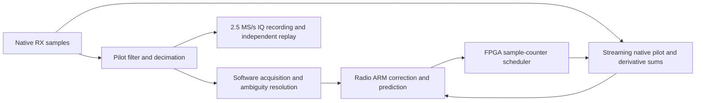

**FPGA branch review and a smaller tracking plan — 12 September 2026**

The most promising next step is to finish software acquisition and radio-local
feedback around the existing scheduled native-pilot FPGA image. High-rate
sample arithmetic has worked on hardware. Reliable acquisition, causal handoff,
and sustained physical-signal tracking are the missing outcome. Combining all
of acquisition, verification, native tracking, inspection, and short-dwell
scanning has repeatedly exceeded the integrated design's physical or scheduling
budget.

This review inventories local firmware branches and reads source, history,
retained hardware receipts, numerical reports and actual Vivado terminal logs.
It finds 71 local branches in the `codex/starlink-rx-only-do-not-merge` family.
That is an inventory, not a claim to have independently requalified every
experiment. The principal inspected heads were PSS `44bef794e`, original GLRT
`6e49144af`, GLRT implementation `b10aa4565`, and isolated tracking/index
`26f225df7`. Existing staged work was preserved. No builds, radio operations or
new collection were started. Historical deployment descriptions below are
dated evidence, not an inspection of today's running radios.

**What actually worked, and where the branches stopped**

| Branch or lineage | Evidence of success | Remaining failure or limit |
| --- | --- | --- |
| Earlier detector-only PSS, retained in the RX-only lineage | Coarse maps and native fine results traversed USB/Ethernet; cabled 30/60-MS/s fine timing; live 30-MS/s coarse acquisition | Cabled fine timing is not live fine lock. Coarse acquisition is not SSS/frame identity or the later paired scanner. |
| `codex/starlink-rx-only-do-not-merge`, shared FFT paired scanner | Numerically checked FFT/PSS, native fine and independent pilot-export components | Complete receiver timing/packing, then causal short-dwell acquisition and handoff |
| Its bank-owned FFT alternatives | Actual-core numerical/capacity tests and some locally improved endpoints | Latest inspected subsystem still fails setup at 175 MHz; it is not a qualified complete receiver |
| `codex/starlink-glrt-only-do-not-merge` | Five native-rate GLRT images routed; independent fixed-2.5-MS/s export | Original scheduler recovered 32/45 synthetic strong frames; 13 truth-near candidates were rejected busy; initially no hardware qualification |
| `codex/glrt-deployment-implementation`, early GLRT commissioning | 2.5/5/10/25/60-MS/s hardware commissioning, PN calibration, IQ/event transport, finite closure; revised synthetic matrix recovered 45/45 strong frames | Quiet bench observations did not establish live pilot agreement; 60-MS/s candidate expiry remained; full resource occupancy |
| Same branch, scheduled native GLRT | **192 hardware jobs at 60 MS/s and 750 Hz; three manual jobs exactly replayed from native IQ on the same firmware** | No demonstrated automatic acquired tracking or physical precision qualification |
| Same branch, newer GLA1/GLT1 combined local acquisition/tracking | Local acquisition has real matched FPGA/host evidence; multirate engines and controller components exist | Combined receiver still fails routing/timing; startup support and latency remain inadequate |

The earlier PSS coefficient-loader defect is instructive: the file and FPGA
register used opposite I/Q halfword order. Swapping I/Q preserved coefficient
energy and valid packet structure, but reduced fine correlation to about 0.048.
After correction, the recorded 60-MS/s positive runs had median correlation
about 0.434 and worst fitted timing residuals of 8.59/8.31 ns. These are cabled
relative residuals, not absolute timing accuracy. The later live 30-MS/s result
was explicitly coarse acquisition only. See the [native-IIO historical record](/home/mouse9911/gits/plutosdr-fw-starlink-rx-only/FPGA_tracker_native_iio.md).

The old GLRT review's scheduler failures should not be presented as today's
unchanged state. Complete-vector staging and finite closure were subsequently
implemented. The [commissioning record](/home/mouse9911/gits/plutosdr-fw-glrt-deployment-review/GLRT_HARDWARE_COMMISSIONING.md)
documents the repaired 45/45 synthetic strong-frame result and hardware
transport. It also documents the actual limits: the final 60-MS/s image used
all 4,400 slices, 72/80 DSPs and 48/60 BRAM tiles. Its 30-second capture delivered
300 MB of decimated IQ and 10,824 score records, but no positive pilot decisions;
two selected candidates expired. Those observations used 2 MHz RF bandwidth and
an unknown feed/IF, so they do not test wideband sensitivity or known live pilots.

The strongest reusable checkpoint is [scheduled hardware verification](/srv/bulk/leo/glrt-deployment-20260909/scheduled-hardware-verification-v1.json):
`glrt-scheduled-eth-r60000000-v1`, FIT SHA-256
`56391f5da4569189bdcbf4e80c2d76553bda8d271d23aa529a1d71728a90a84a`.
It records four finite batches, 32/64/32/64 repeats, 79,200 native samples per
job, restart/drain evidence and three manual exact-IQ checks. This review
independently read and SHA-256-checked all 204 referenced evidence files:
204 matched, none missing or mismatched. This verifies retained provenance,
not a rerun of hardware or independent numerical recomputation. The record
explicitly leaves automatic tracking and precision unqualified.

**Why the PSS timing iterations stalled**

The canonical coarse detector runs at 15 MS/s even for higher input rates.
The shared architecture transfers forward FFT results from a 200-MHz service
to 100-MHz template multiplication, then transfers products back for inverse
FFT. Ownership, metadata comparisons, READY propagation, reset, faults and
publication checks sit around those crossings. The difficulty is the physical
composition, not simply whether a butterfly or multiplier fits.

The [architecture review](/home/mouse9911/gits/plutosdr-fw-starlink-rx-only/docs/starlink-coarse-architecture-review-20260909.md)
records a complete receiver using only 13,068/17,600 LUTs but all 4,400 slices,
with +0.019 ns at 100 MHz and **−0.421 ns at 200 MHz**. Free LUT count did not
translate into available placement/routing capacity. Reducing the unchanged
engine clock to 150/175 MHz failed sustained service tests; adding buffers
could not correct the rate deficit.

The newer bank-owned design changes that service architecture and has genuine
actual-FFT capacity evidence at 175 MHz. It must not inherit the old clock
deficit diagnosis indiscriminately. Its physical problem remains: the latest
[registered-capacity experiment](/home/mouse9911/gits/plutosdr-fw-starlink-rx-only/reports/experiments/20260912-product-registered-capacity-actual-route.md)
has **−1.222 ns worst setup, 802 failing endpoints**. The worst path runs through
metadata validation and fault distribution, with 79% of its delay in routing.
Another control net has 2,304 loads. Some occupancy/identity endpoints now pass,
but the whole subsystem does not. This is a different composition and clock
from the −0.421-ns complete receiver; the values are not a before/after benchmark.

A direct 66-tap coarse correlator is a possible separate experiment, not an
obvious drop-in fix: 15 million positions/s × 66 taps is 990 million complex
tap operations/s before normalization, controls and CFO hypotheses. It also
need not reproduce the frozen quantized FFT arithmetic. Replacing the FFT now
would introduce another numerical and physical qualification project.

The scanner also has an independent algorithmic deadline problem. One coarse
map integrates 85.333 ms; the three-map policy needs 256 ms. Two sequential
one-map aliases consume 170.667 ms. A 120-ms visit cannot contain those policies,
irrespective of timing closure. The [integration gates](/home/mouse9911/gits/plutosdr-fw-starlink-rx-only/reports/starlink-bank-owned-integration-gates-20260910.md)
retain this conflict and the limited remaining native-handoff budget.

**The newest GLRT design is running into the same integration trap**

The retained [multirate draft](/srv/bulk/leo/glrt-deployment-20260909/fpga-multirate-report-draft-v1.md)
describes the right streaming native engine but still combines FPGA acquisition,
verification, shared IQ storage, native tracking and software startup. Its
latest build status was pending when that draft was written. Direct terminal
inspection now gives:

| Combined 2.5-MS/s tracking build | Observed terminal result |
| --- | --- |
| v11 | Post-optimization setup −1.893 ns; fails |
| v12 | Post-optimization setup −1.301 ns; fails |
| v13 | All 33,108 routable nets routed without errors, but setup −0.709 ns; fails |
| v15 | Setup −1.886 ns; fails |
| v17, isolated index change | Exit 2; insufficient-routing DRC; bitstream generation refused |

The v17 log prints −16.657-ns setup on its incomplete implementation. That
number is not a valid completed-route performance comparison with v13. The
actionable outcome is **no legal completed image**. See [v13 route status](/srv/bulk/leo/glrt-deployment-20260909/board-tracking-2500000-v13/hdl/projects/pluto/pluto.runs/impl_1/system_top_route_status.rpt)
and [v17 terminal log](/srv/bulk/leo/glrt-deployment-20260909/board-tracking-2500000-v17/hdl/projects/pluto/pluto_vivado.log).

The startup problem is separate from routing. The complete ARM ambiguity
resolver originally took about 562 ms; later FFT planning measurements reduced
the relevant resolver benchmark to approximately 429–446 ms, still excluding
loaded IIO and submission. The tiny correction solver takes about 2.63 us.
Optimizing the latter cannot fix the former. The runtime's 32-frame forecast
horizon is only about 42.7 ms. Retained-IQ catch-up is necessary; simply
submitting the old acquisition epoch later is invalid.

The [radio runtime evidence](/home/mouse9911/gits/plutosdr-fw-glrt-deployment-review/tools/glrt_native_radio.md)
retains only three successful handoffs from eight accepted acquisition cases
in an earlier development cohort, with later support 73/128, 128/128 and
128/128. The newer [short physical comparison](/srv/bulk/leo/glrt-deployment-20260909/radio-bootstrap-iio-v3/independent-host/summary.json)
has one matched positive in 21 windows but an inconclusive detection gate;
startup obtained six of eight required history observations and submitted no
tracking jobs. Latest recentering experiments improve some retained cases but
do not establish an operational loop. Routing fixes cannot resolve these
numerical/capture-range and causal-latency failures.

**Recommended smaller architecture**

Use a fixed-rate FPGA image with a pilot-channel DDC, original-source sample
counter, scheduled streaming correlation/derivative/energy sums, and a bounded
result queue. Acquire and resolve ambiguities in software; run prediction and
feedback on the radio ARM. Keep an independent software detector on saved
coarse IQ for comparisons. This is hardware-accelerated tracking with software
control. Entirely FPGA-resident autonomous acquisition is a later objective.

Prefer the already commissioned scheduled-native image as the starting source
and packaging reference. Determine the minimum missing software/capture
integration against that exact profile before building another board. If a
small interface extension is necessary, qualify it separately. Do not begin
by restoring the broad FPGA acquisition/verifier to this composition. Moving
search to software reduces the fabric work, but its loaded throughput and
causal startup must still be demonstrated; workstation Ethernet is unsuitable
for per-frame job scheduling.

This choice is supported by measured hardware costs. The [isolated 60-MS/s engine](/srv/bulk/leo/glrt-deployment-20260909/multirate-native-engine-60000000-ooc-v1/summary.txt)
uses 3,065 LUT/SRL primitives, eight DSPs and 11.5 RAM tiles at 100 MHz, with
+0.249/+0.016-ns internal setup/hold. It is not a complete receiver fit, but
the independent scheduled hardware checkpoint establishes that this kind of
native processing has also operated in a real image.

Stream the 300-symbol pilot rather than buffering it. At 60 MS/s it contains
79,200 CI16 samples, or 316,800 bytes—more than the device's entire 60 × 36-Kbit
BRAM capacity even before other storage. At 750 pilots/s, 1.32 ms of samples
per 1.333-ms period is **99% duty cycle**. The saving is one predicted hypothesis
and a few streaming sums, not mostly idle processing. Preserve throughput under
that near-continuous load. A 128-byte result at 750 Hz is only 96 kB/s before
protocol overhead; the independent 2.5-MS/s CI16 stream is 10 MB/s.

**Rate plan, including the missing 10-MS/s profile**

| Native MS/s | CI16 input MB/s | Reduction to 2.5 MS/s | Full-pilot samples | Current evidence relevant to the proposed path |
| --- | ---: | ---: | ---: | --- |
| 5 | 20 | 2 | 6,600 | Original GLRT commissioned; newer serial native engine/component tests exist |
| 10 | 40 | 4 | 13,200 | Original GLRT commissioned; **new GLT1 tracker does not expose this profile** |
| 15 | 60 | 6 | 19,800 | PSS lineage; newer native engine and 15→5→2.5 filter components tested |
| 30 | 120 | 12 | 39,600 | Historical cabled PSS fine timing; new native engine tested; new local-search DDC profile still missing |
| 60 | 240 | 24 | 79,200 | Original GLRT commissioned; scheduled native hardware checkpoint; new combined acquisition/tracking not qualified |

Pilot lengths at 10 MS/s are derived geometry, not an implemented-profile claim.
The old GLRT ladder was 2.5/5/10/25/60; the newer tracking ladder is
2.5/5/15/30/60. Neither equals the requested 5/10/15/30/60 ladder. Define and test
10 explicitly in reference generation, solver, scheduler, packets and driver.
The 5-MS/s serial rotator needs 18 clocks with 20 available at 100 MHz; it
cannot simply be reused at 10 MS/s, where only ten clocks/sample are available.
The parallel engine is the appropriate existing candidate to evaluate.

Start software/feedback qualification at the easiest supported low rate and
reuse the existing 60-MS/s scheduled image for native throughput diagnostics.
After one acquired loop works, qualify 5→10→15→30→60 with separate fixed-rate
images and the same narrow contracts. Full native capture is unnecessary for
continuous transport, but retain selected native diagnostic windows to verify
actual native moments. Decimated IQ cannot reconstruct discarded native data.

Higher sample rate is not itself evidence of better timing/Doppler information.
The retained real-25-MS/s development comparison, committed in tracker
`1d9f4c621e4e` as `reports/2026_09_12_multirate_real25_streaming_review.md`, found
344/344 supported conditional tracking pilots after deriving 2.5-MS/s IQ.
Against native-25 full-pilot fits, differences were 1.48–1.91 ns timing RMS and
1.84–2.72 Hz CFO RMS across four selected intervals. These are estimator
agreement/prediction results on development data, not physical truth. They
suggest testing full-pilot low-rate tracking before assuming 60-MS/s sampling
will fix accuracy. [Retained comparison artifacts](/srv/bulk/leo/glrt-deployment-20260909/multirate-real25-derived-tracking-v1).

Analog bandwidth must also be explicit: AD9361 supports up to 56 MHz and
AD9363 is specified to 20 MHz. A high sample-clock setting or AD9361-compatible
driver identity does not establish the physical chip's bandwidth. The old
commissioning's 2-MHz bandwidth especially cannot demonstrate a wideband
advantage. [Analog Devices product guidance](https://wiki.analog.com/resources/eval/user-guides/ad9361)
and [AMD device resources](https://www.amd.com/en/products/adaptive-socs-and-fpgas/soc/zynq-7000.html)
provide the hardware context; local route reports provide actual utilization.

**A bounded next work package**

1. Freeze one historical scheduled-native image and its numerical/transport
   contracts. Preserve PSS and combined-search experiments as references.
   Produce one matrix separating arithmetic, complete-board timing, transport,
   acquisition, handoff, feedback, accuracy and reacquisition.
2. Replay the existing physical positive/control corpus through the real
   acquisition→resolver→retained-IQ catch-up→controller path. Freeze acceptance
   and count every unsupported startup. Include observed delivery/compute
   latency; a seed supplied by an offline oracle is a conditional diagnostic.
3. Reduce the resolver workload or improve bounded recentering only against
   those failures. Measure whether software acquisition and catch-up can keep
   ahead of actual reception. Preserve CFO aliases until evidence resolves them.
   Do not extend forecast expiry merely to accommodate slow computation.
4. Measure the existing radio-local controller under replay/ingestion load,
   including result reads, retention, POP, SUBMIT and worst observed delays.
   Keep scheduling in FPGA and the feedback controller on ARM. The historical
   500-ms commissioning lead is not a legal tracking prediction horizon.
5. If a new FPGA profile is needed, implement DDC plus scheduled native sums
   first. Require complete route/setup/hold and clock/CDC review on that exact
   composition. Use local registered flow control; keep wide audit identity
   off unnecessary per-sample enables while preserving fault detection and
   invalid-result suppression. Do not relax timing or remove scientific checks.
6. After replay/startup and hardware readiness pass, request a separately
   authorized short known-signal run to demonstrate acquired feedback and
   loss/reacquisition. Account for all 750 opportunities/s; compare selected
   native results with original IQ and coarse detection with an independent
   host. Finish the rate ladder only after that single-target loop works.

The proposed milestone is one repeatable, fixed-frequency, acquired tracking
loop with explicit losses and measurable timing/CFO quality. Short-dwell
multichannel scanning and full FPGA autonomy remain distinct later capabilities.
This recommendation changes the next implementation scope; it does not claim
those earlier requested scanner capabilities have been completed.
