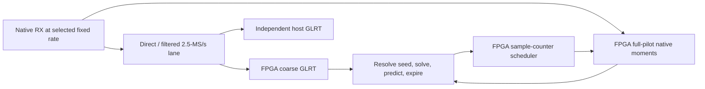

# FPGA tracking at 2.5 / 5 / 15 / 30 / 60 MS/s

Implement one acquisition-and-tracking architecture, qualifying a separate
receive-rate image at each step: **2.5 → 5 → 15 → 30 → 60 MS/s**. FPGA coarse
GLRT searches a 2.5-MS/s lane. After acquisition, native narrow processing uses
every original sample within each scheduled full 300-symbol pilot to refine
timing and carrier-frequency offset (CFO). The target is 750 measurement
opportunities per second; weak, missing or invalid pilots can be rejected.

Updated 2026-09-12, including the 21:58 UTC V25 timing audit. The immediate
objective is 2.5/5/15 MS/s; 30/60 MS/s requires its own hardware qualification.

## Current position

| Area | Verified state | Remaining gate |
| --- | --- | --- |
| Deployed receiver | `.21` retains `glrt-local-search-r2500000-v1`: FPGA acquisition and candidate verification at 2.5 MS/s, with host comparison. Broad search observes 5.6-ms windows every 100 ms. | No persistent native-tracking firmware is deployed. |
| Native processing | Rate-specific reference, moment engine and scheduler components exist for all five rates; isolated engine implementations have passed. V25 now passes complete-board static timing at 2.5 MS/s. | Complete-board qualification at higher rates, loaded feedback and physical operation at every rate. |
| Integrated 5/15-MS/s receiver RTL | Filtering, coarse/native coordinate mapping, acquisition, native processing, GLA2 driver/readers and the compiled ARM kernel pass a combined 352-test qualification. Integrated RTL replay reproduces coarse IQ, acquisition and native moments exactly at both rates. | Rate-specific board/netlist/package integration, radio-local GLA2 capture/bootstrap/handoff and physical verification. |
| Radio ARM control | A finite 2.5-MS/s capture-to-tracking helper runs on the actual radio ARM with modeled IIO/native inputs: 246 supported complete results are independently exact; interruption and cancellation are accounted for. | This is software-model execution, not RF or physical FPGA tracking. Higher-rate GLA2 runtime remains pending. |
| Automatic startup | A 2.097152-s real capture produced one independently matched FPGA/host positive among 21 windows. The worker obtained six of eight required supported history trials and submitted no tracking jobs. | Reliable, timely acquisition-to-tracking handoff; the short capture is inconclusive for detector recovery qualification. |
| Complete-board timing | Latest 2.5-MS/s candidate V25 exits 0: all 32,809 routable nets are routed, setup is +0.002 ns, hold +0.036 ns and pulse width +0.264 ns, with no failing endpoints. The physical MMCM matches the 90.909-MHz processing profile. | A 2-ps setup margin is a narrow static pass. Review CDC/exception/I/O findings and complete package qualification before bounded diagnostics; actual RX calibration and release verification remain open. |
| Package and boot tooling | V2 topology, rate, clock, package verification and boot tests pass 127 cases. | Assemble and independently verify the actual V2 FIT/FRM, create the corresponding PPU profile, and retain pinned rollback. No new package has been deployed. |

The next checkpoint is **a verified V2 package and PPU profile for bounded
2.5-MS/s diagnostics**. V25 closes the complete-board static timing failure;
its audit still explicitly grants no deployment eligibility by itself.
CDC/exception/I/O review, boot/RX calibration and exact native diagnostics
remain necessary. Automatic handoff separately needs supported live startup.
No radio access or firmware change was performed during this report refresh.
The new 5/15-MS/s replay uses synthetically repeated retained coarse IQ;
it proves the integrated digital path, not native RF sensitivity or accuracy.

## Architecture and coordinates

Choose the ADC rate and matching image before reception. Native samples already
flow when acquisition succeeds. Keep one target initially; dynamic rate changes,
simultaneous reference banks for every rate and broad native blind search are
separate features. Narrow refinement has a measured convergence region; an
uncertain prediction requires an explicitly bounded wider search or reacquisition.

| Native rate | Coarse reduction | Native samples per pilot | Nominal samples per 750-Hz repeat |
| --- | --- | ---: | ---: |
| 2.5 MS/s | Direct | 3,300 | 3,333⅓ |
| 5 MS/s | ÷2 | 6,600 | 6,666⅔ |
| 15 MS/s | ÷6 | 19,800 | 20,000 |
| 30 MS/s | ÷12 | 39,600 | 40,000 |
| 60 MS/s | ÷24 | 79,200 | 80,000 |

These are implemented profile lengths, not physical qualification. Reference
stride selects coefficients; it does not discard native observed samples.
Stream correlations, derivative moments and energy without a full-pilot IQ
buffer; budget bounded native diagnostic retention separately.

Keep native source index, dense coarse index, fractional timing, epoch and
filter delay explicit. The DDC output index identifies the newest original
input sample, not the filter's signal center. The new 15-MS/s cascade has
318 native samples of group delay, stride six and 636 samples of startup
history. The integrated 5/15-MS/s RTL now adapts dense coarse coordinates and
exports native rate, stride and delay through GLA2. Tests check support,
source/epoch continuity, interruption and restart. Preserve the existing GLA1
contract; extend the radio-local reader and bootstrap to consume GLA2 explicitly.

Schedule from absolute rational/fixed-point coordinates at every rate:
nominal 2.5/5-MS/s periods and measured corrections can be fractional.
Distinguish ADC sample time, FPGA clocks and ARM wall time; reference-grid
timestamps do not imply a different physical sampling rate.
The current integrated replay and board candidate use a rational processing
clock of 1,000,000,000/11 Hz, approximately 90.909 MHz. Clock metadata, pacing,
admission and driver interpretation must match the selected image; older
100-MHz component timings do not qualify this complete clock configuration.

## Feedback, segmentation and bounded compute

The first release uses the **radio ARM** for initial CFO ambiguity resolution,
the small correction solve and prediction updates. FPGA performs acquisition,
native sample arithmetic and deterministic job timing. Ethernet carries control
and evidence; it is outside the prediction feedback loop.

Predict upcoming repeats using only previous accepted measurements. A segment
is a finite batch of future jobs with a generation, ownership and expiry;
it is not an arbitrary capture file or new RF frame definition. Current native
processing can run while software prepares the next batch. Choose lookahead
and batch length from measured loaded latency and uncertainty growth. A lost
or delayed batch must produce explicit skips or reacquisition, not stale fits.

Use ACQUIRE → validate/resolve → TRACK, with bounded COARSE_CHECK and
HOLDOVER/REACQUIRE paths. Native deadlines have priority. Divide coarse work
at safe resumable boundaries or reserve explicit bounded slots and count the
displaced repeats. Prove both native deadlines and a coarse completion bound;
continuous tracking must not starve recovery. Check sustained operation with
coarse work enabled, rather than inferring capacity from isolated engines.

ARM-only resolver qualification preserves all 459 hypotheses and winners
for each tested buffer configuration. Measured FFT planning reduces mean solve
time from approximately 518–534 ms to 429–446 ms, with approximately 157 ms
of planning before RX. The subsequent optional receiver integration passes
324 tests. The ARM benchmark excludes concurrent IIO and hardware submission;
loaded startup and steady-state feedback latency remain unqualified.
The subsequent actual-ARM modeled continuation checks 246 complete results,
one interrupted result and 29 unadmitted cancellations. All 17 bootstrap
evaluations reproduce independently. Its finite capture does not complete the
full tracking target and does not supersede the real RF six-of-eight startup failure.

## Implementation checkpoints

**Foundation — freeze the numerical and timing contract.** Preserve firmware,
host oracle, retained failures and rollback. Resolve coarse CFO aliases and
aged-seed support on retained IQ. Measure acquisition completion, startup,
future-job admission and steady feedback separately. Freeze seed age, lookahead,
capture region, uncertainty, buffer limits and rejection rules before evaluation.
V25 closes the setup shortfall after V24b's −0.034-ns failure. Preserve both
results and the exact V25 sources; the new private-state revision passes
84 development and 63 isolated tests and retains exact direct/filtered RTL
replay. Review the remaining CDC/exception/I/O findings: timing still reports
15 missing I/O delays, and the CDC report includes two critical findings.
The CDC, clock and exception reports match V24b after header/path normalization;
their findings have not thereby been cleared. Require actual RX calibration
and measured source integrity during bounded diagnostics.

**Checkpoint 1 — deploy 2.5 MS/s.** Assemble the V2 FIT/FRM from the timing-passing
board and pinned kernel/rootfs, independently verify topology, rates, clocks
and hashes, then bind the PPU profile and rollback. After the audit review,
run bounded boot/RX calibration and scheduled native jobs; reproduce their
exact moments from recorded IQ. Then qualify automatic acquisition handoff,
radio-local feedback and loss/reacquisition in shadow mode. Promote only after
the common gates pass, including loaded startup. Preserve the shared design's
200-ms coarse completion limit; latest direct RTL replay completes in 197.746 ms.

**Checkpoint 2 — deploy 5 MS/s.** Carry the verified factor-two receiver RTL,
GLA2 mapping, driver and reader into a timing-passing board/package. Extend the
radio-local capture/bootstrap/controller from its finite 2.5-MS/s path to GLA2.
Qualify physical 6,600-sample pilots and the 6,666⅔-sample repeat cadence.
The serial rotator needs 18 clocks; the 90.909-MHz profile averages only
18.182 clocks/sample. Preserve the passing simulated schedule and measure
actual stalls, boundaries and sustained load. Then run diagnostic → automatic
shadow → promotion with physical 5-MS/s RX calibration.

**Checkpoint 3 — deploy 15 MS/s.** Carry the verified 37-tap/201-tap cascade,
factor-six mapping and parallel native engine into a qualified board/package
and radio-local GLA2 path. The combined replay already produces nine acquisition
records and five exact native results at each of 5 and 15 MS/s while coarse
processing is active. Extend that short simulation evidence to sustained
physical 19,800-sample pilots, coarse interference and recovery. Measure the
complete resource budget and repeat diagnostics, automatic shadow and promotion.

**Autonomy milestone — close the remaining loop in FPGA.** Port the validated
seed resolver, correction solve, timing/period/CFO/rate predictor, uncertainty
gates and recovery state machine. For initial ambiguity resolution, prototype
bounded replay of coarse IQ through reused correlation/FFT arithmetic; freeze
the choice only after retained-case equivalence and resource/latency measurement.
Require fixed-point agreement, overflow/ill-conditioning rejection and full-board
timing. With software predictions stopped, FPGA must acquire, track and reacquire.
ARM may configure RX and collect evidence. Qualify this milestone at lower rates
and carry it into 30/60-MS/s qualification.

**Checkpoint 4 — deploy 30 MS/s.** Add and independently qualify a factor-twelve
coarse filter profile; the current DDC rate guard does not support 30 MS/s.
Evaluate a 30 → 5 → 2.5-MS/s cascade, freezing actual coefficients, attenuation,
delay, arithmetic widths and lane schedule from measurements. Integrate the
existing 39,600-sample native profile. At the current candidate processing clock
the average spacing would be 3.030 clocks; qualify its actual arrival pattern.
Repeat complete-board, calibration, diagnostics, autonomous tracking and host
comparison gates; an isolated eight-DSP native engine is insufficient evidence.

**Checkpoint 5 — deploy 60 MS/s.** Integrate the existing 60 → 5 → 2.5-MS/s
filter profile with exact mapping and the 79,200-sample native processor.
Requalify reference/derivative approximation, memory ports, CDC and computation
with the actual RX stream: the average spacing at the current candidate clock
would be only 1.515 clocks. Retain original IQ to reproduce selected native
results without requiring continuous raw Ethernet export. Promote only after
60-MS/s RX calibration, every-repeat accounting, autonomous recovery and all
common gates pass. Exhaustive native blind search remains a later feature.

## Sanity checks and promotion gates at every rate

- **Detection:** run the host independently on the same complete derived
  2.5-MS/s windows and freeze host verdicts before comparison. Retain every
  miss and extra. Require the existing 95% recovery floor and at least 20
  positive windows across three episodes; a no-hit/short capture is inconclusive.
- **Arithmetic:** reproduce native indices, reference phases and integer
  moments, including interrupted prefixes, from retained original IQ. Test
  gaps, counter wrap, reset, stale generations, expiry, STOP/drain/restart and
  cancellation. Agreement of coarse detections cannot verify native arithmetic.
- **Accuracy:** use synthetic known timing/CFO/rate truth, filter mismatch,
  noise and tone controls. Preserve at least 95% post-startup support on the
  preregistered supported cohort, no accepted declared negative controls and
  error within 1.1× the nonlinear reference plus its predeclared tolerance.
  Compare timing, CFO and rate over equal 20-ms and 125-ms apertures. Retain
  unsupported estimates and report uncertainty coverage, bias and recovery.
- **Scheduling/resources:** account for all 750 opportunities/s as measured,
  rejected or explicitly skipped. On supported continuous test signals require
  no unexplained hardware losses. Measure worst-case queues, deadlines and
  coarse interference. Require the exact complete image's routing, setup,
  hold, CDC/clock coverage, DRC and netlist checks; do not sum isolated resource
  counts and call the result a fit.
- **Deployment:** use PPU over Ethernet on `192.168.1.21`, serial
  `10400056f695001322002d0010ad1719f2`, under its exact production lease and
  radio lock. Pin source/package/identity, preserve bootloader/NVM, keep TX off
  and retain a verified rollback package. Run short diagnostics, then a bounded
  3–5-minute comparison and clean stop/restart. No collection exceeds 30 minutes.

The real paired recording `cap-20260909T121248-414fb81f488c` is the development
oracle for full-pilot models, filter alignment, conditional tracking and
same-span CFO/rate comparisons. Keep its original paired 2.5-MS/s stream
distinct from newly derived streams. Derive controlled 2.5/5/15-MS/s inputs
from native 25-MS/s IQ with traceable filters; do not upsample it and claim
physical 30/60-MS/s evidence. Synthetic native signals establish known-truth
coverage; later native radio recordings establish hardware behavior. Higher
sample rate must demonstrate its benefit. Real RF CFO-rate remains relative
to the receiver/LNB unless clock drift is separately calibrated.

## Evidence and release record

Implementation provenance is `misko/plutosdr-fw`: the integrated filtered
receiver qualification uses branch `codex/glrt-clock-profile-implementation`,
FW `8931ae6ae9af`, HDL `ed84cb06316a` and Linux `86caa241a3ce`.
Its built ARM kernel is `5.15.0-00024-g86caa241a3ce`; it has not been deployed.
The updated development source is FW `87dca93eb`, HDL `e48709fc9`, Linux
`86caa241a3ce` and Buildroot `e347a45d3`. The separate V25 board candidate
uses FW `db6575306` / HDL `58366e0c4`; keep these distinct from development
and from V24b's failed FW `4748bb22d` / HDL `648da8194` candidate.
Earlier FW `1f7c2102f` integrates measured FFT planning; FW `5e130d1e2` / HDL
`bc8d757660c0` introduces the 15-MS/s filter component.
Numerical development reports are retained in `misko/leo-tracker-reduxredux`
at commit `1d9f4c621e4e`, under `reports/2026_09_11_multirate_glrt_development.md`
and `reports/2026_09_12_multirate_real25_streaming_review.md`.

Checked local deployment artifacts retain reproducible inputs and source bindings:

- [Combined filtered-receiver qualification](/srv/bulk/leo/glrt-deployment-20260909/filtered-receiver-qualification-v1/result.json): 352 unique passing tests, exact integrated 5/15-MS/s replay and a linked ARM kernel. Inputs are synthetic repeated coarse IQ; no hardware accessed.
- [V25 complete-board timing](/srv/bulk/leo/glrt-deployment-20260909/board-tracking-clocked-2500000-v25/full-audit/timing_summary.rpt), [route status](/srv/bulk/leo/glrt-deployment-20260909/board-tracking-clocked-2500000-v25/full-audit/route_status.rpt) and [netlist/clock audit](/srv/bulk/leo/glrt-deployment-20260909/board-tracking-clocked-2500000-v25/full-audit/audit.tsv): positive setup/hold/pulse margins, legal route and MMCM 10/11/1. The audit retains `hardware_eligible=0`; [CDC findings](/srv/bulk/leo/glrt-deployment-20260909/board-tracking-clocked-2500000-v25/full-audit/cdc.rpt) and I/O/exception review remain explicit. [V24b timing](/srv/bulk/leo/glrt-deployment-20260909/board-tracking-clocked-2500000-v24b/hdl/projects/pluto/timing_impl.log) retains the preceding setup failure.
- [Private-state development tests](/srv/bulk/leo/glrt-deployment-20260909/private-state-dev-v2.xml) and [isolated tests](/srv/bulk/leo/glrt-deployment-20260909/private-state-board-v1.xml): 84 and 63 passes. [Direct replay](/srv/bulk/leo/glrt-deployment-20260909/tracking-clocked-private-state-replay-v1/result.json) retains 16 exact native results alongside acquisition; [filtered replay](/srv/bulk/leo/glrt-deployment-20260909/filtered-private-state-replay-v1/result.json) retains exact 5/15-MS/s coarse and native outputs. These are RTL simulations, not new RF evidence.
- [V2 package/boot tooling tests](/srv/bulk/leo/glrt-deployment-20260909/tracking-package-v2.xml): 127 passes. These check versioned packaging and topology/clock validation; actual FIT/FRM assembly and PPU profile qualification remain pending.
- [15-MS/s filter tests](/srv/bulk/leo/glrt-deployment-20260909/fifteen-ddc-v1.xml) and [standalone timing](/srv/bulk/leo/glrt-deployment-20260909/fifteen-ddc-ooc-v1/summary.txt): 97 passes; +0.551/+0.104-ns setup/hold at 100 MHz, 1,641 LUTs, 1,069 registers, 16 DSPs and 12 RAM tiles. These physical counts are for the isolated filter, not the integrated receiver.
- [ARM resolver receipt](/srv/bulk/leo/glrt-deployment-20260909/tracking-resolver-unaligned-v1/operator-v1.json): separate plan storage and 0/8-byte-offset execution tested; no RF or firmware change. The later receiver integration passes [324 tests](/srv/bulk/leo/glrt-deployment-20260909/measured-receiver-v1.xml).
- [Independent real host comparison](/srv/bulk/leo/glrt-deployment-20260909/radio-bootstrap-iio-v3/independent-host/summary.json): one matched positive; explicitly inconclusive for promotion.
- [Actual-ARM modeled continuation](/srv/bulk/leo/glrt-deployment-20260909/radio-tracking-arm-v1/operator.json) and [independent arithmetic](/srv/bulk/leo/glrt-deployment-20260909/radio-tracking-arm-v1/independent-arithmetic.json): modeled source/native results with clean drain; no RF, new firmware or physical FPGA tracking.
- Earlier [30-MS/s engine](/srv/bulk/leo/glrt-deployment-20260909/multirate-native-engine-30000000-ooc-v1/summary.txt) and [60-MS/s engine](/srv/bulk/leo/glrt-deployment-20260909/multirate-native-engine-60000000-ooc-v1/summary.txt) each use eight DSPs and 11.5 RAM tiles, with positive internal setup/hold. These pinned isolated revisions exclude coarse acquisition, DDC, receiver and feedback.

Each checkpoint records the image/radio, frozen inputs/limits, measured results,
every disagreement and a **pass / fail / inconclusive** verdict. The diagnostic
deployment date now depends on package and audit completion; automatic tracking
also depends on loaded handoff. Keep full FPGA autonomy and higher-rate hardware
qualification as separate milestones.
