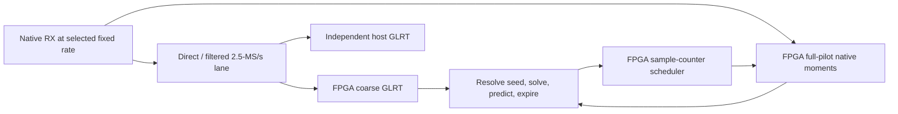

# FPGA tracking at 2.5 / 5 / 15 / 30 / 60 MS/s

Implement one acquisition-and-tracking architecture, qualifying a separate
receive-rate image at each step: **2.5 → 5 → 15 → 30 → 60 MS/s**. FPGA coarse
GLRT searches a 2.5-MS/s lane. After acquisition, native narrow processing uses
every original sample within each scheduled full 300-symbol pilot to refine
timing and carrier-frequency offset (CFO). The target is 750 measurement
opportunities per second; weak, missing or invalid pilots can be rejected.

Reviewed 2026-09-12. The immediate deployment objective is 2.5/5/15 MS/s;
the longer-term 30/60-MS/s stages require their own hardware gates.

## Current position

| Area | Verified state | Remaining gate |
| --- | --- | --- |
| Deployed receiver | `.21` retains `glrt-local-search-r2500000-v1`: FPGA acquisition and candidate verification at 2.5 MS/s, with host comparison. Broad search observes 5.6-ms windows every 100 ms. | No persistent native-tracking firmware is deployed. |
| Native processing | Rate-specific reference, moment engine, scheduler and runtime components exist for all five rates; isolated engine implementations have passed. | Combined receiver fit, source mapping, loaded feedback and physical operation at each rate. |
| 15-MS/s coarse filter | The new 15 → 5 → 2.5-MS/s cascade passes 97 numerical/RTL tests and standalone 100-MHz implementation. | Integrate its coordinates, support flags and resources into the complete receiver. |
| Automatic startup | A 2.097152-s real capture produced one independently matched FPGA/host positive among 21 windows. The worker obtained six of eight required supported history trials and submitted no tracking jobs. | Reliable, timely acquisition-to-tracking handoff; the short capture is inconclusive for detector recovery qualification. |
| Complete-board timing | The v17 candidate isolates an index-enable change from the best legally routed comparison; no final passing qualification was available at this review. | Final routing, setup, hold, clock coverage, DRC and implemented-netlist checks before flashing. |

The immediate gates are **complete-board timing** and **supported live startup**.
Scheduled diagnostics can deploy once hardware/package gates pass, while
automatic handoff remains under independent qualification.

## Architecture and coordinates

Choose the ADC rate and matching image before reception. Native samples already
flow when acquisition succeeds. Keep one target initially; dynamic rate changes,
simultaneous reference banks for every rate and broad native blind search are
separate features. Narrow refinement has a measured convergence region; an
uncertain prediction requires an explicitly bounded wider search or reacquisition.

| Native rate | Coarse reduction | Native samples per pilot | Nominal samples per 750-Hz repeat |
| --- | --- | ---: | ---: |
| 2.5 MS/s | Direct | 3,300 | 3,333⅓ |
| 5 MS/s | ÷2 | 6,600 | 6,666⅔ |
| 15 MS/s | ÷6 | 19,800 | 20,000 |
| 30 MS/s | ÷12 | 39,600 | 40,000 |
| 60 MS/s | ÷24 | 79,200 | 80,000 |

These are implemented profile lengths, not physical qualification. Reference
stride selects coefficients; it does not discard native observed samples.
Stream correlations, derivative moments and energy without a full-pilot IQ
buffer; budget bounded native diagnostic retention separately.

Keep native source index, dense coarse index, fractional timing, epoch and
filter delay explicit. The DDC output index identifies the newest original
input sample, not the filter's signal center. The new 15-MS/s cascade has
318 native samples of group delay, stride six and 636 samples of startup
history. Check mapping by impulse, known pilot and chunked replay before
admitting seeds. Existing direct-coarse logic expects consecutive indices;
passing stride-six indices to it without an adapter is incorrect. Preserve
published contracts and add/version coordinate capabilities explicitly.

Schedule from absolute rational/fixed-point coordinates at every rate:
nominal 2.5/5-MS/s periods and measured corrections can be fractional.
Distinguish ADC sample time, FPGA clocks and ARM wall time; reference-grid
timestamps do not imply a different physical sampling rate.

## Feedback, segmentation and bounded compute

The first release uses the **radio ARM** for initial CFO ambiguity resolution,
the small correction solve and prediction updates. FPGA performs acquisition,
native sample arithmetic and deterministic job timing. Ethernet carries control
and evidence; it is outside the prediction feedback loop.

Predict upcoming repeats using only previous accepted measurements. A segment
is a finite batch of future jobs with a generation, ownership and expiry;
it is not an arbitrary capture file or new RF frame definition. Current native
processing can run while software prepares the next batch. Choose lookahead
and batch length from measured loaded latency and uncertainty growth. A lost
or delayed batch must produce explicit skips or reacquisition, not stale fits.

Use ACQUIRE → validate/resolve → TRACK, with bounded COARSE_CHECK and
HOLDOVER/REACQUIRE paths. Native deadlines have priority. Divide coarse work
at safe resumable boundaries or reserve explicit bounded slots and count the
displaced repeats. Prove both native deadlines and a coarse completion bound;
continuous tracking must not starve recovery. Check sustained operation with
coarse work enabled, rather than inferring capacity from isolated engines.

ARM-only resolver qualification preserves all 459 hypotheses and winners
for each tested buffer configuration. Measured FFT planning reduces mean solve
time from approximately 518–534 ms to 429–446 ms, with approximately 157 ms
of planning before RX. The subsequent optional receiver integration passes
324 tests. The ARM benchmark excludes concurrent IIO and hardware submission;
loaded startup and steady-state feedback latency remain unqualified.

## Implementation checkpoints

**Foundation — freeze the numerical and timing contract.** Preserve firmware,
host oracle, retained failures and rollback. Resolve coarse CFO aliases and
aged-seed support on retained IQ. Measure acquisition completion, startup,
future-job admission and steady feedback separately. Freeze seed age, lookahead,
capture region, uncertainty, buffer limits and rejection rules before evaluation.
Follow the exact board build to its terminal reports; select changes from
measured failing paths/congestion. Never deploy a timing-failed image.

**Checkpoint 1 — deploy 2.5 MS/s.** First deploy bounded scheduled native jobs
and reproduce their exact moments from recorded IQ. Then connect automatic
acquisition handoff, radio-local feedback and loss/reacquisition in shadow
mode. Promote only after the common gates below pass, including loaded
startup. Keep the deployed acquisition cadence distinct from the shared
tracking design's existing 200-ms coarse completion limit.

**Checkpoint 2 — deploy 5 MS/s.** Integrate the existing factor-two filter with
dense coarse/native coordinate mapping, source support, capability validation
and rate-bound driver/operator packaging. Qualify the 6,600-sample pilot's
fractional timing coverage and 6,666⅔-sample repeat cadence. Its serial native
rotator has a measured 18-clock minimum versus 20 available clocks/sample
at 100 MHz; test the actual combined stalls and boundary timing. Repeat
diagnostic → automatic shadow → promotion with physical 5-MS/s RX calibration.

**Checkpoint 3 — deploy 15 MS/s.** Integrate the new 37-tap first filter stage
with the existing 201-tap 5 → 2.5-MS/s stage and the native engine. Qualify
source-phase continuity, filter warmup, cancellation and evidence ownership
under factor-six reduction. Budget the parallel native datapath, filters,
coarse engine, queues and receiver together. Repeat the deployment sequence
and demonstrate sustained 19,800-sample pilot processing with coarse activity.

**Autonomy milestone — close the remaining loop in FPGA.** Port the validated
seed resolver, correction solve, timing/period/CFO/rate predictor, uncertainty
gates and recovery state machine. For initial ambiguity resolution, prototype
bounded replay of coarse IQ through reused correlation/FFT arithmetic; freeze
the choice only after retained-case equivalence and resource/latency measurement.
Require fixed-point agreement, overflow/ill-conditioning rejection and full-board
timing. With software predictions stopped, FPGA must acquire, track and reacquire.
ARM may configure RX and collect evidence. Qualify this milestone at lower rates
and carry it into 30/60-MS/s qualification.

**Checkpoint 4 — deploy 30 MS/s.** Add and independently qualify a factor-twelve
coarse filter profile; the current DDC rate guard does not support 30 MS/s.
Evaluate a 30 → 5 → 2.5-MS/s cascade, freezing actual coefficients, attenuation,
delay, arithmetic widths and lane schedule from measurements. Integrate the
existing 39,600-sample native profile. At 100 MHz the average input spacing is
3⅓ clocks, so validate the actual arrival pattern and sustained throughput.
Repeat complete-board, calibration, diagnostics, autonomous tracking and host
comparison gates; an isolated eight-DSP native engine is insufficient evidence.

**Checkpoint 5 — deploy 60 MS/s.** Integrate the existing 60 → 5 → 2.5-MS/s
filter profile with exact mapping and the 79,200-sample native processor.
Requalify reference/derivative approximation, memory ports, CDC and computation
with the actual RX stream: the average input spacing at 100 MHz is only
1⅔ clocks. Retain enough original IQ to independently reproduce selected native
results without requiring continuous raw Ethernet export. Promote only after
60-MS/s RX calibration, every-repeat accounting, autonomous recovery and all
common gates pass. Exhaustive native blind search remains a later feature.

## Sanity checks and promotion gates at every rate

- **Detection:** run the host independently on the same complete derived
  2.5-MS/s windows and freeze host verdicts before comparison. Retain every
  miss and extra. Require the existing 95% recovery floor and at least 20
  positive windows across three episodes; a no-hit/short capture is inconclusive.
- **Arithmetic:** reproduce native indices, reference phases and integer
  moments, including interrupted prefixes, from retained original IQ. Test
  gaps, counter wrap, reset, stale generations, expiry, STOP/drain/restart and
  cancellation. Agreement of coarse detections cannot verify native arithmetic.
- **Accuracy:** use synthetic known timing/CFO/rate truth, filter mismatch,
  noise and tone controls. Preserve at least 95% post-startup support on the
  preregistered supported cohort, no accepted declared negative controls and
  error within 1.1× the nonlinear reference plus its predeclared tolerance.
  Compare timing, CFO and rate over equal 20-ms and 125-ms apertures. Retain
  unsupported estimates and report uncertainty coverage, bias and recovery.
- **Scheduling/resources:** account for all 750 opportunities/s as measured,
  rejected or explicitly skipped. On supported continuous test signals require
  no unexplained hardware losses. Measure worst-case queues, deadlines and
  coarse interference. Require the exact complete image's routing, setup,
  hold, CDC/clock coverage, DRC and netlist checks; do not sum isolated resource
  counts and call the result a fit.
- **Deployment:** use PPU over Ethernet on `192.168.1.21`, serial
  `10400056f695001322002d0010ad1719f2`, under its exact production lease and
  radio lock. Pin source/package/identity, preserve bootloader/NVM, keep TX off
  and retain a verified rollback package. Run short diagnostics, then a bounded
  3–5-minute comparison and clean stop/restart. No collection exceeds 30 minutes.

The real paired recording `cap-20260909T121248-414fb81f488c` is the development
oracle for full-pilot models, filter alignment, conditional tracking and
same-span CFO/rate comparisons. Keep its original paired 2.5-MS/s stream
distinct from newly derived streams. Derive controlled 2.5/5/15-MS/s inputs
from native 25-MS/s IQ with traceable filters; do not upsample it and claim
physical 30/60-MS/s evidence. Synthetic native signals establish known-truth
coverage; later native radio recordings establish hardware behavior. Higher
sample rate must demonstrate its benefit. Real RF CFO-rate remains relative
to the receiver/LNB unless clock drift is separately calibrated.

## Evidence and release record

Implementation provenance is `misko/plutosdr-fw`, branch
`codex/glrt-deployment-implementation`: FW `f27a05452` qualifies normalization,
`1f7c2102f` integrates measured FFT planning, and FW `5e130d1e2` / HDL
`bc8d757660c0` adds the 15-MS/s filter component.
The isolated v17 timing candidate uses FW `26f225df72e1` / HDL `43a9f4c49981`.
Numerical development reports are retained in `misko/leo-tracker-reduxredux`
at commit `1d9f4c621e4e`, under `reports/2026_09_11_multirate_glrt_development.md`
and `reports/2026_09_12_multirate_real25_streaming_review.md`.

Checked local deployment artifacts retain reproducible inputs and source bindings:

- [15-MS/s filter tests](/srv/bulk/leo/glrt-deployment-20260909/fifteen-ddc-v1.xml) and [standalone timing](/srv/bulk/leo/glrt-deployment-20260909/fifteen-ddc-ooc-v1/summary.txt): 97 passes; +0.551/+0.104-ns setup/hold at 100 MHz, 1,641 LUTs, 1,069 registers, 16 DSPs and 12 RAM tiles. Receiver boundaries remain unqualified.
- [ARM resolver receipt](/srv/bulk/leo/glrt-deployment-20260909/tracking-resolver-unaligned-v1/operator-v1.json): separate plan storage and 0/8-byte-offset execution tested; no RF or firmware change. The later receiver integration passes [324 tests](/srv/bulk/leo/glrt-deployment-20260909/measured-receiver-v1.xml).
- [Independent real host comparison](/srv/bulk/leo/glrt-deployment-20260909/radio-bootstrap-iio-v3/independent-host/summary.json): one matched positive; explicitly inconclusive for promotion.
- Earlier [30-MS/s engine](/srv/bulk/leo/glrt-deployment-20260909/multirate-native-engine-30000000-ooc-v1/summary.txt) and [60-MS/s engine](/srv/bulk/leo/glrt-deployment-20260909/multirate-native-engine-60000000-ooc-v1/summary.txt) each use eight DSPs and 11.5 RAM tiles, with positive internal setup/hold. These pinned isolated revisions exclude coarse acquisition, DDC, receiver and feedback.

Each checkpoint records the image/radio, frozen inputs/limits, measured results,
every disagreement and a **pass / fail / inconclusive** verdict. Estimate dates
after timing and loaded handoff close, separating diagnostics, automatic tracking
and full FPGA autonomy.
