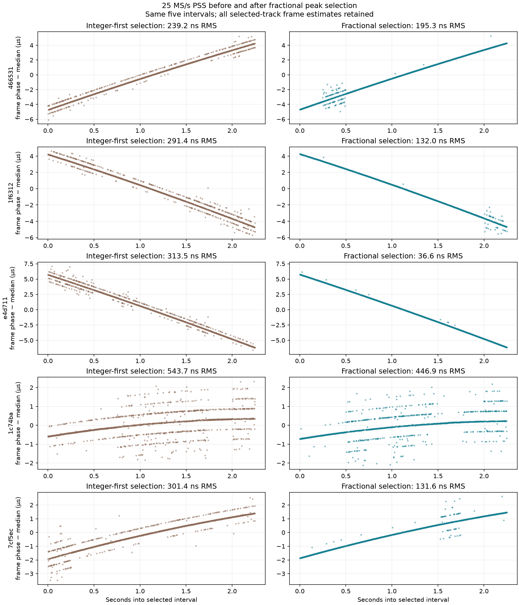

# Fractional PSS peak selection: corrected replay and PNGs

The integer-first peak-selection bug is fixed in the PSS timing analyzer. The
same five GLRT-selected dwells were replayed at native 25 MS/s, recorded 2.5 MS/s
and 2.5 MS/s derived from the native samples. All 135 block searches completed.
The updated figures retain every frame estimate in the selected trajectories;
no residual-based rejection or correction onto a fitted line was applied.

| Dwell ID suffix | Previous 25 MS/s RMS, ns | Corrected 25 MS/s RMS, ns | Corrected 25 MS/s scaled MAD, ns | Corrected derived 2.5 MS/s RMS, ns | Corrected recorded 2.5 MS/s RMS, ns |
|---|---:|---:|---:|---:|---:|
| `466531` | 239.2 | 195.3 | 5.4 | 830.2 | 696.5 |
| `1f6312` | 291.4 | 132.0 | 4.7 | 890.1 | 884.8 |
| `e4d711` | 313.5 | 36.6 | 3.1 | 1,075.1 | 954.7 |
| `1c74ba` | 543.7 | 446.9 | 50.3 | 973.9 | 917.3 |
| `7cf5ec` | 301.4 | 131.6 | 5.3 | 989.5 | 970.8 |

The five native RMS values improve by 1.22–8.56×. Four trajectories lose most of
the persistent parallel branches, while some blocks still select competing peaks.
The fourth dwell remains substantially ambiguous. The small scaled MAD values
describe the central residual distribution, not absolute accuracy; RMS includes
the remaining large errors. These are estimator results, not a fundamental
bandwidth limit or calibrated Doppler-rate accuracy.

Updated PNGs:

- [25 MS/s before/after, with shared vertical limits within each dwell](figures/2026_09_12_paired_glrt_pss_tle/paired-five-pss-bandwidth-20260912-v2-fractional/pss-fractional-before-after.png)
- [All fifteen corrected timing trajectories](figures/2026_09_12_paired_glrt_pss_tle/paired-five-pss-bandwidth-20260912-v2-fractional/pss-timing-comparison.png)
- [Corrected bandwidth and strong-frame comparison](figures/2026_09_12_paired_glrt_pss_tle/paired-five-pss-bandwidth-20260912-v2-fractional/pss-bandwidth-summary.png)

**What changed.** Previously, each frame's correlation was evaluated only at
integer delays, the strongest sampled peak was chosen, and a three-point log
parabola refined only that winner. A taller peak between samples could lose to
an integer-aligned PSS repetition peak. Fractional output after that decision
could not recover the missed peak.

The corrected analyzer evaluates normalized correlation throughout the original
local aperture at 32 fractional phases per sample, using normalized 16-tap
Lanczos interpolation. Only after comparing the full fractional-delay surface
does it choose the winner and apply a small log-parabolic refinement. It then
evaluates match power and complex correlation at that final delay. Carrier-phase
correction also uses the fractional timestamp. The integer sample address remains
an indexing coordinate; the reported timing uses the fractional coordinate.

At 25 MS/s the comparison grid is 1.25 ns, and at 2.5 MS/s it is 12.5 ns. The
subsequent refinement is continuous within a grid cell. These grid spacings are
numerical search spacings, not measurement accuracy claims.

The implementation uses cached polyphase interpolation kernels and bounded local
convolutions. Interpolation support must remain within the supplied continuous
IQ block; an incomplete frame aperture is excluded instead of padded. No candidate
delay may leave the original search aperture. Temporary promotion of IQ to
complex128 is bounded to that aperture, preventing a copy of the complete recording
for every frame. The new interpolation settings are included in the timing config
and therefore in the Standard-native science-configuration digest. Public result
schemas and the published PSS sequence were preserved.

**What the comparison holds fixed.** The selection document is byte-identical to
the original experiment: the same capture IDs, radio paths and 2.25-second
intervals, each with 100% passing GLRT windows at both recorded rates. Each lane
uses nine nonoverlapping 250 ms blocks. The acquisition CFO bank, epoch gates,
association settings and final trajectory-ranking rule are the same as before.
All five corrected selected trajectories in all three lanes contain all nine
blocks, with 1,687 or 1,688 frame measurements.

This is an end-to-end replay: improved fractional measurements can change which
candidate modes the unchanged association policy selects. Thus individual blocks
need not retain their old CFO hypothesis. Blind acquisition still uses coarse
integer timing seeds and discrete CFO hypotheses; the per-frame timing competition
is now fractional. Residual PSS repetition/CFO ambiguities remain visible and
require separate investigation rather than hiding them in the plotting code.

As in the original report, the RMS metric fits a quadratic frame-phase trajectory
to alternating frames and evaluates residuals on the other frames. Acquisition
and association use both halves, so this is a fit diagnostic, not an independent
detection-validation test. Scaled MAD is 1.4826 times the median absolute deviation
of those evaluation residuals. A strong frame has refined peak power divided by
the original integer-grid local median at least five. Neither score is a calibrated
false-alarm probability. The two physical radios have different clocks; the derived
narrowband lane provides the same-ADC bandwidth comparison.

**Validation.** All 57 targeted tests passed, and Ruff and `git diff --check`
passed. New component tests synthesize a true fractional pulse with an independent
Fourier shift and an integer-aligned distorted decoy. The old integer argmax
selects the decoy, while the corrected estimator recovers the true pulse. Additional
tests cover interpolation support, zero energy, aperture boundaries, invalid
fractional geometry and bounded per-frame memory work. Existing PSS template,
multi-rate acquisition, bank/projection, Standard-native integration and replay
tests passed without changing golden scientific fixtures.

The experiment used existing recordings and verified read-only RecordingStore
access. All 45 native/derived block pairs have matching input IQ hashes. The final
replay includes the exact analyzer and runner source hashes in each dwell protocol.
No radio collection or deployment was performed.

- [Corrected metrics CSV](figures/2026_09_12_paired_glrt_pss_tle/paired-five-pss-bandwidth-20260912-v2-fractional/summary.csv)
- [Corrected metrics, selected modes and frame arrays](figures/2026_09_12_paired_glrt_pss_tle/paired-five-pss-bandwidth-20260912-v2-fractional/summary.json)
- [Exact five-dwell selection and complete GLRT audit](figures/2026_09_12_paired_glrt_pss_tle/paired-five-pss-bandwidth-20260912-v2-fractional/selection.json)
- [Original experiment, preserved for comparison](figures/2026_09_12_paired_glrt_pss_tle/paired-five-pss-bandwidth-20260912-v1/README.md)
- [Analyzer implementation](figures/2026_09_12_paired_glrt_pss_tle/source/src/leo/analysis/starlink/pss_timing.py)
- [Component regression tests](figures/2026_09_12_paired_glrt_pss_tle/source/tests/analysis/test_pss_timing.py)

Work is in the isolated `codex/paired-five-pss-bandwidth` worktree, based on
`a29d5ca53dddaac2b3ec92751ca0bc072bf75d55`, with the source snapshots and patch
stored in the corrected experiment directory.
