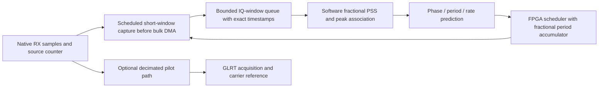

# A bounded path to 30/60 MS/s fractional PSS tracking

12 September 2026. Engineering discussion based on the
[complete paired GLRT/PSS report](2026_09_12_three_lane_glrt_pss_tle_comparison.md),
the [latest PSS models](2026_09_12_pss_mixture_models.md),
and a renewed read-only inspection of retained firmware evidence.
This is a proposed implementation sequence, not a new hardware result. No
firmware, radio settings or RF collection changed during this report update.

**Recommendation: first acquire one candidate and sustain fractional PSS tracking
at one fixed frequency. Use a small FPGA window sampler to prove the complete
measurement/control loop, then move the bounded correlation into FPGA logic.**
The initial stage accelerates data selection and transport; PSS correlation is
still software. The subsequent stage performs the PSS arithmetic in FPGA.
Continuous multichannel acquisition and scanning remain separate capabilities.

This recommendation follows two measured facts. Wideband PSS has materially
better timing and update coverage than the 2.5 MS/s paths in our five-dwell
comparison. Meanwhile the native recordings have overflow-associated gaps,
and the combined FPGA acquisition/tracking designs remain constrained by
composition, timing closure, scheduling and acquired handoff. Reducing output
volume helps if the losses occur downstream of the sampler; it cannot repair
losses at the RF interface or an earlier clock crossing.

**What the branches already establish.** The inspected local PSS head remains
`44bef794e`, with HDL gitlink `0b4bf2f0f`. The GLRT implementation has advanced
from the earlier review's `b10aa4565` to `705d74a63`: it adds filtered acquisition
event geometry for 5 and 15 MS/s, explicitly at component scope. It does not
establish integrated higher-rate acquisition or automatic tracking. These are
dated source/evidence observations, not an inspection of currently running radios
or a claim to have requalified every branch.

| Retained result | What it proves | What remains open |
|---|---|---|
| Detector-only PSS, 30 MS/s | Complete route: setup +0.341 ns, hold +0.015 ns; cabled positive/control separation; native result transport | Live fractional fine lock; composition used 4,392/4,400 slices and had no RX/TX DMA hierarchy |
| Detector-only PSS, 60 MS/s | Cabled timing and native result transport; positive worst residuals 8.59/8.31 ns | These are worst residuals of integer-lag timing, not ns RMS or absolute delay accuracy; no demonstrated live 60 MS/s fine lock |
| Persistent 30 MS/s live PSS | Coarse acquisition with on-channel/control/repeat evidence | Fine tracking, fractional accuracy and stronger frame/SSS consistency |
| Newer bank-owned acquisition subsystem | Actual FFT arithmetic and bounded service tests pass | Inspected registered-capacity route still has −1.222 ns setup and 802 failing endpoints; not a complete receiver qualification |
| Scheduled native GLRT at 60 MS/s, prior review | 192 scheduled hardware jobs at 750 Hz, with three manual jobs checked against matching native IQ | Automatic acquired tracking and physical accuracy were left unqualified |
| Latest GLRT filtered-acquisition component | Explicit native/coarse index mapping and filter-delay contracts at 5/15 MS/s | Complete receiver, driver, IIO closure, native handoff and deployment integration |

The [earlier branch review snapshot](figures/2026_09_12_paired_glrt_pss_tle/paired-five-report-audit-20260912-v7/reference-source/fpga-branch-review.md.txt)
retains the broader GLRT/PSS history. The renewed review directly read the
[PSS cabled and live history](figures/2026_09_12_paired_glrt_pss_tle/paired-five-report-audit-20260912-v7/reference-source/pss-native-iio-history.md.txt),
[remaining PSS route failure](figures/2026_09_12_paired_glrt_pss_tle/paired-five-report-audit-20260912-v7/reference-source/pss-registered-capacity-route.md.txt),
and [new GLRT component scope](figures/2026_09_12_paired_glrt_pss_tle/paired-five-report-audit-20260912-v7/reference-source/glrt-filtered-acquisition.md.txt).
No new hardware replay of those receipts is claimed here.

**The old FPGA fine result is integer timing.** Its reducer stores a signed
integer `winner_lag` and an integer `winner_timestamp`; the host's result printer
exports those fields. See the [inspected reducer snapshot](figures/2026_09_12_paired_glrt_pss_tle/paired-five-report-audit-20260912-v7/reference-source/pss-integer-result-reducer.v).
At 30 MS/s the positive cabled runs had worst residuals 16.86/16.97 ns, about
half a sample. At 60 MS/s the corresponding residuals were about half a sample
again. That is useful arithmetic/transport evidence, but it cannot be substituted
for the software fractional-PSS result in the paired report.

The earlier coefficient-loader I/Q swap also remains a relevant regression:
coefficient energy and valid packet structure did not catch it. Corrected loading
raised the 60 MS/s median fine score from about 0.048 to 0.434. New implementations
need byte-exact coefficient order, conjugation, RF slice and frequency-sign checks,
as well as a timing check. A plausible smooth trajectory alone cannot detect
every waveform mismatch.

**Why PSS is a manageable tracking workload.** The software template contains
1,056 samples at 240 MS/s, or 4.4 µs. It projects to 132 samples at 30 MS/s and
264 samples at 60 MS/s. At 750 frames/s, the PSS itself occupies 0.33% of time.
An illustrative 16 µs capture window, including search and interpolation guards,
occupies 1.2%. The full-pilot GLRT workload discussed in the earlier branch review
is a different aperture: roughly 1.32 ms per frame, or 99% duty cycle. Do not
apply the latter's storage/workload assumptions to a short PSS window.

| Derived quantity, one complex CI16 receiver | 30 MS/s | 60 MS/s |
|---|---:|---:|
| Native sample interval | 33.333 ns | 16.667 ns |
| Nominal samples per frame | 40,000 | 80,000 |
| PSS template samples | 132 | 264 |
| Continuous IQ payload | 120 MB/s | 240 MB/s |
| Samples in a 16 µs window | 480 | 960 |
| Bytes per window | 1,920 | 3,840 |
| Window payload at 750/s | 1.44 MB/s | 2.88 MB/s |
| Window payload plus decimated 2.5 MS/s CI16 inspection lane | 11.44 MB/s | 12.88 MB/s |
| Illustrative 128-byte result at 750/s | 0.096 MB/s | 0.096 MB/s |

These are payload calculations, not measured link capacity or a resource estimate.
Queues, metadata, filter guards, multiple candidates and acquisition/recovery
traffic add cost. A 16 µs window is a starting design example, not a frozen
acceptance aperture. A small buffer per window is feasible in size; complete
receiver placement, BRAM organization and concurrent queue service still need proof.
That optional decimated stream shares the native ADC; independent software
analysis of it is distinct from the separate-radio capture in our paired study.

**First implementation stage: source-counter windowing.**

Acquire using an existing bounded recording/software path or a previously
qualified coarse detector. A narrowband GLRT seed is useful only after its
coordinate offset and uncertainty relative to PSS have been validated; it is
not automatically an exact PSS seed. Our two unsupported independent-radio PSS
cases show why narrowband PSS alone cannot be the only bootstrap policy.

Preserve the same native sample-clock epoch from acquisition to tracking. If a
rate, LO, filter, stream restart or firmware change invalidates that epoch, the
old seed must be discarded or mapped by an explicitly verified transition.
The software resolver must catch up from retained valid observations and forecast
to the current source counter. A clean fit to an old interval is not sufficient
to schedule a future window. Measure acquisition/transfer/compute delay under load.

The FPGA owns every sample-accurate capture deadline. The host or radio ARM can
update a trajectory in batches; Ethernet/Linux must not be responsible for
triggering each 1.333 ms frame. Use a bounded forecast horizon derived from
prediction uncertainty and capture aperture. For the first version, loss of
feedback expands uncertainty and expires the lock; it must not continue producing
apparently measured timing from prediction alone. CPU throughput and worst
observed feedback latency remain measurements to perform, not assumptions.

Do not schedule a perpetual fixed integer period of 40,000 or 80,000 samples.
Track a fractional period with a phase accumulator, while capture addresses
remain integers. Record a wide integer source counter plus a fractional offset
for measured arrival; a versioned extension is required if the existing result
contract cannot represent that value. An example 20 ppm stretch changes each
frame period by 26.7 ns, enough to walk a narrow window if repeatedly rounded away.

Software should evaluate fractional hypotheses across the admitted search region
before selecting a winner, preserving the correction already made in our offline
PSS estimator. Keep multiple local peaks and their scores. Associate a supported
peak using the waveform evidence and the prior, retaining ambiguous observations.
The new mixture model is useful for this policy, but its 95% posterior is
conditional on that model and is not an independently calibrated false-lock rate.
Do not simply snap every observation to a 533 ns grid.

**Second stage: native FPGA correlation in that bounded window.** Once the
windowed software loop works, reuse the short direct-correlator concepts and
replace the software's correlation workload with a small hardware engine. Keep
the trajectory/mixture fit in software initially. Export local complex scores,
energies, nearby alternatives, fractional timing or enough score information
for validated host refinement, and integrity/overflow fields. Preserve selected
raw windows for an independent software check.

The [historical rate plan](figures/2026_09_12_paired_glrt_pss_tle/paired-five-report-audit-20260912-v7/reference-source/pss-rate-plan.md.txt)
budgets its one-CFO, full integer aperture at 17,416 cycles/frame for 30 MS/s and
68,624 for 60 MS/s: 13.062 and 51.468 Mcycles/s, before wrapper/publication costs.
Those are existing integer-engine budgets. Adding fractional phases everywhere
would multiply the main work; they do not establish the new fractional engine's
throughput.

For scale, 17 tested lags × 8 fractional phases × one CFO × 750 frames/s is
13.464 million complex tap operations/s for 132 taps and 26.928 million for
264 taps. This illustrative steady-lock neighborhood is narrower than the old
full recovery aperture. It assumes no particular DSP mapping or clocks per tap.
Eight phases give 4.167/2.083 ns grid spacing at 30/60 MS/s before continuous
refinement; actual bias must be tested across the full sub-sample phase.

Normal lock can use a small delay neighborhood and one supported CFO, with
occasional bounded CFO checks. Acquisition and recovery need wider searches
and separate workload limits. The older nine-CFO/full-aperture 60 MS/s budget
already exceeds 458 Mcycles/s. Requiring all of that on every frame recreates
the integration problem. Fractional search, normalization, queue service and
fault handling must all be included in the complete routed budget.

**Doppler across bandwidth.** For a physical fractional Doppler scale β, a
received wideband replica has both a carrier translation and a time scaling.
The shift difference across bandwidth B is approximately βB. It is one common
scale parameter, not a need to fit unrelated Dopplers independently at every
frequency. Frame-clock drift is a separate parameter from this physical scale.

For an illustrative β = 20 ppm, the shift difference across 60 MHz is 1.2 kHz,
while the stretch accumulated over a 4.4 µs PSS is only 0.088 ns. This supports
starting with a local carrier correction and testing the residual scale mismatch
against exact synthetic replicas. It does not prove negligible bias for every
filter, integration aperture or precision target. Across frames the same rate
accumulates substantial timing motion and must be tracked. A longer coherent
integration would require its own mismatch budget. See the wideband replica
and separate frame/carrier-clock model in
[Qin et al.](https://radionavlab.ae.utexas.edu/wp-content/uploads/qin_starlink_timing_properties.pdf).

**30 before 60, with the RF path made explicit.** A 30 MS/s version has shorter
templates and smaller transport/compute costs, while being close to the already
analyzed 25 MS/s case. Qualify the same single-target loop there, then change
rate/profile to 60 with identical measurement semantics. Neither the 25 MS/s
corpus nor upsampling it establishes the extra bandwidth benefit at 30/60.
Use those recordings to test timestamp mapping, acquisition and recovery; use
synthetic true-rate signals for controlled numerical bias tests; claim a physical
30/60 improvement only after matched measurements exist.

The large 2.5-to-25 MS/s improvement should not be extrapolated as another
tenfold gain. Moving from 25 to 30 is a modest bandwidth increase, and 60 MS/s
can only add timing information to the extent that the RF path passes useful
additional PSS spectrum. Remaining clock variation, multipath, correlation-peak
bias and model error may dominate before any ideal bandwidth bound is reached.
There is no measured basis here for promising that 3–5 ns becomes 1–2 ns or that
the candidate TLE separation improves by the same factor.

AD9361/AD9364 are specified up to 56 MHz channel bandwidth; AD9363 is specified
up to 20 MHz. A 60 MS/s rate request or AD9361-compatible driver name does not
identify the physical die or establish its passband. The historical PSS plan
attests its receiver as AD9363A and treats greater-than-20-MHz operation as out
of specification. Reuse that evidence accurately and confirm the actual target's
physical RF capability before forecasting a wideband gain.
[Analog Devices hardware guidance](https://wiki.analog.com/resources/eval/user-guides/ad9361),
[historical physical-radio record](figures/2026_09_12_paired_glrt_pss_tle/paired-five-report-audit-20260912-v7/reference-source/pss-physical-radio-and-architecture.md.txt).

**Completion criteria for the proposed stages.**

1. Existing-IQ replay demonstrates acquisition → current-counter catch-up →
   predicted-window measurement → update, with no future-frame information
   entering an earlier decision. Include all five dwells, weak cases, alias
   changes and the real native gaps. Resampling 25 MS/s is a numerical control.
2. Fractional-delay and CFO/scale sweeps establish bias across sample phase,
   rate, amplitude and coefficient quantization. Check noise-only and wrong
   template/control cases, including I/Q swap, conjugation and slice mismatch.
3. The exact minimal FPGA composition closes setup/hold and clock-crossing
   checks, sustains queue service and counts every nominal opportunity as
   measured, rejected, missed, expired or reacquiring. Do not import the earlier
   component or detector-only route success as whole-board signoff.
4. Separately authorized, bounded hardware validation demonstrates acquired
   feedback at 30 and then 60 MS/s with source continuity, deliberate loss and
   reacquisition, and agreement with software on matching native windows.
   This report does not initiate new RF or a multi-hour campaign.
5. Scientific evaluation reports raw and associated residuals, update coverage,
   bias, temporal correlation and derivative uncertainty together. Compare
   carrier/timing against a calibrated observation model before claiming a
   Doppler or TLE-identification improvement. Better tracking alone does not
   close the unresolved clock/sign/site questions.

The candidate seed, clock epoch, continuity interval, signal/template/profile
identity, RF configuration, schedule, actual captured bounds, raw score evidence
and update decision must remain inspectable. Reuse existing narrow contracts
where they fit; extend by explicit versioning where fractional timing or window
payloads need new fields. Keep the change small enough to diagnose one failure
at a time and avoid adding acquisition machinery to the first sampler build.

**Evidence and calculation audit:**

- [Source snapshots, hashes and inspected local heads](figures/2026_09_12_paired_glrt_pss_tle/paired-five-report-audit-20260912-v7/source-provenance.json)
- [Derived payload, operation and Doppler-scale calculations](figures/2026_09_12_paired_glrt_pss_tle/paired-five-report-audit-20260912-v7/planning-budget.json)
- [Report audit and measurement inputs](figures/2026_09_12_paired_glrt_pss_tle/paired-five-report-audit-20260912-v7/report-audit.json)
