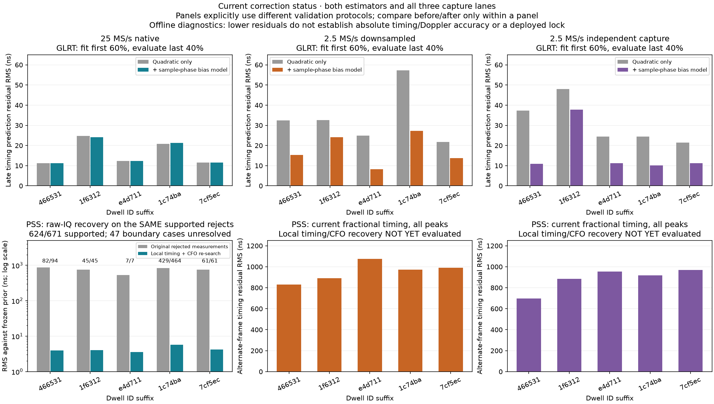
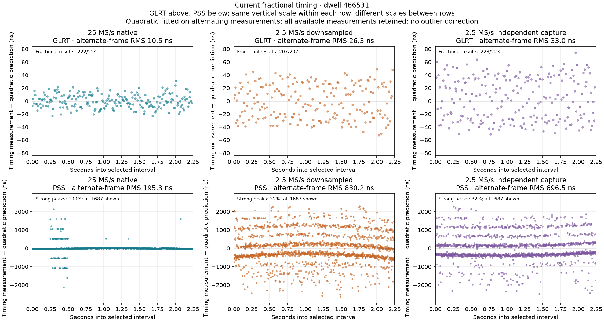
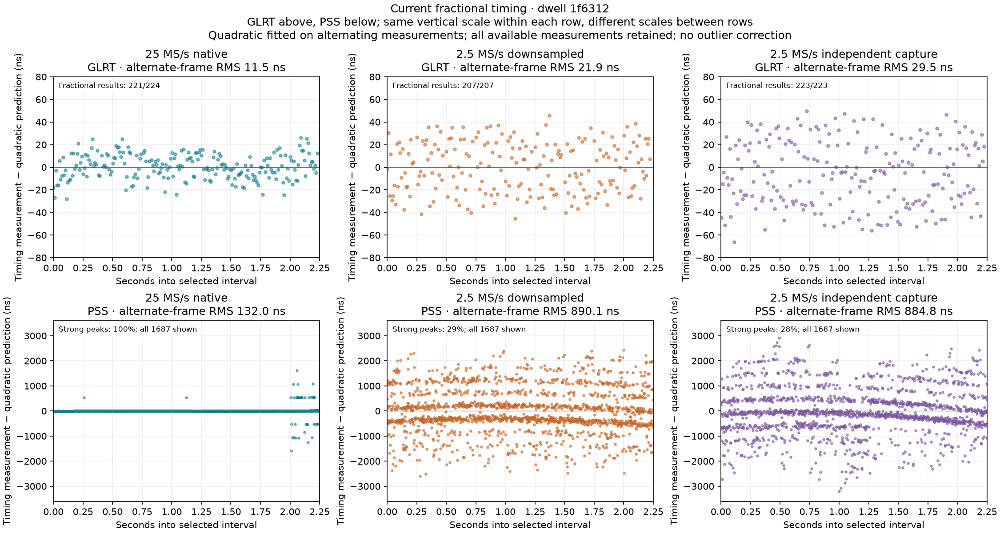
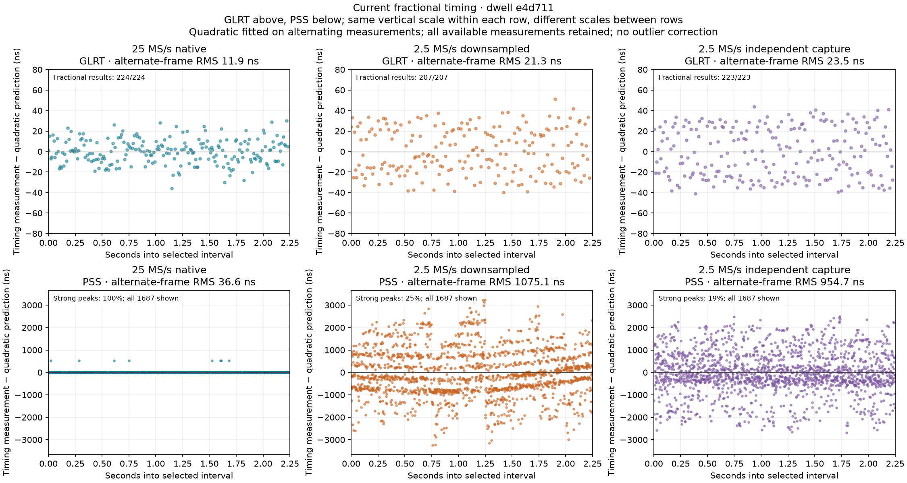
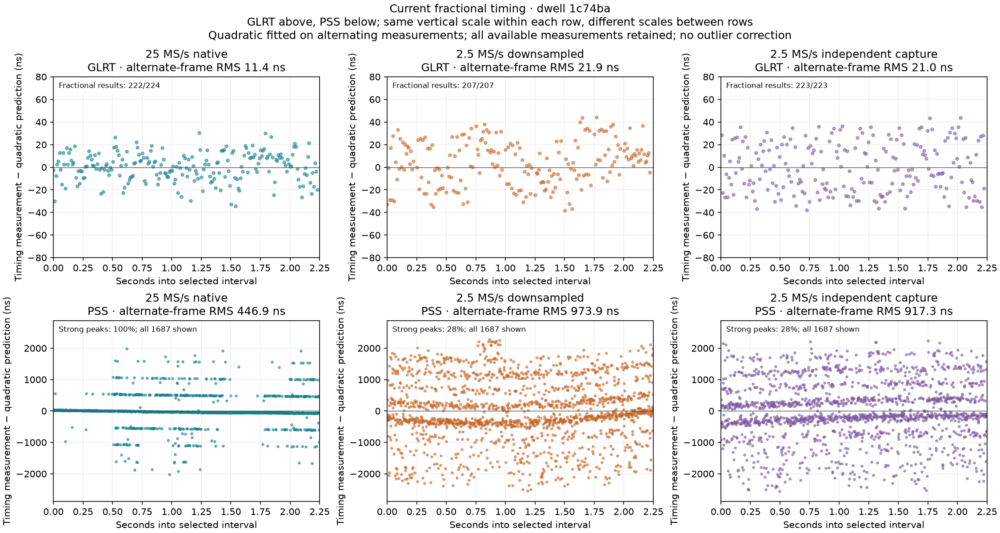
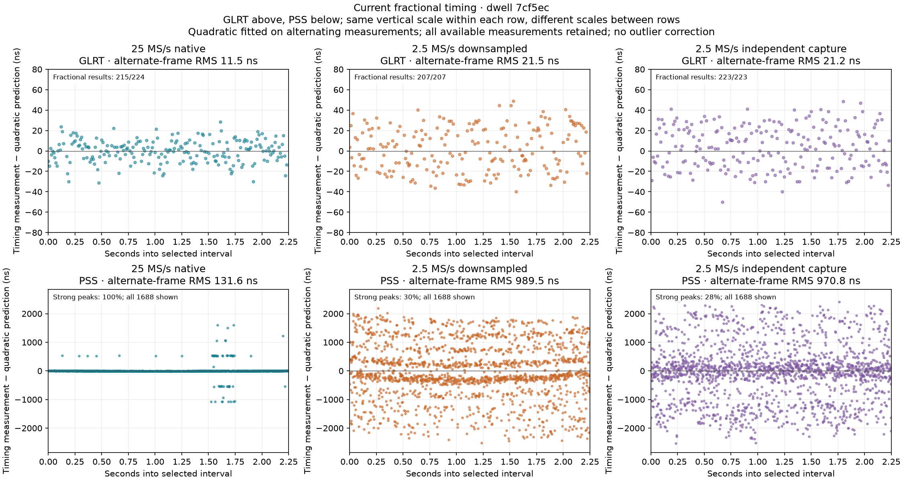
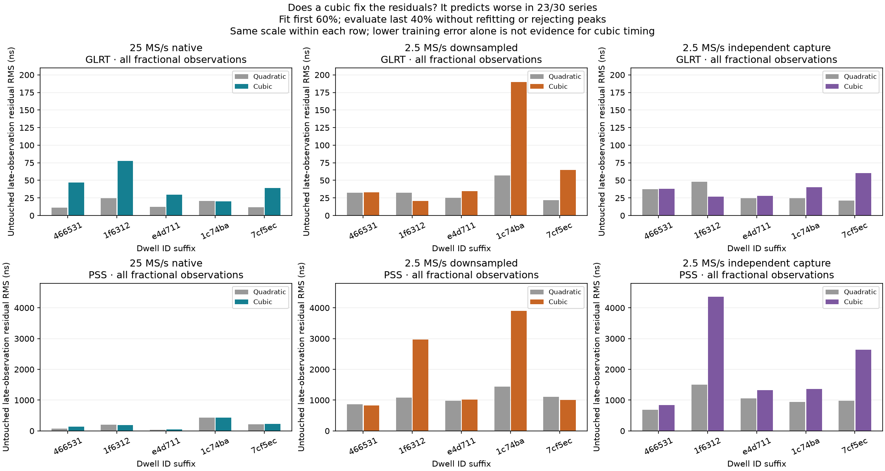
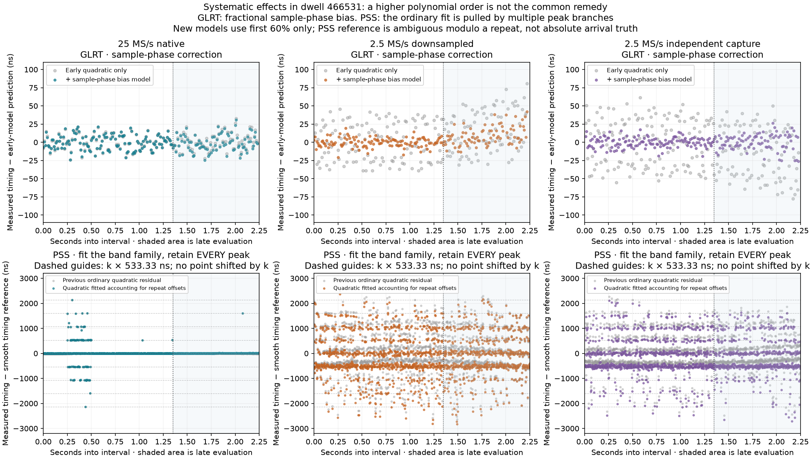

# Current timing status: fractional GLRT, PSS repetition bands and recovery

12 September 2026. Supplement to the
[full three-lane GLRT/PSS/TLE report](2026_09_12_three_lane_glrt_pss_tle_comparison.md).
The same five GLRT-selected, gap-free 2.25-second intervals are used throughout.
This is bounded offline analysis of existing recordings, with no new RF capture.

**Subsequent model update:** [PSS repetition mixtures and causal timing updates](2026_09_12_pss_mixture_models.md)
now separates supported repeated peaks from broad outliers in all three lanes,
shows both raw and associated residuals, and audits the full recordings' gaps.

**Cubic-fit follow-up:** fitting the first 60% and predicting the last 40%, cubic
fits perform worse than quadratics in **23 of 30 series**. A controlled noiseless
test also identifies a specific GLRT fractional-interpolation bias. For PSS,
much of the residual bowing comes from fitting the average of several repetition
branches. Details and new six-panel PNGs are included below.

**The remaining bands are not explained by integer-only reported timing.**
Both current estimators produce fractional timing. There are two different
patterns, and the evidence supports different remedies:

| Observation | Current evidence | Interpretation and next correction |
|---|---|---|
| Wideband PSS large outliers | 609 of 671 post-startup outliers lie within 20 ns of multiples of 533.333 ns | Repetition-peak ambiguity, strongly associated with block CFO choices; recover a supported local peak near a prior timing prediction while refining CFO |
| Fractional GLRT at 2.5 MS/s | Residual error varies with predicted fractional position inside a 400 ns sample; early-fit periodic correction improves all ten narrowband late evaluations | Controlled testing confirms bias in the parabolic approximation; validate continuous score optimization on real IQ before production use |
| Fractional GLRT at 25 MS/s | Sample-phase correction gives essentially no consistent gain | No evidence that the narrowband correction is useful at this rate |

**Plot convention:** every primary comparison below contains GLRT and PSS, with
columns ordered **25 MS/s native, 2.5 MS/s downsampled, 2.5 MS/s independent
capture**. An unavailable correction is labeled unevaluated. The downsample is
the same ADC observation; the independent capture has its own radio clock and
analog path. Their time origins are only approximately aligned by capture metadata.

The top row evaluates two GLRT models on the same untouched late measurements.
The bottom-left compares original and remeasured PSS values on the same supported
subset of rejected native frames. The bottom-middle and bottom-right show the
existing uncorrected narrowband PSS measurement RMS. These are explicitly
different validation protocols; bar heights across those panels are not a
common accuracy benchmark. The native PSS panel uses a logarithmic vertical axis.

**What still uses integers.** Sample array indices, coarse acquisition anchors
and frame identities are integers. PSS also retains a rounded legacy sample field,
but these plots use `fractional_global_device_sample` and fractional frame phase.
The corrected PSS algorithm evaluates 32 phases per sample across the search
aperture before choosing a peak, then adds continuous log-parabolic refinement.
Its comparison-grid spacings are 1.25 ns at 25 MS/s and 12.5 ns at 2.5 MS/s;
the final result is not restricted to that grid. The older integer-first winner
selection was a real issue and was corrected in the preceding experiment.

The current fractional GLRT companion fits a continuous log-parabola to adjacent
integer score probes. This is fractional estimation, but a three-point parabola
need not match the actual peak shape. Its bias can vary periodically as the true
arrival traverses a sample. Thus "fractional" does not imply "unbiased." The
observed sample-phase dependence supports that explanation without yet isolating
all effects of interpolation, windowing, filtering and signal structure.

**Current measurements before the new corrections.** A quadratic is fitted to
alternating measurements, and RMS is evaluated on the other measurements. All
available fractional observations are plotted, including PSS outliers. These
numbers reproduce the frozen comparison; they are timing residuals, not absolute
arrival errors. GLRT windows overlap and PSS branch errors cluster in time, so
the measurements are not independent trials.

| Dwell | GLRT 25 | GLRT downsampled 2.5 | GLRT independent 2.5 | PSS 25 | PSS downsampled 2.5 | PSS independent 2.5 |
|---|---:|---:|---:|---:|---:|---:|
| 466531 | 10.5 | 26.3 | 33.0 | 195.3 | 830.2 | 696.5 |
| 1f6312 | 11.5 | 21.9 | 29.5 | 132.0 | 890.1 | 884.8 |
| e4d711 | 11.9 | 21.3 | 23.5 | 36.6 | 1075.1 | 954.7 |
| 1c74ba | 11.4 | 21.9 | 21.0 | 446.9 | 973.9 | 917.3 |
| 7cf5ec | 11.5 | 21.5 | 21.2 | 131.6 | 989.5 | 970.8 |

All values are ns RMS. Each PNG uses the same vertical scale across a row, but
GLRT and PSS have different vertical scales. No points are clipped to conceal
outliers. Quadratic subtraction exposes the smaller structure hidden under the
large timing slope in the original screenshots. Outliers can also move the
ordinary quadratic reference; a displaced central band is not an absolute bias
measurement. "Strong peak" means local peak/median at least five, not a verified
correct branch or satellite identity.

**PSS outlier distribution.** The repeated 128-sample subsequence at the nominal
240 MHz waveform rate has duration 533.333 ns. This structure is described in
[Signal Structure of the Starlink Ku-Band Downlink](https://arxiv.org/abs/2210.11578)
and is present in the local template. It corresponds to 13⅓ captured samples at
25 MS/s or 1⅓ samples at 2.5 MS/s. It is distinct from the 40 ns or 400 ns ADC
sample interval. Multiples of a waveform repetition are integers of that
repetition, not evidence that the reported delay was rounded to a sample.

This distribution audit uses the existing native PSS gate's innovations against
predictions from earlier accepted measurements. The gate has a 64-frame startup
and a 120 ns rejection threshold. Its candidate association was obtained over
the whole interval, so this is conditional tracking evidence, not blind causal
acquisition validation.

| Dwell | Large outliers / predicted frames | Within 20 ns of a repeat multiple | Longest consecutive run | Most affected 250 ms block |
|---|---:|---:|---:|---|
| 466531 | 94 / 1623 | 92 | 5 | Block 1: 91 outliers |
| 1f6312 | 45 / 1623 | 43 | 3 | Block 8: 43 outliers |
| e4d711 | 7 / 1623 | 7 | 1 | Block 6: 4 outliers |
| 1c74ba | 464 / 1623 | 410 | 8 | Block 8: 102 outliers; several blocks affected |
| 7cf5ec | 61 / 1624 | 57 | 5 | Block 6: 51 outliers |

Blocks are zero-indexed. In total, 671/8116 predicted frames are large outliers;
609/671, or 90.8%, cluster near repetition multiples. They occur in bursts rather
than as stationary independent noise. For example, dwell 466531 has a 250 kHz
selected template CFO in its problematic block versus about 125 kHz elsewhere;
1f6312 has 200 kHz in its problematic block versus 100–125 kHz elsewhere.
These are estimator CFO coordinates, not independently calibrated physical Doppler.

Subtracting the nearest repetition multiple is only a diagnostic. The resulting
RMS across *all* outliers remains 21.7, 43.2, 5.4, 55.8 and 34.2 ns respectively.
Some points are off-band, and a strong alternate peak could represent another
path or signal. Blindly shifting every point onto a smooth line would conceal
that ambiguity.

**Bounded native PSS recovery.** All 671 rejected frames and 180 accepted control
frames were remeasured from the original IQ across the 45 native blocks. Every
raw block hash matched the frozen replay. The experiment used the existing
prediction without updating it with recovered measurements. It searched a local
aperture of approximately ±80 ns (integer floor/ceiling bounds add at most one
sample per side), while searching CFO within ±150 kHz of the block's previous
choice at 25 kHz spacing and then continuously refining it. Each delay search
still uses fractional interpolation.

An interior delay and interior CFO solution support 624 of the 671 rejected
frames; the other 47 reach the declared support boundary and remain unresolved.
There is no additional small-residual selection gate. The before/after table
uses exactly the same supported frames, avoiding comparison of different subsets.

| Dwell | Supported / rejected | Original RMS on supported frames (ns) | Remeasured RMS on supported frames (ns) | Median match-power gain, all rejects |
|---|---:|---:|---:|---:|
| 466531 | 82 / 94 | 863.8 | 3.92 | 2.40× |
| 1f6312 | 45 / 45 | 760.0 | 4.06 | 1.84× |
| e4d711 | 7 / 7 | 529.3 | 3.57 | 1.66× |
| 1c74ba | 429 / 464 | 840.7 | 5.71 | 1.85× |
| 7cf5ec | 61 / 61 | 755.9 | 4.25 | 1.70× |

The accepted controls remain approximately 3–4 ns RMS, with no uniform improvement.
This primarily demonstrates recovery of measurement coverage and suppression of
large branch errors. It does not establish a lower central noise floor. The small
remeasured residuals are conditional on a narrow search around an existing prior;
they are not external timing truth. Recovered points have not yet been fed into
a fresh end-to-end causal tracker. The same recovery has **not** been evaluated
on either 2.5 MS/s lane. The large narrowband PSS bands remain visible in their
panels rather than receiving an assumed improvement.

**Fractional GLRT sample-phase bias.** For each series, a quadratic baseline is
fitted using only the first 1.35 seconds. Fractional sample phase is computed
from the discrete frame identity and that early-only smooth prediction, not from
each late observation's noisy fractional delay. The model then fits a quadratic
plus sine/cosine terms at one and two cycles per sample phase on the same early
data. Both models are evaluated without refitting on the remaining 0.9 seconds.
The split is fixed at 60/40 and no observations are rejected by this diagnostic.

| Dwell | 25 MS/s, baseline → periodic model | Downsampled 2.5, baseline → periodic model | Independent 2.5, baseline → periodic model |
|---|---:|---:|---:|
| 466531 | 11.26 → 11.28 | 32.39 → 15.38 | 37.24 → 10.90 |
| 1f6312 | 24.77 → 24.15 | 32.56 → 24.18 | 47.93 → 37.79 |
| e4d711 | 12.34 → 12.29 | 24.95 → 8.32 | 24.42 → 11.22 |
| 1c74ba | 20.83 → 21.22 | 57.20 → 27.33 | 24.35 → 10.16 |
| 7cf5ec | 11.51 → 11.48 | 21.72 → 13.79 | 21.41 → 11.20 |

All values are ns RMS on untouched late measurements. The periodic model helps
all ten narrowband series and provides no consistent benefit at 25 MS/s. Its
fundamental amplitude is 24.7–34.1 ns downsampled and 25.3–43.2 ns on the independent
radio. The native amplitude is small. These are per-series fitted corrections,
not a single calibrated correction proven transferable to other signals.
The harmonic form was motivated by this corpus, so the late evaluation is useful
within-corpus validation, not a wholly independent model-selection benchmark.

**Does the timing need a cubic?** The preceding residual plots already subtract
a quadratic. A new comparison fits an ordinary quadratic or cubic using only
the first 1.35 seconds and evaluates both on the same last 0.9 seconds. All
available fractional observations are retained. The cubic reduces training
error, but worsens late RMS in **12/15 GLRT series and 11/15 PSS series**.

The result argues against increasing polynomial order as the general remedy.
It does not prove that a physical timing trajectory never has a cubic term.
Even after accounting for repetition offsets, a cubic worsens the late
*modulo-repeat* RMS in 10/13 PSS series with adequate early band coherence.
The diagnostic uses an early circular-coherence threshold of 0.25.
The other two independent-radio PSS series have weak band support and are not
used to claim an effective correction.

**Why the PSS bands can curve after quadratic subtraction.** A useful model is
`measured timing = q(t) + k(t) × repetition + error`, where `k` labels the peak
branch selected for each frame. An ordinary least-squares fit is pulled toward
`q(t) + repetition × average branch index at time t`. If the mix of selected
branches changes with time, that average differs from the shared timing curve.
Subtracting the ordinary fitted polynomial can therefore leave visibly curved
parallel bands even when the underlying timing curve is quadratic.

The new diagnostic fits the circular phase of timing modulo 533.333 ns, so all
repetition branches inform the same smooth curve. It fits only the early 60%.
It then subtracts that **single smooth curve** from the original measurements;
it does not subtract individual repetition multiples, reject points, or replace
measurements with predictions. The bottom row below therefore still shows every
peak branch. The old gray points use the earlier alternating-fit reference;
the colored points use the new early-only reference. This overlay illustrates
the changed reference, not an absolute timing improvement.

For dwell 466531, the PSS quadratic curvature estimates become much more
consistent across the lanes when the fit accounts for the branches:

| Lane | Ordinary early quadratic curvature (ns/s²) | Early fit accounting for repetitions (ns/s²) |
|---|---:|---:|
| 25 MS/s | −249.4 | −326.0 |
| 2.5 MS/s downsampled | +415.8 | −308.9 |
| 2.5 MS/s independent capture | −739.0 | −335.2 |

Both columns use the same early interval. This demonstrates how branch mixing
can corrupt the apparent stretch-rate estimate, including its sign. It is not
a calibrated physical Doppler measurement, and the independent radio retains
its own clock terms. The circular model itself cannot resolve absolute branch
identity.

**The narrowband bands are not exact copies of the native repetition comb.**
An exploratory scan of spacing from 350 to 650 ns averages circular concentration
within 125 ms blocks. Its strongest spacings on all five downsampled PSS series
are **511.0–515.0 ns**, versus about 533 ns natively. The three independent-radio
series with clear concentration peak at 513.5, 523.5 and 517.5 ns. The other two
independent-radio series have weak concentration; their apparent spacings are
not reliable estimates.

This scan describes the distribution of selected peaks, not the physical repeat
duration. Filtering, finite correlation windows, CFO mismatch and adjacent signal
content can distort a correlation peak family. The exact contribution of these
effects to the narrowband spacing has not been isolated. In particular, the
spacing difference must not be interpreted as Doppler stretch or used as an
unvalidated per-point calibration. It reinforces why blindly subtracting
533 ns multiples is insufficient at 2.5 MS/s.

**Controlled estimator test identifies a GLRT implementation bias.** A noiseless
pilot control uses the exact local template, source frame starts matching the
scorer's geometry, and Fourier-imposed fractional delays. Nineteen delays from
−0.45 to +0.45 sample are tested at each rate. It compares the current parabolic
refinement against bounded continuous optimization of the **same GLRT score**.
There is no polynomial trajectory fit or noise in this experiment.

| Control | Current GLRT parabolic RMS error | Continuous GLRT score RMS error | Current fractional PSS RMS error | Longer PSS interpolation RMS error |
|---|---:|---:|---:|---:|
| Nominal 2.5 MS/s | 82.71 ns | 4.75 ns | 1.54 ns | 0.42 ns |
| Nominal 25 MS/s | 0.38 ns | 0.04 ns | 0.14 ns | 0.01 ns |

For a concrete 2.5 MS/s case, a true +0.35-sample delay produces +0.4971 sample
from the current GLRT parabola, a +58.8 ns error. Direct optimization gives
+0.3396 sample, a −4.2 ns error. The discrepancy establishes that the fractional
parabolic approximation itself can produce a substantial systematic bias.
The controlled error magnitude is not a forecast of the correction gain on
real recordings: these exact-template signals omit noise, analog filtering,
adjacent payload and physical clock/time-scaling effects. This control does not
simulate an independent second radio or repeat the analog downsampling path.

The PSS control uses an isolated nominal projected template, also shifted by
known fractional delays. The current 16-tap and diagnostic 64-tap interpolation
both recover fractional timing much more closely than one 400 ns sample.
That control's small error cannot explain the hundreds-of-nanoseconds PSS bands;
the real-recording branch ambiguity remains the larger issue. Longer interpolation
alone is not demonstrated to solve it.

**Can this tighten both locks?** The evidence supports two separate measurement
corrections feeding a timing tracker:

1. PSS: retain alternative local peaks, use prior timing and CFO continuity to
   associate a branch, and refine delay and CFO on actual IQ. Keep unresolved
   boundary cases rejected; coast or reacquire as uncertainty grows. Do not just
   subtract 533 ns multiples from the recorded timestamps.
2. GLRT: test the fractional peak approximation with known fractional delays
   across the whole sample interval, including realistic filtering and SNR.
   The controlled test favors optimizing the score continuously instead of
   treating a fitted three-point parabola as the peak. Use an empirical
   sample-phase calibration only after demonstrating its stability on other
   recordings. The present early/late result is promising evidence for that work.
3. Keep measured delay, predicted delay, ambiguity, support and uncertainty
   separate. GLRT and PSS need their own measurement models even if they update
   a shared frame epoch, clock skew and drift state. The native and downsampled
   data are correlated; the independent radio needs separate clock terms.
4. Validate the combined causal loop offline before mapping it to FPGA. A lean
   FPGA first step remains exact sample timestamps and scheduled short high-rate
   bursts, with a decimated GLRT acquisition/carrier lane and host refinement.

Tighter **unbiased measured** timing over a supported time baseline can improve
stretch and stretch-rate precision. Suppressing repetition slips can prevent a
few large errors from dominating that fit. A smoother predictor alone does not
demonstrate better Doppler. Transmitter/receiver clocks and the physical sign
and time-scaling model remain unresolved as described in the full report. No
new TLE ranking or absolute Doppler accuracy gain is claimed by this supplement.

**Reproduction and validation.** The new plotting code reproduces all 30 frozen
alternate-frame RMS values to 0.001 ns. Six new tests verify that late samples
cannot change the early bias fit or predicted phase, that a known periodic bias
is recovered on unseen synthetic late samples, and that a 533 ns held-out outlier
remains in the plot and RMS without changing the training fit. They also check
that ordinary/circular quadratic and cubic fits cannot use late observations,
and that repetition-aware fitting recovers a known quadratic while retaining
every measured branch. All six pass; Ruff checks pass for the seven new tools
and the new test file. These checks add
to the 64 estimator/comparison tests recorded in the full report. No numerical
golden fixtures were changed.

- [All new six-panel data and recovery statistics](figures/2026_09_12_paired_glrt_pss_tle/paired-five-pss-outlier-bands-20260912-v5/timing-current-status.json)
- [Quadratic/cubic fits, repetition-aware predictions and spacing scans](figures/2026_09_12_paired_glrt_pss_tle/paired-five-pss-outlier-bands-20260912-v5/polynomial-and-bands.json.gz)
- [Noiseless fractional-estimator control data and protocol](figures/2026_09_12_paired_glrt_pss_tle/paired-five-pss-outlier-bands-20260912-v5/fractional-estimator-control.json)
- [Executed validation and source hashes](figures/2026_09_12_paired_glrt_pss_tle/paired-five-pss-outlier-bands-20260912-v5/validation.json)
- [Sample-phase model coefficients, predictions and residuals](figures/2026_09_12_paired_glrt_pss_tle/paired-five-pss-outlier-bands-20260912-v5/glrt-sample-phase-bias.json)
- [Outlier counts, runs, histograms and frozen prior innovations](figures/2026_09_12_paired_glrt_pss_tle/paired-five-pss-outlier-bands-20260912-v5/summary.json)
- [Raw-IQ recovery protocol](figures/2026_09_12_paired_glrt_pss_tle/paired-five-pss-outlier-bands-20260912-v5/recovery/protocol.json)
- [Recovery records, 466531](figures/2026_09_12_paired_glrt_pss_tle/paired-five-pss-outlier-bands-20260912-v5/recovery/cap-20260910T144242-5d3167466531.json)
- [Recovery records, 1f6312](figures/2026_09_12_paired_glrt_pss_tle/paired-five-pss-outlier-bands-20260912-v5/recovery/cap-20260909T180511-4d26661f6312.json)
- [Recovery records, e4d711](figures/2026_09_12_paired_glrt_pss_tle/paired-five-pss-outlier-bands-20260912-v5/recovery/cap-20260907T122009-79d2b4e4d711.json)
- [Recovery records, 1c74ba](figures/2026_09_12_paired_glrt_pss_tle/paired-five-pss-outlier-bands-20260912-v5/recovery/cap-20260910T142004-f161b21c74ba.json)
- [Recovery records, 7cf5ec](figures/2026_09_12_paired_glrt_pss_tle/paired-five-pss-outlier-bands-20260912-v5/recovery/cap-20260910T152219-88da5a7cf5ec.json)
- [Six-panel plotting source](figures/2026_09_12_paired_glrt_pss_tle/source/tools/plot_paired_timing_status.py)
- [Polynomial and repetition-model diagnostic source](figures/2026_09_12_paired_glrt_pss_tle/source/tools/diagnose_timing_polynomial_and_bands.py)
- [Controlled fractional-estimator probe source](figures/2026_09_12_paired_glrt_pss_tle/source/tools/probe_fractional_estimator_bias.py)
- [Sample-phase diagnostic source](figures/2026_09_12_paired_glrt_pss_tle/source/tools/plot_glrt_sample_phase_bias.py)
- [Band analysis source](figures/2026_09_12_paired_glrt_pss_tle/source/tools/analyze_pss_outlier_bands.py)
- [Raw-IQ recovery source](figures/2026_09_12_paired_glrt_pss_tle/source/tools/replay_pss_local_recovery.py)
- [Diagnostic tests](figures/2026_09_12_paired_glrt_pss_tle/source/tests/analysis/test_timing_diagnostic_tools.py)
- [Portable report exporter](figures/2026_09_12_paired_glrt_pss_tle/source/tools/export_paired_report.py)

Source snapshots are the publication versions. The recovery tool received
formatting and explicit binding of per-block closure variables after its raw-IQ
run; its completed per-block worker calls used the same bound values. The
publication manifest records hashes of the exported files. The original v2–v4
inputs and their provenance remain linked from the full report.
