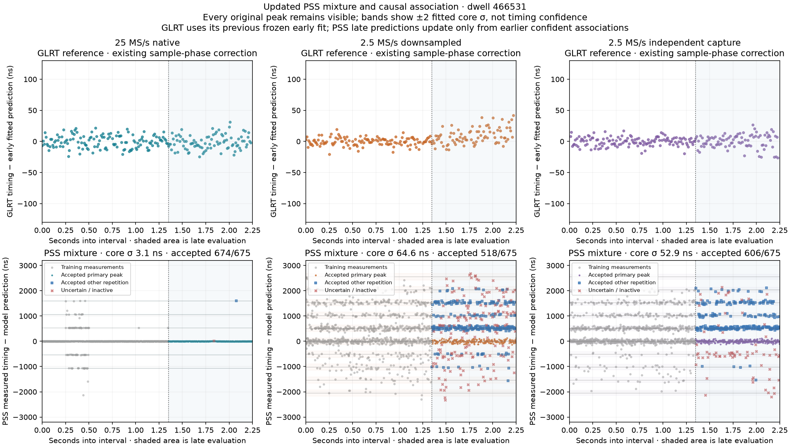
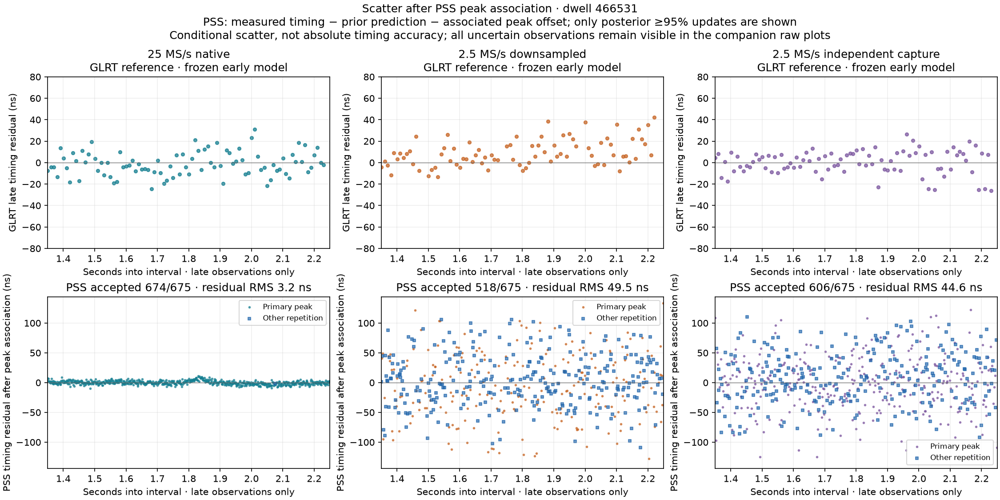
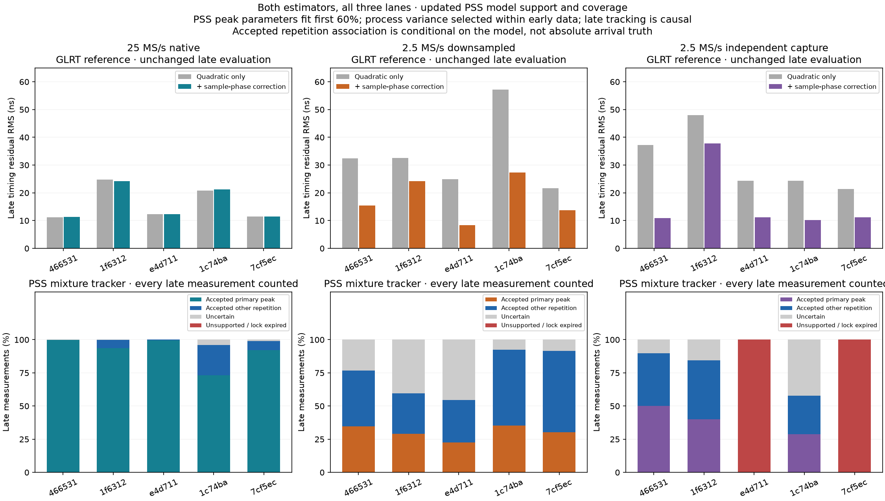

# PSS repetition models, causal timing updates and the bandwidth comparison

12 September 2026. Update to the [full GLRT/PSS/TLE report](2026_09_12_three_lane_glrt_pss_tle_comparison.md)
and [timing-bias investigation](2026_09_12_pss_glrt_timing_residuals.md).
This analysis fits new models to the existing fractional PSS measurements from
all five dwells and all three capture paths. No new IQ measurements or RF captures
were made. GLRT remains the previous frozen-fit reference in these figures.

The consolidated report now explicitly explains the distinction between
conditional timing RMS, derivative uncertainty and TLE discrimination. The
[30/60 MS/s FPGA discussion](2026_09_12_pss_30_60_fpga_path.md)
adds audited historical hardware evidence and proposed windowing/correlation
budgets. Those documentation updates do not change the v6 measurements below.

**25 MS/s makes a substantial difference to PSS frame tracking in these data,
while providing little additional GLRT carrier information.** The new PSS model
distinguishes a smooth timing trajectory, repeated correlation peaks and a broad
outlier population. Its supported 25 MS/s tracks accept 96–100% of late frames
with 3.2–4.7 ns RMS innovations. The downsampled tracks accept 55–92% with
43.9–79.7 ns RMS; the independent radio supports three of five tracks, accepting
58–90% with 44.6–51.8 ns RMS. These are conditional prediction residuals after
peak association, not absolute timing accuracy or measured Doppler uncertainty.

**The 2.25-second interval is a benchmark choice, but these wideband recordings
also have real continuity limits.** Each recording spans 60 seconds. The native
25 MS/s paths are missing 35.7–37.5% of their samples and have longest continuous
segments of only 3.28–3.40 seconds. All five independent 2.5 MS/s paths have
60 seconds of continuous samples. The downsampled path inherits the native gaps.

**What to expect from higher sample rate.** Sample spacing changes from 400 ns
at 2.5 MS/s to 40 ns at 25 MS/s, but fractional estimators can resolve timing
within either spacing. Information comes from captured signal bandwidth and
signal-to-noise ratio, not merely a denser array. For known-signal delay
estimation, the ideal noise bound scales inversely with effective bandwidth and
the square root of energy-to-noise ratio; it does not establish a universal
tenfold improvement for these recordings. See the delay bound in equations
13–14 of [Qin et al., Timing Properties of the Starlink Ku-Band Downlink](https://radionavlab.ae.utexas.edu/wp-content/uploads/qin_starlink_timing_properties.pdf).

| Observable | Expectation for 25 MS/s versus 2.5 MS/s | What these five dwells show |
|---|---|---|
| GLRT pilot carrier frequency and its slope | Little gain when both rates preserve the pilot used by this implementation; carrier phase accumulation and clock behavior matter more than the discarded surrounding bandwidth | Native/downsampled carrier residuals closely match, and the leading TLE candidate is identical in all five dwells |
| Fractional GLRT frame timing | Some improvement from sampling the score peak more densely; continuous peak evaluation can also improve 2.5 MS/s | Existing alternate-frame timing RMS: 10.5–11.9 ns native, 21.3–26.3 ns downsampled, 21.0–33.0 ns independent. Part of the narrowband difference is interpolation bias, not an unavoidable bandwidth limit |
| PSS frame timing | A larger gain because the wider recording retains more of the synchronization waveform, sharpens the useful correlation structure and helps distinguish nearby repeated peaks | Almost all native frames have strong PSS peaks. After probabilistic association, native timing scatter is much smaller and lock coverage is higher than the narrowband paths |
| Orbital Doppler and TLE discrimination from timing | Cleaner timing can improve fitted stretch and curvature if association, clocks and the physical observation model are correct | No new TLE ranking or calibrated Doppler uncertainty has been established by this model update |

The clean rate comparison is native versus its downsample: both share the ADC,
clock and RF path. The independent recording changes the radio and analog path
as well as sample rate; it is valuable corroboration but cannot isolate bandwidth.
Upsampling that narrowband recording would not recreate discarded PSS information.

For the pictured dwell, the original GLRT carrier residual RMS is
**4.79 / 4.95 / 38.42 Hz** in native/downsampled/independent order. Across all
five, the independent radio is noisier in the first two dwells and cleaner in
the other three. Thus 25 MS/s is not uniformly the best carrier measurement.
Those carrier figures use the original alternate-measurement quadratic protocol;
they must not be compared numerically with the new causal PSS timing residuals.

After the earlier sample-phase bias correction, GLRT's frozen early-fit/late-test
timing RMS is **11.3–24.2 ns native, 8.3–27.3 ns downsampled, and 10.2–37.8 ns
independent**. The corrected downsample matches or beats native in two of five
dwells, and is close in another. This further limits the claim that 25 MS/s is
intrinsically necessary for this pilot's timing. These late-test values use a
different split from the alternate-measurement figures in the table above;
the matching before/after late-test bars are shown in the status PNG below.

**What the updated model does.** Each PSS timing observation is modeled as
`y(t) = q(t) + k × T + residual`, or as a broad outlier. The early smooth
trajectory `q(t)` is quadratic; `k` identifies a repeated correlation peak.
Thirteen Gaussian components initially cover `k = −6,…,6`, with a shared
within-peak width and separately fitted branch probabilities. A Student-t
component with three degrees of freedom and 1,500 ns scale models broad errors.
Its center is an ordinary quadratic fitted once on the training data and then
frozen, so the broad component cannot drag the narrow trajectory during fitting.

Three models are fitted to each series: a single Gaussian plus the same broad
background, a repetition mixture with `T = 533.333 ns`, and a mixture with
empirical spacing constrained to 480–570 ns. Multiple early-data initializations
are used for all models, including the single-peak baseline. The native tracker
uses the fixed spacing; the two narrowband trackers use empirical spacing,
following the earlier band investigation. This choice was not selected using
their late scores. Empirical narrowband spacing is an estimator-description
parameter; it is not a new physical repetition period or Doppler measurement.

The most occupied early branch defines zero, and that convention stays fixed.
It does not identify the absolute physical start of the PSS. The Gaussian width
describes residual scatter within the fitted bands, including remaining signal
and estimator effects; it does not isolate thermal noise.

**Fit and evaluation protocol.** The first 1.35 seconds train the final mixture.
The last 0.90 seconds provide 675 measurements per series for late evaluation.
A constant-acceleration Kalman tracker predicts each late observation before
looking at it. Only a best individual branch posterior of at least 95% can
update its phase, slope and acceleration. An accepted update uses the observed
timing minus the associated repetition offset. Other observations remain in
the record without changing the state. A 250 ms coast without a supported update
expires the lock; it cannot silently resume under this replay policy.

The process-noise density is selected from 10³, 10⁵, 10⁷ and 10⁹ ns²/s⁵ using
only an inner early split: fit through 0.90 seconds and score predictions from
0.90 to 1.35 seconds. Branch weights, widths and spacing are frozen for the
late causal replay. A separate evaluation freezes the entire fitted curve and
compares predictive log densities on **all** late points, including outliers.
This checks whether the repetition model explains unseen portions better than
the single-peak baseline without rewarding rejection alone.

A coherence/background/width gate refuses a repetition lock when the early
data do not support one. The independent recordings for `e4d711` and `7cf5ec`
fail this gate. Their mixture width reaches its bound, so their fitted widths
and component weights are not reported as signal precision or noise fractions.

**Updated plots.** Columns always show 25 MS/s native, 2.5 MS/s downsampled,
and 2.5 MS/s independent capture. GLRT is above PSS. Within each row, all three
panels use a common vertical scale.

In this raw plot, no PSS point is shifted by its repetition index. Gray denotes
training measurements. In the shaded late interval, the lane color marks an
accepted primary peak, blue squares mark accepted other repetitions, and red
crosses mark uncertain or inactive observations. Guides are model peak centers
with ±2 fitted core widths, not confidence intervals for physical timing.

The second plot explicitly subtracts the associated `k × T` from accepted PSS
measurements and shows their innovations against the **prior** prediction.
The reduction relative to the raw plot includes resolving the repeated-peak
ambiguity and withholding uncertain observations. It is not independent proof
that every blue point represents the same propagation path. The raw companion
retains all rejected measurements. GLRT uses the earlier sample-phase-corrected,
frozen early model; it has not received the new PSS tracker or PSS gating.

**All fifteen PSS results.** Width, spacing and RMS are in ns. Every coverage
denominator is 675 late frames. The final column is the chosen frozen mixture's
mean late log-density gain over the single-peak model, in nats per measurement;
positive is better. It evaluates all observations, separately from causal replay.

| Dwell | Capture path | Fitted core σ | Spacing T | Accepted late frames | Accepted innovation RMS | Frozen density gain |
|---|---|---:|---:|---:|---:|---:|
| 466531 | 25 native | 3.1 | 533.3 | 99.9% | 3.2 | −0.061 |
| 466531 | 2.5 downsampled | 64.6 | 511.4 | 76.7% | 49.5 | +0.555 |
| 466531 | 2.5 independent | 52.9 | 510.7 | 89.8% | 44.6 | +0.653 |
| 1f6312 | 25 native | 3.6 | 533.3 | 99.7% | 3.6 | −0.870 |
| 1f6312 | 2.5 downsampled | 65.8 | 513.8 | 59.7% | 49.1 | +0.479 |
| 1f6312 | 2.5 independent | 66.8 | 526.7 | 84.4% | 50.6 | +0.631 |
| e4d711 | 25 native | 3.0 | 533.3 | 100.0% | 3.5 | +0.026 |
| e4d711 | 2.5 downsampled | 77.2 | 507.3 | 54.7% | 43.9 | +0.297 |
| e4d711 | 2.5 independent | Unsupported | — | 0.0% | — | +0.116 |
| 1c74ba | 25 native | 4.8 | 533.3 | 96.0% | 4.7 | +0.765 |
| 1c74ba | 2.5 downsampled | 99.5 | 505.7 | 92.4% | 77.6 | +0.534 |
| 1c74ba | 2.5 independent | 82.6 | 513.4 | 57.9% | 51.8 | +0.284 |
| 7cf5ec | 25 native | 3.5 | 533.3 | 98.8% | 3.7 | +0.254 |
| 7cf5ec | 2.5 downsampled | 103.2 | 511.6 | 91.4% | 79.7 | +0.414 |
| 7cf5ec | 2.5 independent | Unsupported | — | 0.0% | — | +0.173 |

The chosen frozen mixture improves density over the single-peak baseline in
11 of 13 supported series; it loses in two native series. Empirical spacing
beats fixed spacing in seven of eight supported narrowband series, not all
eight. A small positive density gain in a weak series does not establish a lock.
This is evidence for modeling the bands, not evidence that a more elaborate
curve always predicts better. The previous cubic comparison already performed
worse than quadratic prediction in 23 of 30 GLRT/PSS series.

Residual noise is not completely independent. For the pictured native track,
adjacent accepted innovations have correlation **0.38**. Therefore the fitted
3.1 ns core and 3.2 ns innovation RMS should not be converted to a slope or
curvature uncertainty by assuming every frame is an independent sample.
Confidence also remains conditional on the fitted spacing, associations and
chosen candidate. The original candidate association used the full interval;
this replay validates causal updates after that association, not blind acquisition.
This cohort and model design were informed by earlier inspection, so the late
split is a retrospective within-corpus evaluation, not a pristine new benchmark.

**Why not use the full 60 seconds?** The frozen device-counter inventories show:

| Dwell | 25 MS/s observed / 60 s | Missing | Longest native segment | Segment containing our selected interval, device seconds | Independent 2.5 MS/s continuous span |
|---|---:|---:|---:|---|---:|
| 466531 | 38.40 s | 36.00% | 3.32 s | 31.24–34.36 (3.12 s) | 60.00 s |
| 1f6312 | 37.52 s | 37.47% | 3.36 s | 0.00–3.00 (3.00 s) | 60.00 s |
| e4d711 | 38.56 s | 35.73% | 3.40 s | 15.96–19.16 (3.20 s) | 60.00 s |
| 1c74ba | 37.76 s | 37.07% | 3.28 s | 55.96–59.20 (3.24 s) | 60.00 s |
| 7cf5ec | 38.48 s | 35.87% | 3.28 s | 5.24–8.52 (3.28 s) | 60.00 s |

All native continuity boundaries carry `counter_gap_and_overflow` or its
terminal variant; the median positive preceding gap is 1.92 seconds in every
dwell. These flags establish missing data associated with overflow, but do not
locate the root cause within the acquisition/transport/storage chain. There are
also short segments and gaps; the recordings are not an exact periodic duty cycle.
The inventory is counter-authoritative and includes zero-fill placeholders;
those placeholders are not observed signal and cannot supply timing measurements.

The selected comparison uses nine 250 ms blocks in one gap-free, GLRT-strong
interval. We can examine the remaining valid portion of its containing segment,
but that only extends a native continuous analysis to roughly 3.0–3.3 seconds
for these particular selections. A 60-second analysis must process separate
native segments, preserve device time across gaps, and reacquire/validate peak
and frame identity after them. The current 250 ms coast policy would expire
across the typical native gap. A global cubic through those gaps would not
constitute a continuously measured timing lock.

The independent 2.5 MS/s recording can support a longer continuous analysis
without new RF collection. Sample continuity does not guarantee strong PSS,
constant satellite/beam identity, or a stable frame clock for the entire minute;
those must be checked on the remaining data. Whole-record GLRT was already used
for selection, but this new PSS replay only evaluates the selected 2.25 seconds.

**Consequences for Doppler and FPGA work.** Better per-frame timing and a longer
validated baseline both help estimate the slope and curvature of the measured
frame-timing trajectory. Converting those derivatives to geometric Doppler also
requires the receiver/transmitter clock and sign conventions. The original
timing/TLE mismatch remains unresolved; this update does not recompute TLE rankings
or turn conditional nanosecond scatter into a satellite identification claim.

The evidence supports a bounded FPGA design: retain a decimated pilot path for
GLRT acquisition/carrier tracking, and evaluate a small fractional PSS delay
neighborhood around a predicted arrival in the native stream. Emit peak scores,
fractional timing, uncertainty indicators and device counters so the host can
perform association and track fitting. Computing these measurements before bulk
IQ transport could reduce transport load; whether it eliminates these overflow
gaps depends on their actual cause. Continuous counter-verified operation and
explicit loss/reacquisition behavior are more useful next validations than
assuming that a higher global polynomial order or a faster full search fixes it.
No new FPGA resource, throughput or hardware result is claimed here.

**Figures and complete per-frame records for every dwell.** Each JSON contains
the original fractional observations, all three fitted models and frozen scores,
process calibration scores, and every late decision with its prior prediction,
branch probability, raw innovation and branch-corrected innovation.

| Dwell | Raw peaks PNG | Associated residual PNG | 25 MS/s JSON | Downsampled 2.5 JSON | Independent 2.5 JSON |
|---|---|---|---|---|---|
| 466531 | [Raw](figures/2026_09_12_paired_glrt_pss_tle/paired-five-pss-mixture-models-20260912-v6/mixture-tracks-466531.png) | [Associated](figures/2026_09_12_paired_glrt_pss_tle/paired-five-pss-mixture-models-20260912-v6/associated-residuals-466531.png) | [Native](figures/2026_09_12_paired_glrt_pss_tle/paired-five-pss-mixture-models-20260912-v6/cap-20260910T144242-5d3167466531-native25.json) | [Downsampled](figures/2026_09_12_paired_glrt_pss_tle/paired-five-pss-mixture-models-20260912-v6/cap-20260910T144242-5d3167466531-derived2p5.json) | [Independent](figures/2026_09_12_paired_glrt_pss_tle/paired-five-pss-mixture-models-20260912-v6/cap-20260910T144242-5d3167466531-recorded2p5.json) |
| 1f6312 | [Raw](figures/2026_09_12_paired_glrt_pss_tle/paired-five-pss-mixture-models-20260912-v6/mixture-tracks-1f6312.png) | [Associated](figures/2026_09_12_paired_glrt_pss_tle/paired-five-pss-mixture-models-20260912-v6/associated-residuals-1f6312.png) | [Native](figures/2026_09_12_paired_glrt_pss_tle/paired-five-pss-mixture-models-20260912-v6/cap-20260909T180511-4d26661f6312-native25.json) | [Downsampled](figures/2026_09_12_paired_glrt_pss_tle/paired-five-pss-mixture-models-20260912-v6/cap-20260909T180511-4d26661f6312-derived2p5.json) | [Independent](figures/2026_09_12_paired_glrt_pss_tle/paired-five-pss-mixture-models-20260912-v6/cap-20260909T180511-4d26661f6312-recorded2p5.json) |
| e4d711 | [Raw](figures/2026_09_12_paired_glrt_pss_tle/paired-five-pss-mixture-models-20260912-v6/mixture-tracks-e4d711.png) | [Associated](figures/2026_09_12_paired_glrt_pss_tle/paired-five-pss-mixture-models-20260912-v6/associated-residuals-e4d711.png) | [Native](figures/2026_09_12_paired_glrt_pss_tle/paired-five-pss-mixture-models-20260912-v6/cap-20260907T122009-79d2b4e4d711-native25.json) | [Downsampled](figures/2026_09_12_paired_glrt_pss_tle/paired-five-pss-mixture-models-20260912-v6/cap-20260907T122009-79d2b4e4d711-derived2p5.json) | [Independent](figures/2026_09_12_paired_glrt_pss_tle/paired-five-pss-mixture-models-20260912-v6/cap-20260907T122009-79d2b4e4d711-recorded2p5.json) |
| 1c74ba | [Raw](figures/2026_09_12_paired_glrt_pss_tle/paired-five-pss-mixture-models-20260912-v6/mixture-tracks-1c74ba.png) | [Associated](figures/2026_09_12_paired_glrt_pss_tle/paired-five-pss-mixture-models-20260912-v6/associated-residuals-1c74ba.png) | [Native](figures/2026_09_12_paired_glrt_pss_tle/paired-five-pss-mixture-models-20260912-v6/cap-20260910T142004-f161b21c74ba-native25.json) | [Downsampled](figures/2026_09_12_paired_glrt_pss_tle/paired-five-pss-mixture-models-20260912-v6/cap-20260910T142004-f161b21c74ba-derived2p5.json) | [Independent](figures/2026_09_12_paired_glrt_pss_tle/paired-five-pss-mixture-models-20260912-v6/cap-20260910T142004-f161b21c74ba-recorded2p5.json) |
| 7cf5ec | [Raw](figures/2026_09_12_paired_glrt_pss_tle/paired-five-pss-mixture-models-20260912-v6/mixture-tracks-7cf5ec.png) | [Associated](figures/2026_09_12_paired_glrt_pss_tle/paired-five-pss-mixture-models-20260912-v6/associated-residuals-7cf5ec.png) | [Native](figures/2026_09_12_paired_glrt_pss_tle/paired-five-pss-mixture-models-20260912-v6/cap-20260910T152219-88da5a7cf5ec-native25.json) | [Downsampled](figures/2026_09_12_paired_glrt_pss_tle/paired-five-pss-mixture-models-20260912-v6/cap-20260910T152219-88da5a7cf5ec-derived2p5.json) | [Independent](figures/2026_09_12_paired_glrt_pss_tle/paired-five-pss-mixture-models-20260912-v6/cap-20260910T152219-88da5a7cf5ec-recorded2p5.json) |

**Reproduction and validation.** The pure [mixture/tracker implementation](figures/2026_09_12_paired_glrt_pss_tle/source/src/leo/analysis/research/pss_peak_mixture.py)
is exercised by [eleven component-owned tests](figures/2026_09_12_paired_glrt_pss_tle/source/tests/analysis/test_pss_peak_mixture.py),
covering known-spacing recovery, broad outliers, a fair single-peak baseline,
probability normalization, absence of late-data fitting, causal update ordering,
rejected-observation behavior, weak/noise-only rejection and lock expiry.
Together with the five existing causal-lock tests, **16 tests pass**; Ruff passes.
Tests establish implementation behavior on controlled inputs, not absolute
accuracy on these recordings.

- [Driver and plotting code](figures/2026_09_12_paired_glrt_pss_tle/source/tools/fit_paired_pss_mixtures.py)
- [Protocol and input hashes](figures/2026_09_12_paired_glrt_pss_tle/paired-five-pss-mixture-models-20260912-v6/protocol.json)
- [All fifteen result summaries](figures/2026_09_12_paired_glrt_pss_tle/paired-five-pss-mixture-models-20260912-v6/summary.json)
- [Counter-based continuity audit](figures/2026_09_12_paired_glrt_pss_tle/paired-five-pss-mixture-models-20260912-v6/continuity-audit.json)
- [Validation commands, results and source hashes](figures/2026_09_12_paired_glrt_pss_tle/paired-five-pss-mixture-models-20260912-v6/validation.json)

From the analysis worktree with its NumPy/SciPy/Matplotlib environment, run
`PYTHONPATH=src OPENBLAS_NUM_THREADS=1 OMP_NUM_THREADS=1 python tools/fit_paired_pss_mixtures.py OUTPUT_DIRECTORY`.
The driver reads the three frozen inputs listed in the protocol. Continuity
statistics are a separate read-only reduction of each selected stream binding's
`validity_inventory`: sample counts divided by the declared sample rate, with
segment bounds and boundary reasons retained in the linked audit.
