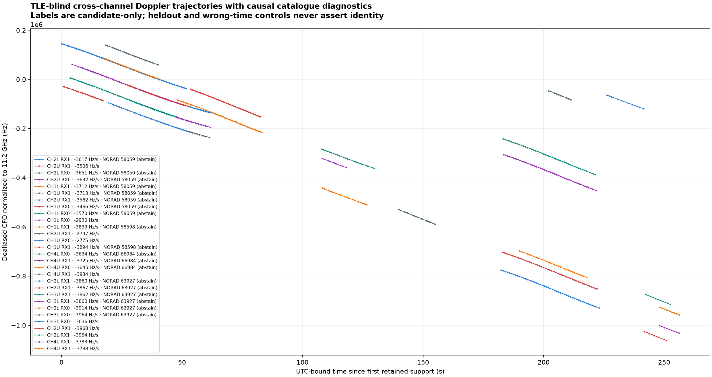
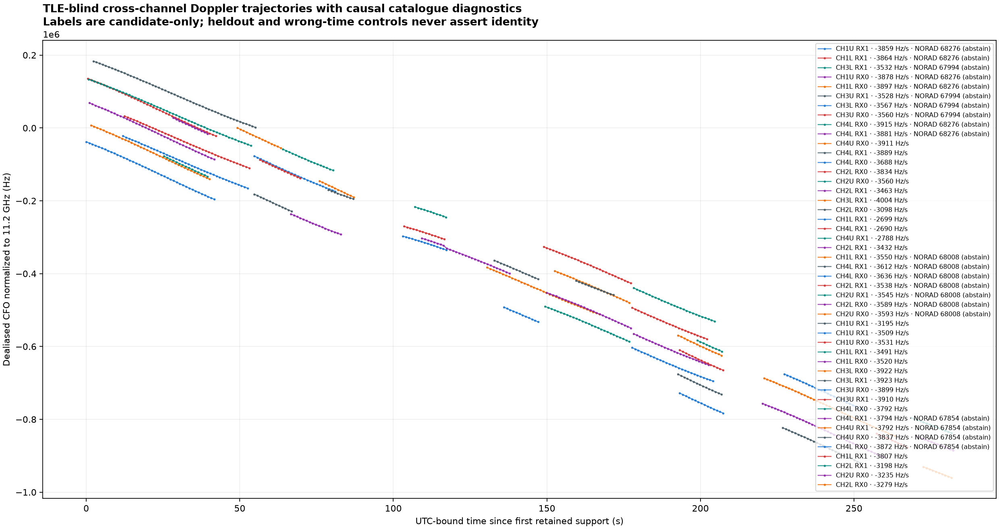

# Shared trajectory and causal TLE tracking

The scanner now uses one cross-channel tracking pipeline for fixed and adaptive
captures at both supported scan rates: 2.5 and 5 MS/s. This closes the missing
adaptive tracking product and prevents a catalogue failure from hiding measured
trajectories. Implementation: `1028d888b770d432f120d922906ada3fa17f1977`.
Deployed API/UI and analysis release: `a80932cb928819ac87324f4a3c60d14eac1f8740`,
which also provisions the new output directory for the unprivileged worker.

## Behaviour

Capture-specific storage adapters verify sealed analysis metrics and expose the
same observation port. The projection uses actual visit counters, fractional
GLRT support, the recorded sample rate and qualified UTC authority. It preserves
irregular revisit intervals and subtracts large integer counters before applying
fractional offsets. It does not manufacture fixed sweeps for adaptive captures.

The existing TLE-blind reconstruction engine produces an independent measured
trajectory PNG before catalogue access. TLE matching checkpoints after each
group, then publishes an annotated companion PNG. Missing catalogues and failed
comparisons retain the measured PNG and expose their actual reasons. Recordings
without qualified UTC or sufficient trajectory support have an explicit outcome.

Matching first requires at least 20 observations spanning 20 seconds. Eligible
groups are ordered by hypothesis, duration, observation count and stable identity
before the four-group budget is applied. Counts distinguish all groups across
hypotheses, eligible groups, attempted comparisons and deferred groups; these are
not counts of uniquely identified satellites.

Catalogue eligibility excludes only objects explicitly named as Starlink debris
(`STARLINK… DEB`), before measured CFO is scored. Publications retain the original
snapshot reference, derived eligible-snapshot digest, full exclusion inventory
and matching-policy digest. Other propagation failures remain explicit failures.
There is no silent dropping of failed eligible satellites or selection of a
catalogue based on which one fits the measurements best.

Chronological heldout evaluation, ±500-second wrong-time controls, the
radio-polynomial control and abstention remain in force. A scored group or a
NORAD label is candidate evidence, not a confirmed satellite identity.

The new products use the separate `scanner-shared-tracking-v1` namespace and
`/api/v1/scanner/tracking/{session_id}` API. Existing published capture, analysis
and legacy tracking products are preserved. Both UI capture modes display the
same panel; the previous fixed tracking publication remains expandable.

## Validation

- All four combinations of capture mode and sample rate have adapter and
  projection coverage. Fixed adapter output agrees with legacy physical support,
  fractional CFO, source intervals and UTC centres at both rates.
- Synthetic known Doppler recovers −2,000 Hz/s at both rates and modes with
  residual RMS below 0.000001 Hz in the noiseless fixture. This checks coordinate
  correctness, not expected performance on real RF.
- Tests cover irregular gaps, large counters beyond float64's exact integer
  range, overlapping probe rejection, unavailable UTC, mismatched authority,
  catalogue failures, resumable work, immutable publication and tamper detection.
- Browser component tests cover both rates, partial results, actual failure
  reasons, figure selection and rejection of evidence from another capture.
- The exact implementation commit passed `./ops test --base 272adf717d0a8b8f13354966346fea04b282189d`,
  including whole-source mypy, changed component tests, lint, formatting, the web
  test suite and the production web build. Fourteen additional legacy trajectory,
  tracking, population, TLE-control and presentation tests passed.

All 26 systemd-template tests passed for the deployment follow-up. The immutable
release passed source, host runtime, publication metadata and web-build checks.
The API became healthy 1.788 seconds after its restart. The acquisition release
was not changed, and no new RF collection was started for this qualification.

Real-track fit residual RMS measures consistency; it is not an absolute Doppler
accuracy measurement.

## Historical and deployed results

| Session | Mode | Rate | Scored groups before | Scored groups now | Tracklet summaries | Longest tracklet | PNGs |
| --- | --- | --- | ---: | ---: | ---: | ---: | --- |
| `scan-hop-7864e7522a479a87` | Adaptive | 2.5 MS/s | Not integrated | 4 / 4 attempted | 39 | 51.69 s | Both |
| `scan-hop-f1827b5f6e5955e8` | Fixed | 5 MS/s | 0 | 4 / 4 attempted | 52 | 52.85 s | Both |
| `scan-hop-63ffc70ef462f8a5` | Fixed | 2.5 MS/s | 0 | 3 / 3 attempted | 33 | 43.24 s | Both |
| `scan-hop-5905b14cd29da9f8` | Adaptive, automatically selected | 2.5 MS/s | Not integrated | 4 / 4 attempted | 43 | 48.05 s | Both |

The first two rows were generated by the deployed release into the production
publication namespace and verified in Chromium through the live web UI. Both
tabs decoded 2480×1312 PNGs, with no JavaScript errors. The third row was replayed
with the deployed release into a separate verification namespace. Export checks
re-read the capture and analysis authorities and verified both digests against
each publication before copying its evidence.

The fourth row verifies the deployed automatic selector with no session ID. It
selected an eligible recent scan, completed in 153 seconds, and both PNGs were
then decoded through the live browser with no JavaScript errors. Its
[publication](evidence/scan-hop-5905b14cd29da9f8-tracking.json),
[annotated PNG](evidence/scan-hop-5905b14cd29da9f8-trajectory-tle.png), and
[browser verification](evidence/scan-hop-5905b14cd29da9f8-web-verification.json)
are included.

No archived adaptive 5 MS/s scans were found in the 35-entry adaptive inventory
checked during this work. That combination is covered by persisted-capture
adapter tests and synthetic physical-coordinate tests, rather than claimed as a
real-data result.

Both fixed examples exclude the single catalogue-labelled debris object
`STARLINK-34343 DEB` (NORAD 69730). The original adaptive example used a causal Hugging Face
snapshot with no such exclusion; the automatically selected adaptive example
used a Space-Track snapshot and excluded the same debris object.
**Every scored group in these four examples
still recommends abstention.** Restoring comparisons did not relax the scientific
controls or establish satellite identities.

### Adaptive scan that was missing tracking



[Measured trajectories](evidence/scan-hop-7864e7522a479a87-trajectory.png) ·
[Complete numerical evidence](evidence/scan-hop-7864e7522a479a87-tracking.json) ·
[Deployed browser verification](evidence/scan-hop-7864e7522a479a87-web-verification.json)

### Fixed 5 MS/s catalogue failure case



[Measured trajectories](evidence/scan-hop-f1827b5f6e5955e8-trajectory.png) ·
[Complete numerical evidence](evidence/scan-hop-f1827b5f6e5955e8-tracking.json) ·
[Previous publication](evidence/scan-hop-f1827b5f6e5955e8-previous-tracking.json) ·
[Deployed browser verification](evidence/scan-hop-f1827b5f6e5955e8-web-verification.json)

The [fixed 2.5 MS/s PNG](evidence/scan-hop-63ffc70ef462f8a5-trajectory-tle.png)
and [numerical evidence](evidence/scan-hop-63ffc70ef462f8a5-tracking.json) provide
an additional real-data rate check.

## Operation and reproduction

The normal analysis backfill invokes the shared tracker after the existing
refinement, adaptive and fixed analysis jobs. It uses the existing nonblocking
analysis lease, prioritizes resumable work and then recent captures, and records
unavailable outcomes explicitly. Unexpected failed jobs require an explicit
session retry rather than repeatedly starving the queue.

For an already captured scan:

```bash
python -m leo.cli.scanner_tracking \
  --site spinnaker-sausalito \
  --session-id scan-hop-7864e7522a479a87 \
  --maximum-seconds 180
```

Omit `--session-id` for automatic pending-session selection. Repeating a completed
session returns the existing immutable publication. An interrupted run resumes
saved group dispositions. Work budgets are checked between groups; one numerical
group or filesystem synchronization can finish after the nominal deadline.

During verification, the bulk XFS filesystem exhibited long synchronization
waits, also affecting the pre-existing analysis worker. The adaptive production
run saved one completed group before its first pass ended, then resumed and
completed the remaining three in 120 seconds. The fixed 5 MS/s production run
completed in 174 seconds. These observations are not a latency guarantee.
The measured PNG was browser-verified while TLE work was still pending, then
both completed figures were verified again.

Release staging also required space on the root filesystem. Browser and npm
caches were relocated to bulk storage with symlinks preserving their original
paths. An inactive temporary build tree was similarly retained on bulk; that
tree had been on tmpfs, so its relocation relieved tmpfs rather than root disk.
No archived RF data or QNAP paths were removed or modified.

The [test receipt](evidence/implementation-test-receipt.json),
[release metadata](evidence/release-metadata.txt), exported publications, original
fixed publications and browser screenshots accompany this report.
The [deployed run journal](evidence/deployed-tracking-journal.txt) records the
checkpoint resume, fixed-scan run and automatic selection. The regular backfill
timer was restored after the targeted runs; the API, acquisition service and
timer were all active in the final [deployment check](evidence/deployment-state.json).
