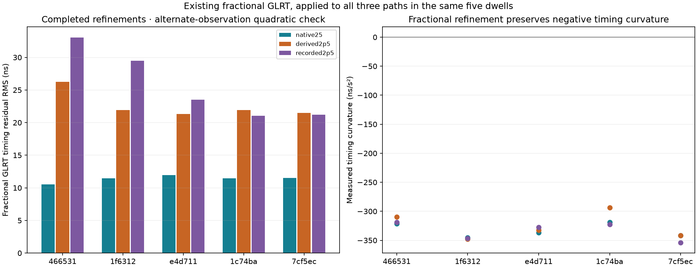
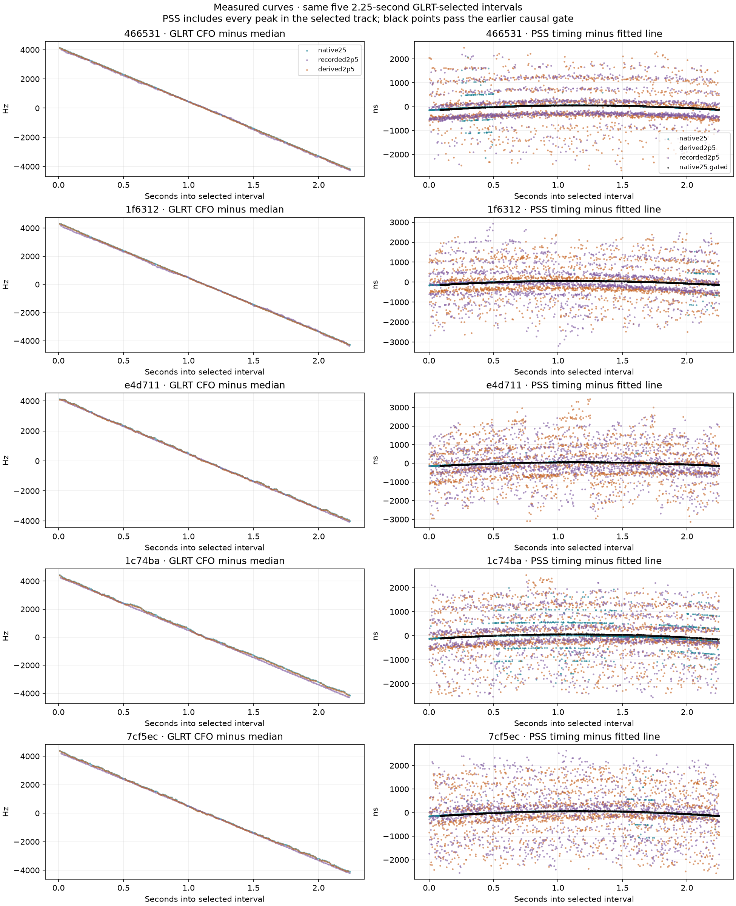
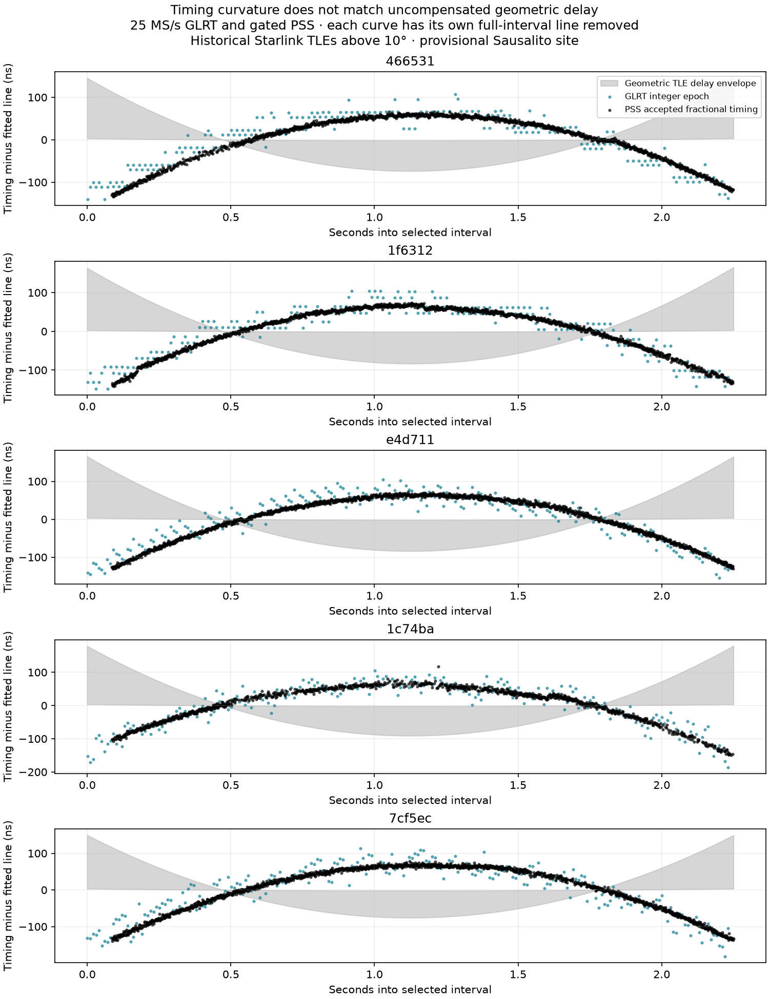
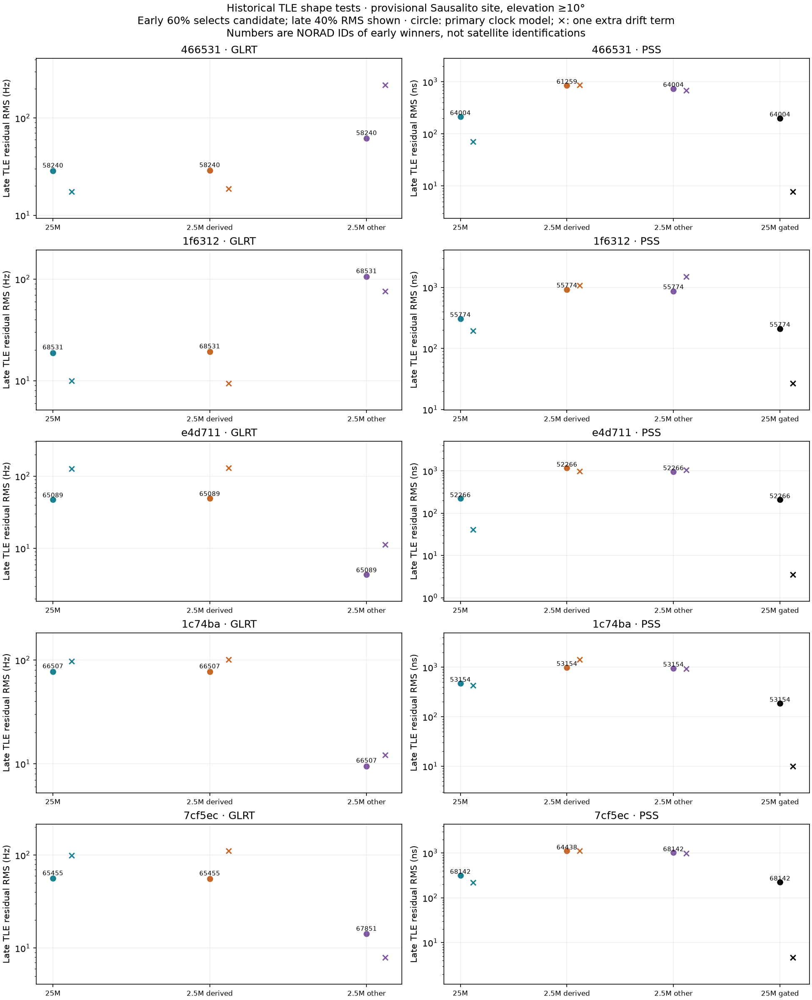

# Five paired dwells: GLRT, PSS, bandwidth and historical Starlink TLE discrimination

Updated and comprehensively audited 12 September 2026. This report consolidates
the five-dwell comparison, fractional GLRT and PSS measurements, interpolation
and repetition-band investigations, updated probabilistic PSS tracking, capture
continuity, historical TLE discrimination, and the proposed 30/60 MS/s FPGA path.
All three paths remain explicit: **25 MS/s native, 2.5 MS/s downsampled, and
2.5 MS/s independent capture**. Original results are retained with their protocols;
later corrections do not silently replace earlier measurements or TLE rankings.

**Reading the evidence:** the current summary below includes the v5 GLRT
correction and v6 PSS models. The detailed carrier/TLE tables later in this report
retain the v4 comparison. No TLE ranking has been recomputed with v5/v6 corrections.
The present v7 update audits and consolidates documentation and engineering
calculations; it is not another measurement or model-fitting experiment.

**Engineering discussion:** [A bounded path to 30/60 MS/s fractional PSS tracking](2026_09_12_pss_30_60_fpga_path.md).
This reviews reusable hardware evidence, the older integer-lag FPGA result,
fractional tracking requirements, acquisition/handoff, analog bandwidth and
explicit transport/compute budgets. It proposes windowed native capture first,
then hardware correlation, with software prediction and explicit reacquisition.

**Latest model update:** [Probabilistic PSS repetition models, causal timing
updates, bandwidth expectations and recording continuity](2026_09_12_pss_mixture_models.md).
New models distinguish repeated peaks from broad outliers in all fifteen series,
with plots showing both raw measurements and explicitly associated residuals.
The continuity audit explains why the 60-second native recordings only provide
roughly three-second continuous stretches, while the independent 2.5 MS/s
recordings are continuous for the full minute.

**Prior timing-status update:** [Residual bands, fractional interpolation bias,
and bounded recovery experiments](2026_09_12_pss_glrt_timing_residuals.md).
This adds six-panel PNGs for every dwell: GLRT above PSS, with columns always
ordered 25 MS/s native, 2.5 MS/s downsampled, and 2.5 MS/s independent capture.
It distinguishes PSS repetition ambiguities from smaller GLRT sample-phase bias.
The new corrections are offline diagnostics; TLE rankings have not been
recomputed using them, and no FPGA tracker has been deployed by this work.

**Fractional GLRT correction:** GLRT does not require integer timing, and this
repository already has fractional GLRT products. The first version of this report
read the integer epoch field and omitted those companions. The completed
v4 alternate-measurement fractional comparison below corrects that omission:
**10.5–11.9 ns native,
21.3–26.3 ns downsampled, and 21.0–33.0 ns other-radio timing RMS**. The integer
table is retained as a labeled baseline, not as GLRT's precision limit.

**The practical result is to keep narrowband GLRT for carrier tracking and use
wideband PSS for precise frame tracking. The current measurements do not justify
turning frame stretch directly into orbital Doppler or claiming a unique satellite
identity.** The 25 MS/s data and its 2.5 MS/s downsample select the same leading
GLRT TLE candidate in all five dwells. Wideband substantially improves PSS timing,
but both GLRT frame timing and PSS frame timing have curvature opposite to the
uncompensated geometric delay predicted by the visible TLEs in this comparison.

**Location remains provisional:** the TLE calculation uses the repository's
Spinnaker, Sausalito preset, latitude 37.858988°, longitude −122.478103°,
ellipsoidal altitude −29 m. That preset is a display convenience, not a capture
location authority. The selected manifests do not establish observer position,
antenna pointing or a calibrated clock model. The numerical rankings below are
conditional on that assumed site; the measured signal comparisons are not.

| Processing path | What the data support | What they do not establish |
|---|---|---|
| 2.5 MS/s downsample of the 25 MS/s recording | All 1,035 new GLRT windows pass; carrier curves and leading TLE candidates closely match native 25 MS/s | An independent second observation: this is the same ADC and the same IQ |
| 2.5 MS/s from the other radio | Strong GLRT in all selected windows; sometimes substantially cleaner carrier measurements than the native radio | Nanosecond time alignment or a shared calibrated oscillator |
| Native 25 MS/s | Much stronger per-frame PSS peaks and cleaner timing; accepted gated measurements have roughly 3–5 ns local residuals | A corresponding absolute Doppler accuracy, or a 10× carrier/TLE improvement |

**Current measurements and what each number means.** Ranges span the five
selected dwells; the independent PSS residual range includes only its three
supported cases. Measurements use the same selected intervals but different
estimator apertures and the explicitly stated validation protocols. They are
not a common absolute-accuracy leaderboard.

| Observable / protocol | 25 MS/s native | 2.5 MS/s downsampled | 2.5 MS/s independent capture |
|---|---:|---:|---:|
| GLRT carrier: v4 alternating-measurement quadratic residual RMS | 4.79–43.35 Hz | 4.95–44.01 Hz | 3.89–42.77 Hz |
| GLRT timing: v5 first-60% fit, late-40% prediction, sample-phase correction | 11.3–24.2 ns RMS | 8.3–27.3 ns RMS | 10.2–37.8 ns RMS |
| PSS timing: v6 accepted late causal innovations after repetition association | 3.2–4.7 ns RMS | 43.9–79.7 ns RMS | 44.6–51.8 ns RMS |
| PSS supported repetition models | 5/5 dwells | 5/5 dwells | 3/5 dwells |
| PSS late update coverage, 675 frames/dwell | 96.0–100% | 54.7–92.4% | 57.9–89.8% in supported cases; 0% in two cases |

Native and downsampled GLRT carrier curves closely agree dwell by dwell and
select the same leading TLE candidate in all five. Their overlapping timing
residual ranges after correction also weaken a claim of an intrinsic large
wideband GLRT advantage. PSS shows a much larger measured benefit from the
wider capture: lower within-track scatter, stronger peaks and higher coverage.

The v6 PSS fit uses the first 1.35 seconds for its band model and replays the
last 0.90 seconds causally, choosing process variance within early data only.
It models a quadratic trajectory, repeated peaks and a broad Student-t outlier
population. Gaussian width, spacing and branch probabilities are frozen for
late updates. Native uses 533.333 ns spacing; the narrowband paths use an
empirical spacing bounded to 480–570 ns. A best-branch posterior of at least
95% is necessary for an update. Unsupported models do not update, and 250 ms
without support expires a lock. The frozen mixture improves all-point late
predictive density over a single-peak baseline in 11 of 13 supported series,
so the more elaborate model is not uniformly better.


GLRT's top row compares like-for-like frozen predictions before and after its
sample-phase correction. PSS's bottom row counts every late opportunity by
update outcome. The two rows intentionally show different quantities. Per-dwell
raw peaks, associated residuals, complete model fits, all late decisions and
limitations are retained in the [PSS model supplement](2026_09_12_pss_mixture_models.md).

**Why small ns RMS does not directly establish better Doppler or a better TLE
match.** The plotted residual is consistency with an estimator/model; it is not
error against known propagation delay. A useful conceptual observation equation is
`measured timing = propagation delay + combined frame/receiver clock offset + estimator error`.
For physical propagation delay `tau = range/c`, the first-order Doppler relation
is `f_D = -f_RF * d(tau)/dt`; Doppler rate depends on the second derivative.
These relations do not automatically apply to the stored template-phase coordinate.
Carrier measurements also have oscillator terms of their own.

At a fixed time baseline and sampling pattern, reducing independent unbiased
timing errors tenfold ideally reduces fitted slope and curvature uncertainty
tenfold. A longer supported baseline can also improve those derivatives.
But lower residuals achieved through stronger smoothing, outlier selection or
repetition association are not automatically an equivalent reduction in true
measurement error. Adjacent accepted native innovations in `466531` have
correlation 0.38, so independent-frame uncertainty formulas are not calibrated
for that track. The current replay is conditional on an already associated
candidate and does not validate blind acquisition or an absolute timing origin.

Starlink's frame and carrier clocks can behave differently; a precise frame
stretch measurement is therefore not by itself a precise geometric carrier
Doppler measurement. [Independent timing research](https://radionavlab.ae.utexas.edu/wp-content/uploads/qin_starlink_timing_properties.pdf)
supports separate clock terms, without diagnosing the cause of our particular
timing/carrier coordinate mismatch.

TLE discrimination additionally requires candidate predictions to remain
different after allowing the same justified clock uncertainties. In our retained
`e4d711` comparison, one drift-adjusted candidate reaches 3.53 ns late RMS, yet
all 193 visible candidates remain within the empirical separation threshold.
Thus a tiny residual can coexist with almost no satellite specificity. This
work compares existing TLE candidates; it does not estimate new orbital elements.
The next scientific quantities to validate are slope/curvature uncertainty with
temporal correlation, calibrated agreement with carrier observations, and
held-out candidate separation under a justified shared observation model.

**Cohort and input control.** The frozen inventory contains 841 paired capture
IDs, 1,682 recorded 2.5 MS/s GLRT products and 121 native 25 MS/s GLRT products
across 121 dwells. There were 242 native/other-radio pair evaluations. Twelve
pairs across ten dwells met the selection policy; the five strongest distinct
dwells were selected using GLRT alone, before PSS analysis.

The policy requires at least 80% passing windows over each complete valid path,
and a gap-free 2.25-second interval with at least 200 complete 20 ms windows,
at least 95% passing, and median GLRT margin at least 0.25 in both recorded paths.
Intervals begin on a 250 ms native-device grid. Ranking maximizes the weaker
recorded path's interval median margin. All selected intervals actually pass 100%.
This is a favorable, GLRT-conditioned cohort, not an unbiased detection benchmark.

| Dwell suffix and full capture ID | Channel / edge | Native interval, device seconds | Other-radio start, device seconds | Estimated UTC start of compared interval |
|---|---|---:|---:|---|
| `466531` — `cap-20260910T144242-5d3167466531` | 4 lower | 32.00–34.25 | 32.300364734 | Sep 10 14:43:20.475834 |
| `1f6312` — `cap-20260909T180511-4d26661f6312` | 3 lower | 0.50–2.75 | 0.786243976 | Sep 09 18:05:18.067083 |
| `e4d711` — `cap-20260907T122009-79d2b4e4d711` | 3 lower | 16.75–19.00 | 17.103863354 | Sep 07 12:20:31.607085 |
| `1c74ba` — `cap-20260910T142004-f161b21c74ba` | 4 lower | 56.75–59.00 | 57.124302940 | Sep 10 14:21:04.733064 |
| `7cf5ec` — `cap-20260910T152219-88da5a7cf5ec` | 1 lower | 5.50–7.75 | 5.820881618 | Sep 10 15:22:31.939190 |

Capture IDs name capture creation, not the beginning of the analyzed interval.
The TLE comparison uses the stream first-sample UTC estimate plus the selected
device offset. Whole native recordings have 35.7–37.5% missing samples; the selected
intervals have none. Inter-radio start offsets are 286–374 ms. Summed first-sample
UTC half-widths are 1.41–1.70 ms, larger than the nominal 1.333 ms frame period.
The paired intervals are contemporaneous, but common individual frame numbers
and absolute inter-radio timing are unresolved.

**The 2.25-second interval is a selection choice, with a real continuity limit
in the underlying wideband captures.** All five native paths span 60 seconds,
but their longest continuous segments are only 3.28–3.40 seconds. The segments
containing our chosen intervals last 3.00–3.28 seconds. All native boundaries
have counter-gap/overflow flags, and their median positive preceding gap is
1.92 seconds. These flags do not isolate the faulty acquisition/transport stage.
All five independent 2.5 MS/s recordings contain 60 seconds of continuous IQ;
the downsampled controls inherit the native gaps. Zero-fill placeholders cannot
be treated as observed timing. See the [full counter audit](figures/2026_09_12_paired_glrt_pss_tle/paired-five-pss-mixture-models-20260912-v6/continuity-audit.json).

A longer analysis can use more of each valid native segment, or process segments
over the full minute with explicit reacquisition and frame/peak identity checks.
It cannot claim continuously measured wideband lock across the missing IQ.
Continuous independent-radio samples permit a longer PSS analysis, but sustained
PSS support outside the selected interval has not yet been established.

The frozen bindings declare RF bandwidths of 25 MHz for native and 2.5 MHz for
the independent recording. These settings do not constitute a measured flat RF
response or physical-die attestation. The comparison demonstrates the behavior
of these recorded paths; extrapolation to 30/60 MS/s requires explicit RF/filter
profiles and new evidence of the additional useful bandwidth.

The downsampled control translates the native IQ to the other radio's pilot-edge
center, applies the existing FFT-based decimation by ten, and trims 64 output
samples from each end of each 250 ms block. It retains the native ADC, clock and
RF path. This digital passband does not reproduce the other radio's analog filter.
Every newly read block's raw IQ SHA-256 was checked against the prior PSS replay;
all 45 comparisons matched. Source GLRT product digests and capture manifests
were also checked. No new RF was collected.

**What GLRT and PSS mean here.** GLRT is a statistical decision method; PSS is a
known synchronization sequence. They are not mutually exclusive categories of
receiver design. In this repository, the GLRT lane acquires a structured pilot
candidate, compares exact and control scores, and then estimates carrier frequency
from known-pilot phase progression. The PSS lane correlates a locally generated
synchronization waveform with the received IQ, searching timing and CFO.
The latter is used here as a frame-arrival measurement, not as a fine carrier
frequency estimator. Its 25 kHz CFO refinement grid must not be confused with
the precision of the GLRT carrier measurements.

| Setting | GLRT comparison | PSS comparison |
|---|---|---|
| Acquisition | Independent 20 ms window searches, production pilot configuration | Independent CFO/timing search in each of nine 250 ms blocks |
| CFO search | Residual ±400 kHz; production coarse/fine search and phase tracking | ±1.2 MHz at 100 kHz, then ±50 kHz at 25 kHz around up to four centers |
| Acceptance | Exact-minus-control margin ≥0.025 | Epoch robust Z ≥6, epoch peak/median ≥1.15, at least four frames |
| Reported carrier observable | Robust frame-CFO line value at its reference time within the 20 ms window | No independent fine carrier series claimed |
| Reported timing observable | Integer acquisition baseline plus fractional companion, modulo the frame period | Fractional PSS peak, modulo the frame period |
| Timing grid | Integer anchor spacing 40 ns / 400 ns; fractional timing adds a continuous offset | 32 phases/sample before continuous local refinement: 1.25 ns / 12.5 ns comparison grids |
| Statistical caveat | 20 ms windows on 10 ms stride overlap | Track association uses the whole interval; frame errors and aliases are correlated |

All three PSS lanes use the corrected estimator that compares fractional-delay
peaks **before** selecting the winning local peak. The previous integer-first
selection could choose a neighboring repetition branch even when a better
fractional peak existed. The correction uses 16-tap Lanczos interpolation and
continuous log-parabolic refinement. Its grid spacing is not an accuracy claim.

PSS selection chooses the associated track with most block support, breaking ties
by median epoch robust Z. Each selected track covers all nine blocks and contains
1,687 or 1,688 measured frames. Other retained tracks include timing/CFO aliases;
they are not a count of different satellites. GLRT did not seed the PSS timing
or CFO searches. The known synchronization sequence and its role in ranging are
described in [Signal Structure of the Starlink Ku-Band Downlink](https://arxiv.org/abs/2210.11578).

**GLRT detection and carrier precision.** Native and other-radio results reuse
224 and 223 persisted windows per dwell respectively. The new downsampled replay
uses 23 complete windows inside each trimmed block, or 207 per dwell. The 17/16
window-count differences arise at the block boundaries; this is the same time
interval, not an exactly identical list of apertures. All 3,270 windows across
the three paths pass the GLRT margin gate. Overlap and cohort selection prevent
interpreting this as a general probability of detection.

| Dwell | Median margin: 25 / derived 2.5 / other 2.5 | Carrier residual RMS, Hz: 25 / derived / other | Carrier slope, Hz/s: 25 / derived / other |
|---|---|---|---|
| `466531` | 0.798 / 0.742 / 0.798 | 4.79 / 4.95 / 38.42 | −3729.96 / −3730.15 / −3723.99 |
| `1f6312` | 0.771 / 0.698 / 0.762 | 9.21 / 8.94 / 42.77 | −3837.99 / −3837.78 / −3771.22 |
| `e4d711` | 0.768 / 0.704 / 0.711 | 37.71 / 37.61 / 3.89 | −3656.26 / −3653.40 / −3669.55 |
| `1c74ba` | 0.718 / 0.644 / 0.667 | 43.35 / 44.01 / 5.92 | −3802.86 / −3803.89 / −3854.05 |
| `7cf5ec` | 0.715 / 0.638 / 0.630 | 35.53 / 36.38 / 5.22 | −3787.07 / −3788.09 / −3789.18 |

Carrier residual RMS fits a quadratic on alternating window measurements and
evaluates the others. Carrier slope is the full-interval quadratic derivative
at 1.125 seconds. These are empirical curve diagnostics, not calibrated errors
against truth. Adjacent carrier aliases are unwrapped at the repository's
2,500,000/11 Hz spacing, without consulting TLEs. This assumes successive true
changes are less than half that spacing. The absolute alias remains unresolved;
the TLE carrier comparison profiles out a constant frequency offset.

Native and downsampled carrier slopes differ by only 0.19–2.86 Hz/s. Their
residual RMS is also nearly identical. The other radio is much noisier in the
first two dwells and much cleaner in the last three. This points to differences
shared by each recorded path, not a carrier-precision benefit from retaining
the extra bandwidth. It does not by itself diagnose a hardware fault.

**Timing precision and outlier handling.** The following RMS values come from
alternating-observation quadratic fits. GLRT contributes roughly one timing
measurement per 10 ms; PSS contributes roughly one per 1.333 ms, so this table
compares current outputs, not equal-cost or equal-aperture estimator bounds.

| Dwell | GLRT integer timing RMS, ns: 25 / derived / other | PSS all-peak timing RMS, ns: 25 / derived / other | PSS strong frames, %: 25 / derived / other |
|---|---|---|---|
| `466531` | 16.5 / 118.9 / 116.3 | 195.3 / 830.2 / 696.5 | 100.0 / 32.3 / 31.7 |
| `1f6312` | 18.8 / 117.3 / 117.7 | 132.0 / 890.1 / 884.8 | 100.0 / 28.8 / 28.0 |
| `e4d711` | 17.8 / 118.4 / 118.2 | 36.6 / 1075.1 / 954.7 | 100.0 / 25.0 / 18.7 |
| `1c74ba` | 20.2 / 118.6 / 116.5 | 446.9 / 973.9 / 917.3 | 99.8 / 27.9 / 27.8 |
| `7cf5ec` | 21.1 / 116.9 / 117.3 | 131.6 / 989.5 / 970.8 | 100.0 / 30.4 / 27.8 |

A strong PSS frame has peak/local-median ≥5. The main wideband trajectory is much
tighter than its all-peak RMS because that RMS retains the side branches and
outliers. Native versus same-ADC downsample improves all-peak PSS RMS by
2.18–29.37×. This demonstrates a bandwidth benefit in this PSS implementation,
not a universal factor for every signal, SNR or estimator.

The narrowband GLRT epoch RMS is close to 400/√12 ≈115.5 ns, consistent with a
400 ns rounding grid being a large contribution. Native GLRT's grid is 40 ns.
The persisted full-capture product exposes the integer acquisition epoch, while
its separately persisted fractional companion contains the refined timestamp.
The V5 producer also passes the fractional offset into its pilot phase analysis;
the recorded carrier series were already using that alignment. My initial
timing table omitted the companion, and the first downsampled replay left its
optional refinement off. The supplement below uses the existing companions and
a second bounded downsampled replay with refinement enabled. Integer addresses
are still useful for indexing IQ; the reported timing estimate need not be integer.

**Fractional GLRT on the same three paths.** Both `standard.glrt-fractional-epoch.v1`
and `.v2` exist beside every selected recorded GLRT product. V1 supplies the
matching full-capture 20 ms window refinements. V2 covers all retained stateful
candidates on a different probe schedule and includes continuous exact/control
scores evaluated with 16-tap Lanczos IQ interpolation. It does not replace
integer candidate ranking with fractional re-ranking.

The matched V1 refinement evaluates exact GLRT scores at integer offsets
−2, −1, 0, +1, +2 around the acquired timing and fits a log-parabola through
the three cells surrounding a bracketed local maximum. The resulting peak
offset is continuous; CFO and the candidate's signal hypothesis remain fixed.
This differs from the corrected PSS search over 32 fractional phases per sample,
but both produce fractional timing. An unbracketed peak yields no supported
fractional estimate, rather than silently substituting a precise-looking number.

| Dwell | Fractional GLRT timing RMS, ns: 25 / derived / other | Completed refinements: 25 / derived / other | Integer RMS on those same completed subsets, ns: 25 / derived / other |
|---|---|---|---|
| `466531` | 10.53 / 26.27 / 33.02 | 222/224 / 207/207 / 223/223 | 16.42 / 118.94 / 116.34 |
| `1f6312` | 11.46 / 21.91 / 29.46 | 221/224 / 207/207 / 223/223 | 20.96 / 117.32 / 117.75 |
| `e4d711` | 11.94 / 21.34 / 23.50 | 224/224 / 207/207 / 223/223 | 17.84 / 118.36 / 118.21 |
| `1c74ba` | 11.43 / 21.94 / 21.02 | 222/224 / 207/207 / 223/223 | 20.68 / 118.56 / 116.52 |
| `7cf5ec` | 11.54 / 21.50 / 21.21 | 215/224 / 207/207 / 223/223 | 21.32 / 116.86 / 117.29 |

These are alternating-observation quadratic residuals, with unsupported
refinements excluded explicitly. Recomputing the integer baseline on exactly the
same subset avoids attributing an exclusion benefit to fractional interpolation.
In particular, the other radio's 400 ns sample spacing is compatible with
21–33 ns timing repeatability. The full recorded companions are validated against
their contracts and their referenced GLRT product and result digests.

The added downsampled fractional replay covers another 1,035 passing windows on
the same hashed IQ blocks; all refinements complete. Its carrier residual RMS
is 4.85, 8.91, 37.73, 44.12 and 36.30 Hz in dwell order. Its leading carrier
TLE candidates remain 58240, 68531, 65089, 66507 and 65455, with late RMS
28.77, 19.33, 49.57, 77.45 and 55.95 Hz. Thus enabling fractional alignment
does not materially change the carrier-ranking result of the original table.

Fractional GLRT's best primary timing-model TLE residuals remain 195–235 ns
across the fifteen series. All fifteen measured timing curvatures remain
negative (approximately −294 to −354 ns/s²), while all primary geometric
candidates have positive curvature. Every candidate falls within the fractional
GLRT empirical prediction-separation threshold when a quadratic clock term is
allowed. Fractional refinement improves timing precision substantially without
resolving the geometric-delay mismatch or establishing a satellite identity.



The fair practical comparison is therefore fractional GLRT at roughly 11 ns
native and 21–33 ns narrowband, versus native PSS at roughly 3–5 ns **after its
explicit outlier gate**. PSS supplies more frequent frame measurements here;
GLRT supplies a useful carrier observable as well. These differences in aperture,
cadence and conditioning prevent claiming a universal estimator accuracy ratio.

| Dwell | Native PSS accepted / rejected after startup | Acceptance % | Accepted one-step prediction RMS, ns | Accepted quadratic alternate-frame RMS, ns |
|---|---:|---:|---:|---:|
| `466531` | 1529 / 94 | 94.21 | 3.20 | 3.18 |
| `1f6312` | 1578 / 45 | 97.23 | 3.62 | 4.64 |
| `e4d711` | 1616 / 7 | 99.57 | 3.31 | 3.18 |
| `1c74ba` | 1159 / 464 | 71.41 | 5.26 | 5.12 |
| `7cf5ec` | 1563 / 61 | 96.24 | 3.67 | 3.83 |

The gate bootstraps on 64 eligible frames with a robust line, uses the previous
128 accepted observations, admits measurements within ±120 ns of the prior
prediction, and loses lock after 250 ms without support. Rejected points never
update the tracker. No lock losses occurred in these five short intervals.
The gate is causal conditional on the previously acquired track; the earlier
whole-interval candidate selection is not causal. The 3–5 ns numbers are
conditional repeatability of accepted measurements, not absolute arrival-time
accuracy and not a validated end-to-end hardware lock.



Left panels show GLRT CFO after subtracting each path's median. Right panels show
PSS timing after removing each path's fitted line, exposing curvature and branch
errors. Black points are accepted native PSS measurements. Vertical offsets
between radio paths have no absolute-ranging interpretation.

**Historical TLE experiment.** The archive reader selected the newest Space-Track
snapshot collected strictly before each analyzed interval, verified its hash,
and copied it into this experiment's artifact directory. We propagated the
archived elements with the repository's SGP4 and observer-coordinate code.
TLEs must be used with their associated propagation model; they are not precise
orbit truth. See [CelesTrak's SGP4 tutorial](https://www.celestrak.org/software/tutorials/sgp4.php).

| Dwell | Snapshot collection age, minutes | Starlink candidates ≥10° | Candidates ≥0° | Element age range among ≥10° candidates, hours |
|---|---:|---:|---:|---:|
| `466531` | 39.75 | 225 | 520 | 6.72–53.74 |
| `1f6312` | 0.71 | 216 | 500 | 2.09–44.26 |
| `e4d711` | 16.94 | 193 | 497 | 4.34–52.14 |
| `1c74ba` | 17.49 | 199 | 496 | 6.35–52.52 |
| `7cf5ec` | 17.96 | 229 | 551 | 7.90–64.56 |

Each snapshot contains about 11,081 objects (11,087 on September 7). Candidates
must be named Starlink, have usable propagation and plausible altitude, and
have an element epoch no later than the measurement. There were no future-epoch
Starlink exclusions. Elevation is screened at interval midpoint. No antenna
cone, active-transmission assumption, known identity or post-observation TLE
is used. A 0° horizon run tests sensitivity to the primary 10° mask.

Predictions are evaluated every 10 ms across the 2.25 seconds and interpolated
to actual measurement times. The pilot RF references come from the manifest's
9.75 GHz LNB LO plus pilot IF: 11.4596875 GHz for channel 4 lower,
11.2096875 GHz for channel 3 lower, and 10.7096875 GHz for channel 1 lower.
We do not multiply Doppler by the downconverted IF frequency. Timing is compared
directly with range/c and therefore requires no arbitrary carrier reference.

The primary measurement models are:

```
GLRT carrier(t) = −f_RF · range_rate_TLE(t)/c + constant_frequency_offset
frame_timing(t) = range_TLE(t)/c + constant_timing_offset + constant_clock_skew · t
```

The first 60% of the interval, t<1.35 s, fits only the stated nuisance parameters
and ranks candidates by residual RMS. That fitted model is evaluated on the
last 40% without refitting. No time shift is searched. No orbital rate is tuned
to the measured data. Detector and track selection already used the full
interval, so this is an early/late **conditional shape check**, not independent
satellite-identification validation.

Constant clock skew is allowed for timing because sample clocks and transmitted
frame clocks are not calibrated here. The carrier's constant offset absorbs an
unknown LO offset and constant pilot alias. Allowing an extra linear frequency
drift or quadratic timing drift is evaluated separately; those parameters can
absorb the very Doppler rate being used to distinguish satellites. Clock terms
are part of radio timing and Doppler observables, as described in
[ESA's basic-observable model](https://gssc.esa.int/navipedia/index.php/GNSS_Basic_Observables).

**Carrier-based TLE ranking.** The IDs below are the early-interval winners,
not identified satellites. The RMS is their late-interval prediction error in Hz.

| Dwell | Native 25: NORAD / late RMS | Derived 2.5: NORAD / late RMS | Other-radio 2.5: NORAD / late RMS |
|---|---|---|---|
| `466531` | 58240 / 28.66 | 58240 / 28.96 | 58240 / 61.91 |
| `1f6312` | 68531 / 18.83 | 68531 / 19.25 | 68531 / 105.95 |
| `e4d711` | 65089 / 47.19 | 65089 / 49.33 | 65089 / 4.33 |
| `1c74ba` | 66507 / 77.33 | 66507 / 77.09 | 66507 / 9.50 |
| `7cf5ec` | 65455 / 56.25 | 65455 / 55.98 | 67851 / 14.24 |

Those objects are STARLINK-30848, -36294, -34665, -34767, -34728 and -36348
respectively. Native and downsampled rankings agree in all five cases; the
other radio agrees in four. The GLRT early winner is unchanged by lowering the
elevation mask to 0° for all 15 carrier series.

Ranking stability is incomplete even in this favorable cohort. In `466531`,
the early winner is only third on late data in all three paths. For native 25,
the early runner-up NORAD 62270 has a better late RMS, 10.79 Hz versus 28.66 Hz.
In `1c74ba` the other-radio runner-up 66279 has 8.55 Hz late RMS versus 9.50 Hz
for the early winner. In `7cf5ec` the other-radio runner-up 65455 has 12.06 Hz
versus 14.24 Hz for its early winner 67851. A smallest score is insufficient
evidence of a unique physical transmitter.

To describe curve separation, we count candidates whose nuisance-adjusted late
predictions lie within one empirical alternate-observation RMS of the early
winner's prediction. This includes the winner. It is a descriptive resolution
count, **not a confidence set**: the RMS contains correlated errors and does not
include TLE, site or clock uncertainty, and the winning model may fit badly.

| Dwell | Carrier candidates within empirical resolution: 25 / derived / other | With a free linear frequency drift: 25 / derived / other |
|---|---|---|
| `466531` | 1 / 1 / 2 | 44 / 55 / 13 |
| `1f6312` | 1 / 1 / 1 | 6 / 6 / 194 |
| `e4d711` | 1 / 1 / 1 | 156 / 156 / 23 |
| `1c74ba` | 2 / 2 / 1 | 163 / 166 / 16 |
| `7cf5ec` | 2 / 2 / 1 | 180 / 220 / 30 |

The useful discrimination is largely coming from carrier slope over time.
Once arbitrary frequency drift is allowed, many TLEs become indistinguishable
at the observed residual level. A wider ADC passband does not solve this
identifiability problem for the present narrow pilot estimator.

**PSS-based TLE ranking and the timing-model failure.** The equivalent table uses
the primary constant-offset-plus-clock-skew timing model. Units are ns.

| Dwell | Native 25: NORAD / late RMS | Derived 2.5: NORAD / late RMS | Other 2.5: NORAD / late RMS | Native gated: NORAD / late RMS |
|---|---|---|---|---|
| `466531` | 64004 / 213.2 | 61259 / 850.3 | 64004 / 741.9 | 64004 / 199.9 |
| `1f6312` | 55774 / 304.5 | 55774 / 922.7 | 55774 / 866.9 | 55774 / 210.0 |
| `e4d711` | 52266 / 222.5 | 52266 / 1167.8 | 52266 / 962.7 | 52266 / 209.9 |
| `1c74ba` | 53154 / 473.2 | 53154 / 991.5 | 53154 / 955.7 | 53154 / 186.1 |
| `7cf5ec` | 68142 / 319.1 | 64438 / 1113.6 | 68142 / 1018.5 | 68142 / 225.6 |

No PSS early winner agrees with its corresponding GLRT carrier winner. More
fundamentally, the native PSS winners change in every dwell when the mask is
lowered from 10° to 0°. The fit is choosing low-curvature geometric curves to
minimize a mismatch, rather than locating a well-fitting physical delay curve.

| Dwell | Gated PSS timing curvature, ns/s² | Native GLRT epoch curvature, ns/s² | Geometric TLE curvature range ≥10°, ns/s² | Naive gated timing-derived Doppler rate, Hz/s | Measured native GLRT carrier slope, Hz/s |
|---|---:|---:|---:|---:|---:|
| `466531` | −313.66 | −307.95 | +7.38 to +346.16 | +3594.42 | −3729.96 |
| `1f6312` | −342.66 | −335.00 | +6.87 to +391.53 | +3841.13 | −3837.99 |
| `e4d711` | −329.60 | −325.72 | +8.57 to +393.69 | +3694.76 | −3656.26 |
| `1c74ba` | −320.05 | −325.27 | +8.72 to +426.98 | +3667.62 | −3802.86 |
| `7cf5ec` | −350.89 | −344.26 | +8.06 to +355.37 | +3757.89 | −3787.07 |

The naive conversion is `Doppler_rate = −f_RF × timing_second_derivative` with
timing expressed in seconds. It applies to propagation delay, not automatically
to a frame-phase observable containing transmitter/receiver clock behavior.
The sign disagreement is preserved in the analysis; we did not flip timing
or Doppler signs to make a TLE fit. The geometric range and range-rate predictions
themselves satisfy this derivative relation to within 0.15 Hz/s across these
candidate sets. That numerical check does not establish orbit accuracy.

The repository already records this coordinate distinction in the September 3
change `61608371`: its presentation uses a **same-sign template-phase CFO proxy**
to compare PSS drift with receiver-coordinate GLRT, and explicitly avoids calling
that calibrated physical Doppler. The direct range/c test here tests a stronger,
unverified interpretation. Its failure must not be read as proof that the signal
cannot come from a listed satellite; it shows why that coordinate/clock calibration
is needed before physical TLE timing association.

The native GLRT integer epochs independently show the same curvature direction
as PSS. Their best late TLE timing residuals are about 209–234 ns despite local
epoch residuals of 16–21 ns. Thus removing PSS outliers or refining only its
fractional delay cannot fix the full discrepancy. A physical clock/transmission
model and an end-to-end sign/coordinate audit are needed before interpreting
either timing observable as geometric delay.

The exact cause has not been isolated. Candidates include transmitted frame
clock behavior, receiver clock dynamics, unmodeled transmission compensation,
RF frequency-sign conventions or another processing-model error. A clean curve
alone cannot distinguish them. Independent Starlink timing research reports
nanosecond-stable intervals alongside timing adjustments and frame-clock drift
exceeding 20 ppm; therefore nanosecond repeatability does not imply a perfect
transmit-time reference. This supports including clock terms, but does not prove
the cause of these five recordings. See
[Timing Properties of the Starlink Ku-Band Downlink](https://arxiv.org/abs/2501.05302).



Each curve in this figure has its own full-interval fitted line removed, purely
to expose curvature. The gray envelope covers the geometric delay curves for
the ≥10° historical candidates. Teal points are native GLRT integer epochs;
black points are accepted native PSS fractional timing. The curvature directions
disagree even though the two measured timing methods agree with each other.

| Dwell | PSS candidates within empirical resolution: 25 / derived / other | Gated native: primary / with quadratic clock drift |
|---|---|---|
| `466531` | 220 / 225 / 225 | 5 / 225 |
| `1f6312` | 188 / 216 / 216 | 10 / 216 |
| `e4d711` | 63 / 193 / 193 | 8 / 193 |
| `1c74ba` | 199 / 199 / 199 | 19 / 199 |
| `7cf5ec` | 202 / 229 / 229 | 7 / 229 |

Both narrowband PSS paths leave every candidate within their empirical shape
resolution. Gating native PSS reduces measurement scatter enough to separate
some mathematical curves, but its best primary model still misses by
186–226 ns on late data. Once quadratic clock drift is admitted, **every visible
candidate** falls within the accepted timing residual scale after profiling.
In `e4d711`, for example, a drift-adjusted candidate reaches 3.53 ns late RMS,
yet all 193 candidates are within the empirical prediction-separation threshold.
A very small residual can therefore coexist with almost no satellite specificity.



Circles use the primary clock model; crosses allow one more drift term. Each
scenario selects its own candidate on early data. Extra flexibility always helps
the early fit but can worsen late prediction, explaining crosses above circles.
GLRT panels use Hz and PSS panels use ns; compare lanes within an observable,
not the numerical heights across different units. NORAD labels identify scored
catalogue entries, not established transmitters.

**What this changes for FPGA work.** These results favor a split processing path:

1. Retain a decimated pilot stream for GLRT acquisition and carrier tracking.
   The same-ADC experiment shows little carrier/TLE benefit from keeping 25 MS/s
   inside this GLRT implementation. Narrowband carrier phase remains the stronger
   orbital-candidate observable in these dwells, subject to oscillator calibration.
2. Use high-rate samples for short scheduled PSS captures around predicted frame
   arrivals, preserving exact device sample counters and gap flags. Initially
   send those bursts to the host's verified fractional estimator and causal gate;
   this allows validating the complete tracker before a new FPGA correlator.
3. A 16 µs burst once per nominal 1.333 ms frame has 1.2% duty cycle. At 25 MS/s
   that is 400 complex samples per frame, averaging 300,000 complex samples/s,
   or about 1.2 MB/s for single-receiver CI16 before metadata. This is an
   engineering example after acquisition, not demonstrated FPGA performance.
   Startup, uncertainty and reacquisition require wider or extra bursts.
4. Keep the raw fractional arrival measurement separate from the clock model,
   tracker prediction and accepted/rejected flag. Preserve alternate peaks for
   reacquisition. Do not report the smooth predictor as if it were measured timing.
5. Before converting stretch into Doppler, validate a joint synthetic signal with
   known time scaling and carrier Doppler through the exact templates and frequency
   conventions; then compare both observables over longer existing gap-free
   intervals with explicit transmitter and receiver clock terms. Confirm the
   station coordinates and use any existing clock calibration evidence. No new
   collection or multi-hour campaign is required for that first diagnostic step.
6. For TLE discrimination, prioritize a longer supported time baseline, stable
   carrier tracking, clock constraints, and independently known antenna pointing
   or shared-signal observations. Do not force a joint GLRT/PSS TLE score while
   their present geometric interpretations disagree.

Higher sample rate helps when it preserves additional **useful signal bandwidth**.
Oversampling an unchanged 2.5 MHz slice does not create the wideband PSS information
seen here. Across a truly wideband signal, physical Doppler includes both carrier
translation and time scaling; a carrier-only correction is not the complete
model. For short PSS bursts the residual effect should be quantified with the
same synthetic validation rather than assuming a full expensive bandwidth-by-
Doppler search is necessary. This experiment demonstrates the 25 MS/s case only;
it does not establish performance at 5, 10, 15, 30 or 60 MS/s or verify an FPGA
implementation at those rates.

**Reproduction and evidence.** The complete machine-readable comparison includes
all measured series, all candidate rankings for the three nuisance/mask scenarios,
GLRT epoch diagnostics and primary timing rankings, input references and prediction
arrays. No published contracts, databases, golden fixtures or QNAP paths were
modified. The additions are research analysis and offline report tools.

| Evidence version | Scope and status |
|---|---|
| v1 | Frozen five-dwell GLRT selection and original integer-first PSS experiment; historical baseline |
| v2 | Corrected fractional PSS measurements; source observations used by the later models |
| v3 | Native PSS causal outlier-gate replay; retained earlier tracking baseline |
| v4 | Three-lane GLRT/carrier and historical TLE comparison, including fractional GLRT companions; current published TLE evidence |
| v5 | Polynomial order, repetition bands, GLRT sample-phase bias and bounded PSS IQ recovery diagnostics |
| v6 | Three-lane probabilistic PSS models, all-point frozen scores, causal updates, all raw/associated PNGs and full-capture continuity audit |
| v7 | This report consolidation, source/evidence audit and 30/60 MS/s engineering calculations; no new IQ measurements, models or hardware claims |

The v6 component validation separately records **16 passing targeted tests**
(eleven mixture tests plus five existing causal-lock tests) and lint success.
The older 64-test result at the end of this report belongs to v4; it is not a
new run or a combined count for v6. This documentation update checks linked
artifacts, input/source hashes, result accounting, reported ranges and derived
engineering arithmetic. See the [report audit](figures/2026_09_12_paired_glrt_pss_tle/paired-five-report-audit-20260912-v7/report-audit.json)
and [source/provenance snapshot](figures/2026_09_12_paired_glrt_pss_tle/paired-five-report-audit-20260912-v7/source-provenance.json).

- [Measurement summary CSV](figures/2026_09_12_paired_glrt_pss_tle/paired-five-glrt-pss-tle-20260912-v4/measurement-summary.csv)
- [All carrier/PSS TLE rankings CSV](figures/2026_09_12_paired_glrt_pss_tle/paired-five-glrt-pss-tle-20260912-v4/tle-rankings.csv.gz)
- [Complete numerical comparison, including GLRT epoch TLE rankings](figures/2026_09_12_paired_glrt_pss_tle/paired-five-glrt-pss-tle-20260912-v4/comparison.json.gz)
- [Fractional GLRT comparison, matched integer subsets and TLE rankings](figures/2026_09_12_paired_glrt_pss_tle/paired-five-glrt-pss-tle-20260912-v4/fractional-glrt-comparison.json.gz)
- [Existing fractional GLRT product references and hashes](figures/2026_09_12_paired_glrt_pss_tle/paired-five-glrt-pss-tle-20260912-v4/fractional-glrt-inputs.json)
- [Historical catalogue, site and RF audit](figures/2026_09_12_paired_glrt_pss_tle/paired-five-glrt-pss-tle-20260912-v4/catalogue-audit.json)
- [Snapshot filenames and verified SHA-256 values](figures/2026_09_12_paired_glrt_pss_tle/paired-five-glrt-pss-tle-20260912-v4/tle-snapshots.json)
- [Protocol and source/input provenance](figures/2026_09_12_paired_glrt_pss_tle/paired-five-glrt-pss-tle-20260912-v4/protocol.json)
- [Artifact checksum manifest](figures/2026_09_12_paired_glrt_pss_tle/paired-five-glrt-pss-tle-20260912-v4/artifact-manifest.json)
- [Corrected all-frame PSS PNG](figures/2026_09_12_paired_glrt_pss_tle/paired-five-pss-bandwidth-20260912-v2-fractional/pss-timing-comparison.png)
- [Causal gate PNG, all five dwells](figures/2026_09_12_paired_glrt_pss_tle/paired-five-pss-bandwidth-20260912-v3-causal-lock/pss-lock-five-dwells.png)
- [Fractional-estimator correction report](2026_09_12_fractional_pss_peak_fix.md)
- [Original frozen cohort selection](figures/2026_09_12_paired_glrt_pss_tle/paired-five-pss-bandwidth-20260912-v1/selection.json)

The new pure comparison tests check that late observations cannot alter early
fits/rankings, that a free clock term erases timing discrimination as expected,
that pilot alias unwrapping preserves a real frequency outlier, and that malformed
comparison inputs fail explicitly. The artifact validation record captures the
executed test and lint results alongside source hashes.

Validation completed: **36 targeted comparison/PSS tests and 28 existing
fractional-GLRT/native-runner tests passed**. The latter include synthetic
fractional-delay recovery across 2.5, 3, 5, 10, 15, 20 and 25 MS/s. Those synthetic
checks do not establish FPGA operation or on-air performance at every rate.
Ruff checks passed for the five newly added comparison source/test files.
