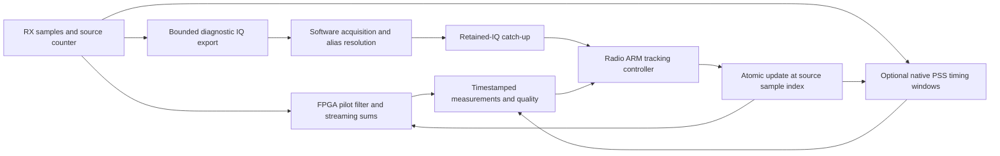

# Timing, frequency, resolution and the next FPGA tracking step

Review date: 12 September 2026. The recommended next milestone is a repeatable,
single-target acquired tracking loop: software acquisition and ambiguity
resolution, radio-local feedback, and FPGA streaming pilot measurements scheduled
against the original sample counter. Partial-band PSS timing should remain an
independent observable and a candidate later addition to that loop.

The report-by-report index is [summary.md](/home/mouse9911/gits/leo-tracker-reduxredux/summary.md).
The review covers the 110 pre-existing Markdown reports under `reports/`,
including untracked drafts, nested receipts, and archived duplicates, plus
supplemental qualification and analysis documents. Three parallel reviewers
covered the August reports; the coordinating reviewer covered September,
cross-checked selected artifacts, and revisited primary literature. This is a
review of retained evidence, not a new scientific qualification. Supporting JSON
and code were checked selectively; the entire generated artifact tree and every
historical firmware branch were not independently replayed.

**A correction to the earlier literature discussion:** the older concept page's
edge-pilot-only description is incomplete for the current report inventory.
There are partial-band PSS experiments at 2.5 MS/s, native-25-MS/s PSS products,
and historical FPGA PSS results. Capturing the complete 240 MHz channel is not
a prerequisite for every useful PSS timing measurement. Which spectral slice,
analog filtering, and sample rate were used still matters.

## What the time and frequency numbers mean

Four quantities must remain distinct: sample spacing, search-grid spacing,
statistical precision on accepted observations, and accuracy against physical
truth. A sub-sample fitted delay is possible; its numerical precision does not
establish a calibrated time of arrival. Similarly, a 25 Hz frequency grid is
neither a 25 Hz measurement uncertainty nor a 25 Hz two-signal resolution limit.

| Quantity | Evidence / value | Interpretation for a tracker |
|---|---|---|
| Frame period | 1/750 s = 1.333333… ms | Nominal opportunity cadence; reception and valid measurements need separate counts. |
| OFDM symbol period | 4.4 µs including cyclic prefix | 11 samples at 2.5 MS/s. |
| Useful OFDM interval / subcarrier spacing | 4.266666… µs / 234,375 Hz | Different from the inverse full-symbol period. |
| Edge pilot | 300 symbols × eight subcarriers per edge, lasting 1.32 ms | A long frequency-estimation aperture available in a narrow spectral slice. |
| Symbol-sampled CFO ambiguity | 1/4.4 µs = 227,272.727… Hz | Maintain the ambiguity class separately from the actual IQ correction. |
| Legacy Standard probe | 20 ms every 25 ms; 2,400 probes per 60 s | A detection/aggregation policy with 80% sample support, not a waveform clock. Older baselines used 20 ms every 50 ms. |
| Local rate support | Examples use 16–75 ms local windows, 20–125 ms continuity ramps, and 50/75 ms scanner windows | A 750 Hz CFO stream does not yield an independent high-precision rate estimate every frame. |
| September native PSS baseline | 125 ms window / 62.5 ms stride; blind anchors every 0.5 s | Aggregation and update cadence, not PSS waveform duration. |
| September PSS candidate | 62.5 ms / 31.25 ms | Promising on one strong recording; not a globally qualified default. |

Sources: [waveform geometry](/home/mouse9911/gits/leo-tracker-reduxredux/docs/concepts/starlink-transmissions.md:85),
[probe comparison](/home/mouse9911/gits/leo-tracker-reduxredux/reports/2026_08_26_20ms_window_comparison.md:51),
[local-rate ladder](/home/mouse9911/gits/leo-tracker-reduxredux/reports/2026_08_23_470384_multiscale_cfo.md:35),
and [native PSS window study](/home/mouse9911/gits/leo-tracker-reduxredux/reports/2026_09_03_9120_pss_window_sensitivity.md:16).

The following rate table is derived geometry, not a list of qualified profiles.
CI16 means two 16-bit components, four bytes per complex sample per receiver.

| MS/s | Sample spacing (ns) | CI16 MB/s per RX | Samples in 1.32 ms pilot | Samples per nominal frame |
|---:|---:|---:|---:|---:|
| 2.5 | 400 | 10 | 3,300 | 3,333⅓ |
| 5 | 200 | 20 | 6,600 | 6,666⅔ |
| 10 | 100 | 40 | 13,200 | 13,333⅓ |
| 15 | 66.667 | 60 | 19,800 | 20,000 |
| 25 | 40 | 100 | 33,000 | 33,333⅓ |
| 30 | 33.333 | 120 | 39,600 | 40,000 |
| 60 | 16.667 | 240 | 79,200 | 80,000 |

Fractional frame timing requires a fractional phase accumulator or equivalent
schedule. Repeatedly rounding 3,333⅓ samples to 3,333 would accumulate error.
Higher sampling rate only adds information if the captured signal bandwidth and
noise support it. Resampling a narrowband recording creates no new bandwidth.

## What frequency coverage we actually have

The historical edge corpus spans the lower and upper edges of Starlink channels
1–4. With the configured 9.75 GHz LNB LO, the documented edge centers run from
10.7096875 to 11.6903125 GHz RF, or 959.6875 to 1,940.3125 MHz IF. These are
channel/receiver coordinates, not measured oscillator calibration. A centered
CH4-lower profile instead tunes 1,709,521,250 Hz IF, 166,250 Hz below the nominal
pilot-band center. The distinction must follow the actual recording binding.
[Tuning geometry](/home/mouse9911/gits/leo-tracker-reduxredux/docs/concepts/starlink-transmissions.md:115),
[centering report](/home/mouse9911/gits/leo-tracker-reduxredux/reports/2026_08_21_edge_pilot_if_dc_centering.md),
[calibration limits](/home/mouse9911/gits/leo-tracker-reduxredux/docs/qualification/frequency-calibration.md).

The eight tones are spaced by 234.375 kHz; their centers extend ±820,312.5 Hz
around the edge-pilot center. The calibration gate budgets a 937,500 Hz occupied
half-span and a further 300 kHz satellite-Doppler guard. At 2.5 MHz bandwidth,
filter placement and residual frequency offset can therefore consume the margin.
Digital correction cannot restore tones already removed by the analog filter.

There is no single universal acquisition grid in these reports:

| Study / implementation | Frequency search | What to retain |
|---|---|---|
| Early Standard parameter study | ±400 kHz, coarse 80 kHz; fine 500 Hz; conditioned 100 Hz | A bounded acquisition policy, with basin suppression affecting recovery. |
| Early dense Research study | ±400 kHz, coarse 10 kHz; fine 100 Hz; conditioned 25 Hz | More hypotheses and cost; fine grid does not imply physical precision. |
| Aug23 comprehensive blind audit | ±1.2 MHz, coarse 40 kHz; fine 500 Hz; conditioned 100 Hz | Independent timing/CFO modes across a full frame; 16 basins. |
| September native-25 PSS artifact | ±1.2 MHz in 200 kHz steps | Broad frequency hypotheses for timing detection, not a finely resolved CFO measurement. |

Sources: [T1 search study](/home/mouse9911/gits/leo-tracker-reduxredux/reports/2026_08_22_t1_glrt_search_parameter_study.md),
[blind audit](/home/mouse9911/gits/leo-tracker-reduxredux/reports/2026_08_23_470384_blind_timing_cfo_comprehensive.md:250),
[native PSS product](/home/mouse9911/gits/leo-tracker-reduxredux/reports/figures/2026_09_03_9120_pss_window_sensitivity/pss-half-62.5ms-31.25ms.json).

GLRT residual FFT grids of roughly 443.9 Hz (512 points) and 55.5 Hz (4,096
points) are also reported. They sample a symbol-rate ambiguity function. They
must not be confused with OFDM subcarrier spacing, acquisition CFO extent, or
the formal uncertainty of a continuous peak fit. Same-IQ replay is still needed
to select the correction lift: one reviewed case gave 400/401 positives on the
correct lift versus 1/401 on a lower canonical representative.
[Alias canonicalization](/home/mouse9911/gits/leo-tracker-reduxredux/reports/2026_08_26_cfo_alias_canonicalization.md).

## Measured precision and its limits

| Evidence | Measured result | Scope |
|---|---|---|
| 2.5-MS/s PSS, 21-dwell study | Recent cohort: GLRT-consistent epoch in 46/60 blocks and 8/10 dwells | Timing agreement within four samples; all ten available PSS CFO-rate intervals across the study included zero (eight recent, one reference, one historical). Independent SSS produced no qualified dwell-rate result. |
| Native-25 PSS, `9120` | 62.5/31.25 ms: 37.823 ns quadratic residual RMS; baseline: 39.550 ns | One selected strong track, 270 observations across a 12.46 s span. Windows overlap; this is neither 270 independent observations nor proof of gap-free lock across the span. |
| PSS timing-derived rate | +2.554584 kHz/s in the shorter-window case | Derived from timing curvature using a nominal 11.2175 GHz RF reference; not a direct carrier-CFO-rate measurement. |
| PSS score weighting | ~4 ns curve movement, +3.8–4.5 Hz/s rate shift | Weighted objective improves itself but ordinary RMS and stability do not improve. `robust_z` is not a calibrated timing variance. |
| Edge-pilot frame CFO, split-symbol check | T01/T06 phase-refined even/odd RMS 42.22/29.40 Hz | Agreement of two estimators on one frame; not physical truth. Broader uncertainty calibration remains incomplete. |
| Selected 50–75 ms pilot rate windows | Roughly 13–28 Hz held-out CFO RMS; some slope errors 77–174 Hz/s | Conditional on supported local windows. Historical missing-time effects invalidate naive global interpretations. |
| Native cabled PSS hardware | Worst fitted timing residuals 8.59/8.31 ns in recorded corrected 60-MS/s runs | Historical cabled relative timing; not live absolute accuracy. |
| Native-25 versus derived-2.5 pilot tracking | Reported 1.48–1.91 ns timing RMS and 1.84–2.72 Hz CFO RMS differences | Selected development intervals and conditional estimator agreement. This review reads the retained branch review; it does not independently rerun that comparison. |

Sources: [multi-dwell PSS/SSS](/home/mouse9911/gits/leo-tracker-reduxredux/reports/2026_08_25_multi_dwell_pss_sss_doppler.md:199),
[PSS timing](/home/mouse9911/gits/leo-tracker-reduxredux/reports/2026_09_03_9120_pss_window_sensitivity.md:46),
[timing-to-rate formula](/home/mouse9911/gits/leo-tracker-reduxredux/reports/figures/2026_09_03_9120_pss_window_sensitivity/run_window_sensitivity.py:344),
[weighting](/home/mouse9911/gits/leo-tracker-reduxredux/reports/2026_09_03_9120_pss_weighted_fit_comparison.md:35),
[frame CFO](/home/mouse9911/gits/leo-tracker-reduxredux/reports/2026_08_24_frame_cfo_estimator_study.md:148),
[local qualification](/home/mouse9911/gits/leo-tracker-reduxredux/reports/2026_08_23_five_dwell_modulo_pi_qualification.md:59),
[hardware and multirate review](/home/mouse9911/gits/leo-tracker-reduxredux/reports/2026_09_12_fpga_branch_review_and_simpler_tracking_plan.md).

For the September PSS record, the persisted source accounts for 917 million
observed and 583 million missing samples out of a 1.5-billion-sample logical
interval. Complete analysis blocks stay within an observed continuity segment.
The excellent selected timing residual is therefore compatible with poor overall
sample retention. Its host/UTC timing brackets are much wider than tens of
nanoseconds. Receiver-relative timing precision cannot be promoted to UTC accuracy.

## Continuity and transport are design inputs

The August 24 investigation supersedes earlier explanations of a roughly
105 ms sawtooth as Starlink scheduling. The observed cadence matches
262,144 / 2,500,000 = 104.8576 ms receiver refills; omitted RF time explains
both timing and frequency jumps. Host-retiming is a diagnostic, not exact
reconstruction of missing samples.
[Refill investigation](/home/mouse9911/gits/leo-tracker-reduxredux/reports/2026_08_24_refill_time_compression_sawtooth.md).

That problem is not universal to the later corpus. The August 25 retrospective
reports 178/178 device-counter-audited streams with no missing samples, while
the August 27 switching study separates clean 2.5/3-MS/s captures from degraded
5-MS/s attempts. Always use the individual capture's evidence.
[Post-refill retrospective](/home/mouse9911/gits/leo-tracker-reduxredux/reports/2026_08_25_post_refill_24h_retrospective/README.md),
[switching report](/home/mouse9911/gits/leo-tracker-reduxredux/reports/2026_08_27_post_refill_edge_switching.md).

The September 12 transport comparison is especially concrete:

| Exact 30 s device-time interval | Single RX, 10 MS/s | Dual RX, 10 MS/s each |
|---|---:|---:|
| Offered CI16 payload | 40 MB/s | 80 MB/s |
| Observed sample time per RX | 30 s | 18.4680448 s |
| Missing sample time per RX | 0 s | 11.5319552 s |
| Retained fraction | 100% | 61.560149% |
| Gap events | 0 | 880 |

This review independently recomputed the interval unions from all 2,289 and
1,410 returned-buffer records respectively, verified adjacent counter gaps
against `missing_samples_before`, and reproduced both results. Dual-RX gaps
were 131,072 samples, or 13.1072 ms each. Sequence numbers correctly skip when
buffers are lost. These were fixed-2.4-GHz transport tests; only metadata was
retained, and they do not qualify Starlink detection, disk writing, or hopping.
[Single-RX receipt](/home/mouse9911/gits/leo-tracker-reduxredux/reports/2026_09_12_rx0_10msps_30s/README.md),
[dual-RX receipt](/home/mouse9911/gits/leo-tracker-reduxredux/reports/2026_09_12_dual_rx_10msps_30s/README.md).

An FPGA correlator placed upstream of a lossy host-IQ export could retain
measurement continuity even when full IQ transport cannot. That is a design
opportunity, not an already qualified property of the current firmware. Sample
counters must count the original source stream; backpressure, internal loss,
retunes, and dropped measurement records must remain observable.

## What has already worked on FPGA

The September branch review is the strongest local hardware starting point.
It reports 192 scheduled native-pilot hardware jobs at 60 MS/s and 750 Hz,
including three exact-IQ manual numerical comparisons. It explicitly leaves
automatic acquired feedback and physical precision unqualified.

The older commissioned image used all 4,400 slices, 72/80 DSPs and 48/60 BRAM
tiles. An isolated newer native engine used eight DSPs and 11.5 RAM tiles, but
an isolated fit is not a complete board fit. Combined acquisition/tracking
designs still failed routing or setup; control and metadata fanout contributed
materially. Older reports named “hardware aligned” concern host CPU execution,
not FPGA synthesis.

At 60 MS/s the 1.32 ms pilot is 79,200 CI16 samples, 316,800 bytes: larger than
the chip's entire 60 × 36-Kbit BRAM budget before any other buffers. Stream its
correlations and moments. The pilot occupies 99% of every nominal frame, so
pilot-only processing is almost continuous work, not a low-duty gated task.
An illustrative 128-byte result at 750 Hz is 96 kB/s, versus 240 MB/s native IQ.

Startup is a separate bottleneck: the reported ARM ambiguity resolver takes
429–446 ms after optimization, excluding loaded ingestion/submission, while
the 32-frame forecast horizon is only 42.7 ms. Retained-IQ catch-up and causal
handoff must be demonstrated. A 2.63 µs correction solve does not fix an old
acquisition epoch. Similarly, an 85.333 ms coarse map, a 256 ms three-map policy,
or two sequential 170.667 ms alias maps cannot all fit inside a 120 ms scan visit.
[Hardware review and evidence links](/home/mouse9911/gits/leo-tracker-reduxredux/reports/2026_09_12_fpga_branch_review_and_simpler_tracking_plan.md).

The hardware review also distinguishes the AD9363's specified 20 MHz analog
bandwidth from the AD9361's up-to-56 MHz capability. A 60-MS/s sample setting or
AD9361-compatible driver identity does not establish the physical chip or its
usable analog bandwidth. These limits should follow verified board identity
and the actual filter configuration in any proposed rate profile.

## Literature reconsidered against this evidence

| Source | What to take from it now | Limit |
|---|---|---|
| [Humphreys et al., Signal Structure of the Starlink Ku-Band Downlink (2023)](https://arxiv.org/abs/2210.11578) | PSS/SSS sequence and frame-structure authority used by the partial-band synchronization experiments. | Generate the reference for the actual captured spectral slice; a full-band sequence sampled naively is not equivalent. |
| [Qin et al., Pilots and other predictable elements (2026)](https://www.nature.com/articles/s44459-026-00075-6) | Exact edge-pilot waveform and additional predictable frame structure; strongest waveform basis for the existing long-pilot estimator. | Full-frame processing gains do not automatically apply to one narrow edge. |
| [Kozhaya et al., Unveiling Starlink for PNT (2025)](https://people.engineering.osu.edu/media/document/2025-08-06/kassas_unveiling_starlink_for_pnt.pdf) | Acquisition/tracking separation, timing/carrier states, innovations, slips and frequency corrections. | Their full-beacon receiver and its noise tunings are not our edge-only receiver. |
| [Qin et al., Maximum Likelihood TOA and Doppler Estimation (2025)](https://radionavlab.ae.utexas.edu/wp-content/uploads/qin_ML_Precise_TOA_PLANS.pdf) | Longer temporal aperture produces much better Doppler estimation. Table II reports 6.34 Hz Doppler and 1.626 ns TOA post-fit residuals for full-frame ML. | Uses payload-bearing full-frame information; post-fit residuals are not a transferable accuracy guarantee. |
| [Qin et al., Timing Properties (2025 preprint; 2026 journal)](https://arxiv.org/abs/2501.05302) | Real transmit timing adjustments and variable jitter justify explicit discontinuity handling. | Does not explain away our receiver-refill artifacts or establish a calibrated transmit-time reference. |
| [Psiaki and Bowman, Tracking of Starlink Doppler Shift and Code/Carrier Divergence using Edge Pilots](https://www.ion.org/gnss/abstracts.cfm?paperID=17070&sessionID=2061) | Particularly relevant: estimates carrier Doppler and timing/carrier divergence separately using SSS and both edge pilots. | As of Sep12 this is an abstract for Sep18, 2026, not a reviewed full paper. Its stated 1.6 Hz strong-dish result uses wideband SSS plus both edges; do not use it as our specification. |
| [Han, Zhou and Shen, Starlink frame synchronization circuit (2026)](https://www.telecomsci.com/zh/article/doi/10.11959/j.issn.1000-0801.2026004/) | Four-way parallel delay correlation, frequency correction and fine frame timing. | Abstract verified; full PDF unavailable in this review. XCZU47DR implementation does not establish fit on our smaller Zynq. No public RTL verified. |
| [MathWorks NR HDL Cell Search](https://www.mathworks.com/help/wireless-hdl/ug/nr-hdl-cell-search.html) | Concrete search/track states, consistent sample counters, frequency feedback, timing windows and timeout/reacquisition. | 5G waveform and cadence; licensed model/toolchain. Borrow architecture, not NR constants. |
| [catkira/open5G_phy](https://github.com/catkira/open5G_phy) | Inspectable Verilog correlator, multiplier reuse, fixed-point widths and cocotb tests. | Archived/unsupported, AGPL-3.0; no established Starlink port. |
| [CTTC GNSS-SDR FPGA architecture](https://navposproducts.cttc.es/products/ip-cores/) | Established division: FPGA carrier wipe-off/multicorrelators, ARM tracking control. | GNSS signal models differ; software is open source but cited FPGA IP is commercial. |
| [JuliaGNSS/gnss-m2sdr](https://github.com/JuliaGNSS/gnss-m2sdr) | An inspectable implementation of per-epoch correlator records and sample-indexed atomic NCO updates. | GPS/Migen/LiteX project, not a verified Starlink solution. Its notes require IQ DMA draining for its observer to receive samples; our desired independence from IQ export must be designed and tested. |
| [Kumar and Kishore, the originally linked 5G PSS/SSS paper](https://www.techscience.com/cmc/v73n1/47754/html) | Supplemental matched-filter/peak-selection background. | Lower priority than our measured bottlenecks and the concrete implementations above; does not establish our tracking loop. |

The code/carrier-divergence abstract is an especially useful new lead. It means
we should not hard-wire timing drift to CFO through a single Doppler factor.
Separate timing and carrier states are warranted; the extent identifiable from
one narrow edge still needs an observability and conditioning check. This also
limits the old `review.md` suggestion that timing drift alone gives a free
unambiguous physical identity test.

## Proposed implementation direction

This is a recommendation inferred from the reports, not work performed here.

1. **Prove the existing pilot loop first at one fixed rate.** Use the retained
   scheduled-native image as the source/packaging reference. Replay acquisition,
   alias resolution, catch-up and feedback with measured delays. A seed supplied
   by an offline oracle is a conditional tracking test, not acquired lock.
2. **Give PSS and pilot measurements different jobs.** Use native partial-band
   PSS as a timing check, initially in software or bounded native windows. Use
   the 300-symbol pilot for frame-local CFO. Compare their timing histories
   without imposing exact carrier/timing equivalence. Adding PSS RTL to an
   already full image is a separately measured composition decision.
3. **Keep the inner FPGA datapath small.** Carrier rotation, waveform/template
   evaluation, prompt and derivative or early/late sums, energy, sample count,
   overflow and continuity status. Keep acquisition alternatives, alias
   selection, uncertainty, multi-frame pooling and loss decisions in software
   initially. Quantities needed for independent diagnostics must survive export.
4. **Treat frame phase as conditional.** Use phase only when its measured
   stability passes. Preserve the observed sign/modulo-π evidence, but allow
   per-frame nuisance phase or noncoherent pooling after failures. Do not force
   a continuous PLL through missing samples or transmitter changes.
5. **Budget feedback against actual source time.** Corrections should apply
   atomically at a specified future source index; stale updates should expire.
   Measure loaded read/solve/submit latency and support loss. Keep radio-local
   feedback independent of workstation Ethernet scheduling.
6. **Qualify rate increases separately.** The old hardware ladder includes
   2.5/5/10/25/60 MS/s; the newer tracker uses 2.5/5/15/30/60. The 10-MS/s profile
   is not automatically present. An 18-clock serial rotator fits 5 MS/s at
   100 MHz but not 10 MS/s. Check full image setup/hold/CDC, transport and
   acquisition at each rate rather than extrapolating isolated engine results.

The first replay cohort should include clean post-refill 2.5-MS/s intervals,
the explicit-gap native-25 PSS case, weak or competing pilot modes, alias-lift
counterexamples, and preserved cabled/native hardware fixtures. Separate records
used for development from those used to assess the result.

Report acquisition success, causal handoff success, every frame opportunity,
valid measurements, loss/reacquisition, timestamp closure, latency, fixed-point
agreement, and held-out timing/CFO residuals separately. Preserve record/session
boundaries in statistical checks. A rolled pilot searched over all timing is
not a valid global negative control: a 17-symbol roll can simply reparameterize
the delay. Use controls outside the searched equivalence class as well as
fixed-hypothesis rolled comparisons.

No published persisted contracts or golden scientific fixtures were changed in
this review. No radios, builds, or new RF collections were started. The desired
next deliverable is evidence that one acquired loop stays causal and accounts
for its losses; calibrated absolute timing, spacecraft identity and navigation
remain separate qualifications.
