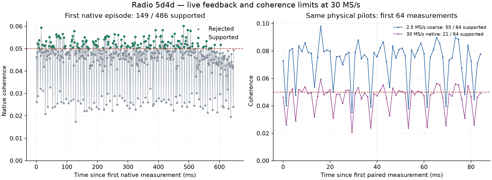

# Radio .20: physical causal startup, native feedback and reacquisition

Radio `192.168.1.20`, serial `1040005e0b100007100010000bf33a5d4d`, is back
online. Both image transitions passed serial, FIT-hash, return and TX-disabled
attestation. The causal-startup probe has now executed on the physical ARM at
both native rates. The 30-MS/s run demonstrates brief supported native feedback
and a fresh acquisition after loss. Neither rate completed the configured
1,500-measurement native episode, so sustained tracking remains unqualified.

| Physical result | 30 MS/s native | 60 MS/s native |
| --- | ---: | ---: |
| Coarse stream used by ARM acquisition/catch-up | 2.5 MS/s | 2.5 MS/s |
| New RF duration | 231.068 s | 228.728 s |
| Acquisition attempts | 200 | 200 |
| Live handoffs to FPGA | 2 | 1 |
| Native measurements retained | 509 | 17 |
| Native measurements passing existing support gates | 149 | 0 |
| Clean returns to acquisition after loss | 2 | 1 |
| Completed 1,500-measurement native episodes | 0 | 0 |
| Reported CDC / pacer drops | 0 / 0 | 0 / 0 |
| Maximum refill gap | 13.711 ms | 11.304 ms |

These are sequential captures of changing RF, not a controlled comparison of
sample rates. Both used LO `1690312496` Hz, RF bandwidth `2500000` Hz, manual
gain 30 and port `A_BALANCED`. Each run was bounded to 294.912 seconds and
200 attempts; together they collected 459.796 seconds of RF. No threshold,
local-correction bound, handoff deadline or loss horizon was relaxed.

## Actual ARM saved-IQ qualification

Before new RF collection, the prepared positive and control recordings were
paced at 2.5 MS/s on the radio's ARM, with no RX buffer or native FPGA jobs.
The positive case reached a fresh handoff in **1,407.092 ms**, with 14,400 coarse
samples (**5.760 ms**) of lead. It accepted all eight initial observations and
113 of 118 observations overall, retaining a 96-observation history. The
control accepted zero observations and rejected in 1,146.443 ms.

Independent review verifies 73,326 integer search scores, sixteen ordering
scores, 34 resolver hypotheses, 126 moment/dense-fit comparisons, exact retained
IQ and the five initial carrier forecasts. This is measured ARM performance,
replacing the earlier host-only timing evidence. It remains a saved-IQ result,
separate from the live results below.

## What happened during live tracking

At 30 MS/s, attempt 5 accepted all 120 retained coarse measurements and handed
off to native tracking. Its native episode spanned frames 1087–1572, or
646.667 ms between the first and last scheduled measurement. Of 486 native
measurements, 149 passed the existing gates. Supported measurements extended
the feedback horizon to frame 1540; the controller stopped exactly at frame
1572, the configured last-supported-plus-32-frame limit.

The capture owner drained and cleared the native path, established a fresh
source epoch, and resumed acquisition. Attempt 10 accepted 115 of 117 coarse
measurements and produced another handoff. Its 23 native measurements were
unsupported. It stopped at frame 1076, exactly 32 frames after the last
supported coarse observation at 1044, then returned to a third source epoch
and continued scanning until the total attempt limit.

At 60 MS/s, one acquisition reached native tracking. Its 17 native measurements
were unsupported; the controller stopped at frame 1085, exactly 32 frames after
the last supported coarse observation at 1053. A fresh source epoch then
resumed scanning. This physically exercises loss recovery at both rates;
only the 30-MS/s run also demonstrates a second successful acquisition after
that recovery.

Acquisition, retained-IQ catch-up and feedback execute on the ARM; scheduled
native moment accumulation executes on the FPGA. The host orchestrates these
bounded tests and performs the independent reviews afterward. These tests scan
epoch/frequency hypotheses at a fixed LO. Autonomous LO revisits and a deployed
refinement service are still unfinished.

## Same-pilot evidence explains the remaining coherence concern

The new probe retained matching coarse IQ for the first 64 native heads across
all episodes, or all heads when fewer were produced. This finally allows a
same-run comparison of the two paths on the same physical pilots.

| Same-pilot diagnostic | 30 MS/s run | 60 MS/s run |
| --- | ---: | ---: |
| Pairs reviewed | 64 | 17 |
| Coarse measurements supported | 55 | 14 |
| Native measurements supported | 21 | 0 |
| Median coarse/native coherence ratio | 1.594 | 1.632 |
| Median coarse/native total energy per sample | 0.510 | 0.485 |
| Median coarse/native matched energy per sample | 0.815 | 0.790 |

The coarse path retains a larger fraction of matched energy than total energy,
so its normalized coherence is higher. The measured ratios are diagnostics for
these captures, not a universal conversion factor or a calibrated replacement
support gate. They also do not prove why every individual native measurement
failed. The figure shows intermittent native support close to the gate, not a
continuous 647-ms stable lock.

## Independent verification and limitations

The complete acquisition reviews pass at both rates. Together they recompute
14,665,200 coarse search scores, 3,200 ordering scores, 6,800 resolver hypotheses
and 3,634 retained measurement fits. They check all 3,200 initial startup jobs,
including 30 causal forecasts, along with retained-IQ overlaps, epoch bindings,
source counters and the global attempt/restart budgets.

All 526 native estimates pass a separate dense numerical recomputation from
the retained FPGA moments and reference rows. Deliberately corrupted frequency
and coherence estimates are refused. Native raw IQ was not retained, so this
check does **not** independently recompute the FPGA moment accumulation or
establish physical estimation accuracy. The native journal review separately
checks descriptor association, ownership, drain/clear and loss horizons.

A host-only oracle optimization moves constant reference-energy calculation
outside its per-sample loop. It preserves every grid value on the saved live
window and passes all twelve coarse component tests, including random, rail,
zero and full-scale coefficient cases against the actual C implementation.
That window's review took 0.516 seconds versus 1.763 seconds before the change;
this is a host review speedup, not an ARM performance improvement. Firmware
worktree commit `0777f62d3` contains only this test-oracle change. The deployed
v11 probe is unchanged, SHA-256
`284b392d5199a58dc82eab0678816b82742e453849915b5dd51e2740c184952a`.

Both operators confirm identical before/after radio identity, preserved
configured RF settings, idle buffers, disabled TX and removal of their own
temporary files. The final resident image is `glrt-iq-tracking-r60000000-v1`,
boot `f685a28f-a5da-47ec-a03e-bfd111d7ab70`.

The next useful work is to diagnose native support using these retained pairs
and qualify any proposed change on separate recordings before another RF test.
Stable native feedback, autonomous frequency revisits and refinement remain
unqualified. Repeating long captures alone would not resolve those gaps.

The [evidence manifest](figures/2026_09_13_radio20_live_causal_feedback/evidence.json)
contains the ARM and live operator receipts, full independent reviews, native
estimates, paired diagnostics, source hashes and oracle test/benchmark receipts.
Original artifacts remain under
`/srv/bulk/leo/glrt-deployment-20260909/radio20-iq-tracking-20260912/`.

