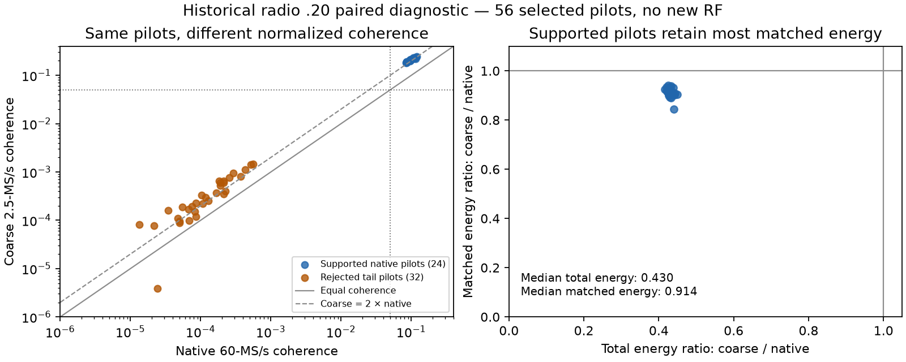

# Radio .20: compare native and coarse measurements of the same pilot

The historical `.20` recording shows why coarse support need not imply native
support at the same numerical threshold. For 24 selected supported pilots
measured at the same times, coarse coherence was a median 2.121 times native
coherence. The coarse path retained a median 91.4% of matched energy but only
43.0% of total energy. Both paths rejected the 32 selected tail measurements
after tracking loss. These observations support investigating path-specific
qualification; they do not calibrate a replacement threshold.

The new ARM diagnostic build also completed a bounded live run at 60 MS/s,
but all 200 attempts rejected before native submission. Therefore this report
contains a new implementation and live capture check, plus a separate historical
paired analysis. It does not claim a new successful native tracking loop.

## Implementation and live check

Firmware-worktree commit `520bb03a95367e255028835c153e78b3f174ba00` retains
coarse IQ corresponding to the first 64 native measurements. Each window
contains 3,333 complex samples at 2.5 MS/s, beginning 16 coarse samples before
`floor(native_start / decimation_ratio)`. Its journal binds the source view,
IQ offset and length to the native sequence, start, phase seed/step, reference
phase, sample count and fault. Total additional IQ is bounded to 853,248 bytes.

The native journal still retains each original head before POP. Paired copying
waits across controller ticks for the capture thread to publish the matching
coarse samples; scheduling does not wait for future IQ. Pending copies have
at most 100 ms after controller termination to finish. Retention failure or
lost/overwritten samples fail qualification. The copies are diagnostic inputs
and do not alter prediction, feedback, support gates or expiry.

All 122 relevant component/operator tests pass. These include synthetic
1,500-measurement handoffs at 30 and 60 MS/s, exact association of the first
64 paired windows, delayed publication, closed/overwritten input, retention
failure and final RF checks after a failed executable. The ARM binary builds
with warnings treated as errors. The tests are distinct from physical evidence.

The actual target is `192.168.1.20`, serial
`1040005e0b100007100010000bf33a5d4d`, resident image
`glrt-iq-tracking-r60000000-v1`, boot
`89459b01-4aeb-4ad1-a01b-4fe065b8ea76`. The bounded profile permits 200 attempts
or 294.912 seconds. This run used receive LO 1,190,312,500 Hz, bandwidth 2.5 MHz,
manual gain 30 dB and A_BALANCED.

It ended after 233.8335376 seconds, returning 584,581,120 complex samples;
final counters include 2,724 additional exported samples at shutdown. It
retained 2,800,000 searched samples and 7,943,200 worker samples. Full raw IQ
was intentionally not retained. All 200 attempts rejected without supported
history; maximum single-pilot ordering coherence was 0.016319. The native
journal contains only its header and `native.coarse.ci16` is empty.

Independent review passed all 7,332,600 grid values, 1,600 ordering scores,
3,400 resolver hypotheses, 1,600 integer-moment/dense-fit comparisons and
3,699,901 overlapping retained samples. Active-epoch CDC and pacer drops
were zero. Maximum refill interval was 11.159 ms. The operator retrieved all
artifacts, confirmed unchanged RF settings and firmware/boot, verified TX-safe
idle state, and removed its
private evidence filesystem. This particular executable exited successfully
because its bounded rejection workload completed; tracking remains unqualified.

## Historical comparison without new RF

The retained September 10 recording at
`native-acquired-controller-20-v3/` has a 240-second coarse stream and a
journal of 10,463 native measurements, 10,431 supported. Its source binding
associates sample zero with native signal-center index 2,921,023,992 and a
24:1 ratio. This analysis rechecked the complete 2.4-GB IQ hash, journal hash,
capture evidence hashes, final source geometry and the journal's ownership,
association and drain. The correspondence is retrospective retained evidence,
not a new radio attestation or an absolute timing calibration.

The historical firmware was `glrt-native-exact-r60000000-stripped-v1`, with
GLS1 native measurements and host-assisted acquisition. Its receive LO was
1,690,312,496 Hz; bandwidth, gain and port were 2.5 MHz, 30 dB and A_BALANCED.
It is a different run and firmware checkpoint from the current GLI1/GLT1 image.

The bounded diagnostic selects 16 evenly spaced supported measurements,
eight weakest supported measurements and the last 32 rejected measurements,
deduplicated to 56 pairs. Every coarse window corresponds to its native pilot
through the retained source mapping. Fixed timing uses the nearest supported
quarter-coarse-sample reference to the actual native start and the same
scheduled carrier frequency. A separate +/-8-sample, four-phase timing search
is retained as a diagnostic; it is not used to redefine support.

Native estimates are independently recomputed from retained moments and a
dense reference-space projection. Native raw IQ is absent, so this does not
independently recompute the FPGA moments. Coarse estimates use the actual
retained IQ, the pinned direct references and a dense real least-squares fit.

| Same-pilot cohort | Native coherence | Coarse coherence | Native / coarse supported |
| --- | --- | --- | --- |
| 24 selected supported pilots | 0.0838–0.1189 | 0.1833–0.2431 | 24 / 24 |
| 32 rejected tail pilots | 0.0000134–0.000555 | 0.00000382–0.001476 | 0 / 0 |

For the supported cohort, median coarse/native ratios are 2.121 for coherence,
0.430 for total rotated energy per complex sample, and 0.914 for the matched
component of that energy. The guarded timing search's best positions stay
within the expected integer start and fractional-phase neighborhood. The fixed
timing fits have delay corrections between -67.4 and 35.7 ns and residual
frequency corrections between -19.5 and 21.5 Hz.

## Relevance to the remaining tracking work

Power coherence is a normalized statistic. The observed path change removes
substantially more total energy than matched energy, so the numerical coherence
increases after coarse filtering. Equal coherence gates across the two paths
therefore need not admit the same signal. This helps explain the plausibility
of the [previous live handoff](2026_09_13_radio20_bounded_arm_scan.md), where
coarse observations passed 0.05 but ten native observations did not.
It does not prove the cause of that particular loss: simultaneous coarse IQ
was not retained for its native measurements.

The stable next step is to qualify native handoff using evidence appropriate
to the native measurement path. A path-specific gate would need independent
controls and held-out signal examples; this selected historical cohort has a
large gap between its supported and rejected cases and cannot establish a
false-alarm rate near a new threshold. No gate, forecast horizon or reference
fixture was changed. The new paired-IQ diagnostic remains ready to capture a
future fresh handoff and distinguish filtering effects from fading or timing.

Supported live native feedback at both rates, autonomous frequency selection,
reacquisition and refinement remain unfinished. The new diagnostic's physical
paired-retention branch also remains unexercised; its exact association is
currently covered by component tests and the historical source comparison.

Evidence root:
`/srv/bulk/leo/glrt-deployment-20260909/radio20-iq-tracking-20260912/`.

- `cpu-live60-paired-lo1190-v1/`: complete bounded rejection run and independent review.
- `historical-paired-coherence-v1.json`: all 56 pair comparisons, timing-search scores, IQ-slice hashes and source identities.
- `analyze_historical_paired.py`: bounded, read-only historical analysis.
- `review_paired_coherence.py`: review tool for the new paired-IQ format; this run returns `no_pairs`, so its numerical comparison branch remains unexercised on new RF.

The [evidence manifest](figures/2026_09_13_radio20_paired_coherence/evidence.json)
retains the actual operator/review records, historical comparisons and hashes.
