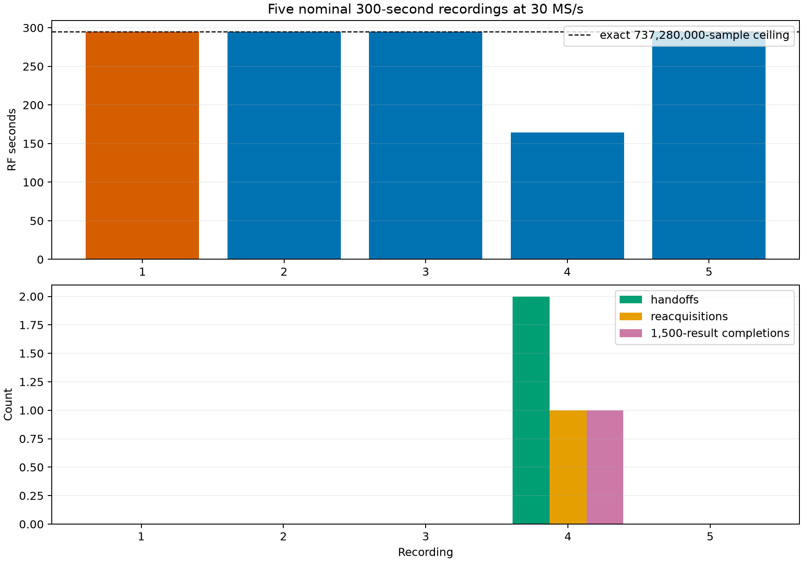
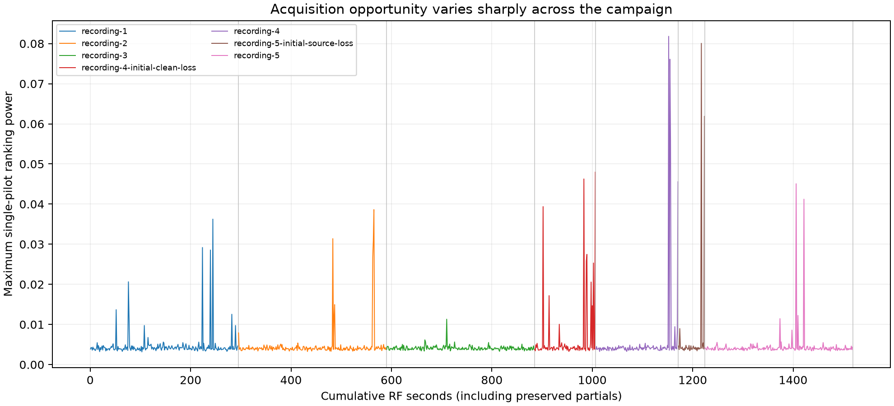
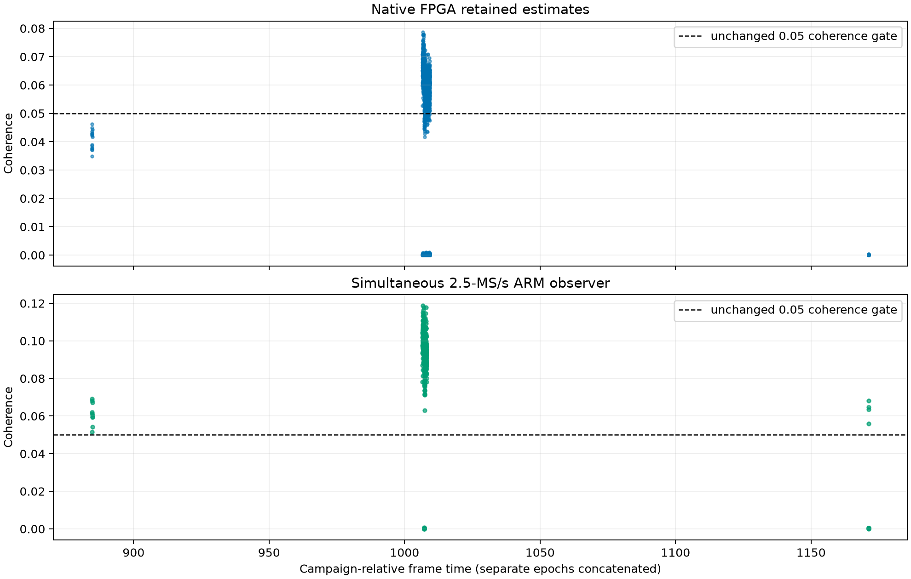

# Five nominal 300-second 30-MS/s FPGA tracking recordings on radio .20

## Result

Five bounded primary recordings were collected from radio `1040005e0b100007100010000bf33a5d4d` on 14 September 2026. Every primary recording had zero active CDC and pacer drops. One recording acquired twice, continued scanning after a clean native loss, and completed a second native FPGA tracking episode of 1,500 scheduled estimates. This proves continuous 30-MS/s FPGA intake, ARM acquisition, native scheduled measurements, clean-loss feedback and bounded reacquisition in one physical run.

Acquisition was not repeatable across the five recordings: recordings 1, 2, 3 and 5 produced no handoff. The result therefore qualifies the 30-MS/s data path and conditional tracking behavior, but it does not yet qualify an always-on tracker. The next work should improve acquisition proposal recall and timing refinement while preserving the current tracking gates.

The requested 300 seconds is a nominal ceiling. The finite profile exports 45,000 blocks of 16,384 samples at 2.5 MS/s, exactly 294.912 seconds of RF. Recording 4 stopped at 164.607 seconds because it reached the configured successful 1,500-result terminal condition. The five primary recordings contain 1,344.255 RF seconds (22.404 minutes). Two preserved diagnostic partials bring the entire authorized campaign to 1,518.921 seconds (25.315 minutes), below the 30-minute repository limit.

## Duty and longest track

“Duty” has three different denominators in this campaign. They must not be combined into one percentage:

| Measure | Calculation | Result | Interpretation |
|---|---:|---:|---|
| Active-capture data completeness | delivered samples / admitted samples, with zero CDC and pacer drops | 100% at counter resolution | The receive path did not report missing samples while each capture was active. This is a transport-completeness result, not wall-clock availability. |
| Nominal campaign RF duty | 1,344.255 / (5 × 300 s) | 89.62% | Four recordings ran to their exact sample ceiling; recording 4 stopped early after successful completion. |
| Exact-profile utilization | 1,344.255 / (5 × 294.912 s) | 91.16% | Uses the executable's realizable ceiling rather than the rounded 300-second request. |
| Time executing native tracking in recording 4 | (504 + 1,500) / 750 / 164.607 | 1.62% | The remaining recording time was acquisition scanning, refinement, reacquisition and setup. |
| Time executing native tracking across all five primary recordings | 2.672 / 1,344.255 | 0.20% | Only recording 4 handed off. |
| Supported native estimates while tracking | 1,290 / 2,004 | 64.37% | This is estimator support, not capture duty. Rejected estimates remain retained evidence. |

The longest uninterrupted native FPGA track was **2.000 seconds**, exactly 1,500 scheduled estimates at 750 Hz. An earlier episode in the same recording lasted **0.672 seconds** (504 estimates), then declared clean loss and returned to scanning. The campaign therefore establishes full sample delivery during active captures and a two-second longest qualified track. It does not establish full-duty tracking over a recording or continuous wall-clock operation.

## Fixed setup and rates

| Component | Location | Rate or cadence | Role |
|---|---|---:|---|
| ADC and FPGA receive path | ADALM-Pluto radio .20 | 30 MS/s | Receives the physical stream and performs native scheduled tracking work. |
| Exported IQ owner | Pluto ARM | 2.5 MS/s complex IQ | Retains bounded rolling IQ and selected evidence; 12 native input samples correspond to one exported sample. |
| ARM acquisition scan | Pluto ARM | one attempt about every 1.2 s; 243–248 attempts in full recordings | Searches retained IQ over delay/frequency, ranks 64 proposals with a 4,096-point FFT, refines them and tests the unchanged history gates. |
| Passive observer | Pluto ARM | every third 750-Hz frame, nominally 250 Hz | Independently measures the acquired trajectory from exported IQ. |
| Native estimator | FPGA/control interface | 750 results/s | Emits one retained estimate per 40,000 native samples after handoff. |
| Feedback/controller | Pluto ARM and FPGA control port | consumes native results at 750 Hz | Applies unchanged support/correction gates, updates history and declares clean acquisition loss when support is insufficient. |

All recordings used RX LO 1,690,312,496 Hz, 30 dB gain, 2.5 MHz analog bandwidth, `A_BALANCED`, and image `glrt-iq-tracking-r30000000-v1`. TX was disabled and powered down. The long selected-IQ profile retained searched windows, grids, journals and bounded observer/native evidence rather than the full continuous IQ stream.

## Primary recordings

| Recording | RF seconds | Refills | Attempts | Handoffs | Reacquisitions | Native supported/results | Observer supported/results | Result |
|---|---:|---:|---:|---:|---:|---:|---:|---|
| 1 | 294.912 | 45,000 | 243 | 0 | 0 | 0/0 | 0/0 | Full capture; acquisition did not qualify. The v1 wrapper returned failure only because it treated clean finite-source cancellation as an error. |
| 2 | 294.912 | 45,000 | 246 | 0 | 0 | 0/0 | 0/0 | Full capture and clean operator result; acquisition did not qualify. |
| 3 | 294.912 | 45,000 | 245 | 0 | 0 | 0/0 | 0/0 | Full capture and clean operator result; acquisition did not qualify. |
| 4 | 164.607 | 25,117 | 134 | 2 | 1 | 1,290/2,004 | 362/372 | First episode lost cleanly after 504 results; autonomous rescan acquired again and completed 1,500 results. |
| 5 | 294.912 | 45,000 | 248 | 0 | 0 | 0/0 | 0/0 | Full replacement capture and clean operator result; acquisition did not qualify. |

The maximum refill gap was 16.061 ms across the primary recordings, with no active source drops. Median scan-and-rank time was about 625–626 ms and the worst observed scan-and-rank time was 641.118 ms. Median refinement worker time was 570–597 ms. The largest worker outlier was 869.220 ms. These are serial stages, so a complete attempt generally spans about 1.2 seconds; they should not be described as a sub-second end-to-end acquisition loop.

Acquisition opportunity varied strongly with time. Recording 4 reached maximum single-pilot ranking power 0.08182 and the initial recording-5 diagnostic reached 0.08007. Full recordings without handoff peaked between 0.01131 and 0.04507. This supports keeping the acceptance gates unchanged while improving how weak, correctly aligned proposals enter the refinement shortlist.

## Tracking and reacquisition evidence

Recording 4 had two native episodes:

| Episode | Native result | Estimates | Supported | Support rate | Meaning |
|---|---:|---:|---:|---:|---|
| 0 | -4 | 504 | 383 | 76.0% | Acquired, tracked for 0.672 s, then declared clean acquisition loss. |
| 1 | 0 | 1,500 | 907 | 60.5% | Reacquired in a new source epoch and reached the configured 2.000-s completion horizon. |

Across both episodes, 1,290 of 2,004 native estimates were supported (64.4%). The simultaneous exported-IQ observer supported 362 of 372 measurements (97.3%). The observer uses a coarser 250-Hz cadence and a different retained-IQ view, so its higher support fraction is useful corroboration but is not a one-for-one native estimator accuracy comparison.

The first diagnostic attempt for recording 4 produced a clean native loss after 16 unsupported results. It exposed that the long profile inherited a short-profile rule preventing another acquisition episode. The repaired long profile allows up to three bounded restarts after a clean `-4` loss while retaining global attempt and time limits. The primary recording 4 then demonstrated that path physically.

The first diagnostic attempt for recording 5 acquired twice, then encountered one partially published native head when the source disappeared. Review records 13 complete unsupported estimates in episode 0 and one incomplete 3,260-sample head in episode 1. The controller returned source loss `-3`; the incomplete head was retained with rejection flags and was not counted as supported. A fresh full replacement recording did not reproduce the source loss. This remains a fault worth monitoring, not evidence of a supported tracking result.

## Expectations comparison

| Expectation | Evidence | Assessment |
|---|---|---|
| Radio identity and TX safety are fixed | Serial, image, LO, RX settings and powered-down TX were checked in every operator receipt. | Pass |
| 30-MS/s input remains continuous for bounded long recordings | All five primary runs have zero active CDC/pacer drops; four reach 45,000 refills and recording 4 exits through its successful terminal condition. | Pass |
| The 64-candidate ARM scanner remains within its per-stage budget | Worst scan-and-rank time is 641.118 ms, below one second; complete scan plus worker attempts are about 1.2 s. | Pass for the scan stage |
| Acquisition hands off whenever usable signal is present | Only one of five primary recordings hands off; the signal opportunity varies and the current shortlist still misses weak peaks. | Not yet qualified |
| Native scheduled measurements execute after handoff | 2,004 native estimates are retained; one episode reaches all 1,500 configured results. | Pass, conditional on acquisition |
| Clean loss returns to scanning and can reacquire | Recording 4 loses after 504 estimates, creates a new epoch, reacquires and completes 1,500 estimates. | Pass for one physical event |
| Tracking is sustained for a nominal 300-second recording | The longest successful native episode is 2.000 s by design. The remaining recording time exercises scanning rather than continuous tracking. | Not yet qualified |
| Evidence is independently reproducible from retained artifacts | Hashes pass; sampled scans reproduce 843,249 integer grid values and 1,472 ranked FFT scores; all 2,033 complete native estimates are recomputed. | Pass within retained-evidence scope |

## Evidence review and limitations

The checked-in analyzer verifies artifact hashes and operator invariants, reconstructs attempt sequences and native epochs, and independently recomputes the first, middle, last and handoff-adjacent selected-IQ scans. It checked 843,249 integer grid values and 1,472 ranking FFT scores. It also recomputed the reported moment-to-estimate transformation for all 2,033 complete native heads across the primary and diagnostic runs, and verified that the single incomplete head was retained only under explicit source loss.

The campaign did not retain the full continuous IQ stream. It retained selected acquisition windows and bounded tracking evidence, so the report cannot rerun an arbitrary new detector over every RF sample. Recomputing retained native moments checks journal decoding and estimator math; it does not independently observe the FPGA's internal arithmetic before those moments were emitted. The evidence qualifies execution and consistency, not Starlink identity, calibrated absolute frequency, or a probability of acquisition.

The firmware change adds the bounded `45000-selected-observer3-scan64` profile, finite-source cleanup handling, clean-loss restart for long profiles, and source-loss-aware native review. The focused tests produced 234 passes and one timing-sensitive `observer_retention` failure under host load; the exact failed case passed immediately in isolation. Machine-readable evidence, the analyzer, JUnit outputs and the build manifest are in [the figure directory](figures/2026_09_14_radio20_five_300s/).

After the campaign, radio .20 was left on the attested 30-MS/s image with all buffers idle and TX disabled. `leo-acquisition.service` was restarted and confirmed active. The production acquisition state returned to `running`, generation 248.
