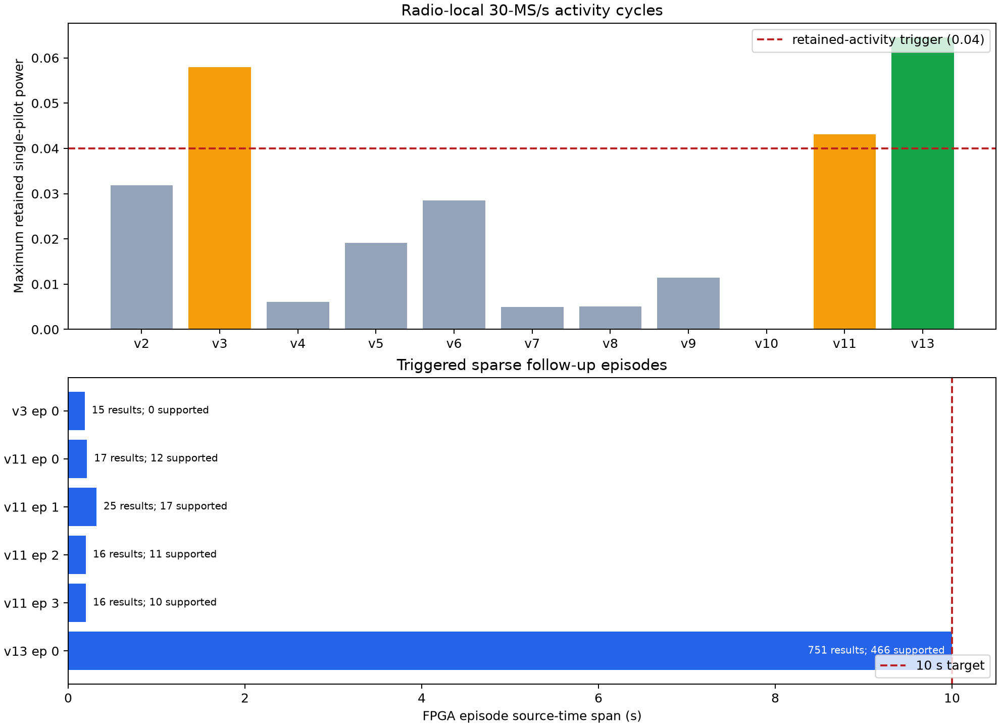
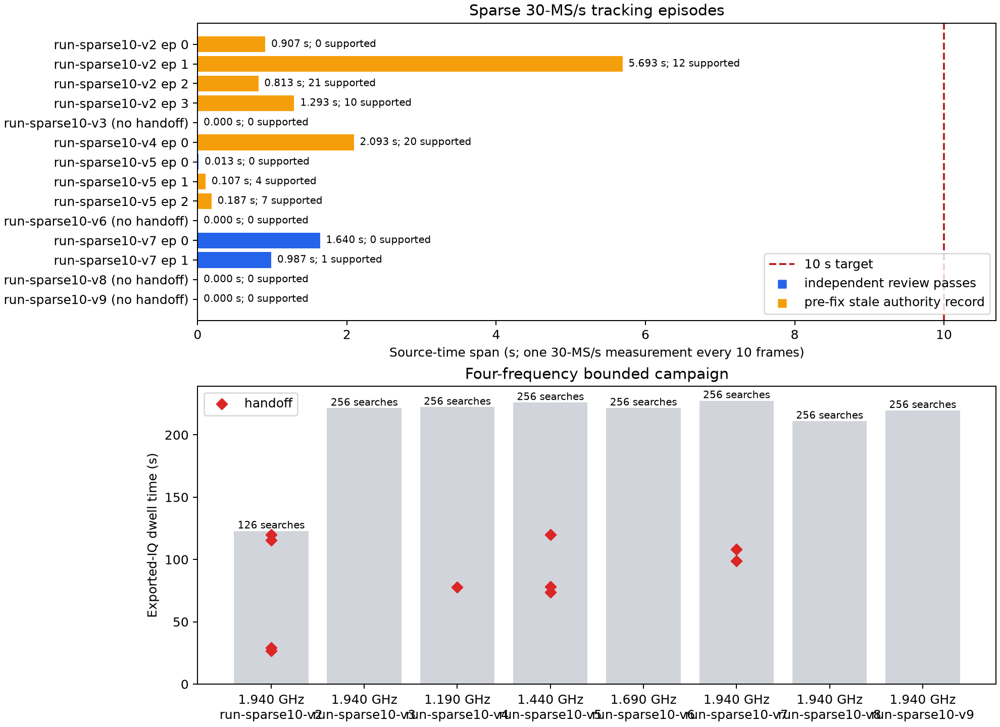
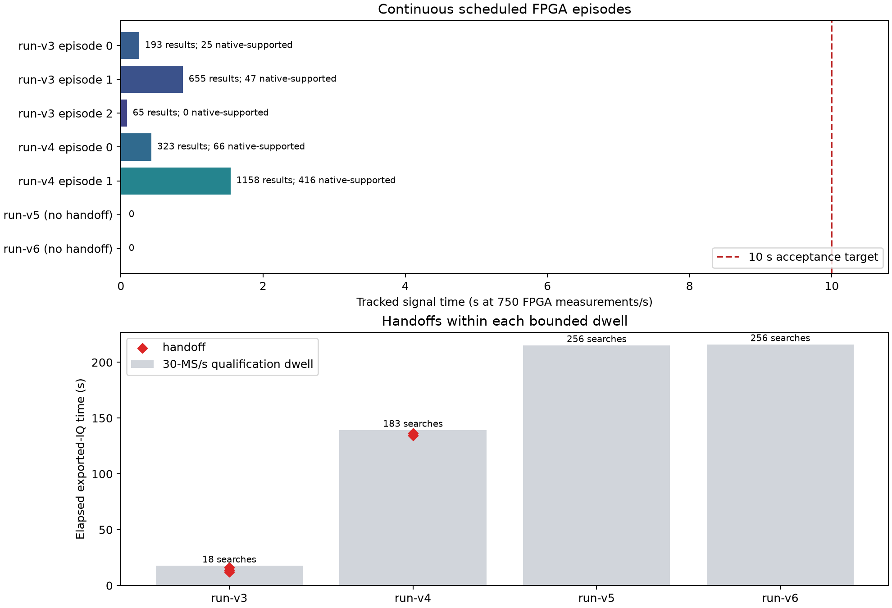

# Coarse-authority 30-MS/s tracking qualification

**Date:** 15 September 2026  
**Radio:** `1040005e0b100007100010000bf33a5d4d` (`192.168.1.20`)  
**Image:** `glrt-iq-tracking-r30000000-v1`  
**Result:** complete 10-second and 30-second physical 30-MS/s FPGA tracking runs pass; the 100-second gate remains open

## Result

Retained 2.5-MS/s ARM observations can now extend the causal scheduling
horizon of existing 30-MS/s FPGA pilot jobs. The implementation preserves a
separate native-result history, retains every authority update before use, and
does not rewrite work already submitted to the FPGA. Synthetic positive and
negative controls pass; the final change passes 368 focused controller,
journal, visit, operator and live-authority tests.

The final activity-triggered v13 run completed all **751** stride-ten FPGA
measurements from frame 1,290 through frame 8,790. That is exactly **10.000
seconds** of scheduled source time; the retained FPGA head starts span
10.000038 seconds. The unchanged native diagnostic accepted 466 results and
rejected 285, while 699 retained coarse-authority refreshes kept future work
scheduled. The controller completed and drained normally with zero capture,
CDC and pacer drops. The independent epoch/ownership and journal reviewers
pass all 751 heads, 64 paired-IQ records, and the final clear.

Before the sparse work, four physical runs exercised the dense path. Two acquired the signal and produced
five FPGA episodes. The strongest episode contains **1,158 consecutive FPGA
results, or 1.544 seconds at the 750-Hz pilot cadence**. Its concurrent ARM
observer supports 124 of 130 measurements, while 416 of 1,158 wider native
diagnostics pass their unchanged gate. Those runs established the dense-path
limit and motivated the sustainable stride-ten cadence used by v13.

The dense 750-result/s experiments also established that ARM/sysfs retention
drains about 96.5 results/s. A dense controller therefore falls behind the
750-Hz source clock even when its wall deadline is extended. Firmware commit
`fc77d57dc` adds an opt-in cadence that measures one pilot every ten 750-Hz
frames. Each pilot still enters the FPGA at **30 MS/s** and contains 39,600
native samples; the scheduled measurement rate is **75/s**. The 751st result is
exactly 10.000 seconds after the first result in source time. The existing dense
profiles and their persisted GLT1 bodies are unchanged.

Eight physical sparse-cadence dwells covered all four reviewed upper LOs. They
produced ten handoffs and 1,040 scheduled measurements. The longest operational
episode contained 428 measurements spanning **5.693 seconds**. Independent
review exposed that the first five dwells sometimes retained a newer coarse
authority when it was 33 frames behind the next descriptor frontier, outside
the predictor's 32-frame bound. No descriptor used that stale record, but those
journals correctly fail evidence review. Commit `627654e9c` now refuses such a
refresh until the next observer update. The corrected CH4 validation produced
two independently reviewable clean-loss episodes spanning **1.640 s** and
**0.987 s**. None of those earlier sparse dwells reached 751 measurements.

The later radio-local activity campaign ran ten admitted cycles after one
lease refusal. Three cycles triggered refinement. The final corrected cycle
proved the complete scan-to-follow-up-to-reacquisition path at 1.9403125 GHz:
224 acquisition attempts produced four native episodes and three clean
reacquisitions. The episodes contained 17, 25, 16 and 16 FPGA results; 50 of 74
native diagnostics passed the unchanged gate, and the longest episode spanned
**0.320 s**. Independent epoch/ownership review passes, all FPGA fault and drop
counters are zero, and the exact radio state was restored. That result exposed
the cadence-alias authority issue fixed before v13.

## Rates and limits

| Component | Rate | Bound or role |
| --- | ---: | --- |
| FPGA receive and scheduled-pilot input | 30 MS/s | 39,600 native samples per 1.32-ms pilot |
| FPGA scheduled measurements | 750 results/s of signal time | 7,500 results define the ten-second target |
| Sustainable FPGA measurement profile | 30 MS/s input; one pilot every 10 frames (75 measurements/s) | 751 measurements span exactly 10 seconds and stay below measured ARM drain capacity |
| Exported IQ and ARM acquisition | 2.5 MS/s | Continuous GLI1 stream in original 30-MS/s coordinates |
| ARM coarse authority observer | 2.5 MS/s, one pilot every 9 frames (83.33 measurements/s) | Up to 1,024 measurements and 12 seconds of source span |
| ARM native-result retention | Measured about 96.5 results/s in run-v4 | Drains FPGA heads through sysfs; it is slower than signal time |
| Long controller wall deadline | 120 s | Time to drain already authorized results; it does not enlarge the ten-second source horizon |
| Whole worker | 300 s | Fixed total bound; operator alarm is 325 s |

The measured run-v4 drain rate projects 7,500 results in about 77.7 wall
seconds, but the source advances ten seconds while ARM drains only about 965
results. Later dense jobs therefore become late before they can be submitted;
the 120-second wall deadline cannot repair that causal backlog.

The sparse profile has about 21.5 results/s of measured drain margin. A
15-frame/50-Hz prototype was rejected before deployment because it leaves only
seven observations in the estimator's 96-frame causal window; the estimator
requires at least eight. Ten frames is the slowest cadence that retains useful
model margin while remaining below the ARM port capacity.

## Sparse-cadence physical runs

| Run | LO | Exported-IQ time | Searches | Handoffs | Longest source span | Evidence review |
| --- | ---: | ---: | ---: | ---: | ---: | --- |
| sparse-v2 | 1.9403125 GHz | 122.887 s | 126 | 4 | 428 measurements / 5.693 s | Fails: retained 33-frame stale authority |
| sparse-v3 | 1.9403125 GHz | 221.413 s | 256 | 0 | none | Clean negative dwell |
| sparse-v4 | 1.1903125 GHz | 222.219 s | 256 | 1 | 158 / 2.093 s | Fails: retained 33-frame stale authority |
| sparse-v5 | 1.4403125 GHz | 225.942 s | 256 | 3 | 15 / 0.187 s | One 2-result journal passes; later journals expose the stale refresh |
| sparse-v6 | 1.6903125 GHz | 221.557 s | 256 | 0 | none | Clean negative dwell |
| sparse-v7 | 1.9403125 GHz | 227.443 s | 256 | 2 | 124 / 1.640 s | **Both journals pass independent review** |
| sparse-v8 | 1.9403125 GHz | 211.019 s | 256 | 0 | none | Clean negative dwell after authority fix |
| sparse-v9 | 1.9403125 GHz | 219.559 s | 256 | 0 | none | Clean negative dwell after authority fix |

The eight dwells total 1,672.040 seconds (27.867 minutes) of exported-IQ time,
inside the 30-minute collection cap.

All sparse terminals were clean acquisition loss rather than controller
deadline. The strongest v2 episode scheduled and drained 428 results without
falling behind source time. Of those, 12 pass the unchanged native diagnostic
gate; most other pilots report low coherence (rejection 64), with 80 also
outside the local timing window (rejection 96). Sparse-v7 retained and popped
all 199 configured results, passed cadence/descriptor/head/estimate
association, drained and cleared the FPGA, and restored the exact serial,
image, buffers and TX-safe state.

## Physical runs

| Run | ARM binary | Exported-IQ time | Searches | Handoffs | Longest episode | Terminal observation |
| --- | --- | ---: | ---: | ---: | ---: | --- |
| v3 | `e579af79…7850cf4` | 17.629 s | 18 | 3 | 655 / 0.873 s | Exposed premature descriptor-horizon exhaustion; final episode reported source loss |
| v4 | `c8a39148…7b78e1d` | 139.218 s | 183 | 2 | 1,158 / 1.544 s | Horizon fix worked; controller reached the old 12-second wall deadline |
| v5 | `480b6c60…cbe174` | 215.135 s | 256 | 0 | none | Clean negative dwell after the 120-second fix |
| v6 | `480b6c60…cbe174` | 216.013 s | 256 | 0 | none | Clean negative dwell after the 120-second fix |

Run-v3 episode lengths are 193, 655 and 65 results. Run-v4 episode lengths are
323 and 1,158 results. Run-v4's final episode ended with a controller deadline,
after all 1,158 configured results had been retained and popped. Its native
journal independently decodes with 416 supported results; the observer records
124 supported measurements out of 130. Runs v5 and v6 completed all 256 bounded
search attempts without creating native work. They are negative signal dwells,
not evidence that an acquired track failed.

All four final GLI1 snapshots pass the capture fault/loss checks. Every operator
record confirms the same serial and image after execution, no enabled IIO
buffer, TX LO powered down, and TX gain at -80 dB. Temporary remote files were
removed. Run-v5's independent epoch/ownership review passes with its empty
native journal. The older review schema deliberately does not classify the
run-v4 deadline as a successful episode; the individual journal and capture
checks are reported without promoting it to acceptance.

## Implementation

Firmware branch `codex/radio20-tracking-qualification` contains:

- `67260ed21`: separate retained coarse authority, immutable submitted jobs,
  reconstructed journal authority, and positive/noise/zero controls;
- `ede05fb9e`: descriptor counts use the newest valid authority horizon,
  including a partial final batch;
- `aa8d4070d`: separates ten seconds of source work from the 120-second ARM
  drain deadline and records both limits accurately;
- `fc77d57dc`: adds the opt-in 75-Hz sparse cadence, explicit retained cadence
  evidence, independent reconstruction, operator admission and ARM profile;
- `627654e9c`: rejects observer authority more than 32 frames behind the next
  descriptor frontier.
- `7593b7f6d`: carries the sparse cadence and 751-result target through the
  bounded multi-visit operator;
- `bb8744243`: adds a radio-local 16-result scout across two to four LOs and
  launches one 751-result sparse follow-up on the first proven signal.
- `ac6984526`: also launches refinement from a retained scan64 activity peak,
  leaving scan80/local-2 and all native tracking gates unchanged.
- `f80841de7`: adds the bounded production operator for one activity-triggered
  cycle, SSD-first evidence, exact restoration and hash-verified RAID copy.
- `ee14bf8ad`: adds a non-RF dry run that validates and prints the exact cycle
  before the radio lease can be claimed.
- `fe11b582c`: lets the selected long child use the existing bounded
  reacquisition path while keeping scouts as single visits.
- `1212d9227`: preserves explicit clean loss after those restarts are exhausted
  and downloads raw evidence before parent-status decoding.

The prior focused suite passes **527 tests**. The sparse change additionally
passes 319 controller/journal/operator checks and all 171 live-probe checks; the
post-review admission fix passes 222 controller/journal checks. The corrected
ARM executable SHA-256 is
`32155cdd3cd376ac23e458b71ae40e2ccfebe55e1fa90321f8f328a695485f51`.

The radio-local composition accepts the opt-in
`sparse10-after-scout16` plan. All scouts share a 60-second deadline. A proven
scout selects its LO, and one sparse follow-up then has a 320-second deadline;
the whole ARM process has a 400-second alarm. Its result JSON distinguishes an
exhausted scan, a started follow-up and a completed 751-result track. It accepts
success only from the child's retained summary after cleanup. Controller,
fork, classification and profile-limit tests pass (220 plus 37 focused cases),
and the cross-built ARM executable SHA-256 is
`fdf8bebec321cf780dd14bcb96adc10363a019f7131d4dada844032b52130c83`.
That exact executable is staged on the attested radio serial at
`/tmp/glrt-cpu-scout-followup-fdf8bebec321cf78`; its remote hash and dynamic
libraries verify, and an invalid-argument preflight exits 2 before IIO access.
The post-deployment buffer is disabled, TX LO is powered down and TX gain is
-80 dB.
Three existing wall-clock-sensitive live simulations failed in one broad run
and passed individually on rerun.

Post-campaign analysis showed why native-handoff-only scouting was too strict.
In the historical scan64 corpus, a normalized single-pilot power floor of 0.04
within the six attempts ending at a handoff covers four of five handoffs. The
new campaign contained 57 such observations in 32 scout children, including 29
observations at 1.4403125 GHz, but no scan64 native handoff. The revised parent
therefore treats one retained power observation at or above 0.04 as an activity
trigger. It then runs the stronger scan80/local±2 sparse child, whose unchanged
resolver and native gates decide whether tracking exists. Activity is never
reported as a completed track. The strict retained-journal parser rejects
missing, duplicated, nonfinite and oversized evidence; the revised focused
suites pass 415 cases. The final ARM binary SHA-256 is
`c5d4528708e1ad4fdc7c2c7cc9712ec145a77d8289c264374908a6e7c6d756de`.
Its staged payload identity and runtime linkage passed, and the physical cycle
restored the bound serial, image, disabled buffers and TX-safe state.

Replaying the new trigger over all 45 physical cycles would have launched
refinement in 22 cycles. Seven cycles had activity at more than one LO. With
the proposed 1.4403-first order, the first selected LO would be 1.4403 GHz in
15 cycles, 1.1903 GHz in five and 1.9403 GHz in two. This replay predicts trigger
behavior only; it cannot predict whether scan80 would complete 751 results.

The next cycle is now a concrete reproducible command rather than a temporary
harness. `qualify_glrt_cpu_radio_local20.py` admits only the reviewed image,
binary, bank, references and upper-edge LOs; proves the 335.1773184-second
worst-case source bound; validates the exact executed scout/follow-up archive;
and rehashes the SSD-to-RAID copy. Its pure operator and controller coverage
passes 239 focused tests. A suggested LO order is 1.4403125, 1.9403125,
1.1903125, then 1.6903125 GHz because the first LO contained 29 of the 57
campaign observations above the activity floor.

The actual dry run passes with that order, the bound radio serial, reviewed
deployment receipt and all three payload hashes. It declares 335.1773184
seconds maximum source time, SSD output
`/srv/postgres-nvme/codex-radio20-authority/activity-followup-20260915-v1`
and the corresponding hash-verified RAID destination. The focused suite now
passes 240 cases. The dry run performed no RF collection and created neither
output path.

## Radio-local scout campaign

The composition subsequently ran on the physical radio in 45 bounded cycles
split across four admitted tranches.
Each cycle visited all four reviewed upper-edge LOs in the order 1.9403125,
1.1903125, 1.4403125 and 1.6903125 GHz. All 180 child scouts ended with status 0,
`worker_complete=1`, six acquisition attempts, no handoff and no native result.
The parent therefore exhausted each plan cleanly and correctly launched no
sparse follow-up.

The children retained 211,900 source blocks, or 1,388.70784 seconds
(23.1451 minutes) of 2.5-MS/s IQ equivalent, across 1,080 acquisition attempts.
The campaign stopped within the 30-minute RF bound. It produced no candidate
track, so it cannot establish the requested ten-second result.

Each tranche's before/after radio attestations are identical: serial and boot identity,
30-MS/s image and FIT hash, every buffer disabled, TX datapaths absent, TX LO
powered down and TX gain at -80 dB. All 2,074 manifest-listed evidence files
were written to SSD and copied to the `radio-local-scout-followup-20260915-v1`,
`-v3`, `-v4` and `-v5` directories beneath
`/srv/bulk/leo/glrt-deployment-20260909/radio20-iq-tracking-20260912`.
Each SSD and RAID SHA-256 manifest matches; the four RAID copies total about
1.2 GB. The `-v2` name records an admission refusal and contains no RF run.
The compact campaign totals are retained in
[`radio_local_scout_summary.json`](2026_09_15_radio20_30ms_authority_tracking/radio_local_scout_summary.json).

## Activity-triggered follow-up campaign

One initial attempt was refused before RF because the normal acquisition
service held the shared lease. Ten admitted cycles then ran from SSD-first
operator paths `activity-followup-20260915-v2` through `-v11`. Seven exhausted
their two- or four-frequency scouts without activity. Cycles v3, v10 and v11
crossed the retained 0.04 activity floor and selected a sparse follow-up. V3
used the original single-visit wrapper and retained one 15-result clean loss.

V10 physically exercised the newly enabled restart path, but its exhausted
loss surfaced as an unrecognized parent result. The operator still restored
the radio, but decoded the parent before retrieving the archive, so the remote
child journals were cleaned without a host copy. This evidence-loss defect is
fixed and covered by the final v11 run.

V11 selected 1.9403125 GHz and retained four independently decodable native
journals. The epoch/ownership reviewer passes all 74 results, all 64 paired IQ
records, three reacquisition transitions and every final zero-drop snapshot.
The four native episode spans are 0.213, 0.320, 0.200 and 0.200 seconds. The
concurrent ARM observer retained 81 measurements. The parent returned explicit
clean loss after the bounded third restart and did not promote the run to a
completed track.

V12 failed before radio attestation or RF collection because its selected host
Python environment lacked the SSH transport dependency. V13 used the reviewed
environment and the cadence-authority fix from firmware commit `9c8ca3952`.
The two scouts at 1.9403125 and 1.4403125 GHz retained activity but no native
handoff; the radio-local parent selected 1.4403125 GHz and launched the long
follow-up. Its 189th acquisition attempt produced one native episode that
completed all 751 measurements without a restart. Independent review reports
466 supported native diagnostics, 285 rejection-code-64 diagnostics, 699
monotonic coarse-authority refreshes, and a 10.000-second frame span. The
successful child processed 27,326 source blocks and returned status 0 with
`worker_complete=1`.

Every complete admitted cycle has matching SSD and RAID manifests. V10 is
explicitly marked incomplete because only its parent stdout and before/after
operator receipt survived. The reproducible cycle summary and plot are
generated by
[`analyze_activity_followups.py`](2026_09_15_radio20_30ms_authority_tracking/analyze_activity_followups.py)
and retained in
[`activity_followup_summary.json`](2026_09_15_radio20_30ms_authority_tracking/activity_followup_summary.json).

## Evidence and acceptance

The four runs were written to NVMe first. All 51 evidence files were then copied
to
`/srv/bulk/leo/glrt-deployment-20260909/radio20-iq-tracking-20260912/authority-track10-30ms-20260914-v1`.
The SSD and RAID SHA-256 manifests match for every file; the 246-MB RAID copy
contains `SHA256SUMS`, and the SSD originals remain in place.

The sparse runs were likewise written to NVMe first and copied to
`/srv/bulk/leo/glrt-deployment-20260909/radio20-iq-tracking-20260912/sparse10-30ms-20260915-v1`.
All 106 SSD and RAID files match by SHA-256. The RAID copy is 684 MB and contains
its reproducible `SHA256SUMS`; SSD originals remain in place.

The complete activity-triggered cycles are stored under matching
`activity-followup-20260915-vN` paths on NVMe and RAID. V11 contains 26 retained
files, and its entire RAID manifest verifies. V13 contains 34 retained child
files; all 38 manifest entries match independently on both SSD and RAID. Its
before/after attestation is identical, including serial, boot ID, 30-MS/s image,
FIT/QSPI hashes, disabled buffers and TX-safe state. V10 has no RAID copy for
the documented pre-fix evidence-ordering reason.

The acceptance gate remains:

1. two repeatable dense episodes of at least 7,500 results/10 seconds, or two
   explicitly sparse episodes of 751 measurements spanning 10 seconds;
2. clean loss and reacquisition;
3. zero active capture, CDC and pacer drops;
4. exact radio and TX-safe restoration.

This campaign establishes sustainable 30-MS/s FPGA scheduling, causal authority
admission, zero-loss capture, clean negative behavior and restoration. V13 is
one qualifying sparse ten-second episode, so the single-run milestone is
**passed**. The stated acceptance gate asks for two repeatable episodes, so the
repeatability gate remains open until a second independent 751-result run.

The next stable step is analysis and replay of v13, followed by one independent
repeat rather than changing the native diagnostic threshold. The physical
system now scans, selects an LO, acquires, schedules 30-MS/s FPGA measurements,
uses retained ARM history through native cadence gaps, and drains a ten-second
run without host feedback. Native support is 62.1% in v13; that remains useful
signal-quality evidence and is not relabeled as 100% continuous RF support.

The figure and `summary.json` are regenerated by
[`analyze.py`](2026_09_15_radio20_30ms_authority_tracking/analyze.py) from the
original hash-verified RAID evidence. The sparse figure and
`sparse_summary.json` are regenerated by
[`analyze_sparse.py`](2026_09_15_radio20_30ms_authority_tracking/analyze_sparse.py)
from the sparse RAID evidence.

## Thirty-second extension gates

Later bounded cycles tested the path from the proven ten-second result toward
the requested 30- and 100-second profiles. Cycle v28 used immediate scout
handoff at 1.1903125 GHz. The follow-up retained four clean episodes with 43,
293, 550 and 41 FPGA results. Their longest source-time span was 6.588 seconds.
The simultaneous 2.5-MS/s observer accepted 916/927 measurements, while the
30-MS/s path supported 352/927. All four native journals independently decode,
all configured heads were popped, and every final snapshot has zero FPGA, CDC
and pacing faults. Both SSD and RAID manifests pass.

V28 also exposed a cadence problem: the nine-frame observer and nine-frame FPGA
schedule stayed separated by the descriptor queue's fixed lead. A short run of
unsupported observations therefore reached the unchanged 32-frame prediction
horizon. Firmware commit `0c35e896b` adds separate stride-ten 30- and
100-second profiles while preserving the stride-nine profiles for evidence
replay. The new profiles request 2,251 results for exactly 30 seconds and 7,501
for exactly 100 seconds. The profile, visit and serial-bound operator tests pass
259 focused cases; the Cortex-A9 v16 payload SHA-256 is
`74f19c399fa4a0e138adb8822864d8374f6d57585295e4718e5d0643aca67335`.

Physical cycle v29 selected 1.9403125 GHz and exercised four stride-ten
episodes. They retained 892, 946, 925 and 474 FPGA results, spanning 11.880,
12.600, 12.320 and 6.307 seconds. Native support was 747, 135, 845 and 467;
the observer supported 3,584/3,595 measurements and retained 3,036 monotonic
authority refreshes. This doubles the previous longest 30-second-profile
episode but does not complete the required 2,251-result run. Independent epoch
and ownership review passes all 3,237 results and all four clean reacquisitions.
Every final snapshot again has zero FPGA, CDC and pacing faults, both manifests
pass, the exact serial was restored, and the acquisition service is active.

The remaining stop is now specific. The observer can reject two or three
measurements while the FPGA queue is already about 27 frames beyond the last
supported authority. The next stride-ten descriptor then lies 36--39 frames
after support and is correctly refused by the 32-frame horizon. The next
implementation gate is an explicit profile-scoped coast window, initially 64
frames (85.3 ms). It must leave every existing profile at 32 frames, persist the
selected horizon in each native journal, and pass independent review plus
synthetic one-, two- and three-miss cases before another physical 30-second
run. The 100-second run remains gated on one complete, clean 30-second result.

V28 and v29 are retained under matching NVMe and RAID directories named
`activity-followup-20260915-v28` and `-v29` beneath the established deployment
root. Their manifests contain 30 and 41 entries respectively and verify in
both locations.

Firmware commit `30683eb4b` implemented that 64-frame coast for only the new
30- and 100-second profiles. It retained the 32-frame behavior and journal
format for every earlier profile, added an explicit horizon to the new cadence
record, and made the independent reviewer enforce it. The focused predictor,
observer, controller, journal and live-profile suite passed 408 tests; 271
visit/operator tests also passed. In the expanded live suite, 491 tests passed
and the existing load-sensitive scan80 timing case passed when rerun alone.

Physical cycle v32 selected 1.1903125 GHz. Its three native episodes retained
144, 1,101 and 166 results, spanning 1.907, **14.667** and 2.200 seconds. The
middle episode supported 710 native diagnostics and 1,215/1,222 observer
measurements. It ended after four consecutive observer rejections: the last
retained authority was frame 12096, the committed FPGA frontier reached 12156,
and frame 12166 was 70 frames beyond authority. A supported observer result at
12141 arrived only after the controller had begun draining. This is longer than
v29's 12.600 seconds, but it does not meet the 2,251-result gate. Independent
epoch review passes all 1,411 results and three reacquisitions. Every final
snapshot has zero FPGA, CDC and pacing faults; both SSD and RAID manifests pass.

Commit `5d62b7533` bounds the long-profile coast at 96 frames, equal to the
existing retained trend fit window, and preserves review of the persisted
64-frame journal. Cycle v33 selected 1.6903125 GHz but encountered much weaker
activity: its two episodes retained 70 and 139 results, with one supported
native diagnostic in each, and spanned 0.920 and 1.840 seconds. The observers
supported 68/73 and 142/148 measurements. Independent review passes all 209
results and two reacquisitions with zero FPGA, CDC and pacing faults; both
manifests pass and the exact radio was restored with acquisition active.

The 96-frame trial did not complete 30 seconds, and a wider coast would merely
increase extrapolation without addressing the measured race. The stable next
step is offline replay and profiling of v32's retained IQ to reduce the
observer-to-authority delay and to keep the authority update ahead of the
descriptor frontier. The 100-second run remains gated on one independently
verified 2,251-result, exactly 30-second run.

Timing analysis of v32 and v33 shows the nine-frame passive observer operating
at its source-time limit: its mean interval is 12.00 ms, median is about
12.99 ms and p95 is about 13.8 ms, while nine pilot frames provide exactly
12 ms. Firmware commit `6befc76cf` therefore preserves the proven nine-frame
acquisition bootstrap but aligns only the long-profile passive observer with
the stride-ten FPGA schedule. That provides 13.33 ms per observer result and
reduces ARM load by ten percent. The combined component and operator suite
passes 692 tests; a further 271 serial-bound operator tests pass after the ARM
payload is hash-pinned.

Physical cycle v34 used that cadence-aligned payload, but none of its four
scouts crossed the retained-activity trigger. It correctly performed no
follow-up and is not evidence for or against the cadence change. All 45 SSD
and RAID manifest entries pass, radio identity and TX-safe state were restored,
and acquisition is active. Commit `d6dc86951` adds publication, application
and latency timestamps to each subsequently retained coarse-authority record,
so the next signal-bearing run can separate observer computation delay from
controller polling delay without changing scheduling authority.

Cycle v35 selected 1.1903125 GHz and exercised the timestamped cadence-aligned
path. The RF interval was weak: its two episodes retained 12 and 15 FPGA
measurements, spanning 0.147 and 0.187 seconds, with one and six supported
native diagnostics. Their passive observers supported 3/6 and 6/9
measurements. Seven coarse-authority applications measure 0.471 ms mean,
0.423 ms median, 0.580 ms p95 and 0.616 ms maximum publication-to-application
latency. This rules out controller polling as the material delay seen in v32.
Both journals pass independent epoch and ownership review, all FPGA, CDC and
pacing counters are zero, all SSD and RAID manifest entries pass, and the
radio and acquisition service are restored.

The evidence now separates two cases. V32 demonstrates a strong 14.667-second
episode where a 96-frame fit-window coast would bridge the measured
four-rejection burst. V33 and v35 demonstrate weak intervals where neither a
larger coast nor faster authority application can create truthful RF support.
Further RF retries in the same window would be an uninformative campaign. The
next engineering task is to use the retained observer and scan IQ to qualify a
reacquisition/continuity state machine: preserve the bounded Doppler model and
track identity across explicitly marked unsupported gaps, reacquire with the
existing gates, and report supported duty separately from scheduled coverage.
The exact 30-second single-episode gate remains unmet, so no 100-second RF run
has been launched.

Firmware commit `8d3e3e627` implements the first bounded continuity controller
without changing any published single-follow-up profile. The new
`continuity30-after-scout16` plan permits three scan/segment rounds. Each round
uses the existing four-LO FPGA/ARM scout followed by a 7,500-refill segment
that retains the exact 2,251-result gate but returns to the parent on its first
verified clean loss. Three worst-case four-LO rounds account for 670,629,888
source samples, or 268.252 seconds at the retained 2.5-MS/s coarse-IQ rate,
below the previous plan's 335.177-second ceiling. Direct state-machine tests
cover completion after rescan, three clean losses and three empty sweeps with
contiguous evidence numbering. The wider controller, observer, solver,
transport and journal suite passes 1,882 tests. The Cortex-A9 v21 payload is
hash-pinned as
`80723a8562148641ceea41895281144dfc2a0dc7f3450b906f80553829c56dc7`.

Physical cycle v36 validates the new transition path. It completes three scan
rounds and three clean-loss segments in seven child visits. The first two
rounds select 1.1903125 GHz; the third rescans through that LO and selects
1.9403125 GHz. The segments retain 14, 45 and 306 FPGA results over 0.173,
0.587 and 4.067 seconds. Their native supported counts are 0, 0 and 140; the
passive observers accept 5/8, 34/40 and 204/249 measurements. Independent
epoch and ownership review passes all three journals. Commit `461a70867` adds
an independent decoder for the parent transition journal; it verifies all
three scan/segment transitions, seven contiguous evidence visits and the
469,303,296-sample executed-plan ceiling. Both SSD and RAID manifests verify,
all retained boundary and native final snapshots have zero FPGA, CDC and
pacing faults, radio identity and TX-safe state match before and after, and the
acquisition service is active.

V36 proves autonomous frequency rescan and reacquisition, including a change
of selected LO, but its RF interval is weaker than v32 and does not extend the
14.667-second record. Short segments are intentionally not accumulated toward
the qualification gate. The next informative physical action is one bounded
continuity run during a stronger signal interval; a segment must independently
reach 2,251 results before the 7,501-result 100-second run is admitted.

Cycle v37 evaluates complete-LO activity ranking. Its first round records
qualifying powers of 0.0369 at 1.9403125 GHz and 0.0786 at 1.4403125 GHz, then
correctly selects 1.4403125 GHz. That segment acquires but retains only 15 FPGA
results before clean loss. The second round records 0.0297, 0.0613 and 0.0180
at three LOs and correctly selects 1.9403125 GHz. By then the selected activity
is stale: scan80 uses 62 attempts and all 7,500 refills without a handoff. This
exposed a typed-status defect: a finite no-handoff child has
`worker_complete=0`, but the parent originally required one and mapped the
otherwise valid `NO_TRACK` to a run failure. The first independent transition
review also compared that mapped parent result directly with the raw child
outcome. The radio was still restored correctly. The corrected reviewer passes
both ranked transitions and the recovered immutable evidence is published as
116 verified files on SSD and RAID with a separate recovery receipt.

Commit `3d206cb9c` fixes finite `NO_TRACK`, maps raw child failures correctly in
the independent reviewer, and ensures a future review failure is recorded and
published to RAID before the operator returns an error. It also adds
`continuity30-fresh-after-scout1`: one scan64 attempt per LO, selection of the
strongest recent isolated activity, and at most sixteen scan80 refinement
attempts before rescanning. A successful handoff still has all 7,500 refills
and the unchanged 2,251-result requirement. The focused profile, controller,
operator and reviewer suites pass 383 tests; the separately rerun load-sensitive
scan80 case passes. The Cortex-A9 v23 payload is
`079e70f769d31a457bed789402fd8cc0fca30815693a312dc3a62709ddd412a3`.

Physical cycle v38 completes three four-LO rounds in twelve contiguous
one-attempt scout visits but admits no segment. Its retained evidence corrects
the initial interpretation: the strongest values recur at 1.9403125 GHz
(0.0372--0.0431) with isolation ratios of 13.4--15.1, so they do satisfy the
unchanged activity gate. The new scout profile measured these events correctly,
but the parent activity parser recognized only the older scout profile name and
discarded them. Independent transition review and both manifests still pass;
all boundary fault counters are zero and the radio is restored. Commit
`8df05772a` adds the missing dispatch and a child-level regression that decodes
the retained worker file and exposes its activity to the ranked parent. The
Cortex-A9 v24 payload is
`75b30ff21ba099fc0f787f4dcb0616825adb098b157b82052f930a0ba9193407`.

Physical cycle v39 verifies that correction. Round zero scans all four LOs,
selects the only qualified recent activity at 1.4403125 GHz (0.0499), and its
bounded sixteen-attempt scan80 refinement returns typed `NO_TRACK`. Round one
has no qualified activity. Round two selects 1.6903125 GHz (0.0693) and also
returns `NO_TRACK` without promoting a weak acquisition to FPGA tracking. The
parent accounts for fourteen visits, two segments and a 547,749,888-sample
executed ceiling. Its first independent review correctly fails closed and the
operator still publishes all evidence to both stores. The failure exposes two
review-only assumptions: segment-bearing rounds need not be contiguous, and
the attested AD9361 LO may round by two hertz within the controller's existing
16-Hz tolerance. Commit `f0bcebb8b` corrects both and adds regression cases.
The recovered review passes both transitions and all 160 SSD/RAID manifest
entries verify. Radio identity and TX-safe state match before and after and
acquisition is active.

V39 proves the complete fresh scan/refinement negative path, including skipped
activity rounds, without lowering acquisition gates. It did not produce a
native handoff, so v32 remains the strongest tracking evidence and the exact
30-second and gated 100-second qualifications remain open.

Retained-moment reconstruction gives a more specific result for the second
refinement. Attempt 3 at 1.6903125 GHz resolved a coherent branch near
332 kHz CFO and accepted 67 of 72 scheduled measurements; 66 entered the trend
history. It still returned `GLRT_WORKER_HISTORY` because only seven accepted
points remained inside the unchanged 96-frame trend window after recent
rejections at frames 558, 603, 612 and 630. Eight recent points are required.
At that decision the best descriptor inside the unchanged 32-frame forecast
horizon was also about 1.32 million coarse samples (528 ms) behind the live
receiver, versus the required 12,500-sample future lead. Lowering the history
count alone therefore cannot make this candidate admissible.

This changes the next engineering step. The retained v39 evidence should first
drive an offline prior-guided reacquisition experiment: carry the supported
timing/CFO state only as a search prior into the next retained 14,000-sample
scan, resolve a fresh local candidate from those actual samples, and require
the existing eight-point support and 32-frame handoff checks again. If that
reduces the full scan/ranking delay while rejecting controls, implement it as
an opt-in refinement path and exercise one bounded physical 30-second gate.
Only a complete independently reviewed 2,251-result episode admits the
7,501-result 100-second run. Further immediate RF retries before this replay
would add little information.

Firmware commits `4897fc631` through `30bd9ce84` implement that replayed
design as the opt-in `continuity30-prior-after-scout1` profile. A previous
measured trend can only center a fresh circular timing search over eight
coarse epochs; the selected point is still the maximum of newly computed
11-frequency-row evidence. The resolver then evaluates four complete pilots
over a two-sample timing radius, reducing its FFT count from 68 to 20, and
the worker must rebuild at least eight supported measurements before the
unchanged 32-frame live handoff gate. The prior cannot directly create an
FPGA descriptor. On a clean post-handoff loss, the profile now retains the
joined passive observer history as the same search-only prior, rebases the
source into a new hardware epoch, and attempts fresh reacquisition within the
same 49.152-second segment.

Saved v39 IQ validates the local computation against the full algorithms. An
eight-sample local coarse search selects the same grid maxima as the global
scan in attempts 4, 5 and 7. For attempts 4 and 5, the two-sample four-pilot
resolver selects the identical best timing/CFO hypothesis as the 17-shift
resolver while using 20 rather than 68 FFTs. The focused validation passes
277 resolver/coarse/trend/seed/worker tests, 258 visit/operator/reviewer tests,
and an isolated end-to-end synthetic test that performs the local scan,
20-FFT resolver, rebuilt history, handoff and all 1,500 scheduled results.

Physical cycle v41 stopped at strict host decoding after the ARM parent omitted
the new activity-policy field; radio state and acquisition were restored and
its five-file pre-review record was hash-verified from SSD to RAID. Commit
`603f50b83` fixes that identity only. Cycle v42 then passes the independent
transition review and both storage manifests. It selects 1.4403125 GHz,
hands off on its second refinement attempt and retains **1,233 exact FPGA
results**, or **16.44 seconds** at the 75-Hz stride-ten measurement cadence.
This exceeds v32's 1,101-result/14.67-second record. The episode ends in a
clean supported-history loss with 11 recent supported measurements. Because
handoff preceded the bootstrap-history failure, the new prior-local branch was
not invoked; this observation motivated the bounded post-loss rebase in
`30bd9ce84` rather than any relaxation of support thresholds.

Cycles v43 and v44 use that post-loss payload and each complete three four-LO
scan rounds with no activity above the unchanged isolation gate. Both perform
zero tracking segments, pass independent transition review, verify SSD-to-RAID
publication and restore the exact radio with acquisition active. They therefore
do not test the physical restart branch. The next informative run is another
bounded activity-triggered cycle with this same payload. It must first show a
prior-local scan after a clean native loss and then independently retain all
2,251 results in one uninterrupted 30-second episode. The 7,501-result
100-second profile remains gated on that result.

## Verified 30-second gate and direct 100-second follow-up

Cycle v45 confirms that activity on the separate `003a` receiver is not a
reliable trigger for radio `.20`: all twelve `.20` scouts remain between
0.00358 and 0.00458 despite a contemporaneous `003a` detection. Firmware
commit `4990f28b3` therefore adds an opt-in, same-radio wait profile. It keeps
the one-attempt four-LO scout on `.20`, permits at most twelve scan rounds and
three 30-second segments, and has a 900-second wall cutoff. Its four-LO
worst-case source budget is 630.640 seconds. The selection and transition
reviewer attests these limits rather than inferring them from process exit.

Cycle v46 passes the exact 30-second gate on its first scan round. The
1.4403125-GHz scout has peak isolated pilot power 0.08567; the other three LOs
remain below 0.00403. The retained-activity transition hands off on its first
refinement attempt and completes exactly **2,251 scheduled FPGA results** in
one native episode with zero reacquisitions. The concurrent observer records
2,251 measurements spanning 30.001183 seconds, accepts 2,247, and has median
coherence 0.10256. The native terminal is clean and complete. Independent
continuity review passes all five child visits and the 223,543,296-sample
executed-plan accounting. SSD and RAID manifests both verify, post-run radio
identity and TX-safe state match, and acquisition is restored active. This is
the required uninterrupted 30-second 30-MS/s result and supersedes v42's
16.44-second record.

The first separately launched 100-second cycle, v47, sees no qualified
activity on its two longer scouts and correctly starts no follow-up. Firmware
commit `40bb12f1a` removes this launch gap with
`sparse100-wait12-after-scout1`: quick same-radio scans select activity and
enter the existing exact 7,501-result 100-second tracker in the same process.
It permits one long follow-up and has a 1,200-second wall cutoff; with two LOs
its worst-case source budget is 536.504 seconds.

Cycle v48 verifies that combined transition but does not complete tracking.
Its first round selects 1.9403125 GHz from a 0.02987 scout peak. The long
refinement produces two native episodes of 61 and 183 results, or about 0.81
and 2.44 seconds at 75 Hz, before acquisition loss. Across both episodes it
retains 244 FPGA results; the passive observer accepts 225 of 233 measurements
over 7.556 seconds. The worker then exhausts its bounded 256 attempts. This is
real partial tracking evidence, not a 100-second result.

The successful v46 trigger was 2.87 times stronger than the v48 trigger.
Firmware commit `010e545e5` consequently makes a narrow, profile-specific
change: only the 100-second wait profile requires scout peak power of at least
0.05. Other discovery and tracking gates remain unchanged. Cycle v49 scans
both LOs for all twelve rounds. Its maximum peak is 0.04669, so it correctly
uses no long follow-up. All 24 boundary visits, the 603,979,776-sample executed
budget, SSD and RAID manifests, and radio restoration pass independent review.

The wait-to-100 implementation and reviewer pass 288 focused tests and the
Cortex-A9 build with warnings treated as errors. A wider CPU run passes 739
tests; one unrelated load-sensitive scan80 noise test times out at its
30-second test deadline on two reruns. The deployed v31 payload is pinned as
`41973ca0c22b3a1313ae984eaba14695021a0827fde38a4612973db3e0566a34`.

The stable next action is another bounded v49-equivalent cycle during a
stronger `.20` interval. No host-side trigger or relaunch is required. A scout
at or above 0.05 will transition immediately to the existing 100-second
tracker; success requires exactly 7,501 results in one completed native run.
If another above-0.05 trigger produces only short native episodes, the retained
IQ should be used to diagnose support loss before changing any acceptance
gate or running another RF cycle.
