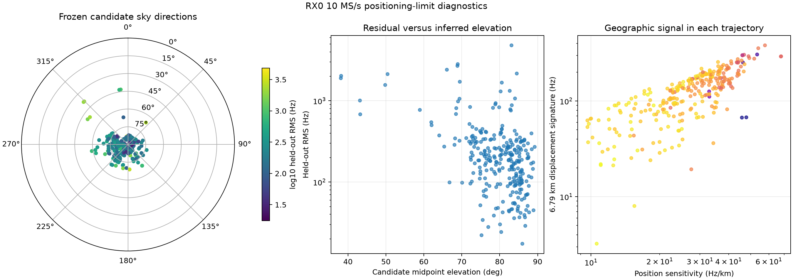
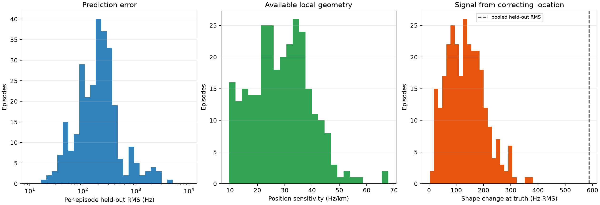
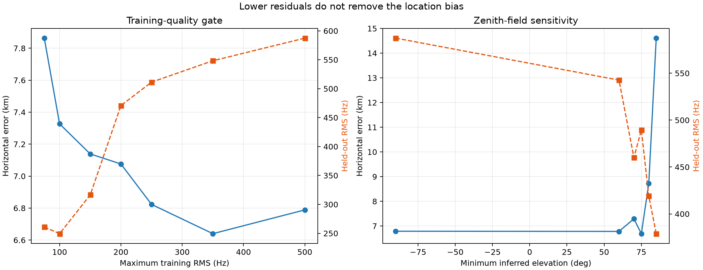

# Working backward from the RX0 10 MS/s detection and positioning limits

Date: 2026-09-15 UTC

Corpus: 47 sealed RX0-only 10 MS/s scanner recordings from 2026-09-14
15:30:12–23:20:12 UTC

Scientific status: retrospective diagnosis using frozen RF tracks and blind-fit
candidate identities; no new RF and no confirmed satellite identity

## Finding

There is no single detection limit. The system currently has five distinct
decision layers, and each has a different bottleneck:

| Layer | Present evidence | Main limit |
|---|---|---|
| Retain IQ | 95.2415% median source-counter duty | Not limiting this cohort |
| Online GLRT feedback | 69.50% of complete visits called detected | Runs on decimated 2.5 MS/s and is adaptive/correlated; not calibrated probability of detection |
| Offline GLRT trajectory | 647 eligible tracks; median 27.96 s support | Only one 20 ms probe per 120 ms visit; association across sparse visits |
| PSS acquisition | 149/376 native-10 candidates versus 53/376 derived-2.5 | Pilot-only controls also pass; false-positive rejection, not bandwidth, blocks a detection claim |
| TLE identity | Median track leader held-out RMS 110.55 Hz; 94.1% retain rank one | Radio-polynomial controls still win; no calibrated association rate or capture-bound beam model |
| Blind location | Correct continental basin; 6.79 km final error | Correlated orbit/time/CFO/model error, not independent sample noise |

The dominant limit depends on the intended output. For **finding waveform
candidates**, native 10 MS/s bandwidth helps, while sparse probe allocation and
false-positive rejection limit useful detections. For **naming a spacecraft**,
the missing antenna field-of-view authority and failure against radio-only
controls are central. For **estimating receiver location**, the several-kilometre
floor is dominated by correlated Doppler-model error; neither a lower RMS gate
nor a narrower zenith field removes it.

## Working backward from the 6.79 km location miss

The [position-convergence study](2026_09_15_rx0_10msps_position_convergence.md)
ends at 37.905555° N, 122.428079° W, 6.789 km from the evaluation site. This
extension freezes its 286 selected catalogue hypotheses and asks how much each
trajectory changes when moving the receiver from that estimate to the site.

The median local Doppler-shape sensitivity is **28.72 Hz/km**; its 10th–90th
percentile range is 14.46–41.51 Hz/km. Correcting the complete 6.79 km error
changes the per-segment, offset-centred predicted shape by **151.16 Hz RMS**.
The actual pooled chronological held-out residual is **587.42 Hz**—3.9 times
the geographic signal being recovered.

| Backward diagnostic | Result | Interpretation |
|---|---:|---|
| Location correction under test | 6.789 km | Distance from blind result to evaluation site |
| Median trajectory sensitivity | 28.72 Hz/km | Geographic Doppler curvature available after removing a constant offset |
| Shape change between estimate and site | 151.16 Hz RMS | Signal that distinguishes the two positions |
| Pooled held-out residual | 587.42 Hz RMS | Includes long-tailed model/association error |
| Conditional linearized axes | 0.86, 1.47 km | Noise-only model scale; excludes major systematics |
| Actual horizontal error | 6.79 km | 4.6 times the larger formal axis |

If the fitted satellite identities, TLE states, UTC, offsets and residuals were
independent and correctly modelled, the local Jacobian predicts sub-2 km axes.
The real miss is much larger. That gap is direct evidence for **correlated or
biased error outside the fitted noise model**. It can include TLE orbit error,
absolute clock error, receiver/LNB drift that is not a constant, correlated
tracks from one emitter, wrong candidates, or RF path bias.

*Figure 1 — Frozen candidate sky directions, residual versus inferred elevation,
and the geographic signal in each trajectory. Directions are conditional on
candidate assignments; they are not measured angles of arrival.*

The per-episode held-out RMS median is 196.71 Hz, with 101.70/320.03 Hz at the
25th/75th percentiles and 615.09 Hz at the 90th. The pooled 587 Hz result is
driven by the squared-error tail rather than a typical track. That tail matters
for prediction quality, but the gate experiment below shows it does not explain
the position bias by itself.

*Figure 2 — Residual error, trajectory sensitivity, and the Doppler-shape change
created by correcting the location. The location signal lies well below the
pooled residual.*

## Is RMS the limit?

RMS is an important diagnostic and a poor root-cause label. We reran the full
continuous position fit with thresholds that use **training RMS only**. Held-out
values and the evaluation coordinate never select an episode.

| Maximum training RMS | Episodes | Held-out RMS | Horizontal error |
|---:|---:|---:|---:|
| 75 Hz | 93 | 260.9 Hz | 7.86 km |
| 100 Hz | 122 | **249.4 Hz** | 7.33 km |
| 150 Hz | 182 | 316.5 Hz | 7.14 km |
| 200 Hz | 215 | 470.8 Hz | 7.08 km |
| 250 Hz | 249 | 511.3 Hz | 6.82 km |
| 350 Hz | 278 | 548.3 Hz | **6.64 km** |
| 500 Hz | 286 | 587.4 Hz | 6.79 km |

Tightening the gate from 500 to 100 Hz more than halves held-out RMS and makes
position error worse. The best tested result, 6.64 km at 350 Hz, is only 0.15 km
better than the baseline. High-RMS episodes inflate the predictive residual;
they are not the main source of the common geographic bias. Optimizing or
reporting RMS alone can therefore move the system away from better positioning.

## Is sample rate the limit?

Sample rate is not the present GLRT/TLE trajectory limit. Native 10 MS/s has a
100 ns sample interval versus 400 ns at 2.5 MS/s, but the offline trajectory
observations are roughly **0.88 s apart** and the capture UTC bracket has a
1.269 ms median width. The position solver receives CFO-versus-time points and
per-segment offsets; it does not consume raw carrier phase, PSS time of arrival,
pseudorange, or the 100 ns grid as a ranging observable.

The closest 2.5 MS/s catalogue comparison has 113.51 Hz median leader held-out
RMS versus 110.55 Hz for 10 MS/s. That is effectively the same trajectory
precision. Controlled short-window injection experiments achieve approximately
1–5 Hz folded CFO recovery, showing that the local estimator can be much more
precise when the alias and association are fixed. The hundreds-of-hertz error
arises mainly from long sparse trajectory association and physical-model
mismatch.

Bandwidth does help PSS candidate acquisition. On the same ADC data and the
same 376 selected visits, native 10 MS/s yields 149 candidate-bearing visits
and derived 2.5 MS/s yields 53, a 2.81× increase. That gain cannot yet be called
detection sensitivity because pilot-only interference produces stable
candidates in both arms. The next sample-rate question is therefore not “does
10 MS/s contain more signal?”—it does—but “can a matched detector reject the
extra false candidates and turn the bandwidth into validated detections?”

The online adaptive decision path also decimates native IQ to 2.5 MS/s before
six 20 ms screens. Raising stored-IQ rate does not raise online decision
bandwidth unless that path changes.

## Is field of view or orientation the limit?

It is a major missing authority for detection and identity, but this diagnostic
does not show it is the main cause of the 6.79 km location floor.

The frozen candidate assignments cluster near zenith: midpoint elevation has
10th/median/90th percentiles of **72.27° / 81.67° / 86.39°**. Azimuth is not
uniform: 126 candidates lie in the west quadrant, 81 south, 42 north and 37
east. The circular resultant is 0.329 toward 247.9°, consistent with a
west-southwest illumination preference. These are orbit-derived directions
conditional on unconfirmed identities, so they suggest a beam pattern but do
not measure it.

Higher inferred elevation correlates with lower held-out RMS (Spearman
ρ = −0.397). We therefore reran the continuous solve with a zenith-centred
minimum-elevation gate evaluated at the blind training location:

| Minimum inferred elevation | Episodes | Held-out RMS | Horizontal error |
|---:|---:|---:|---:|
| No added gate | 286 | 587.4 Hz | 6.79 km |
| 60° | 280 | 542.7 Hz | 6.78 km |
| 70° | 248 | 460.1 Hz | 7.29 km |
| 75° | 193 | 489.4 Hz | **6.69 km** |
| 80° | 99 | 419.1 Hz | 8.72 km |
| 85° | 25 | 379.0 Hz | 14.61 km |

The 60–75° cuts barely change location; aggressive cuts lose geometry and make
it worse. A beam model can reject impossible identities and supply the missing
denominator for detection probability, but a simple zenith cone does not
remove the current position bias.

*Figure 3 — Both training-quality and inferred-elevation gates reduce held-out
RMS without materially improving location. Aggressive zenith cuts destroy
geographic diversity.*

The association graph is locally stable: **275/286 assignments (96.15%)** use
the same NORAD at the fitted grid cell and the sampled cell nearest the site.
This makes wholesale identity switching an unlikely explanation for a
6–7 km local shift. Some identities can still be consistently wrong at both
locations, and the field of view remains essential for proving them.

## The most useful next steps

1. **Measure and bind antenna authority.** Record physical boresight, polarization,
   mounting uncertainty and an approximate azimuth/elevation gain mask with each
   capture profile. Re-score archived evidence with a declared beam likelihood,
   then measure candidate reduction, wrong-time controls and held-out prediction.
   The present zenith-cone sweep is the baseline: a useful model must outperform
   it without discarding geometry.
2. **Jackknife correlated groups.** Refit while leaving out one scan, TLE snapshot,
   channel and frozen NORAD group at a time. Plot position displacement by group.
   This will identify whether a small set of passes or one catalogue snapshot
   pulls every horizon north-east.
3. **Separate clock, orbit and oscillator error.** Add one bounded shared UTC
   correction per capture and a slowly varying receiver-frequency term across
   scans, with priors fixed before held-out scoring. Compare them with existing
   ±500 s wrong-time and radio-polynomial controls. Accept a nuisance term only
   when both held-out RMS and location stability improve.
4. **Run a matched GLRT trajectory ablation.** Derive 2.5 MS/s from the same RX0
   10 MS/s IQ, force identical visit times, track graph, catalogue, time-shift
   grid and gates, then compare CFO error, rank stability and position. The
   existing unpaired reports cannot isolate sample rate.
5. **Use more of each retained visit.** The capture has 95% duty, while offline
   GLRT analyzes one 20 ms probe per 120 ms visit—about 15.9% of wall time.
   Evaluate two or three decimated probes per visit first. This increases
   trajectory continuity without increasing stored-IQ rate or starting a new
   RF campaign.
6. **Qualify PSS against interference.** Add a pilot-only rejection feature and
   freeze thresholds on controls before measuring native-10 versus derived-2.5
   sensitivity. Until that passes, PSS outputs should remain candidate-only.

The immediate priority for **position accuracy** is the group jackknife and
bounded clock/oscillator decomposition. The immediate priority for **satellite
identity** is a capture-bound antenna model plus stronger radio-null controls.
The immediate priority for **candidate yield** is denser decimated probing and
PSS interference rejection. Increasing sample rate alone addresses none of
those three primary limits.

Machine-readable per-episode geometry, residuals, gate sweeps and source digests
are in [`summary.json`](figures/2026_09_15_rx0_10msps_detection_limits/summary.json)
and [`episode-diagnostics.csv`](figures/2026_09_15_rx0_10msps_detection_limits/episode-diagnostics.csv).
The reusable diagnostic is
[`diagnose_rx0_position_limits.py`](../tools/diagnose_rx0_position_limits.py).
