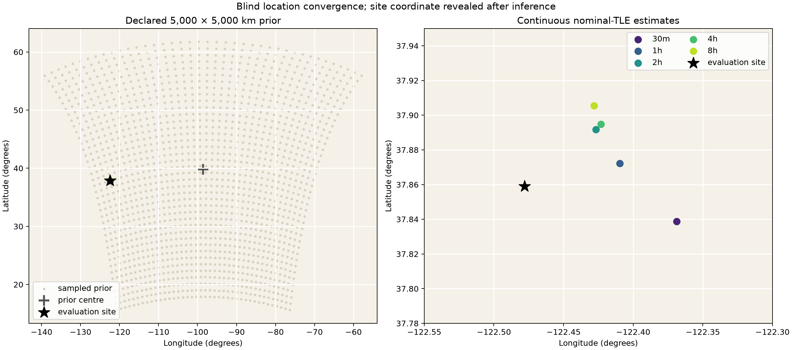
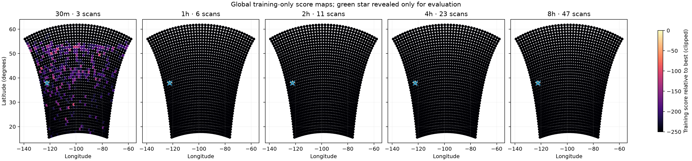
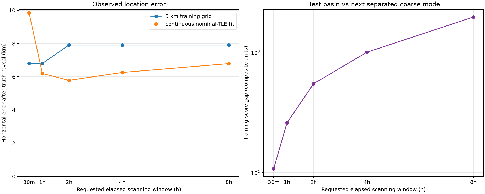
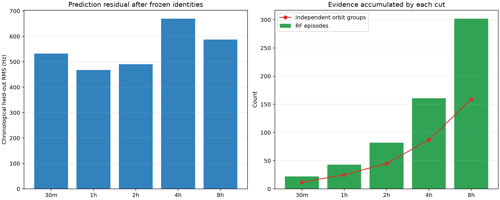
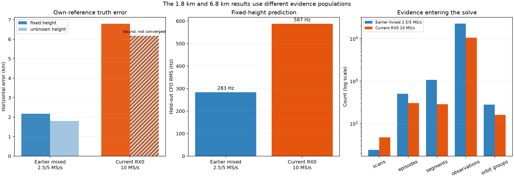

# Position convergence from the eight-hour RX0 10 MS/s scan cohort

Date: 2026-09-15 UTC

Source window: 2026-09-14 15:30:12–23:20:12 UTC

Scientific status: retrospective, truth-revealed evaluation of location-blind
inference; exploratory accuracy evidence from one stationary receiver and one
eight-hour interval, not a calibrated confidence guarantee

The follow-up [detection and position limit diagnosis](2026_09_15_rx0_10msps_detection_and_position_limits.md)
works backward from the final miss using per-episode Doppler sensitivity,
inferred sky geometry, and training-only RMS/elevation gate sweeps.

## Result

Starting with a **5,000 × 5,000 km map-square prior** centred at
**39.8283° N, 98.5795° W**, the location-blind search selects the correct
Northern California basin within the first 30 minutes. The continuous
nominal-TLE estimate is **9.85 km** from the evaluation coordinate at 30
minutes, improves to **6.19 km** at one hour and **5.78 km** at two hours, then
remains near a **6–7 km systematic floor** through eight hours.

| Available window | Completed scans | RF episodes | Blind estimate | Observed horizontal error | Held-out CFO RMS | Next separated basin gap |
|---:|---:|---:|---|---:|---:|---:|
| 30 min | 3 | 22 | 37.838843°, −122.368883° | **9.85 km** | 532 Hz | 107.5 |
| 1 h | 6 | 43 | 37.872267°, −122.409586° | **6.19 km** | 468 Hz | 259.5 |
| 2 h | 11 | 82 | 37.891652°, −122.426834° | **5.78 km** | 490 Hz | 548.0 |
| 4 h | 23 | 161 | 37.894789°, −122.423106° | **6.26 km** | 670 Hz | 1,001.9 |
| 8 h | 47 | 302 | 37.905555°, −122.428079° | **6.79 km** | 587 Hz | 1,965.1 |

The practical answer for this corpus is therefore **about 10 km after 30
minutes and about 6–7 km after one to eight hours**. This supports metro-scale
localization from a continental prior. It does not support street-level
positioning or a claim that the error is bounded by those distances on a new
day. The table reports distance to a location revealed after each blind result
was sealed; it is an observed error, not a posterior radius.

*Figure 1 — The sampled prior and the continuous nominal-TLE estimates. The
black site marker is evaluation-only and was not read by the inference path.*

## What improves with time

More scans decisively improve **global disambiguation**. At 30 minutes the
training score already prefers the Northern California basin by 107.5
composite units over the next mode at least 50 km away. That gap grows to
1,965.1 units by eight hours. The maps become progressively darker away from
the selected basin.

*Figure 2 — Independently accumulated training-only maps at the five requested
cuts. Colour is score relative to the best sampled cell, clipped at −250. It is
not probability. The green evaluation marker was added only after inference.*

Local accuracy stops improving after roughly two hours. The continuous fit
moves from 9.85 km error at 30 minutes to 5.78 km at two hours, but later data
shift it slightly north rather than toward the site. The grid solution tells
the same story: it is 6.80 km away at 30 minutes and one hour, then 7.91 km away
from two through eight hours. The continuous optimizer removes grid
quantization but cannot remove model bias.

*Figure 3 — Left: error measured only after revealing the evaluation
coordinate. Right: separation from other continental basins continues to grow
even while local accuracy plateaus.*

At the 5 km refinement, the number of sampled cells within 10 score units of
the best falls from 11 at 30 minutes to three at one and two hours, and one at
four and eight hours. At 30 minutes those cells extend 15.8 km from the best;
at one and two hours they extend 5 km. This is a resolution diagnostic, not a
confidence interval. By four hours a single sampled cell remains, yet the
truth error is still 7.91 km. That mismatch directly demonstrates why score-map
sharpness must not be reported as positioning certainty.

## Why the result has a several-kilometre floor

The global search solves a discrete association problem and a position problem
together. For every RF episode and trial receiver cell, it marginalizes over
the complete causal Starlink catalogue plus an unassigned alternative. Each RF
segment receives a training-fitted constant frequency offset. It does not
receive a free slope or curvature term that could erase geographic Doppler
information. Once a basin is selected, the continuous fit freezes the
training-selected satellite identities and restores all observations from
qualified episodes.

The chronological held-out residual does not decline monotonically: it is
532, 468, 490, 670 and 587 Hz at the five cuts. A bounded shared orbit-time
alternative lowers these residuals slightly, but changes position error by
less than 0.12 km and does not cure the floor. The remaining bias can include
TLE orbit error, absolute UTC error not represented by the host/device bracket,
residual CFO-path bias, wrong identity assignments, antenna/site effects, and
the fixed-height approximation. Additional measurements strengthen a biased
model's preferred basin; they do not necessarily move its optimum toward the
true receiver coordinate.

*Figure 4 — Held-out prediction remains hundreds of hertz while the corpus
grows from 22 to 302 RF episodes. The continuous gate retains 22, 43, 82, 154
and 286 episodes, representing 12, 25, 45, 87 and 159 independent
catalogue-snapshot/NORAD groups.*

## Truth isolation and inputs

The source is the frozen [RX0 10 MS/s recording and TLE review](2026_09_15_rx0_10msps_recording_tle_review.md):
47 sealed 300-second recordings from physical RX0 on radio
`104000bac4950008230026001b440a003a`. Capture starts are nominally ten minutes
apart. A 30-minute cut contains three completed captures starting at 0, 10 and
20 minutes; the next start falls just beyond the exact cut. The final start is
7 h 50 min after the first, so the eight-hour result uses all 47 recordings.

The published per-recording TLE screen used the configured Sausalito observer.
Those candidate fields cannot be used for a cold-start location experiment.
The new export adapter therefore selects the longest RF-only track in each
channel/edge lane and writes only time, CFO, RF metadata, and opaque observation
IDs. It explicitly omits the observer and every prior NORAD candidate. This
produces 302 nonduplicated RF episodes and copies six digest-verified causal TLE
snapshots beside the evidence. Tests verify that observer and candidate fields
cannot cross the adapter.

For each track, the first 60% of observations are training and the last 40%
are held out. The regional stage uses at most six evenly spaced observations
from each partition. It searches 1,600 cells at 125 km spacing across the whole
prior, retains three geographically separated training-selected modes, then
refines them at 25 km and 5 km. Each requested time cut is a fresh run limited
to the scans available at that cut; later scans do not select its mode or
refinement points. The continuous fit uses every observation in episodes whose
training signal weight is at least 0.95 and training RMS is at most 500 Hz.

Only after all blind runs completed did the reporting tool read the evaluation
coordinate **37.858988° N, 122.478103° W**. The coordinate was known elsewhere
in the repository and to the investigator, so this is algorithmically isolated
retrospective research rather than a personally blinded or preregistered trial.
RF tracks are also reconstructed from their complete within-recording support;
the exercise is not end-to-end causal acquisition.

Machine-readable results are in
[`horizon-results.csv`](figures/2026_09_15_rx0_10msps_position_convergence/horizon-results.csv)
and [`results.json`](figures/2026_09_15_rx0_10msps_position_convergence/results.json).
The JSON binds every sealed coarse, refined and continuous result by SHA-256.
The location-blind export and truth-revealed renderer are
[`prepare_rx0_positioning_evidence.py`](../tools/prepare_rx0_positioning_evidence.py)
and [`report_rx0_position_convergence.py`](../tools/report_rx0_position_convergence.py).

## Comparison with the earlier result within 2 km

The earlier [continental positioning study](2026_09_07_blind_regional_doppler_positioning.md)
reported **1.805 km** horizontal error after 24 mixed 2.5/5 MS/s scans. That
headline used an unknown-height continuous fit. Its fixed-height nominal result,
which matches the present model, was **2.179 km**. The present 10 MS/s fixed-height
result is **6.789 km**, 3.1 times the earlier error.

| Quantity | Earlier mixed 2.5/5 MS/s | Current RX0 10 MS/s | Current / earlier |
|---|---:|---:|---:|
| Completed scans | 24 | 47 | 1.96× |
| RF episodes before continuous gate | 502 | 302 | 0.60× |
| Episodes entering continuous fit | 493 | 286 | 0.58× |
| Source segments | 1,069 | 286 | 0.27× |
| Full observations in continuous fit | 22,694 | 10,561 | 0.47× |
| NORAD/TLE-snapshot orbit groups | 279 | 159 | 0.57× |
| Fixed-height horizontal error | **2.179 km** | **6.789 km** | 3.12× |
| Fixed-height training RMS | 124.9 Hz | 148.0 Hz | 1.19× |
| Fixed-height held-out RMS | **283.4 Hz** | **587.4 Hz** | 2.07× |
| Unknown-height error | **1.805 km**, converged | 6.177 km, **not converged** | not comparable |

*Figure 5 — Accuracy, held-out prediction and evidence volume for the two blind
studies. The hatched current unknown-height result reached the −500 m bound after
two iterations and did not converge; it is a sensitivity result, not a replacement
headline.*

### Why the earlier tracking study did better

The current scanner produced more recordings, but the positioning solver received
less geometric evidence. The earlier study combined RX0 and RX1, joined compatible
upper/lower tracks into physical channel episodes, and carried 1,069 source
segments into the continuous fit. The current study is RX0-only and deliberately
keeps one longest RF-only representative per channel/edge so the known-site TLE
screen cannot leak into a cold-start experiment. It therefore supplies only 286
segments. More scan files did not compensate for losing nearly three quarters of
the independently offset trajectory segments.

The earlier evidence is also more consistent with its frozen satellite hypotheses.
Its 283 Hz held-out RMS is less than half the current 587 Hz. That difference is
consistent with cleaner satellite assignments, more favourable pass geometry,
better TLE/UTC agreement, or cleaner CFO tracks. It is not explained by grid
resolution: the current 125 km whole-prior grid finds the correct basin, whereas
the earlier 125 km branch failed and required an independent 50 km, 10,000-cell
global search. The current experiment is stronger at coarse global disambiguation
and weaker at local physical fit.

The positioning estimator consumes CFO-versus-time trajectories. It does not use
raw-sample carrier phase, PSS time of arrival, pseudorange, or the 100 ns sample
interval as a ranging observable. Its regional stage also retains at most six CFO
points per training and held-out partition. Consequently 10 MS/s helps only when
it produces more accurate or longer CFO trajectories; four times the waveform
sample rate does not automatically provide four times the positioning information.

### Other differences that prevent a sample-rate conclusion

The cohorts observe different satellite passes on different dates, use different
causal TLE snapshots, and use different receiver and episode construction. The
earlier evaluation coordinate was 37.849043° N, 122.485674° W, while the present
report uses the configured 37.858988° N, 122.478103° W site. Those references are
1.290 km apart. Re-evaluating the earlier unknown-height estimate against the
current reference places it 1.220 km away, so the reference change does not explain
away its advantage, but the two published headline errors are not measured against
an identical truth point.

The current unknown-height fit improves the apparent error from 6.789 to 6.177 km,
but it runs directly into the −500 m height bound and reports non-convergence. The
earlier unknown-height solution converged at −265 m and improved its fixed-height
error by 374 m. Neither inferred height has surveyed-altitude accuracy authority;
height can absorb orbit and model bias.

The defensible conclusion is that the **earlier RF evidence population supports a
substantially better local Doppler fit**. This comparison does not establish that
2.5/5 MS/s is intrinsically better than 10 MS/s. A controlled sample-rate test
would need simultaneous or replay-equivalent RF, the same receiver paths, the same
track-selection policy, the same TLE snapshots, and one frozen evaluation
coordinate.

The exact comparison values and source digests are retained in
[`comparison.json`](figures/2026_09_15_rx0_10msps_position_convergence/comparison.json).

## What can be claimed

This cohort demonstrates that the existing RF-only Doppler evidence can recover
the correct continental basin from a 25-million-square-kilometre prior using
three completed scans. On this one truth-revealed run, a reasonable operational
description is **approximately 10 km at 30 minutes, approximately 6 km after
one to two hours, and a 6–7 km floor thereafter**.

Confidence requires repeated held-out days or sites with the inference and
thresholds frozen in advance. Until then, the growing wrong-basin score gap is
evidence for location disambiguation, while the observed truth error is the
more honest measure of local accuracy.
