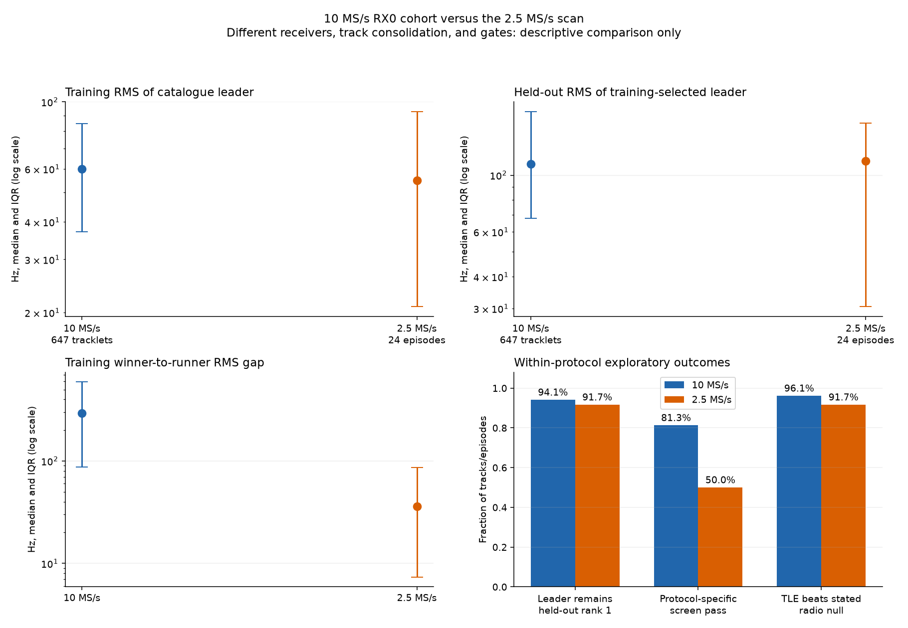
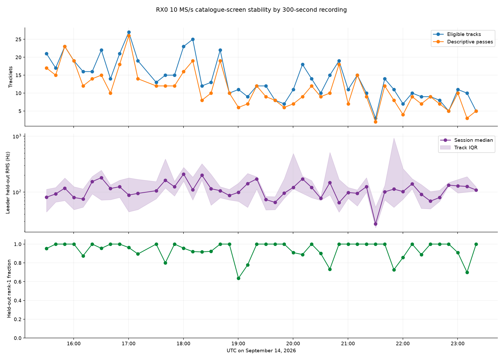
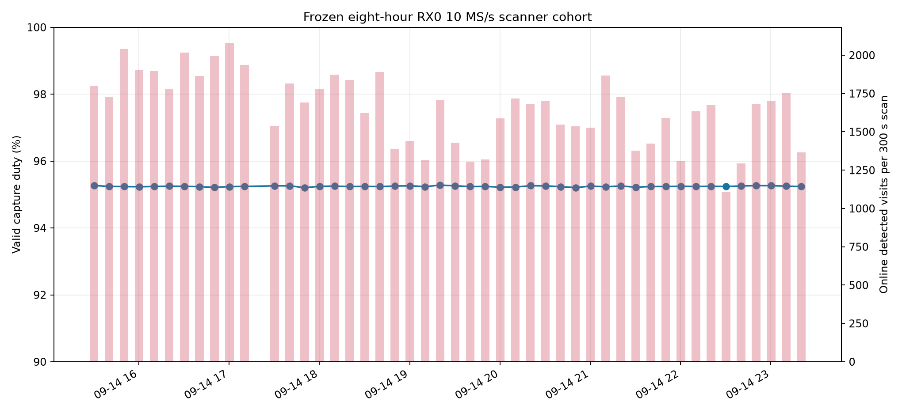
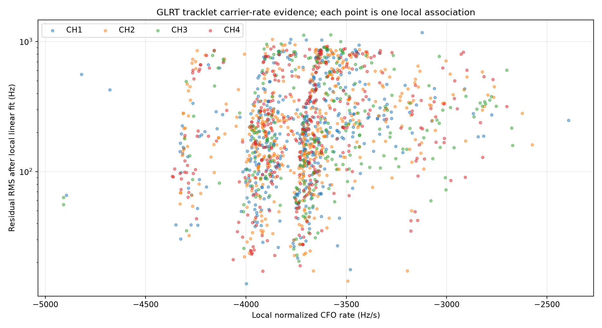
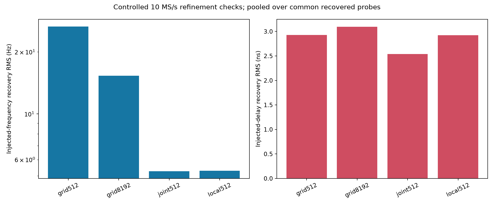
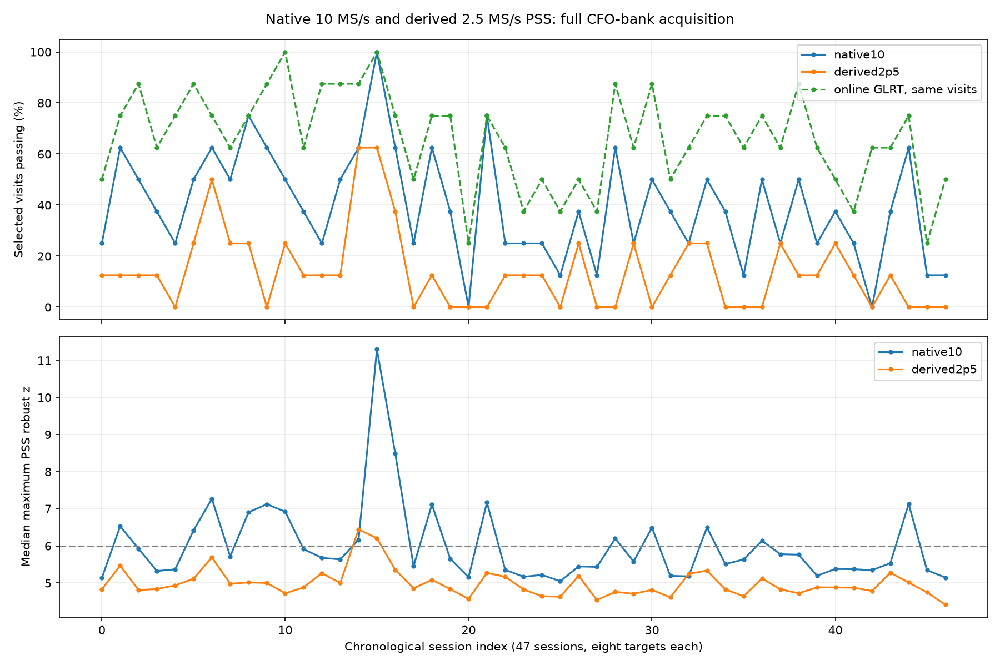
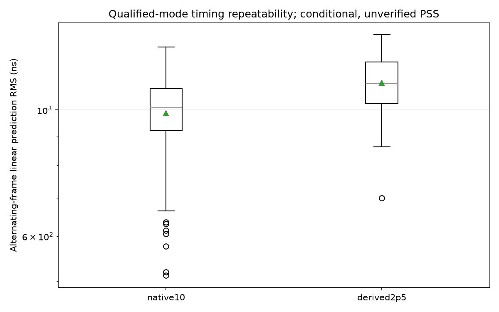
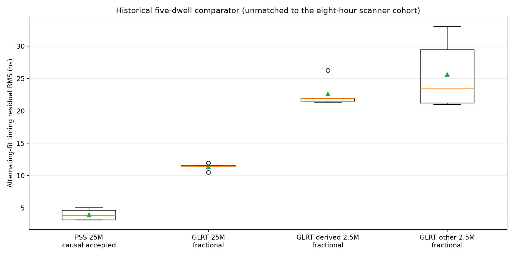

# Per-recording Starlink TLE candidate review: RX0 10 MS/s

This review uses the same **47 sealed recordings from September 14, 2026,
15:28–23:28 UTC** as the
[eight-hour scanner report](2026_09_14_eight_hour_rx0_10msps_pss_glrt_tle.md). The radio is
`104000bac4950008230026001b440a003a`, physical RX0, at 10 MS/s. It uses retained
IQ and archived Space-Track element sets; no new RF collection is involved.

**The data support candidate shortlists, not confirmed satellite identities.**
A single recording can contain several transmitters and several competing
interpretations of a track. Assigning one satellite name to each file would
overstate what these measurements establish.

## Executive assessment: tracking is strong; identity remains unproven

The system now has strong evidence that it can repeatedly extract and follow
structured carrier trajectories from the 10 MS/s scanner recordings. It does
not yet have strong evidence that it can attach a unique Starlink catalogue
identity to those trajectories.

| Question | Evidence | Assessment |
|---|---|---|
| Did the scanner retain usable IQ? | 47 sealed 300 s recordings; median valid source-counter duty 95.2415%; qualified UTC | High confidence for this cohort |
| Can GLRT form sustained CFO tracks? | 647 eligible tracklets; median span 27.96 s; median training/heldout leader RMS 59.91/110.55 Hz | Strong descriptive tracking evidence |
| Is the catalogue ranking temporally stable? | 609/647 training leaders (94.1%) remain heldout rank one | Strong ranking stability within this screen |
| Does one TLE generally separate from retained alternatives? | Median training winner-to-runner gap 294.55 Hz; leader beats the best other retained heldout candidate on 609/647 tracks | Often strong descriptive separation |
| Do simple negative controls pass? | 526/647 tracklets pass all descriptive gates; 121 have one or more concerns | Encouraging, but thresholds are exploratory and tracklets are correlated |
| Does a named satellite beat a strong radio-only explanation? | All three covariance-aware, support-integrated audits favor or tie the radio polynomial and abstain | No confirmed association |
| Can we claim a specific Starlink identity? | No calibrated false-association rate, no independent truth, no antenna pointing authority, and only RX0 | No |

The important distinction is between **tracking a radio trajectory** and
**identifying its spacecraft**. The former is working well. The latter remains
a candidate-ranking capability. A heldout rank-one result among roughly 450–618
visible candidates is useful, but a short, nearly linear arc plus a fitted
carrier offset can match more than one satellite or receiver-drift curve.

All **47 recordings** were screened, covering **647 eligible unique tracklets**.
Of these, **526** pass the descriptive checks below, with at least one in each
recording. These counts are correlated tracklets, not satellite counts. The
three stronger audits all abstain. All 47 per-recording PNGs and evidence
archives are included; there are no unavailable recordings in this review.

Each recording now links a **satellite RMS comparison** page for every eligible
track. It lists the retained Starlink names/NORADs, training and heldout RMS,
training/heldout ranks, and the training leader's advantage over each alternative
in Hz and percent. Positive gain means lower RMS for the leader; negative gain
means the alternative does better. The percentage uses the alternative's RMS
as denominator and is not identification confidence. A separate sentence compares
the leader against the best other heldout candidate, which can differ from the
training runner-up. These are within-track comparisons, not a pooled satellite
ranking across a recording's potentially different transmitters.

The archived screen retained the top five training and top five heldout
candidates per track, not the entire scored population's identities and scores.
The comparison pages expose their union and the full scored population count.
[All candidate comparisons as CSV](figures/2026_09_15_rx0_10msps_recording_tle_review/candidate-comparisons.csv)
provide the unrounded values.

The [ranked RMS gallery](figures/2026_09_15_rx0_10msps_recording_tle_review/rms-plots/README.md)
and each comparison page link plots covering every track. The
plots show training and held-out RMS for the same training-ranked satellites,
capped at ten hits. This archive retained five per ranking, so five are plotted;
the missing ranks are not inferred from the union of different shortlists.
Each panel reports the full scored satellite count and the leader's held-out
rank. Logarithmic axes above 1 Hz keep large and small errors readable.

The [all-track overlay gallery](figures/2026_09_15_rx0_10msps_recording_tle_review/all-track-overlays/README.md)
extends the original six-longest-track image to all 647 eligible tracks. Each
row shows measured CFO with the top three training-ranked TLE curves alongside
their residuals. Sessions are split into pages of at most six rows and tracks
are ordered by recording time. Every session page now includes a top-three table
for each track: training/heldout RMS for the leader and first two training
runner-ups, plus the leader's heldout ratio and percentage improvement versus
the better of those two runners. The same RMS values are printed in each plot's
legend and the gain is printed over its residual panel.

The [per-recording index](figures/2026_09_15_rx0_10msps_recording_tle_review/README.md)
links each UTC timestamp and recording ID to its complete track table, measured
CFO/TLE overlays, residual plots, top-three training candidates, heldout rank,
negative-control assessment, and downloadable evidence. The
[machine-readable summary](figures/2026_09_15_rx0_10msps_recording_tle_review/summary.json)
contains final coverage and diagnostic counts.
The [element-set identities](figures/2026_09_15_rx0_10msps_recording_tle_review/shortlist-element-identities.json)
pin shortlisted NORADs to their precise element epochs and pair digests, and
[provenance](figures/2026_09_15_rx0_10msps_recording_tle_review/provenance.json)
records the source-code hashes and numerical-library versions.

## What a candidate match means

Measured fractional GLRT observations are reconstructed into alias-aware tracks
**before opening the catalogue**. The source stream is native 10 MS/s; the
offline analysis uses one 20 ms probe per complete 120 ms visit. These are
sparse observations of a recording, not continuous carrier tracking.

Every unique reconstructed track with at least 20 observations and at least
20 seconds between its first and last observation enters the exploratory
screen. Alternative global hypotheses can share tracks; shared track IDs are
screened once. Cross-channel tracklets remain correlated and their counts
must not be interpreted as independent detections.

For each recording, the latest archived catalogue collected before the earliest
wrong-time prediction opportunity is selected. The observer is the previously
configured Spinnaker, Sausalito site. Source and catalogue digests, site
coordinates, and exclusions are retained in each recording's evidence.

A coarse orbital grid identifies possible horizon-visible candidates. Each
candidate is then propagated with SGP4 at **every observation center** for each
integer time shift from −5 through +5 seconds. Scoring uses those exact-time
predictions, not interpolation of the coarse grid. Doppler and observations
share the 11.2 GHz RF reference. This screen uses observation centers rather
than integration over each 20 ms measurement support.

The first 60% of observations select the candidate, time shift, and one constant
carrier offset. The final 40% is scored without refitting. The offset absorbs
unknown carrier/receiver bias and absolute alias choice; it is not a measured
oscillator calibration. Each candidate is allowed the same fitting opportunity.
No measured CFO slope is fitted into the orbital model.

The trajectory detector has already used the whole recording before this split.
Heldout therefore applies to catalogue/offset fitting, not to a fully prospective
validation of the detector and track-selection pipeline.

The screen also fits independent catalogues at −500 and +500 seconds and linear
and quadratic radio-drift models. A descriptive pass requires the training
leader to remain first on heldout data, no exact candidate tie, no time-shift
boundary, horizon visibility throughout measured support, and a lower heldout
RMS than both wrong-time leaders and both radio models. Small score margins
remain small evidence; these criteria do not supply a calibrated probability.

## Why some existing catalogue products were unavailable

The strict matcher rejects an incomplete catalogue propagation. For example,
the catalogue used for `scan-hop-24e4b051b0fbc5ca` contains SGP4-error-6 objects
`STARLINK-34343 DEB` (NORAD 69730) and `STARLINK-37793` (NORAD 100286). Excluding
only objects labelled debris therefore does not resolve that failure.

This research screen records all orbital-only exclusions: failed propagation,
implausible altitude, or labelled debris. These checks cover the whole recording
and wrong-time fields, without consulting measured signal fit. **The resulting
shortlist is conditional on the propagatable catalogue subset.** It does not
claim that excluded objects could not have transmitted, and it does not rewrite
the production pipeline's stricter completeness policy.

## A stronger audit of three promising examples

The first three chronologically available recordings among the original 41
complete analyses with descriptive passes were selected for a second check,
using the longest passing track in each. The six later backfills did not change
that frozen audit selection.
This is a post-hoc audit of examples, not an independent validation cohort.
The existing covariance-aware, support-integrated matcher uses the same
orbital-only exclusions and its established chronological/wrong-time controls.

| Recording | Screen and stricter matcher leader | Track support | TLE heldout negative log score | Best radio-model score | Stricter conclusion |
|---|---:|---:|---:|---:|---|
| `scan-hop-24e4b051b0fbc5ca` | NORAD 60413 | 36.80 s | 120.73 | 115.27 | Abstain |
| `scan-hop-c2313aebc38416ef` | NORAD 63795 | 50.41 s | 174.94 | 156.48 | Abstain |
| `scan-hop-499abcb9ca352397` | NORAD 63780 | 38.97 s | 137.00 | 129.65 | Abstain |

Lower negative log score is better; compare models within a row, not across
rows with different support. All three leaders remain first on heldout data,
but all three fail `radio-polynomial-null-not-worse-on-heldout`.

The simple RMS screen and the stricter matcher answer different questions.
RMS describes curve agreement; the stricter predictive score includes the
declared covariance and nuisance uncertainty. A lower RMS alone does not prove
that the orbital explanation is better supported than receiver drift.
The [full audit evidence](figures/2026_09_15_rx0_10msps_recording_tle_review/deep-checks/README.md)
preserves all candidate and control scores.

## Comparison with the similar 2.5 MS/s 300-second report

The closest existing comparison is
[`scan-hop-09970e41439adea3`](2026_09_07_scan_09970e_fractional_glrt_trajectory_tle_review.md),
a 300-second, 2.5 MS/s scan recorded on September 7. It is scientifically useful
but is **not a controlled sample-rate experiment**. The 2.5 MS/s analysis used
both receivers, consolidated receiver replicas and lower/upper edges into 24
physical channel episodes, and used 0.25 s TLE time-shift steps. The 10 MS/s
cohort uses RX0 only, reports 647 unique lane tracklets across 47 recordings,
and uses 1 s time-shift steps plus explicit ±500 s controls. Denominators and
screen gates therefore differ.



| Quantity | RX0 10 MS/s cohort | Similar 2.5 MS/s scan | Interpretation |
|---|---:|---:|---|
| Recordings / duration | 47 × 300 s | 1 × 300 s | 10 MS/s establishes repeatability across time; 2.5 MS/s is one detailed case |
| Receivers | RX0 only | RX0 + RX1 | The 2.5 MS/s report has receiver corroboration unavailable at 10 MS/s |
| Median valid capture duty | 95.2415% | 95.5594% | Operational capture quality is effectively similar |
| Analysis unit | 647 lane tracklets | 24 consolidated episodes | Counts are not directly comparable |
| Median support | 27.96 s | 12.05 s | Longer 10 MS/s tracklets help expose divergence, but reflect selection/construction too |
| Median candidates scored | 520 | 511.5 | Both solve a similarly dense catalogue problem |
| Median leader training RMS | 59.91 Hz | 54.95 Hz | No demonstrated 10 MS/s RMS improvement |
| Median leader heldout RMS | 110.55 Hz | 113.51 Hz | Essentially the same typical predictive residual |
| Median training winner gap | 294.55 Hz | 35.86 Hz | Better separation in the 10 MS/s cohort, but not attributable to sample rate alone |
| Training leader remains heldout rank one | 609/647 (94.1%) | 22/24 (91.7%) | Both rank candidates consistently on most tracks |
| Protocol-specific screen pass | 526/647 (81.3%) | 12/24 (50.0%) | Different gates and consolidation prohibit a direct sensitivity claim |
| TLE beats stated simple radio null | 622/647 (96.1%) | 22/24 (91.7%) | Different polynomial null definitions; descriptive only |
| Strongest stricter association | 0/3 audited tracks pass | 0/1 cross-channel handoff passes | Neither report confirms a named satellite |

The median RMS result is the most useful rate comparison: 10 MS/s and 2.5 MS/s
are nearly identical for catalogue-leader CFO prediction. This is consistent
with GLRT carrier tracking drawing most of its identity-bearing information
from trajectory shape over time rather than from raw ADC sample count. More
samples can improve local timing or acquisition, but they do not create more
orbital curvature during the same 20–30 second arc.

The larger 10 MS/s winner gap is promising. Its median training gap is 8.2 times
the 2.5 MS/s value, and 94.1% of leaders survive holdout. That is not yet proof
of a bandwidth benefit because the 10 MS/s set contains many more epochs,
longer median tracks, only one receiver, different track boundaries, different
time-shift resolution, and different control gates. A valid sample-rate claim
requires replaying the same RX0 IQ through matched native-10 and derived-2.5
pipelines with identical probes, tracks, candidate universe, nuisance parameters,
and frozen thresholds.

The detailed 2.5 MS/s report reached one especially promising cross-channel
candidate: STARLINK-34856 / NORAD 65687, with 109.4 Hz training RMS and 138.4 Hz
heldout RMS. It remained rank one, but the strict left-to-right handoff gave
112.8 Hz for the TLE and a better 92.9 Hz for the radio-only cubic. It therefore
abstained. Its 12 provisional single-channel passes collapsed to seven NORAD
families, also without an identity claim.



The 10 MS/s result is not carried by one favorable recording. Every recording
contains at least two descriptive-pass tracklets, session median heldout RMS is
generally near 100 Hz, and most session-level leader-stability fractions are
above 0.9. The repeated evidence strengthens confidence in the tracking system,
while correlated tracks and repeated constellation geometry prevent treating
47 recordings as 47 independent satellite identifications.

## What the wider bandwidth did help

The matched PSS replay on these same 10 MS/s recordings found candidate-bearing
visits in 149/376 native windows versus 53/376 after deriving 2.5 MS/s from the
same IQ, a 2.81-fold increase. This shows that the wider stream contains useful
waveform-acquisition information. It is not yet a detection-rate result: the
pilot-only control also formed stable candidate tracks, so PSS remains
candidate-only. The additional bandwidth has therefore demonstrated acquisition
potential, not improved satellite identity.

For GLRT/TLE association, the present data do not show a better typical RMS at
10 MS/s. The next matched experiment should hold the observation times and
trajectory graph fixed and compare native 10 MS/s with a deterministic 2.5 MS/s
decimation. The primary endpoints should be heldout TLE-versus-radio score,
winner-to-runner margin, rank stability, and a preregistered false-association
rate—not merely the number of passing tracks.

## Complete analysis and figure index

The report keeps summary figures inline and links the exhaustive per-track
figures rather than embedding 256 large PNGs into one page.

### RX0 10 MS/s cohort

- [Per-recording assessment index](figures/2026_09_15_rx0_10msps_recording_tle_review/README.md): all 47 recordings, track tables, candidates, controls, and evidence downloads.
- [All-track CFO/TLE overlay gallery](figures/2026_09_15_rx0_10msps_recording_tle_review/all-track-overlays/README.md): 128 PNGs covering all 647 tracks, with top-three TLE curves and residuals.
- [Ranked RMS gallery](figures/2026_09_15_rx0_10msps_recording_tle_review/rms-plots/README.md): 128 PNGs covering all 647 tracks and the retained top-five candidates.
- [Candidate comparison ledger](figures/2026_09_15_rx0_10msps_recording_tle_review/candidate-comparisons.csv): 4,079 unrounded candidate rows and top-one gains.
- [Machine-readable summary](figures/2026_09_15_rx0_10msps_recording_tle_review/summary.json), [element identities](figures/2026_09_15_rx0_10msps_recording_tle_review/shortlist-element-identities.json), and [provenance](figures/2026_09_15_rx0_10msps_recording_tle_review/provenance.json).
- [Stricter three-track audit](figures/2026_09_15_rx0_10msps_recording_tle_review/deep-checks/README.md).

The broader eight-hour scanner evidence is included here:













### Similar 2.5 MS/s 300-second scan

The [complete original 2.5 MS/s report](2026_09_07_scan_09970e_fractional_glrt_trajectory_tle_review.md)
contains the method, tables, and machine-readable evidence. Its ten figures are:

1. [Linear/quadratic/cubic residuals](figures/2026_09_07_scan_09970e_trajectory_tle_review/01-linear-quadratic-cubic-residuals.png)
2. [Merged upper/lower physical tracks](figures/2026_09_07_scan_09970e_trajectory_tle_review/02-upper-lower-merged-tracks.png)
3. [Merge RMS and rate resolution](figures/2026_09_07_scan_09970e_trajectory_tle_review/03-upper-lower-rms-resolution.png)
4. [Cross-channel candidates](figures/2026_09_07_scan_09970e_trajectory_tle_review/04-cross-channel-join-candidates.png)
5. [Leading model orders](figures/2026_09_07_scan_09970e_trajectory_tle_review/05-top-candidate-model-orders.png)
6. [All cross-channel TLE checks](figures/2026_09_07_scan_09970e_trajectory_tle_review/06-all-cross-channel-tle-checks.png)
7. [STARLINK-34856 detail](figures/2026_09_07_scan_09970e_trajectory_tle_review/07-top-cross-channel-tle-detail.png)
8. [All single-channel TLE checks](figures/2026_09_07_scan_09970e_trajectory_tle_review/08-all-single-channel-tle-checks.png)
9. [All candidate summary](figures/2026_09_07_scan_09970e_trajectory_tle_review/09-all-candidate-tle-summary.png)
10. [Strongest single-channel details](figures/2026_09_07_scan_09970e_trajectory_tle_review/10-best-single-channel-tle-details.png)

The comparison inputs and exact summary statistics are preserved in
[comparison summary JSON](figures/2026_09_15_10msps_vs_2p5msps_starlink_tracking/summary.json).

## Limits and reproduction

PSS detections are not used as identity evidence. The current PSS engine's
pilot-only false tracks remain an unresolved qualification issue. GLRT aliases,
receiver drift, multipath, short nearly linear arcs, catalogue errors, and
unknown antenna illumination can all create plausible orbital matches.
Repeated labels on nearby RF lanes are useful diagnostics, not independent
confirmation. Neither TLE visibility nor a matching Doppler slope demonstrates
that a particular satellite transmitted the recorded waveform.

The scripts operate through read-only capture adapters and separate research
outputs. Six initially missing offline analyses are backfilled separately;
the original eight-hour production snapshot is preserved. Published evidence
contains capture/analysis/catalogue digests and exact per-recording dispositions.

```bash
PYTHONPATH=src:. OPENBLAS_NUM_THREADS=1 OMP_NUM_THREADS=1 python \
  tools/review_rx0_scanner_tles.py \
  --sessions reports/figures/2026_09_14_eight_hour_rx0_10msps_pss_glrt_tle/sessions.csv \
  --analysis-root /srv/bulk/leo/experiments/20260915-rx0-tle-review/analysis \
  --output /tmp/rx0-tle-review-fresh
PYTHONPATH=src:. OPENBLAS_NUM_THREADS=1 OMP_NUM_THREADS=1 python \
  tools/review_rx0_scanner_tles.py \
  --sessions reports/figures/2026_09_14_eight_hour_rx0_10msps_pss_glrt_tle/sessions.csv \
  --output /tmp/rx0-tle-review-fresh
PYTHONPATH=src:. python tools/validate_scanner_tle_screen.py /tmp/rx0-tle-review-fresh
PYTHONPATH=src:. python tools/publish_scanner_tle_review.py \
  /tmp/rx0-tle-review-fresh /tmp/rx0-tle-report
PYTHONPATH=src:. python tools/plot_scanner_candidate_rms.py /tmp/rx0-tle-report
PYTHONPATH=src:. python tools/plot_scanner_candidate_overlays.py /tmp/rx0-tle-report
```

`backfill_scanner_review_metrics.py` handles missing analyses into an explicit
research root; `review_rx0_scanner_tles.py --analysis-root` reads those products.
The six backfilled products are retained under the research root above. The
second invocation fills the other 41 from the production analysis store,
reusing the six successful screens. Error records are retried; successful
screens are cached, so use a fresh destination when changing the method.
The published evidence pins each analysis digest separately.
`check_scanner_tle_shortlist.py` reproduces the three post-hoc stronger checks;
their recording IDs are frozen in the tool so later backfill cannot change the
audit cohort.
