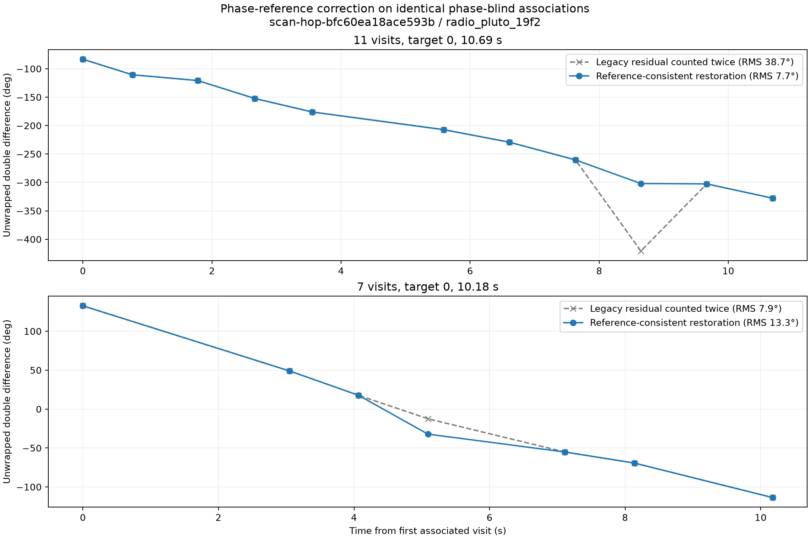
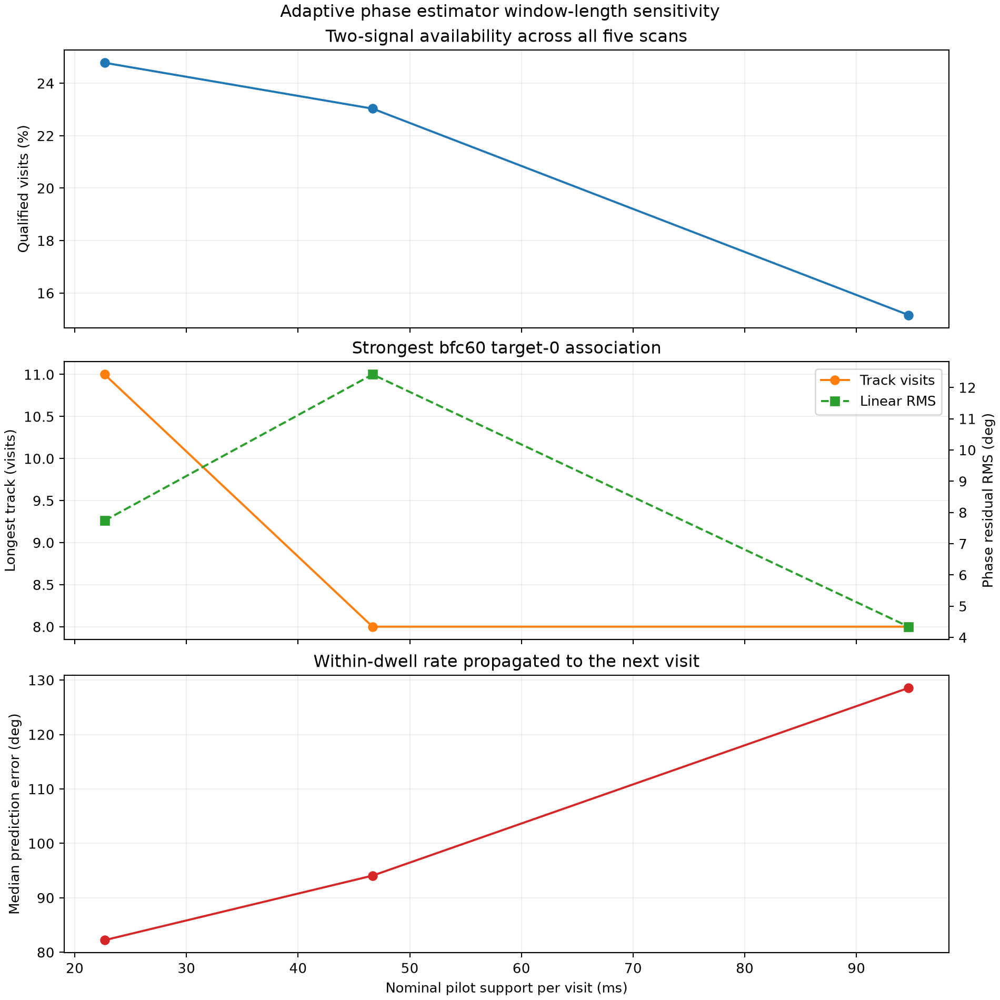

# Adaptive dual-RX Starlink pilot phase recovery

Date: 2026-09-16. Scope: five existing nominal 300-second adaptive scans at
2.5 MS/s, with RX0 and RX1 sampled simultaneously by one radio. No new RF was
collected. Status: an eleven-visit receiver-phase double-difference progression
is recovered; geometric phase remains unverified.

## Result

A phase-reference error in the exploratory extractor counted each receiver's
individual GLRT residual frequency twice when restoring phase to the dwell
center. Correcting it changes the strongest `bfc60...` target-0 path from a
jumpy eleven-point candidate into the best phase progression in the cohort:

- eleven visits over 10.69 seconds;
- -22.79 degrees/s linear slope;
- 7.74-degree unweighted residual RMS and 6.91-degree uncertainty-weighted RMS;
- phase-increment concentration 0.982;
- no exceedance in 20,000 within-track phase permutations;
- 1.75-degree median wrapped prediction error on the last five points from a
  line fitted to the first six;
- 4.88-degree median estimated phase standard error and normalized residual RMS
  1.39.

The identical phase-blind association had 38.71-degree RMS with the legacy
restoration. Its apparent anomalous dwell was largely an estimator artifact.



The correction improves accuracy, but the fitted short-dwell rate still cannot
integrate cycles through a roughly one-second gap. The eleven-point path's
one-step rate-propagation error remains 82.2 degrees median.

## Recording coverage

RX0 and RX1 always use the same stored sample index. The compact IQ layout is
`I0,Q0,I1,Q1`; acquisition-time gaps between adaptive visits are not stored.
The extractor reconstructs compact stored indices from visit, probe offset, and
probe-local epoch.

| Session | Radio | Qualified local phase visits | Qualified two-signal visits | Longest phase-blind path | Best increment concentration |
| --- | --- | ---: | ---: | ---: | ---: |
| `scan-hop-bfc60ea18ace593b` | `19f2` | 874 / 876 | 46 / 108 (42.6%) | 11 | 0.982 |
| `scan-hop-ca76f0138c3d5538` | `19f2` | 597 / 613 | 3 / 15 (20.0%) | none | none |
| `scan-hop-9626fed2bb56f5c4` | `19f2` | 726 / 738 | 15 / 39 (38.5%) | 4 | 0.796 |
| `scan-hop-ebe72de635485b4e` | `5d4d` | 857 / 859 | 18 / 144 (12.5%) | 4 | 0.903 |
| `scan-hop-45b79e4e8b5e4d72` | `19f2` | 676 / 685 | 3 / 37 (8.1%) | none | none |


The lower two-signal counts supersede the earlier report. The old 120 kHz
RX-pairing gate was ineffective: after reducing an error modulo the 227.27 kHz
symbol alias, its magnitude cannot exceed 113.64 kHz. The new matcher finds the
largest one-to-one assignment whose RX1-minus-RX0 offsets agree within 10 kHz,
without using a fixed radio-offset prior. Sensitivity runs from 5 to 40 kHz
recover the same six cross-dwell paths; 10 kHz is retained as the conservative
setting.

## Correct phase reference

For signal (s), the coherent receiver product is

\[
z_s(t)=y_{1,s}(t)y_{0,s}^{*}(t),\qquad \phi_s(t)=\arg z_s(t).
\]

The individual GLRT combines symbols after removing an estimated residual CFO.
Each resulting per-frame phasor still contains that residual's propagation at
the frame origin. The receiver-product phase fit therefore already contains the
difference between the individual RX residuals. The correct restoration is

\[
\hat\phi(t_c)=\arg\{\hat z(t_c)\}
+2\pi[f_{1,a}(t_c-r_1)-f_{0,a}(t_c-r_0)],
\]

where (f_a) is the acquired CFO and (r) is the acquisition reference. Adding
the individual GLRT residuals to (f_a) in the last term counts their
propagation twice.

Synthetic tests vary reference samples, acquired CFOs, and individual residuals
and require the restored phase to remain invariant modulo one cycle. A second
test verifies that receiver-relative frequency combines the two acquired CFOs
with the fitted receiver-product residual exactly once.

## Double difference and association

For two distinguishable signals evaluated at a common time, the reported double
difference is

\[
D(t)=\operatorname{wrap}\{\phi_{\mathrm{high}}(t)-
\phi_{\mathrm{low}}(t)\}.
\]

This cancels a phase term common to both receiver products at that instant.
Frequency-dependent group delay, unequal time support, multipath, pair mistakes,
and non-common LNB terms remain. `D(t)` is a receiver-phase double difference;
it is not automatically satellite geometry.

Association proceeds without reading phase or phase rate:

1. Retain every pilot-qualified two-signal hypothesis in a visit.
2. Represent both signal orderings so an alias-boundary order reversal does not
   split a physical trajectory.
3. Connect states using target, elapsed time, both alias-aware CFO trajectories,
   signal separation, and pilot/control quality.
4. Allow at most 3.5 seconds, 32 visit indices, 15 kHz motion per signal, and
   3 kHz separation change between states.
5. Freeze the longest admissible path, then evaluate phase and shuffled-phase
   controls.

```text
for each visit:
    estimate all one-to-one RX0/RX1 pairs with a common receiver offset
    keep every pilot-qualified pair-of-signals hypothesis
    create orientations (A, B, +D) and (B, A, -D)

for each target:
    build edges from time, CFO trajectories, separation, and pilot quality
    select the longest low-cost path
    freeze its hypothesis IDs and orientations
    only then unwrap phase, fit a line, and run phase permutations
```

Randomizing every phase value leaves the selected hypothesis IDs and
orientations unchanged. Phase concentration is recorded as a diagnostic and is
no longer part of association quality.


The eleven-point track changes smoothly from about 27 to 31 kHz separation.
The independent seven-point target-0 path has -23.98 degrees/s slope,
13.32-degree RMS, increment concentration 0.925, and phase-permutation value
0.00035. Its agreement in slope is interesting, but different time and signal
separation do not prove that the paths contain the same signal pair.

The error bars use an approximate circular-mean standard error,

\[
\sigma_\phi \simeq \sqrt{\frac{-2\log R}{N}},
\]

where (R) is resultant length and (N) is accepted frame count. The normalized
RMS shows that the model is slightly optimistic for the eleven-point path and
strongly rejects several weaker paths. It is a useful weight, not a complete
multipath or model-error covariance.

## Window-length and common-frame tests



The nominal 23 ms support remains the best operating point. Expanding nominal
support to 47 and 95 ms reduces all-five qualified two-signal availability from
24.8% to 23.0% and 15.1%. The strongest path shrinks from eleven to eight
visits. A 95 ms window lowers one selected path's line RMS to 4.34 degrees but
worsens next-visit rate prediction from 82.2 to 128.6 degrees. Longer windows
mix intermittent pilot support and do not solve cycle propagation.

Directly forming the two-signal double difference on identical accepted frame
epochs is mathematically preferable because it cancels the shared receiver
phasor before averaging. Only one of 98 retained hypotheses has at least three
common frame epochs: different pilots generally use different Starlink frame
epochs. The direct implementation and synthetic cancellation test are retained,
but it cannot provide broad coverage on these recordings.

## Remaining limitation and next estimator

The corrected local measurements still cannot reliably propagate phase with
the fitted short-dwell derivative. A joint asynchronous-frame model is the next
useful estimator:

1. Preserve every pilot-frame receiver product, timestamp, weight, and control
   score in each dwell.
2. Model a shared LNB phase/frequency nuisance process and a separate smooth
   phase for each signal at its own frame epoch.
3. Freeze signal association using CFO, separation, timing, and pilot evidence.
4. Solve integer cycle sequences with a robust batch likelihood after
   association, retaining several ambiguities when evidence is insufficient.
5. Downweight a dwell using its predeclared uncertainty and control residuals.
6. Use three signals when available to obtain two independent double
   differences and a closure residual.

For future authorized captures, faster same-channel revisits would help more
than longer integration over the present intermittent pilots. A shared
calibration tone through both LNB paths would separately expose retune-dependent
hardware phase.

The current evidence supports an exploratory eleven-point receiver-phase
progression. It does not yet support a satellite identity, baseline length,
absolute path difference, or exclusively geometric interpretation.

## Reproduction

The checked-in tool consumes frozen per-visit hypotheses and regenerates the
association, uncertainty metrics, and figures:

```bash
.venv/bin/python tools/report_adaptive_dual_rx_phase.py \
  --input-dir reports/figures/2026_09_16_adaptive_dual_rx_phase \
  --output-dir reports/figures/2026_09_16_adaptive_dual_rx_phase \
  --sensitivity-input 9=reports/figures/2026_09_16_adaptive_dual_rx_phase \
  --sensitivity-input 18=reports/figures/2026_09_16_adaptive_dual_rx_phase/sensitivity-radius-18 \
  --sensitivity-input 36=reports/figures/2026_09_16_adaptive_dual_rx_phase/sensitivity-radius-36
```

Key outputs are the [association summary](figures/2026_09_16_adaptive_dual_rx_phase/adaptive-phase-association-summary.json),
[window sensitivity](figures/2026_09_16_adaptive_dual_rx_phase/adaptive-phase-window-sensitivity.json),
five frozen short-window hypothesis files, and two additional five-file frozen
cohorts for the duration experiment. The raw QNAP recordings remain read-only.
