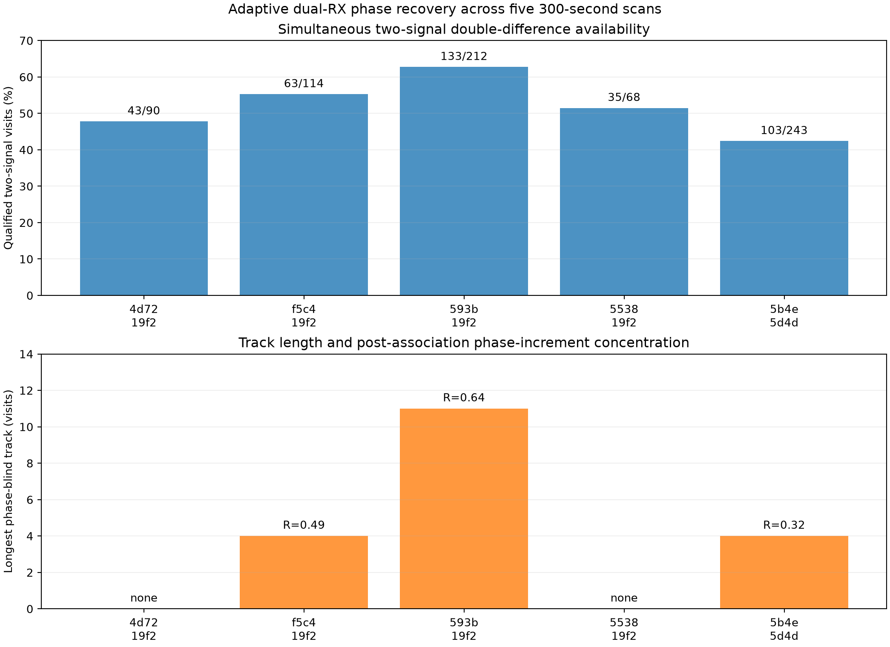
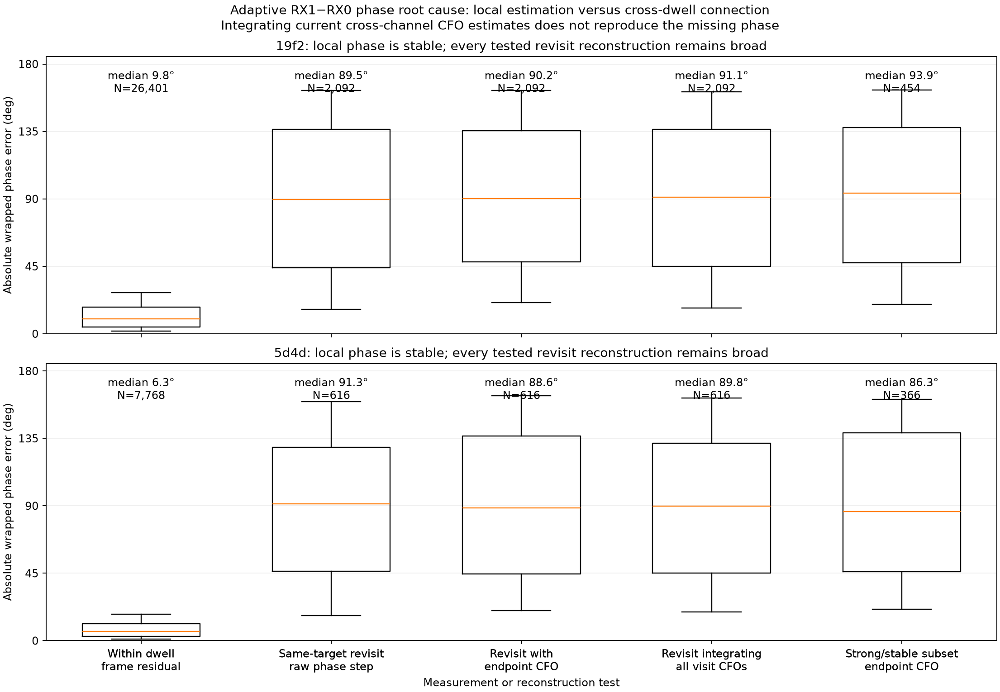
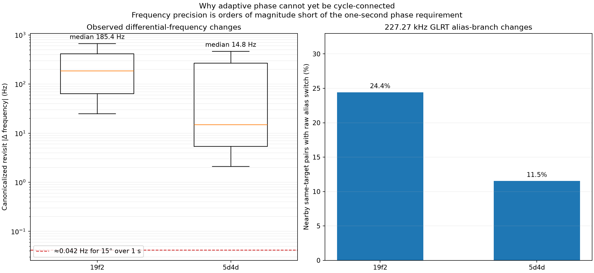
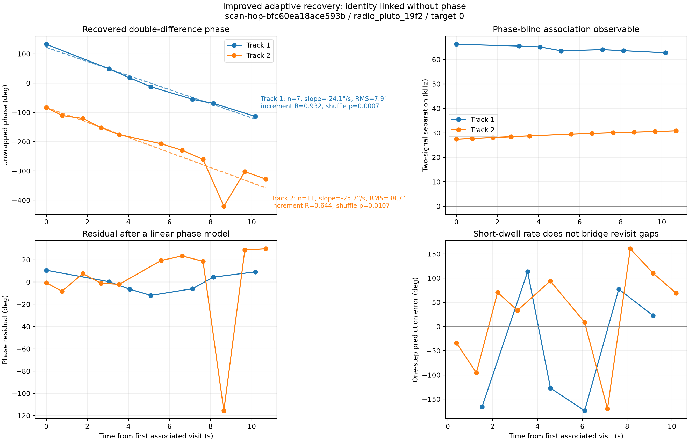

# Adaptive dual-RX Starlink pilot phase recovery

Date: 2026-09-16. Scope: five existing nominal 300-second adaptive scans at
2.5 MS/s, with RX0 and RX1 sampled simultaneously by one radio. No new RF was
collected. Status: receiver-relative pilot phase is locally measured; one
promising cross-dwell double-difference track is recovered; geometric phase is
not yet proven.

## Result

The adaptive recordings contain good local phase measurements but generally do
not contain frequency estimates precise enough to carry an integer cycle count
through a roughly one-second revisit gap. This distinction resolves the earlier
apparent contradiction:

- Inside a dwell, median absolute phase residual is 9.8 degrees on radio `19f2`
  and 6.3 degrees on `5d4d`.
- Across same-target revisits, raw and frequency-propagated phase errors are all
  approximately uniform, with median absolute errors near 90 degrees.
- A simultaneous two-signal double difference cancels the dominant common LNB
  phase term without extrapolating it through the gap.
- A new phase-blind association recovers a clean seven-visit progression over
  10.18 seconds in `scan-hop-bfc60ea18ace593b`: slope -24.06 degrees/s,
  7.90-degree linear residual RMS, phase-increment concentration 0.932, and a
  within-track phase-permutation probability of 0.0007.
- The same scan contains an independently associated eleven-visit candidate
  over 10.69 seconds with slope -25.73 degrees/s, but one large anomalous dwell
  raises its residual RMS to 38.71 degrees. The candidate is useful evidence,
  not a clean recovered carrier-phase track.
- The other four recordings do not reproduce the strong result. Two contain
  weak four-point paths, and two contain no defensible four-point phase-blind
  path. The seven-point result is therefore exploratory rather than a general
  qualification.



## Recordings and coverage

The recordings are one-radio, two-receiver captures. RX0 and RX1 use the same
stored sample index. The compact IQ layout is interleaved
`I0,Q0,I1,Q1`; acquisition-time gaps between adaptive visits are not stored as
IQ. The corrected extractor reconstructs a compact stored index from the visit,
probe offset, and probe-local epoch. Treating the acquisition session sample as
a direct compact-array index was an earlier extraction error and is corrected
in all results below.

| Session | Radio | Qualified local phase visits | Qualified simultaneous two-signal visits | Longest phase-blind path | Best increment concentration |
| --- | --- | ---: | ---: | ---: | ---: |
| `scan-hop-bfc60ea18ace593b` | `19f2` | 874 / 876 | 133 / 212 (62.7%) | 11 | 0.932 on the clean 7-point path |
| `scan-hop-ca76f0138c3d5538` | `19f2` | 597 / 613 | 35 / 68 (51.5%) | none | none |
| `scan-hop-9626fed2bb56f5c4` | `19f2` | 726 / 738 | 63 / 114 (55.3%) | 4 | 0.485 |
| `scan-hop-ebe72de635485b4e` | `5d4d` | 857 / 859 | 103 / 243 (42.4%) | 4 | 0.318 |
| `scan-hop-45b79e4e8b5e4d72` | `19f2` | 676 / 685 | 43 / 90 (47.8%) | none | none |

The local visit counts establish that a coherent Qin pilot can usually be
measured when a paired candidate is present. They do not imply that visits are
the same satellite or that their phases are cycle connected.

## Observable and cancellation

For signal (s), the simultaneous receiver product at sample time (t) is

\[
z_s(t) = y_{1,s}(t)y_{0,s}^{*}(t), \qquad
\phi_s(t)=\arg z_s(t).
\]

The measurement contains the geometric inter-antenna phase, the relative phase
of the two LNB chains, frequency-dependent receiver delay, noise, and multipath.
The raw RX0 and RX1 correlations always use the same sample indices.

For two distinguishable signals measured at an effectively common time, the
reported double difference is

\[
D(t)=\operatorname{wrap}\{\phi_{\mathrm{high}}(t)-
\phi_{\mathrm{low}}(t)\}.
\]

A phase term common to both signals at that instant cancels. A retune-dependent
common phase can therefore cancel even when an absolute single-signal phase
cannot be connected across retunes. Frequency-dependent group delay, unequal
within-window weights, multipath, signal-pair mistakes, and any non-common LNB
term remain. Consequently, `D(t)` is a receiver-phase double difference; it is
not automatically satellite geometry.

## Why the single-signal revisit connection fails



Both radios show the same pattern: the local fit is narrow, but every tested
cross-dwell reconstruction is broad. Endpoint CFO correction, integration of
all intervening visit CFOs, and restriction to strong/stable endpoints do not
improve on the raw revisit phase step.

If the frequency error is (\epsilon_f) over a gap (T), its phase error is

\[
\epsilon_\phi = 360^\circ\epsilon_f T.
\]

For no more than 15 degrees error over one second, the required frequency error
is about 0.042 Hz. The observed median canonicalized revisit changes are
185.4 Hz for `19f2` and 14.8 Hz for `5d4d`. Even a 0.1 Hz error accumulates 36
degrees in one second. The problem is therefore not that phase mysteriously
forgets itself; the present short-dwell frequency observation leaves many
indistinguishable whole-cycle hypotheses over the gap.



The Qin symbol duration also creates a 227.2727 kHz frequency-alias spacing.
Nearby same-target estimates change raw alias branch in 24.4% of tested `19f2`
pairs and 11.5% of `5d4d` pairs. Canonicalization removes the explicit branch
jump, but it cannot manufacture the sub-hertz precision required to integrate
phase for one second. The large apparent RX1-minus-RX0 offsets are consistent
with the two independent LNB oscillators and alias choice; they are not a radio
sample-clock mismatch.

This also explains the historical fixed-tune gap experiment. Withholding phase
updates does not physically destroy phase. The initial endpoint-frequency
interpolator was too weak to infer the missing integer cycles. Correcting that
experiment restored the continuously observed fixed-tune track, but did not
make sparse one-second adaptive revisits identifiable from the available CFO
precision.

## Improved phase-blind association

The initial adaptive analysis selected one two-signal candidate per visit and
required a visit-index gap no larger than eight. That discarded useful
hypotheses and incorrectly split a physical time-contiguous run when the
adaptive scheduler inserted other targets. The improved analysis:

1. Retains every qualified two-signal hypothesis in a visit.
2. Represents both possible signal orderings. This is necessary when a signal
   crosses the canonical alias boundary and the numerical low/high order flips.
3. Connects states only by target, elapsed time, both alias-aware CFO
   trajectories, signal separation, and quality.
4. Allows at most 3.5 seconds, 32 visit indices, 15 kHz motion per signal, and
   3 kHz change in separation between connected states.
5. Finds the longest path in the resulting directed acyclic graph and blocks
   used hypotheses before extracting another path.
6. Evaluates phase only after the path is frozen.

The central safeguard is testable: randomizing every phase value leaves the
selected hypothesis IDs and orientations unchanged.

```text
for each visit:
    keep every qualified pair-of-signals hypothesis
    create orientation (A, B, +D) and orientation (B, A, -D)

for each target:
    for each earlier_state -> later_state:
        reject if elapsed time, visit gap, either alias-aware CFO step,
                  or signal-separation step exceeds its bound
        otherwise add an edge scored only from CFO, separation, and quality
    path = longest admissible path, minimum transition cost as tie-break
    freeze path
    only now unwrap D, fit phase slope, and run shuffled-phase controls
```



The seven-point track from 149.12 to 159.30 seconds is the strongest result.
Its signal separation remains near 64 kHz while its double difference follows
a nearly linear -24.06 degrees/s progression. Its first-half fit predicts the
three later points with 28.5-degree median wrapped error. The permutation value
of 0.0007 is descriptive and unadjusted: the thresholds and recording were
examined during development, so it is not a preregistered false-alarm
probability.

The eleven-point track from 265.30 to 275.98 seconds has a smoothly changing
separation near 27--31 kHz and a similar -25.73 degrees/s fitted slope. One
phase/rate anomaly near the end prevents calling it a clean phase lock. It is
retained in the figure rather than removed after looking at phase.

The bottom-right panel tests whether the within-dwell double-frequency rate can
propagate each phase to the next visit. Median absolute one-step errors are
120.2 degrees for the clean seven-point track and 82.2 degrees for the
eleven-point candidate. The double difference improves common-mode rejection;
the short dwell still does not estimate its derivative accurately enough to
bridge the gap directly.

## Controls and interpretation

- Exact-pilot correlations are compared with a symbol-rolled control in each
  receiver. Phase is accepted only after both receivers pass pilot/control,
  purity, timing-boundary, and concentration checks.
- Timing is selected from RX0 and then applied to identical RX0/RX1 indices.
- Two component signals must be centered within 0.2 ms before differencing;
  this avoids hundreds of alias-sensitive LNB-difference cycles of
  propagation.
- Association never reads phase or phase rate. The phase-rate field is used
  only for the post-association prediction diagnostic.
- A uniform-increment Monte Carlo and a phase-label permutation are reported
  after association. Neither corrects for exploratory threshold tuning or the
  search across recordings.
- The four-recording non-replication is part of the result. Weak paths in
  `9626...` and `ebe72...` have permutation values 0.168 and 0.664; `ca76...`
  and `45b79...` have no four-point path.

The two strong `bfc60...` candidates have similar fitted slopes, which is
interesting, but their different signal separations and times do not establish
that they are the same signal pair. No baseline length, satellite identity, or
absolute path difference is inferred.

## Recommended next estimator

The best next step is not a looser phase-smoothness gate. It is a joint
raw-frame batch estimator whose association remains phase blind:

1. Preserve all individual pilot-frame receiver products inside each dwell,
   rather than reducing a dwell immediately to one phase and one rate.
2. Estimate the two simultaneous signals jointly with a shared LNB phase/frequency
   nuisance state and per-signal geometric phase states.
3. Use CFO trajectories and signal separation to freeze association, then solve
   the integer-cycle sequence with a robust batch likelihood.
4. Downweight a dwell from pilot/control evidence, frame residuals, or rate
   inconsistency fixed before evaluating cross-dwell phase—not because removing
   it makes the final phase line smoother.
5. Use three simultaneous signals when available. Two independent double
   differences provide a closure check and can identify a single contaminated
   signal.
6. For future authorized captures, either revisit the same channel in less than
   100 ms or lengthen a dwell enough to approach sub-hertz differential-rate
   precision. A calibration tone shared through both LNB paths would separately
   measure retune-dependent hardware phase.

The current evidence justifies using the seven-point double-difference track as
an exploratory recovered phase progression. It does not justify feeding sparse
single-signal adaptive phases into a continuous carrier-phase navigation filter.

## Reproduction and retained evidence

The checked-in report tool consumes the five frozen per-visit hypothesis JSON
files and regenerates the association summary and two new figures:

```bash
.venv/bin/python tools/report_adaptive_dual_rx_phase.py \
  --input-dir reports/figures/2026_09_16_adaptive_dual_rx_phase \
  --output-dir reports/figures/2026_09_16_adaptive_dual_rx_phase
```

Key artifacts are:

- [Derived association summary](figures/2026_09_16_adaptive_dual_rx_phase/adaptive-phase-association-summary.json)
- [Local/revisit root-cause metrics](figures/2026_09_16_adaptive_dual_rx_phase/adaptive-phase-root-cause-summary.json)
- [All-five local phase summary](figures/2026_09_16_adaptive_dual_rx_phase/five-adaptive-dual-rx-phase-summary.json)
- [All-five simultaneous double-difference summary](figures/2026_09_16_adaptive_dual_rx_phase/five-adaptive-double-difference-summary.json)
- Five `scan-hop-*-adaptive-double-difference.json` files containing every
  retained two-signal hypothesis used by the checked-in associator.

The original raw recordings remain read-only on the local corpus. The frozen
JSON is sufficient to reproduce the published association and figures, but not
to rerun pilot extraction from IQ.
