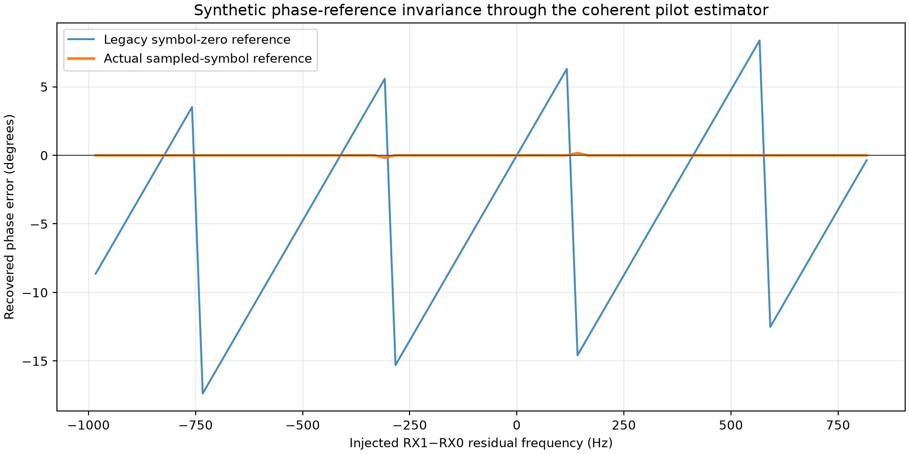
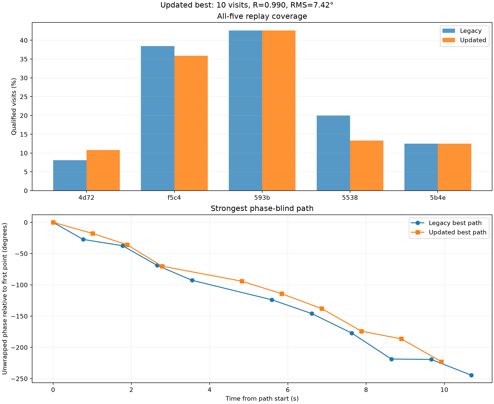
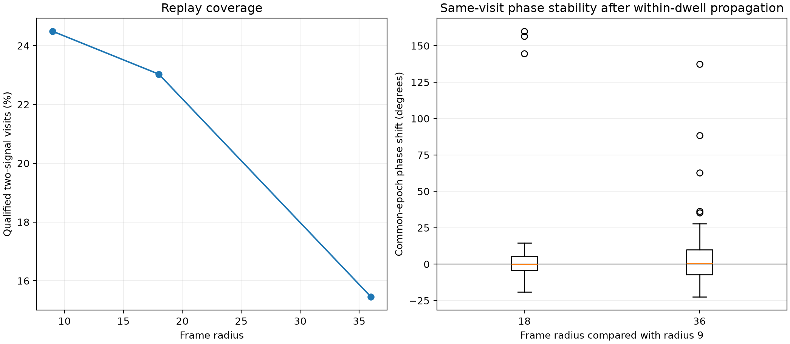

# Adaptive dual-RX phase-reference validation and historical replay

Date: 2026-09-16. Scope: the same five nominal 300-second, 2.5 MS/s,
simultaneous RX0/RX1 adaptive scans used in the phase-recovery report. The raw
recordings were read without modification. No RF was collected.

## Result

The coherent pilot estimator had a second phase-reference inconsistency. It
rotated the selected pilot symbols using lags beginning at zero even though the
correlations use symbols 2 through 65 and each sampled symbol has a specific
energy-weighted epoch. It also retained the nearest 443.9 Hz FFT-bin residual
frequency. The updated estimator:

1. assigns each symbol correlation its energy-weighted sample time relative to
   the frame origin;
2. uses those times for coherent residual-frequency removal;
3. refines the FFT-bin residual continuously; and
4. reports every coherent frame phasor at the frame origin.

Across a synthetic residual-frequency sweep, the legacy convention reaches
17.37 degrees of common-time receiver-phase error. The updated convention stays
within 0.165 degrees. A separate generated-IQ test passes actual Qin pilot
templates through symbol correlation, independent receiver CFO correction,
coherent frame formation, RX1 times conjugate RX0 fitting, and phase restoration.
It recovers the injected phase within 0.03 degrees.



This removes a real estimator bias. It does not solve phase continuity between
adaptive dwells. On the historical data, the strongest path becomes slightly
smoother but shorter, and its held-out prediction does not improve.

## Phase convention

For symbol (k), the old coherent sum used

\[
  C=\sum_k c_k\exp[-j2\pi\hat f(k-k_0)T_s],
\]

with (k_0) implicitly set to the first selected symbol. That makes the output
phase refer to that symbol rather than the Starlink frame origin. It also
ignores the 2.5 MS/s rounding of symbol boundaries.

For template samples (p[n]), the updated effective correlation epoch is

\[
 \tau_k=\frac{1}{f_s}
 \frac{\sum_{n\in k} n|p[n]|^2}{\sum_{n\in k}|p[n]|^2},
\]

and the coherent frame phasor is

\[
 C=\sum_k c_k\exp(-j2\pi\hat f\tau_k).
\]

This references the coherent result to the frame origin. The existing
common-sample restoration remains

\[
 \hat\phi_{10}(t_c)=\arg \hat z(t_c)
 +2\pi[f_{1,a}(t_c-r_1)-f_{0,a}(t_c-r_0)],
\]

where the fitted RX1/RX0 product already contains the individual residual CFO
difference. The residual must not be added again during restoration.

The implementation also replaces greedy RX candidate pairing with an exact
one-to-one assignment for each common receiver-offset hypothesis. A regression
test includes a graph where the formerly preferred edge blocks a two-pair
solution. The five replays retained the same aggregate attempt counts, so this
change hardens ambiguous cases without driving the result reported below.

```text
for each receiver and candidate signal:
    correlate Qin pilot symbols at identical RX0/RX1 sample indices
    compute each correlation's energy-weighted sample epoch
    find a coarse residual CFO by FFT
    refine residual CFO continuously around the winning bin
    rotate correlations to the frame origin and sum them

form RX1 * conjugate(RX0) for each accepted frame
fit receiver-product phase and slope at the dwell center
restore acquired-CFO propagation once at the common sample

for each receiver-offset hypothesis:
    solve the full one-to-one RX0/RX1 candidate assignment
associate visits using frequency, timing, separation, and pilot evidence only
evaluate phase only after the path is frozen
```

## Historical replay

At the nominal 23 ms support, 84 of 343 attempted two-signal visits qualify,
compared with 85 previously. The per-session result is:

| Session | Radio | Updated qualified visits | Longest path | Best increment concentration |
| --- | --- | ---: | ---: | ---: |
| `scan-hop-bfc60ea18ace593b` | `19f2` | 46 / 108 | 10 | 0.990 |
| `scan-hop-ca76f0138c3d5538` | `19f2` | 2 / 15 | none | none |
| `scan-hop-9626fed2bb56f5c4` | `19f2` | 14 / 39 | none | none |
| `scan-hop-ebe72de635485b4e` | `5d4d` | 18 / 144 | 4 | 0.942 |
| `scan-hop-45b79e4e8b5e4d72` | `19f2` | 4 / 37 | none | none |



The updated strongest path covers ten visits and 9.92 seconds:

| Metric | Legacy estimator | Updated estimator |
| --- | ---: | ---: |
| Phase-increment concentration | 0.982 | 0.990 |
| Linear slope | -22.79 deg/s | -21.71 deg/s |
| Linear residual RMS | 7.74 deg | 7.42 deg |
| Weighted residual RMS | 6.91 deg | 7.17 deg |
| Median estimated phase standard error | 4.88 deg | 5.24 deg |
| Forward holdout median absolute error | 1.75 deg | 6.05 deg |
| Forward holdout RMS error | 9.77 deg | 10.65 deg |
| Forward holdout maximum absolute error | 20.68 deg | 19.00 deg |
| Median local-rate propagation error | 82.22 deg | 95.45 deg |

The legacy path contains one additional leading visit, so the prediction rows
are not a paired comparison. They nevertheless prevent a misleading conclusion:
the phase-reference correction improves invariance and local increment
concentration, but it does not provide a better cycle connection across the
roughly one-second revisit gaps.

The updated path still has 0.997 correlation between elapsed time and signal
separation. A linear time trend therefore cannot distinguish geometric phase
evolution from frequency-dependent differential hardware phase in this data.
The zero exceedances among 20,000 within-path phase permutations are descriptive
for the frozen association; they do not account for the exploratory choice of
recordings, thresholds, or path of interest.

## Matched window test

The earlier duration comparison allowed the selected measurements to change.
This replay additionally matches the same session, visit, target, and signal
frequencies across frame radii. Since different windows have different center
epochs, the longer-window estimate is propagated to the radius-9 epoch using
its own within-dwell double-difference rate before comparison.



| Nominal support | Qualified visits | Matched to radius 9 | Median absolute shift | 90th percentile | Within 20 deg |
| --- | ---: | ---: | ---: | ---: | ---: |
| 23 ms, radius 9 | 84 / 343 | reference | reference | reference | reference |
| 47 ms, radius 18 | 79 / 343 | 74 | 5.08 deg | 14.38 deg | 95.9% |
| 95 ms, radius 36 | 53 / 343 | 45 | 9.26 deg | 32.38 deg | 82.2% |

The 47 ms estimator usually agrees with the short estimator after accounting
for the different epoch, but three of 74 comparisons differ by more than 90
degrees and drive a 31.88-degree RMS. Radius 36 has one such outlier and a
29.15-degree RMS. This supports short local windows for the intermittent pilot:
longer support loses coverage and increases the robust phase discrepancy.

## What remains unresolved

The dominant limitation is now frequency precision over the dead time between
visits. A frequency error of only 0.028 Hz accumulates ten degrees in one
second, while producing 0.23 degrees across a 23 ms local fit. The present
recordings can therefore support a useful local phase estimate without
supporting a unique integer-cycle connection to the next dwell.

The next estimator should retain all frame-level complex products and fit the
available signals jointly at their actual timestamps. It should represent a
shared RX1/RX0 LNB phase process, smooth signal-specific phases, and several
integer-cycle hypotheses across gaps. Because those terms are not identifiable
without constraints, evaluation should use injected end-to-end IQ, artificial
gaps cut from continuous historical tracks, and strictly held-out visits.

Uncertainty also remains approximate. Accepted pilot frames can be correlated,
and timing selection reuses some of the data later used for phase. A future
uncertainty estimate should use independent held-out frames or a block bootstrap
and should include frequency/phase covariance.

The evidence supports a corrected local receiver-phase observable and one
smooth exploratory double-difference path. It does not yet establish satellite
identity, integer-cycle continuity, baseline geometry, or separation of
geometric phase from frequency-dependent LNB and RF-path delay.

## Reproduction

The frozen radius-9, radius-18, and radius-36 replay documents are checked in
with the figures. Regenerate the validation summary and plots with:

```bash
.venv/bin/python tools/report_adaptive_dual_rx_phase_validation.py \
  --legacy-dir reports/figures/2026_09_16_adaptive_dual_rx_phase \
  --updated-dir reports/figures/2026_09_16_adaptive_dual_rx_phase_validation/radius-9 \
  --window 9=reports/figures/2026_09_16_adaptive_dual_rx_phase_validation/radius-9 \
  --window 18=reports/figures/2026_09_16_adaptive_dual_rx_phase_validation/radius-18 \
  --window 36=reports/figures/2026_09_16_adaptive_dual_rx_phase_validation/radius-36 \
  --output-dir reports/figures/2026_09_16_adaptive_dual_rx_phase_validation
```

The machine-readable result is the
[validation summary](figures/2026_09_16_adaptive_dual_rx_phase_validation/adaptive-phase-validation-summary.json).
