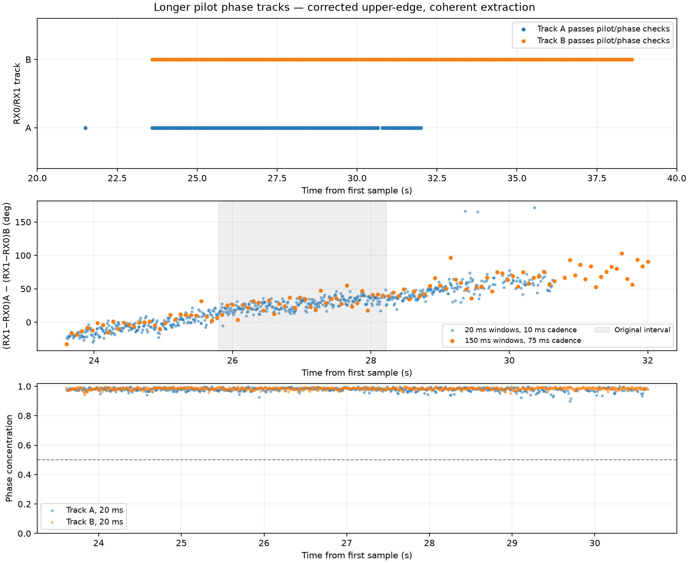
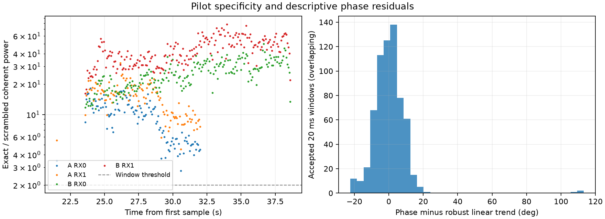

# Longer dual-receiver Starlink pilot phase tracks

**Date:** 2026-09-16. **Status:** measured pilot-relative phase; satellite path geometry remains unverified.

## 1. Result and scope

Re-analysis of an existing 2.5 MS/s recording gives a 15-second receiver-pair track for one signal and a 7.05-second continuous overlap between two signals. Within that overlap, 650 of 704 candidate measurements pass the pilot and phase checks using 20 ms integration at 10 ms cadence. The measured double-difference phase has a descriptive trend of approximately 12.08 degrees/s.

This report supersedes the earlier conversational claim of a recovered 15.3-degree geometric change and a 5.55 cm baseline projection. Those quantities were inferred using an incorrect pilot edge and an insufficiently validated satellite association. They must not be used as path-length or baseline measurements.

The results concern one recording and one radio, not all five previously surveyed recordings or a comparison between radios `19f2` and `5d4d`. No new RF collection was performed.

| Quantity | Measured result |
| --- | --- |
| Raw interval examined | 20–40 s from the first sample |
| Coarse integration / cadence | 150 ms / 75 ms |
| Coarse windows examined | 265 |
| Both tracks accepted | 112 windows |
| Longest joint run | 95 consecutive window centers, 23.60–30.65 s; 7.05 s |
| Additional joint run | 17 centers, 30.80–32.00 s; 1.20 s |
| Track B alone | 201 consecutive centers, 23.60–38.60 s; 15.00 s |
| Fine integration / cadence | 20 ms / 10 ms; 100 candidate points/s |
| Fine interval examined | 23.60–30.65 s |
| Fine windows accepted jointly | 650 / 704, approximately 92.3% |
| Median fine phase concentration | A: 0.982; B: 0.985 |
| Robust descriptive phase slope | 12.08 degrees/s |
| Fitted change over accepted fine span | 84.70 degrees |
| Robust residual scatter | 7.41 degrees, MAD-based scale |
| Fine vs nearest coarse circular RMS difference | 14.00 degrees |

Durations in the table are between window centers. A 150 ms window extends beyond its center. Overlapping windows share data: cadence is not independent time resolution, and the fine run has rejected windows. No integer cycle connection is asserted across gaps.



**Figure 1.** Top: each signal's RX0/RX1 acceptance across the 20-second scan. Middle: accepted double-difference phase using two integration lengths; shading marks the original 25.8–28.225 s interval. Bottom: fine-window phase concentration. High concentration measures agreement with a locally fitted phase rotation; it is not a calibrated probability of correct satellite identification.

## 2. Recording, tuning, and sample alignment

- Capture: `cap-20260825T105915-2770b84587cc`, recorded 2026-08-25.
- Radio: `radio_pluto_5d4d`, stream 0, RX0 and RX1 on a shared radio clock.
- Physical setup supplied by the operator: two separate LNBs, separated by a few centimeters and pointing approximately upward. No surveyed baseline vector or receiver-chain calibration is available.
- Applied sample rate and bandwidth: 2,500,000 samples/s and 2,500,000 Hz.
- Applied IF center: 1,940,312,500 Hz. Assuming the nominal 9.75 GHz LNB LO, this corresponds to 11,690,312,500 Hz, channel 4 **upper** edge. Nominal RF is not a calibrated frequency measurement.
- The capture profile's nominal/requested description names a different tuning. The applied stream settings govern the analysis.
- Stored IQ: Zstandard-compressed little-endian signed 16-bit interleaving `[I0,Q0,I1,Q1]`. Both receivers are read from the same row of the same sample stream.
- Raw manifest: `/srv/bulk/leo/recordings/2026/08/25/cap-20260825T105915-2770b84587cc/manifest.json` (local corpus, not included in Git).
- First-sample UTC estimate: `1787655558416073733` ns, using the manifest's device-counter-anchored estimate.

For a given track, the timing search selects one frame-start sample index and applies it to **both** RX0 and RX1. There is no independent receiver timing shift in this procedure. A and B have different frame epochs; their receiver-relative phases are fitted to the same window-center time before subtraction.

Sample-index alignment establishes simultaneous digitizer samples. It does not remove unequal analog group delay, LNB phase noise, or cable phase.

## 3. What phase is observable?

Let $r\in\{0,1\}$ index receivers, $k\in\{A,B\}$ index signals, $\mathbf b=\mathbf r_1-\mathbf r_0$ point from RX0 to RX1, and $\mathbf s_k(t)$ be a unit vector toward the transmitter. A narrowband received signal may be written as

$$
x_{rk}(t)=a_{rk}(t)p_k(t-\tau_{rk})
\exp\{j[\phi_{T,k}(t-\tau_{rk})-2\pi f_k\tau_{rk}-\theta_r(t)+h_r(f_k)]\}+n_{rk}(t).
$$

Here $p_k$ is the known pilot, $\theta_r$ contains the LNB/radio oscillator phase, and $h_r$ is a receiver-chain phase response. With the far-field approximation and negligible transmitter-phase change over the inter-antenna delay, the single-signal receiver phase is approximately

$$
\delta_k(t)=\arg[x_{1k}(t)x_{0k}^*(t)]
\simeq \frac{2\pi f_k}{c}\mathbf b\cdot\mathbf s_k(t)
-[\theta_1(t)-\theta_0(t)] + H_k(t)\pmod{2\pi}.
$$

Different LNBs can contribute both a fixed phase and a rotating term. A stable frequency offset produces a *linear phase ramp*, not constant relative phase. The shared radio clock does not independently stabilize the two LNB oscillators.

The measured double difference is

$$
D(t)=\operatorname{wrap}[\delta_A(t)-\delta_B(t)].
$$

Ideally, evaluating both signals at the same time cancels the common oscillator term:

$$
D(t)\simeq\frac{2\pi}{c}\mathbf b\cdot[f_A\mathbf s_A(t)-f_B\mathbf s_B(t)]
+H_A(t)-H_B(t)\pmod{2\pi}.
$$

For sufficiently close RF frequencies, the geometric part is often approximated as $2\pi\mathbf b\cdot(\mathbf s_A-\mathbf s_B)/\lambda$. Cancellation in these finite-window estimates is approximate: the signals can have different accepted frames, weights, and residual phase fluctuations.

The hardware difference $H_A-H_B$ need not be constant. For example, a differential group delay $\Delta\tau_g$ contributes approximately $-2\pi\Delta\tau_g(f_A-f_B)$; its phase changes when signal separation changes, even if the delay itself is stable. Therefore a smooth $D(t)$ alone does not establish a geometric path change.

## 4. Frozen frequency and timing models

The local frequency model is $f_{rk}(t)=a_{rk}(t-t_{0,rk})+b_{rk}$, in Hz. Its phase convention is

$$
\psi_{rk}(t)=2\pi\left[\tfrac12a_{rk}(t-t_{0,rk})^2+b_{rk}(t-t_{0,rk})\right].
$$

| Track / receiver | Reference time (s) | Slope (Hz/s) | Frequency at reference (Hz) |
| --- | ---: | ---: | ---: |
| A / RX0 | 25.800 | −3514.6676537163635 | 372727.86206062447 |
| A / RX1 | 23.650 | −3522.9132283698773 | −180335.85438927953 |
| B / RX0 | 23.625 | −3894.0112036045334 | 490104.87639001757 |
| B / RX1 | 25.175 | −3885.094498606725 | −76458.44384059052 |

The frame epochs are sample **67,500,908** for A and **67,501,006** for B. Predicted frame starts follow $e_k+\operatorname{round}(m f_s/750)$; the timing search adds an integer shift. These are acquisition coordinates, not propagation delays or satellite identifiers.

The source trajectory IDs are:

```text
A RX0 sha256:122edcd9c395365063af40dc7c913ac40bc787c484cdc815f4bcb91801411c48
A RX1 sha256:3620b4b786ddcf51360d6db4de3ebda150f92ae2257b7c2fe2cf01a0adf9f5fc
B RX0 sha256:462d34badcd69ff580b5b43e11f4082aff5e7f86d4d0bc6edd9e6b8107f214fe
B RX1 sha256:7451f5760a31f17ed36bf15c8a3b52444989e9849759f6f8e7e9161d834670ce
```

The original model supports are A RX0: 25.8–28.225 s; A RX1: 23.65–30.425 s; B RX0: 23.625–47.425 s; B RX1: 25.175–36.0 s. Parts of the extended scan extrapolate these models. Acceptance is reassessed from raw pilot evidence in each window; the model support alone does not validate the extension or resolve CFO aliases.

## 5. Coherent pilot extraction

The implementation uses the repository's Qin upper-edge pilot template and a control with the pilot symbol sequence rolled by 17. It correlates template symbols 2 through 65 inclusive: 64 symbols of 4.4 microseconds each, approximately 281.6 microseconds per frame. At 2.5 MS/s, each symbol contains 11 samples.

For frame $m$ and symbol $\ell$, after derotating the frozen model:

$$
c_{rkm\ell}=\sum_{n\in I_{km\ell}}x_r[n]p_k^*[n-e_{km}]
\exp[-j\psi_{rk}(n/f_s)].
$$

Combine the symbols **before** forming a receiver product:

$$
C_{rkm}=\sum_{\ell=2}^{65}c_{rkm\ell},\qquad
z_{km}=C_{1km}C_{0km}^*.
$$

This coherent sum retains the pilot sequence's discrimination. Multiplying receiver correlations independently for every symbol can cancel the template's symbol phase and admit unwanted signal components. The earlier symbolwise measurement therefore did not provide sufficient evidence of distinct pilot tracks.

Timing is trained only on RX0: search shifts from −80 through +80 samples and maximize summed coherent pilot power on the frames at integer indices $\lfloor N/4\rfloor$, $\lfloor N/2\rfloor$, and $\lfloor3N/4\rfloor$. Exclude those three frames from subsequent measurements. The same chosen shift applies to both receivers. The holdout is local to each window; overlapping windows reuse samples.

Define a per-frame concentration of the 64 symbol correlations:

$$
q_{rkm}=\frac{|C_{rkm}|^2}{64\sum_\ell|c_{rkm\ell}|^2}.
$$

A frame passes when both receivers satisfy $|C|^2>4|C_{\mathrm{control}}|^2$ and $q>0.1$. Form weights $w_m=\sqrt{q_{0km}q_{1km}}$ and unit phasors $u_m=z_{km}/|z_{km}|$. Fit the residual frequency at window center $t_c$:

$$
\widehat\nu_k=\underset{\nu\in[-375,375]}{\arg\max}
\left|\sum_m w_m u_m\exp[-j2\pi\nu(t_m-t_c)]\right|.
$$

The search uses 1 Hz grid spacing, followed by 44 golden-section iterations within two grid steps of the best bin, clipped to the search bounds. Frame times are the mean symbol sample times. The 750 Hz frame cadence makes frequency aliases a material concern; searching this interval does not resolve absolute frequency ambiguity.

The fitted phase and its concentration are

$$
\widehat\alpha_k=\arg\sum_mw_mu_me^{-j2\pi\widehat\nu_k(t_m-t_c)},
\qquad R_k=\frac{|\sum_mw_mu_me^{-j2\pi\widehat\nu_k(t_m-t_c)}|}{\sum_mw_m}.
$$

Restore the frozen models' phase origins before subtracting tracks:

$$
\widehat\delta_k(t_c)=\operatorname{wrap}\left[
\widehat\alpha_k+\psi_{1k}(t_c)-\psi_{0k}(t_c)\right],
\quad \widehat D(t_c)=\operatorname{wrap}[\widehat\delta_A(t_c)-\widehat\delta_B(t_c)].
$$

This restoration is necessary because different trajectory models use different reference epochs.

## 6. Acceptance criteria and pseudocode

In addition to the frame checks, a track window passes only when:

1. At least 12 frames pass for a 150 ms window, or 5 for a 20 ms window.
2. In **each receiver**, the ratio of summed coherent exact-pilot power to summed control power exceeds 2, evaluated over all held-out frames before frame rejection.
3. The fitted phase concentration exceeds 0.5.
4. The chosen timing shift is strictly inside ±80 samples.

These thresholds are exploratory quality criteria. They are not a calibrated false-positive rate, and $R$ is computed after fitting frequency on the same accepted frames.

```text
read aligned RX0, RX1 IQ and applied tuning from the capture manifest
build upper-edge exact pilot and symbol-roll-17 control

for each window center:
    for each candidate signal A, B:
        predict frame starts from its epoch and 750 Hz frame cadence
        choose three training frames
        for common timing shift in [-80, ..., +80] samples:
            score coherent 64-symbol RX0 pilot power on training frames
        choose the shift with maximum score
        exclude the training frames

        for each remaining frame and receiver:
            use identical RX0/RX1 sample indices
            derotate that receiver's frozen frequency model
            correlate 64 symbols with exact and control templates
            sum symbol correlations coherently
            compute symbol concentration q

        compute exact/control power ratio before rejecting frames
        reject frames failing either receiver's pilot or q checks
        if enough frames remain:
            form C_RX1 * conjugate(C_RX0)
            fit residual rotation and phase at the window center
            restore the frozen model phase difference at that center
        apply track-window checks and retain the rejection status

    if both tracks pass:
        retain wrap(receiver_phase_A - receiver_phase_B)
    otherwise:
        leave a gap; do not invent a phase connection
```

## 7. Pilot specificity, residuals, and time scales

Median **ungated** coherent exact/control power ratios in accepted coarse windows are:

| Signal | RX0 | RX1 |
| --- | ---: | ---: |
| A | 9.98 | 15.24 |
| B | 25.28 | 42.12 |

“Ungated” here means before rejecting individual held-out frames, within a window that subsequently passes the window criteria. This is stronger evidence than comparing exact and control only after selecting symbols where exact already wins.



**Figure 2.** Left: coherent exact/control ratios for accepted coarse windows. Right: the 650 accepted fine-window double differences after subtracting a robust straight-line description. The histogram includes outliers and overlapping observations; it is not a distribution of independent geometric-phase errors.

The descriptive line uses iteratively reweighted least squares with Huber-style weights, cutoff 1.345 times a MAD-based scale, for 20 iterations. The raw accepted phase values lie within a single displayed branch; no gap-spanning unwrap is used for this fit. Its 12.08 degrees/s slope corresponds to 84.70 degrees across the accepted fine-window span. This is not an orbit fit. No baseline is inferred from the slope.

The fine and coarse measurements agree in overall trend but differ by 14.00 degrees circular RMS when each fine estimate is paired to the nearest accepted coarse center within 40 ms. They share raw samples and therefore provide a sensitivity check rather than independent replication. The coarse integration reduces fluctuations while the 20 ms integration exposes occasional outliers. No periodic component has been established by this analysis; the visible structure is a secular rise with residual fluctuations.

## 8. Why the earlier geometric interpretation was withdrawn

Two errors materially affected the earlier interpretation:

1. **Pilot/tuning mismatch.** The extractor synthesized lower-edge pilots although the applied stream tuning is the upper edge. The corrected extraction uses upper-edge pilots and coherent sequence discrimination.
2. **Incomplete orbital association.** The proposed pair, NORAD 68046 and 59166, was ranked by frequency separation without requiring compatible individual Doppler slopes. At the earlier assumed RF, their predicted slopes were approximately −1260 and −1736 Hz/s, versus observed trajectory slopes of −3515 and −3894 Hz/s. Changing the RF by approximately 2% cannot explain that discrepancy. An unmodeled oscillator drift could affect slopes, but was not independently established to reconcile this pair.

The 82 Hz separation-fit RMS previously quoted did not establish satellite identities. Consequently neither the 15.3-degree “geometric recovery” nor the 5.55 cm projection and its confidence interval are valid conclusions. The longer corrected pilot measurement supports a changing receiver-phase double difference; its geometric attribution remains open.

## 9. Limits and next discriminating measurements

- Validate satellite and frequency-alias assignments jointly with both individual frequency histories, their separation, and plausible oscillator drift.
- Establish stability under timing offsets, narrower sub-bands, alternate pilot subsets, and additional control sequences. A single scrambled control does not exclude every leakage or multipath explanation.
- Measure or constrain differential receiver group delay and its frequency dependence. Stable hardware delay can still create a changing phase bias as the two signal frequencies move.
- Use a surveyed RX0-to-RX1 baseline vector and receiver-chain phase calibration to test a predicted geometric curve. Absolute phase remains modulo $2\pi$ without additional ambiguity information.
- Qualifying one signal for 15 seconds does not extend two-signal oscillator cancellation through that whole interval. Track A is the limiting signal here.

## 10. Reproduction and provenance

The committed data contain all candidate coarse and fine windows, including rejection flags, accepted frame counts, timing shifts, exact/control ratios, fitted residual frequencies, concentrations, and phases. No raw IQ is included.

- [Coarse measurements](figures/2026_09_16_dual_rx_pilot_phase/105915-coherent-pilot-20s.json)
- [Fine measurements](figures/2026_09_16_dual_rx_pilot_phase/105915-coherent-pilot-20ms.json)
- [Machine-readable summary](figures/2026_09_16_dual_rx_pilot_phase/105915-coherent-extension-summary.json)
- [Figure and summary reproduction script](figures/2026_09_16_dual_rx_pilot_phase/reproduce_figures.py)

From a Python environment with NumPy and Matplotlib, regenerate both figures and the numerical summary without hardware, network access, PostgreSQL, or the raw corpus:

```bash
python reports/figures/2026_09_16_dual_rx_pilot_phase/reproduce_figures.py
```

This command reproduces the presentation and summary from the committed measurements, not the raw-IQ extraction. Reimplementing the extraction requires the local corpus and the models, thresholds, and pseudocode above. Repository numerical references are [pilot templates](../src/leo/analysis/starlink/templates.py) and [polynomial frequency/phase conventions](../src/leo/analysis/starlink/kalman_tracking.py). The template source identifies the Qin Appendix-A pilot states and their provenance.

The extraction's vectorized symbol correlations were checked against the earlier scalar implementation on real IQ at numerical tolerance before the extended runs. Publication checks regenerate figures and summary, reconcile acceptance counts and run lengths with the stored windows, and validate local report links. This report adds research documentation and artifacts; it does not change a production analyzer or a public persisted contract.
