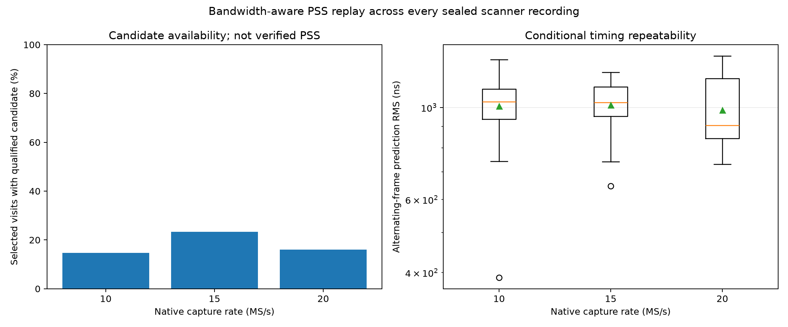
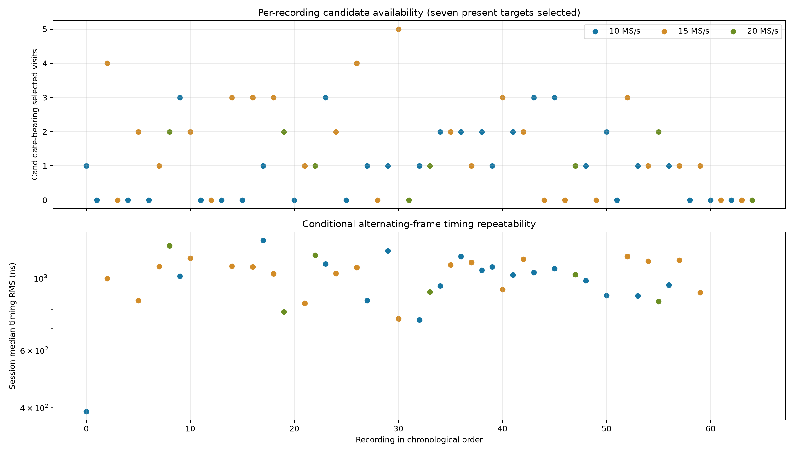

# PSS and frame-timing replay across the 10/15/20 MS/s scanner corpus

This report applies the reusable bandwidth-aware PSS acquisition and causal
tracking code to every sealed RX0 recording in the frozen 16-hour scanner cohort:
**65 recordings, 30 at 10 MS/s, 27 at 15 MS/s, and 8 at 20 MS/s**. No RF was
collected. All inputs use radio `104000bac4950008230026001b440a003a`, RX0.

The result is clear: the current recordings contain many PSS-like candidate
modes and some temporally stable tracks, but their measured frame timing is only
about **one microsecond repeatable**, not the 3–5 ns seen in the earlier clean
native-25 experiment. Pilot-only controls are already known to create stable
tracks in this engine, so these results do not verify PSS presence.

## Protocol

For the rate comparison, one retained 120 ms visit per present target in every
recording was chosen by the minimum SHA-256 of a frozen salt, capture-manifest
digest, and visit index. Selection is independent of GLRT and PSS outcomes. The
corpus contains seven present targets per session, giving **455 comparison
visits**.

Each visit uses its native 10, 15, or 20 MS/s IQ and actual center frequency.
`PssCaptureBand` constructs the observable PSS-channel template for the full
declared receiver passband. Thirteen independent blind timing searches cover
−1.2 to +1.2 MHz CFO in 200 kHz steps. The analogue response is not calibrated;
the replay assumes an ideal rectangular passband.

Timing repeatability uses the strongest qualified mode in each passing visit.
A line is fitted to alternating PSS frame windows and evaluated on the held-out
windows. The resulting RMS measures prediction of frame phase inside one
continuous 120 ms visit. It is conditional on selecting a qualified mode.

For causal tracking, the replay also processes the first six retained visits per
target at or after 120 seconds in every recording. Each receiver/target/clock
binding has a separate `PssTracker`; gaps are preserved and no future sample is
used for an earlier update.

## Results by native sample rate

| Rate | Recordings | Candidate visits | Recordings with candidate | Conditional timing RMS, median | 10th–90th percentile | Recordings reaching `tracking` | Tracking updates |
|---|---:|---:|---:|---:|---:|---:|---:|
| 10 MS/s | 30 | 31/210 (14.76%) | 18/30 | **1,032 ns** | 840–1,159 ns | 17/30 | 88 |
| 15 MS/s | 27 | 44/189 (23.28%) | 19/27 | **1,029 ns** | 782–1,162 ns | 15/27 | 114 |
| 20 MS/s | 8 | 9/56 (16.07%) | 6/8 | **905 ns** | 789–1,209 ns | 5/8 | 55 |



The three timing distributions overlap strongly. The 20 MS/s median is
numerically lower, but it is based on nine timed visits from eight recordings.
This corpus does not establish a sample-rate advantage. Fifteen MS/s has the
highest candidate rate, but the rates occupy different wall-clock slots and see
different signals and interference, so that is not a controlled sensitivity
comparison.

The tracker’s internal timing uncertainty on updates in `tracking` state has
medians of **788 ns at 10 MS/s, 761 ns at 15 MS/s, and 781 ns at 20 MS/s**.
Those values agree with the held-out frame-window residual scale, but they are
engineering uncertainty states rather than calibrated confidence intervals.

## Recording-by-recording result



Candidate support is intermittent. A typical recording contains zero or one
candidate-bearing comparison visit; a few contain three to five. The complete
[per-recording ledger](figures/2026_09_18_sixteen_hour_rx0_multirate_pss_glrt_tle/pss-multirate/pss-sessions.csv)
lists all 65 recordings, their selected/candidate/timed visit counts, median
timing RMS, causal tracking updates, and targets reaching tracking. The
[per-visit ledger](figures/2026_09_18_sixteen_hour_rx0_multirate_pss_glrt_tle/pss-multirate/pss-visits.csv)
retains source manifest and chunk digests, frequency, frame phase, score, mode
count, and timing residual. The [causal update ledger](figures/2026_09_18_sixteen_hour_rx0_multirate_pss_glrt_tle/pss-multirate/pss-tracking.csv)
contains all 2,730 tracker updates.

## What “timing accuracy” means here

The PSS waveform repeats on the 750 Hz frame lattice, every 1.333333 ms. The
replay estimates a template-relative phase within that period. Its approximately
1 µs held-out residual means that, after choosing a mode, the next alternating
frame window is typically predicted to roughly one microsecond. It does **not**
identify the absolute frame number, calibrate receiver group delay, provide UTC
at that precision, or establish propagation time.

At light speed, 1 µs corresponds to about 300 m of one-way range, but converting
this result into a ranging error would be invalid: instrument delay, transmitter
timing, absolute frame ambiguity, and candidate identity are unresolved. The
roughly 0.21 s capture UTC brackets are also many orders of magnitude wider.

This result must be kept separate from the known-delay GLRT refinement result of
1–3 ns. That GLRT experiment injects a shift into the same IQ and asks whether
the estimator recovers it around an already associated pilot. The PSS replay is
a blind acquisition problem with competing frequency and timing modes.

## Comparison with previous PSS reports

The September 12 paired five-dwell study reported **3.18–5.12 ns** conditional
native-25 PSS timing residuals after a causal ±120 ns acceptance gate. Those
captures provided a coherent high-quality PSS track and used a different,
favorable conditional subset. The present scanner corpus is about 200–300 times
less repeatable. More native bandwidth alone therefore does not guarantee the
earlier precision; the dominant present limitation is selecting a clean PSS
mode rather than raw sample spacing.

The September 15 bandwidth replay already showed why acceptance must remain
conservative: pilot-only IQ produced qualified candidates and stable tracker
updates in both native and derived bandwidths. The current finding that 37 of 65
recordings reach `tracking` is evidence of temporal consistency, not proof that
37 recordings contain PSS. A repeating edge pilot or other structured signal
can satisfy the same tracker.

## Supported conclusion

For these recordings, the defensible PSS/frame-timing capability is:

* detect candidate modes in roughly 15–23% of outcome-independent selected
  visits, depending on rate;
* maintain candidate-only causal tracks in 37 of 65 recordings;
* estimate frame phase with approximately **0.9–1.0 µs conditional held-out
  repeatability**;
* make **no verified PSS detection, absolute frame, UTC, range, or satellite
  identity claim**.

Improving this requires a discriminant that rejects pilot-only controls, followed
by the same frozen replay. Once a candidate is independently verified as PSS,
receiver-response and group-delay calibration are required before interpreting
template timing as arrival time.

## Reproduction

```bash
PYTHONPATH=src OPENBLAS_NUM_THREADS=1 OMP_NUM_THREADS=1 python \
  tools/replay_multirate_scanner_pss.py \
  --input reports/figures/2026_09_18_sixteen_hour_rx0_multirate_pss_glrt_tle \
  --output reports/figures/2026_09_18_sixteen_hour_rx0_multirate_pss_glrt_tle/pss-multirate \
  --workers 8
```

The replay is resumable by session. `--aggregate-only` regenerates the CSV,
JSON, and PNG products without reading IQ. The frozen machine-readable result is
[pss-summary.json](figures/2026_09_18_sixteen_hour_rx0_multirate_pss_glrt_tle/pss-multirate/pss-summary.json).
