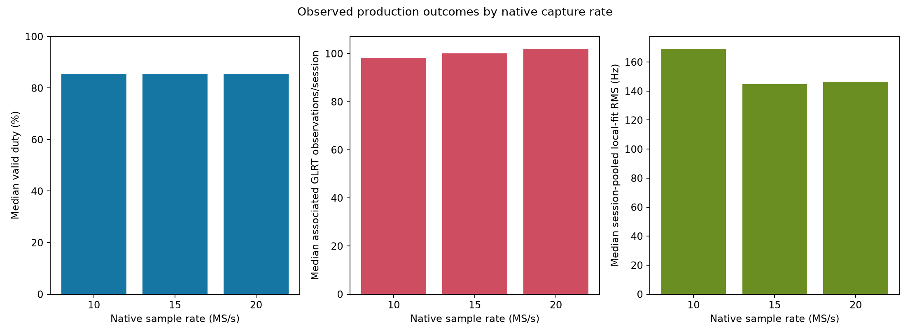
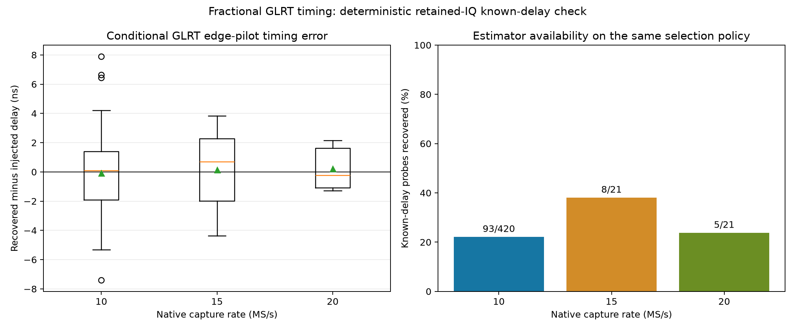
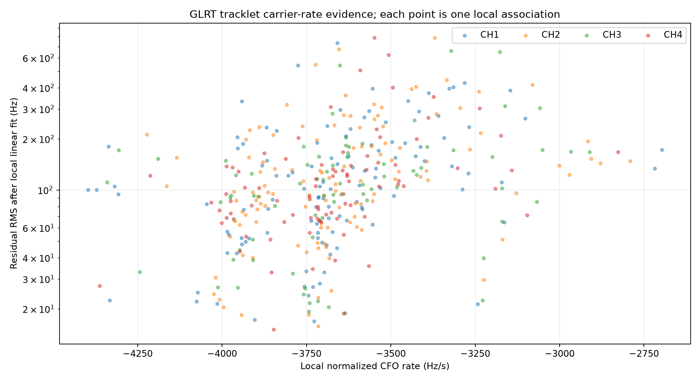
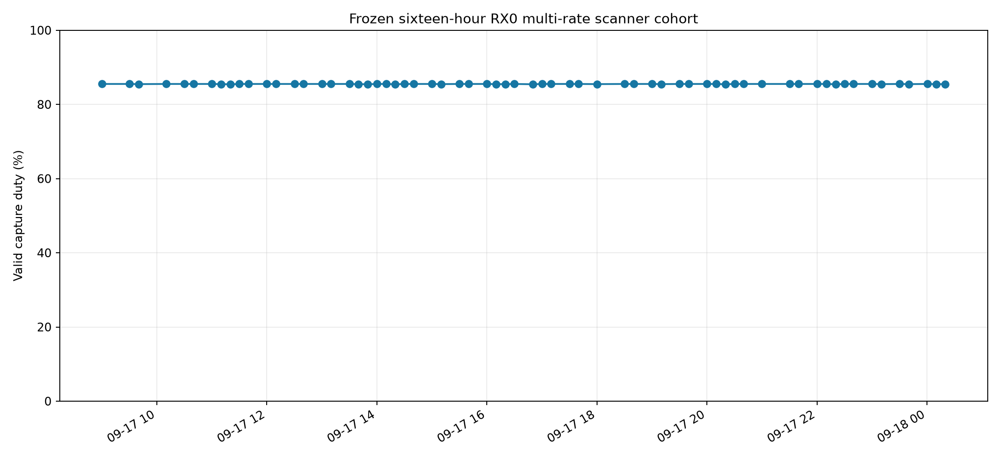
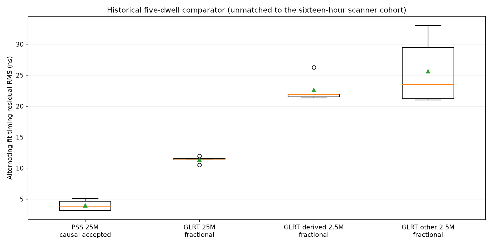
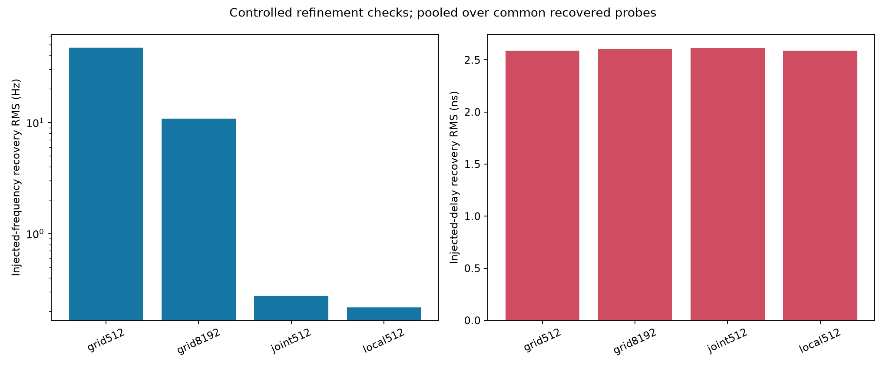

# Sixteen-hour RX0 multi-rate scanner: GLRT, PSS, Doppler, and Starlink TLE evidence

This report freezes sealed scanner captures whose first-sample UTC estimate lies
in **2026-09-17 09:00:00 UTC through 2026-09-18 01:00:00 UTC, end exclusive**.
It uses the standard capture, adaptive-overview, shared-tracking-v2, and
controlled-refinement products. No new RF was collected. Every included capture
uses radio `104000bac4950008230026001b440a003a`, physical RX0, and one of the
10, 15, or 20 MS/s production profiles.

The principal result is that the scanner reconstructs substantial, smooth
Doppler-like carrier evidence at every rate, but **none of these 65 sessions can
make a defensible Starlink catalogue association**. Firmware v0.52 supplies
device-counter-relative timing, while the host UTC brackets are 212.6–218.7 ms
wide. The frozen catalogue scorer requires qualified absolute UTC and therefore
attempted zero TLE comparisons. This is an absolute-time-authority limitation,
not a failure to find local trajectories.

## Results by native capture rate

The schedule assigned one slot per rate every 30 minutes, or 32 opportunities
per rate. Successful captures have nearly identical retained-IQ duty. Completion
reliability, especially at 20 MS/s, is the large operational difference.

| Native rate | Sealed / scheduled | Median valid duty | Complete visits | Completed trajectories | Tracklets | Median associated observations/session | Median session-pooled local-fit RMS |
|---|---:|---:|---:|---:|---:|---:|---:|
| 10 MS/s | 30 / 32 (93.75%) | 85.52% | 64,139 | 30 / 30 | 197 | 98 | 169.15 Hz |
| 15 MS/s | 27 / 32 (84.38%) | 85.52% | 57,717 | 27 / 27 | 158 | 100 | 144.67 Hz |
| 20 MS/s | 8 / 32 (25.00%) | 85.44% | 17,090 | 7 / 8 | 42 | 102 | 146.36 Hz |

Across all rates, the 65 sealed recordings retain 16,673.52 seconds of valid IQ
and contain 138,946 complete visits. Shared tracking reconstructs 397 tracklets
from 7,017 selected GLRT CFO observations. Median tracklet residual RMS about
its own local linear carrier model is **106.45 Hz** (10th–90th percentile
35.16–278.18 Hz). Median session-pooled RMS is **159.56 Hz**, with a
session-bootstrap 95% interval of 143.79–185.60 Hz.



The 15 and 20 MS/s RMS medians are numerically below the 10 MS/s median, but this
is **not a controlled bandwidth gain**. Different rates occupy different wall
clock slots and therefore observe different satellites, elevations, channels,
interference, and adaptive histories. The 20 MS/s estimate has only eight
sessions. Moreover, the standard GLRT path works on the rate-normalized pilot
representation; native bandwidth mainly changes retained context and capture
reliability. These data show no evidence that a higher native rate improves the
GLRT carrier estimate. They also do not show degradation among successful
captures.

### Fractional edge-pilot frame timing

A deterministic known-delay replay measures timing directly: apply a declared
30–300 ns fractional delay to retained IQ, rerun the production grid512
fractional GLRT estimator, and subtract the declared delay from the recovered
epoch change modulo the 750 Hz frame period. The left panel is conditional on
recovering the same qualified candidate; the right panel prevents that
conditioning from being hidden.



| Native rate | Qualified / attempted probes | Conditional delay RMS | Median absolute error | 90th-percentile absolute error |
|---|---:|---:|---:|---:|
| 10 MS/s | 93 / 420 (22.14%) | 2.59 ns | 1.55 ns | 4.21 ns |
| 15 MS/s | 8 / 21 (38.10%) | 2.69 ns | 2.37 ns | 4.00 ns |
| 20 MS/s | 5 / 21 (23.81%) | 1.43 ns | 1.30 ns | 1.94 ns |

The result to retain is **roughly 1–3 ns conditional frame-epoch precision**
when the edge pilot is strong enough to recover. At 10 and 15 MS/s the measured
RMS is effectively the same. The 20 MS/s subset is numerically tighter, but five
recovered probes are insufficient to claim a sample-rate improvement. The
larger 10 MS/s inventory comes from all 30 standardized refinement products;
15 and 20 MS/s use three deterministic sessions each, so availability percentages
are descriptive rather than population detection probabilities.

This is relative delay recovery on the same IQ, not absolute UTC accuracy and
not a bound on the 1.333 ms frame number. Higher native rates give finer raw
sample spacing (100, 66.7, and 50 ns), but interpolation of the full edge-pilot
waveform provides the nanosecond-scale conditional estimate. Signal quality and
correct candidate association dominate simple sample spacing.



The successful-session duty distribution is extremely narrow: 85.44–85.52%.
The missing 31 scheduled products must not be folded into that duty statistic.
Doing so would mix acquisition reliability with within-session retained-IQ
coverage. The schedule yield is 65/96 overall, driven by 20 MS/s failures and
sparse captures that never became sealed analysis sessions.



## Starlink TLE association

Sixty-four sessions produce valid relative trajectories. One 20 MS/s session
reports `no-trajectory` because no alias-aware track met the frozen geometry
thresholds. The 64 valid products expose 19 geometrically eligible physical
groups and would project 68,414 catalogue candidates before limiting, but the
standard scorer stops before any comparison because their absolute UTC is not
qualified. Consequently:

| Catalogue quantity | Result |
|---|---:|
| Sessions with `tle_state=unavailable` | 65 / 65 |
| TLE group comparisons attempted | 0 |
| Candidate rows | 0 |
| Identity claims | 0 |

It would be misleading to rank satellites or publish top-versus-runner-up RMS
for this window. At Starlink LEO velocities, a 0.21 s epoch uncertainty moves the
predicted Doppler curve enough to dominate the hundred-hertz-scale local fit.
Allowing a free time shift would make many nearby Starlink orbits look compelling
on a 30–40 s segment and would train away the very quantity needed to distinguish
them. The correct next scientific step is to qualify the v0.52 capture epoch or
bind an independently measured clock offset, then rerun the unchanged scorer.

This differs from the earlier 10 MS/s tracking report, where qualified host
brackets allowed some catalogue scoring. Even there, all 20 candidate rows
recommended abstention and failed the radio-polynomial heldout control. Smooth
visual overlays established Doppler-like tracking, but did not establish
identity. The present window improves local trajectory residuals (106 Hz median
tracklet RMS versus 205 Hz in that older eight-hour cohort), while losing the
absolute time authority required for any catalogue test.

## PSS evidence

The current production profiles publish edge-pilot GLRT products and **no PSS
products**. There are therefore zero current-window PSS observations at 10, 15,
or 20 MS/s, and no honest within-window rate comparison is possible.

The closest controlled evidence remains the September 12 same-ADC five-dwell
experiment. Native 25 MS/s PSS achieved 3.18–5.12 ns conditional timing residual
RMS after its causal acceptance gate. Fractional GLRT produced 10.53–11.94 ns at
native 25 MS/s, 21.34–26.27 ns after deriving 2.5 MS/s from the same ADC, and
21.02–33.02 ns on the other 2.5 MS/s radio. This supports wider bandwidth for
PSS/frame timing because it preserves a sharper correlation feature. It does
not predict a 10-versus-15-versus-20 MS/s production result without running the
same PSS estimator on matched IQ.



The previous 2.5 MS/s production rollout reported 94.53% capture duty, higher
than the present firmware schedule's 85.5%, but it used a different transport,
visit plan, and scanner generation. It is useful as an operational baseline,
not a controlled detector comparison. The matched experiment above is the
appropriate evidence for bandwidth-dependent timing.

## Controlled refinement and presentation completeness

Thirty 10 MS/s sessions have controlled shift-recovery products. On common
recovered probes, injected-delay RMS is 2.59–2.61 ns across the four refinement
profiles. For injected frequency, `joint512` and `local512` recover 0.277 Hz and
0.217 Hz pooled CFO RMS respectively; grid-only profiles are less precise.
These synthetic same-probe results test numerical refinement, not satellite
identity or absolute UTC.



All 65 sessions have the three standard adaptive overview PNGs. Sixty-four have
a trajectory PNG; the sole exception is the truthful 20 MS/s `no-trajectory`
session. The two refinement PNGs exist for all 30 sessions for which refinement
was scheduled. The frozen [PNG inventory](figures/2026_09_18_sixteen_hour_rx0_multirate_pss_glrt_tle/png-inventory.csv)
records each session.

## Reproduction and evidence

Run the frozen analyzer against the retained production corpus:

```bash
sudo env MPLBACKEND=Agg /opt/leo-tracker/current-api/.venv/bin/python \
  reports/figures/2026_09_18_sixteen_hour_rx0_multirate_pss_glrt_tle/analyze_window.py \
  --output reports/figures/2026_09_18_sixteen_hour_rx0_multirate_pss_glrt_tle
```

The output includes [summary.json](figures/2026_09_18_sixteen_hour_rx0_multirate_pss_glrt_tle/summary.json),
[session rows](figures/2026_09_18_sixteen_hour_rx0_multirate_pss_glrt_tle/sessions.csv),
[tracking-session rows](figures/2026_09_18_sixteen_hour_rx0_multirate_pss_glrt_tle/tracking-sessions.csv),
[tracklets](figures/2026_09_18_sixteen_hour_rx0_multirate_pss_glrt_tle/tracklets.csv),
and a [source-manifest ledger](figures/2026_09_18_sixteen_hour_rx0_multirate_pss_glrt_tle/source-manifests.csv).
The empty TLE candidate CSV is intentional evidence that the standard scorer
made no catalogue comparison; it is not a missing export.
