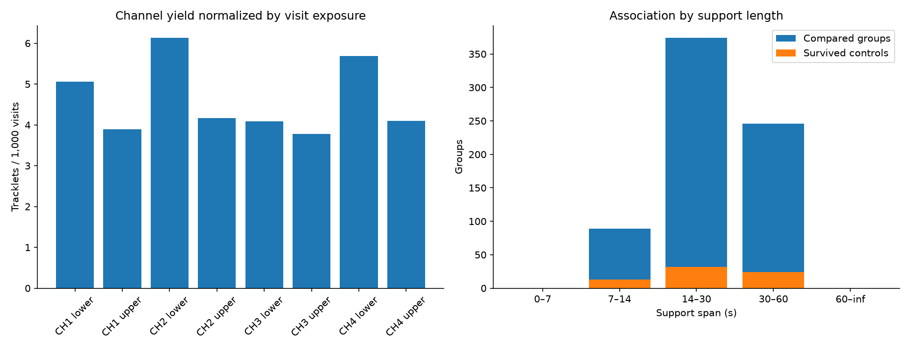
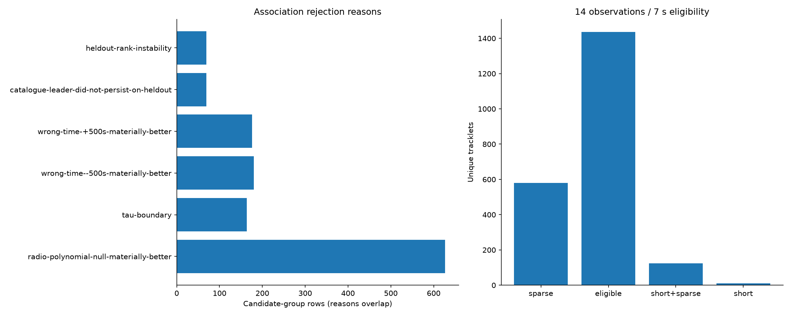
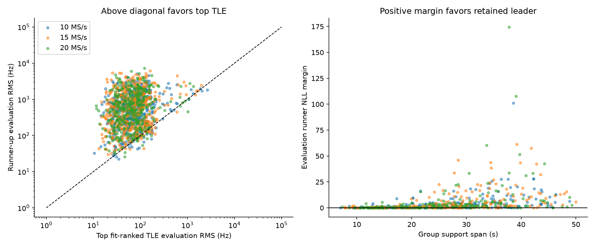

# Adaptive scanner: comprehensive 48-hour audit

Frozen capture window: **2026-09-18T01:38:00+00:00 to 2026-09-20T01:38:00+00:00**. Selection uses the capture publication index timestamp. No new RF was acquired for this report. Audit completed 2026-09-20T01:52:46.349034+00:00.

## Coverage and verification

| Quantity | Count |
|---|---|
| sessions | 218 |
| tracklets | 2151 |
| comparisons | 709 |
| survived | 69 |
| reviews | 1437 |
| near_eligibility | 201 |
| rms_vs_production_disagreements | 235 |
| deferred | 1227 |
| no_track_sessions | 4 |
| no_candidate_sessions | 7 |
| comparable_rankings | 695 |
| evaluated_top_beats_runner | 1376 |
| sessions_with_surviving_candidate | 48 |

PNG content/digest checks passed: 2519. Recorded audit problems: 0. Metrics states: {'figures_ready': 218}; tracking states: {'complete': 218}.

Each PNG was fetched from production, checked for image/png, decoded, and compared with its manifest SHA-256. Per-track review images must be 2250×2100. Tracking JSON must match the current store product and bind the capture and metrics digests. This verifies the API assets used by the UI; it is not a browser screenshot test for every session.

## Sample-rate comparison

| MS/s | Captures | Median duty % | Tracks | Tracks/capture | Median span s | Local RMS Hz | Compared | Survived | Survived % | Deferred | Review RMS Hz |
|---|---|---|---|---|---|---|---|---|---|---|---|
| 10.0 | 74 | 85.52 | 750 | 10.14 | 16.51 | 213.12 | 254 | 21 | 8.27 | 483 | 64.43 |
| 15.0 | 84 | 85.52 | 813 | 9.68 | 16.44 | 218.58 | 264 | 24 | 9.09 | 405 | 67.03 |
| 20.0 | 60 | 85.44 | 588 | 9.80 | 16.44 | 206.29 | 191 | 24 | 12.57 | 339 | 65.04 |

Rates are interleaved in time, not simultaneous views of the same signals. These descriptive differences combine RF conditions, satellites in view, channel choice, and selection. They cannot establish a causal bandwidth gain. Local linear-fit RMS, TLE-review RMS, and likelihood scores are different quantities and must not be substituted for one another.

## Scan policy is a material confounder

| Policy | MS/s | Captures | Tracks/capture | Median span s | Review RMS Hz | Compared | Survived |
|---|---|---|---|---|---|---|---|
| mixed | 10.0 | 21 | 15.62 | 17.28 | 72.00 | 83 | 10 |
| mixed | 15.0 | 24 | 16.88 | 17.42 | 70.69 | 88 | 13 |
| mixed | 20.0 | 16 | 14.44 | 17.57 | 71.99 | 52 | 11 |
| single-side | 10.0 | 53 | 7.96 | 15.52 | 59.04 | 171 | 11 |
| single-side | 15.0 | 60 | 6.80 | 15.59 | 62.23 | 176 | 11 |
| single-side | 20.0 | 44 | 8.11 | 15.32 | 60.82 | 139 | 13 |

The mixed cohort visits seven lanes across both sidebands; the single-side cohort visits four. These policies occur at different times. Shorter revisit intervals can improve track support without any change in sample rate. The table stratifies the observations but does not remove differences in satellites or RF conditions.

## Channel and sideband comparison

| Lane | Visits | Tracks | Tracks/1k visits | Median span s | Local RMS Hz | Compared | Survived |
|---|---|---|---|---|---|---|---|
| CH1 lower | 61043 | 309 | 5.06 | 16.02 | 225.73 | 106 | 7 |
| CH1 upper | 62965 | 245 | 3.89 | 15.46 | 182.98 | 73 | 11 |
| CH2 lower | 61689 | 378 | 6.13 | 16.58 | 219.15 | 129 | 13 |
| CH2 upper | 62622 | 261 | 4.17 | 16.58 | 211.44 | 89 | 5 |
| CH3 lower | 61136 | 250 | 4.09 | 17.28 | 227.46 | 75 | 11 |
| CH3 upper | 54801 | 207 | 3.78 | 15.18 | 205.66 | 72 | 4 |
| CH4 lower | 53120 | 302 | 5.69 | 17.21 | 213.59 | 100 | 11 |
| CH4 upper | 48581 | 199 | 4.10 | 17.14 | 211.22 | 65 | 7 |

Visit-normalized counts correct sampling exposure, but not antenna gain, satellite visibility, transmit activity or SNR. Adaptive dwell selection makes exposure outcome-dependent. Upper/lower groups are distinct observations, not automatically independent satellites.

## Track length and eligibility

| Span s | Tracklets | Eligible tracklets | Compared groups | Survived | Local RMS Hz |
|---|---|---|---|---|---|
| 0–7 | 135 | 0 | 0 | 0 | 56.06 |
| 7–14 | 712 | 246 | 89 | 13 | 117.27 |
| 14–30 | 957 | 844 | 374 | 32 | 277.25 |
| 30–60 | 347 | 347 | 246 | 24 | 627.83 |
| 60–inf | 0 | 0 | 0 | 0 | — |

Trajectory extraction requires at least 8 observations, 4 seconds of span, and gaps no larger than 4 seconds. Catalogue eligibility requires 14 observations and 7 seconds. The tracker compares at most four eligible groups across hypotheses per capture; other eligible groups are deferred. Tracklets, physical groups across hypotheses, and independent satellites are not interchangeable counts.
Longer tracks can have larger local linear-fit RMS because real orbital Doppler has curvature; this is not automatically noisier GLRT. The TLE residual is the appropriate shape-aware quantity for evaluating an orbit. Neither residual is a frame-timing error or a UTC accuracy measurement.

## Successes, near misses, and misses

| Association rejection reason | Rows |
|---|---|
| radio-polynomial-null-materially-better-on-randomized-evaluation | 627 |
| wrong-time--500s-materially-better-on-randomized-evaluation | 180 |
| wrong-time-+500s-materially-better-on-randomized-evaluation | 176 |
| tau-boundary | 164 |
| catalogue-leader-did-not-persist-on-heldout | 69 |
| heldout-rank-instability | 69 |

There are 201 near-eligibility tracks, defined in this report as at least 12 observations and 5 seconds but failing 14/7. These are engineering near misses, not independently verified satellites. The full ledger identifies whether each track fails span, support count, or both.

A no-track result means no trajectory met the configured extraction criteria. It does not prove absence of a satellite. There is no labeled truth set or calibrated antenna field-of-view inventory for this window, so detection recall, false-negative rate, and missed-satellite counts cannot be measured from these products alone.

## Catalogue discrimination

The per-track RMS report and production association select different leaders in **235** directly comparable representative-track rows. The report ranks constant-offset/time-shift residual RMS; production uses uncertainty-aware likelihood and control comparisons. An attractive rank-1 PNG is not automatically a production acceptance. See ranking-disagreements.csv for every case.

Current evaluation partitions observations deterministically at random (60% fit, 40% evaluation), rather than holding out the end of a pass. Fixed TLE elements are propagated; a constant CFO offset and bounded ±5 s time shift are fitted. Legacy JSON fields containing training/heldout refer to this randomized policy. Polynomial and ±500 s wrong-time controls test alternative explanations. A control must improve NLL by at least 0.01 per evaluation observation to trigger its material-advantage rejection.

The per-track middle-right panel fits polynomials to the TLE residual as a diagnostic. A runner-up whose RMS collapses after polynomial subtraction has systematic slope/curvature mismatch. Those extra coefficients should not be silently used to rescue its physical TLE fit. Conversely, a smooth top-candidate residual can reflect calibration or timing error and deserves investigation. Scalar RMS alone is insufficient to assign a calibrated identity probability.

## How decisive are the residual rankings?

| MS/s | Reviews | Top beats runner on evaluation | Median runner/top RMS | Runner ≥2× worse | Top tau on ±5 s boundary |
|---|---|---|---|---|---|
| 10.0 | 504 | 478 | 7.42 | 423 | 38 |
| 15.0 | 536 | 516 | 7.79 | 434 | 48 |
| 20.0 | 397 | 382 | 8.68 | 338 | 31 |

The top five satellites are selected by fit RMS. The evaluation column compares those frozen fits. A runner/top ratio above one supports the fit leader; a ratio below one is a rank reversal between these two. This does not test all alternative satellites or establish a posterior identity probability.

### Uncertainty in survival fractions

| MS/s | 95% bootstrap lower % | 95% bootstrap upper % |
|---|---|---|
| 10.0 | 4.54 | 12.60 |
| 15.0 | 4.95 | 13.74 |
| 20.0 | 7.33 | 18.42 |

Intervals use 2,000 resamples of entire captures, deterministic seed 20260920. They preserve within-capture track correlation but not correlation between adjacent passes; treat them as descriptive uncertainty, not a rate-effect test.

### Strong successful examples

| Session | Lane | Span s | RMS leader | Evaluation Hz | Runner Hz | Runner/top | Figure |
|---|---|---|---|---|---|---|---|
| scan-fw-0a4527c2676967c7 | CH2 upper | 33.83 | 66626 | 36.56 | 3,503.63 | 95.83 | [3×2 PNG](http://gauss:8090/api/v1/scanner/tracking/scan-fw-0a4527c2676967c7/tle-review-01.png?sha256=sha256:601d15584e20064509e32295449212acc1389e73ed04dbd892a761a1c3da04b4) |
| scan-fw-219c32625329e76d | CH3 lower | 37.32 | 65364 | 30.54 | 2,582.89 | 84.57 | [3×2 PNG](http://gauss:8090/api/v1/scanner/tracking/scan-fw-219c32625329e76d/tle-review-04.png?sha256=sha256:25646bae210aa54e4cb0145687f1408ffee0ccb0856f1039e186c8958ee67f5d) |
| scan-fw-7156da925530db62 | CH4 lower | 20.07 | 63657 | 31.02 | 1,963.02 | 63.27 | [3×2 PNG](http://gauss:8090/api/v1/scanner/tracking/scan-fw-7156da925530db62/tle-review-05.png?sha256=sha256:885308f42dc502d0ea8261c50aa34af23e289f00bd1c00da3caee7408ca7e225) |
| scan-fw-a8f2afc6e2bd2358 | CH2 lower | 39.01 | 57876 | 100.01 | 3,671.00 | 36.71 | [3×2 PNG](http://gauss:8090/api/v1/scanner/tracking/scan-fw-a8f2afc6e2bd2358/tle-review-09.png?sha256=sha256:97c0097b9f4c96d60957b0bf1b45afffe134c2892f5845653adc6a630e4a627c) |
| scan-fw-0e051aa4840732c4 | CH1 upper | 14.33 | 67333 | 32.40 | 1,178.54 | 36.37 | [3×2 PNG](http://gauss:8090/api/v1/scanner/tracking/scan-fw-0e051aa4840732c4/tle-review-01.png?sha256=sha256:e8f944340c92aeaba0d2a370331c50f50420cb2e2ff071b2546cc9413c28d934) |
| scan-fw-7bd15a039c17b925 | CH3 lower | 35.78 | 59849 | 16.55 | 425.93 | 25.73 | [3×2 PNG](http://gauss:8090/api/v1/scanner/tracking/scan-fw-7bd15a039c17b925/tle-review-14.png?sha256=sha256:27e2c6858d8efd43d10c93ade0664a59fd416c417299499150a4c4b92322eab9) |

These examples have a surviving production comparison and agreement between the production and RMS leaders. They are selected illustrations, not a representative success-rate estimate.

### Representative ranking disagreements

| Session | Lane | Span s | RMS leader | Production leader | Production survived | Figure |
|---|---|---|---|---|---|---|
| scan-fw-ca412a042c7f030b | CH2 upper | 21.33 | 59637 | 54159 | False | [3×2 PNG](http://gauss:8090/api/v1/scanner/tracking/scan-fw-ca412a042c7f030b/tle-review-06.png?sha256=sha256:91a376a041e00bcaee884466231412eaf5735045555b53f25e07aa2e2eefd244) |
| scan-fw-ca412a042c7f030b | CH1 lower | 28.91 | 58985 | 53072 | False | [3×2 PNG](http://gauss:8090/api/v1/scanner/tracking/scan-fw-ca412a042c7f030b/tle-review-07.png?sha256=sha256:ccd9edace7c901227ff69f4a175fcf2e88048e87a129d9ee4c40615e46141ece) |
| scan-fw-6bff1fff37cc8ff2 | CH2 upper | 13.33 | 69199 | 63664 | False | [3×2 PNG](http://gauss:8090/api/v1/scanner/tracking/scan-fw-6bff1fff37cc8ff2/tle-review-07.png?sha256=sha256:8cd84082f33b1bea1b24dd28f30fcf029a4af2ab4e8dbfe5ce865d33646abbd1) |
| scan-fw-b2f704c15e95d366 | CH3 upper | 27.93 | 62749 | 69500 | False | [3×2 PNG](http://gauss:8090/api/v1/scanner/tracking/scan-fw-b2f704c15e95d366/tle-review-01.png?sha256=sha256:6c3ab23db5ade55a53c99b4f09e1e486d598651e82f509150a9b359bfb81e9bc) |
| scan-fw-b2f704c15e95d366 | CH1 upper | 37.60 | 68145 | 63378 | False | [3×2 PNG](http://gauss:8090/api/v1/scanner/tracking/scan-fw-b2f704c15e95d366/tle-review-05.png?sha256=sha256:e3e28f6a7858f63e31d59ef003ac06d34c1696595b0d1bbe9bf959010f54a575) |
| scan-fw-e902dc59d3ff9b05 | CH2 lower | 20.63 | 51991 | 67814 | False | [3×2 PNG](http://gauss:8090/api/v1/scanner/tracking/scan-fw-e902dc59d3ff9b05/tle-review-08.png?sha256=sha256:809becdd9fd1c2257f2dfce03d26be2a60a33cef3dd4cc1fcc69025ba04c3687) |
| scan-fw-e902dc59d3ff9b05 | CH2 lower | 18.80 | 58936 | 68162 | False | [3×2 PNG](http://gauss:8090/api/v1/scanner/tracking/scan-fw-e902dc59d3ff9b05/tle-review-09.png?sha256=sha256:c57632d49bcd8047d233c0c8933007e3a11db8d5e5470a8f5749993a8df567b6) |
| scan-fw-1043f994f9abb964 | CH3 upper | 15.16 | 59083 | 69319 | False | [3×2 PNG](http://gauss:8090/api/v1/scanner/tracking/scan-fw-1043f994f9abb964/tle-review-01.png?sha256=sha256:b357e7714c9fe212b0fd97c5235f9bc50d0718a084b1811f7569f4ba3e1b5a76) |
| scan-fw-1043f994f9abb964 | CH2 upper | 25.53 | 59083 | 63757 | False | [3×2 PNG](http://gauss:8090/api/v1/scanner/tracking/scan-fw-1043f994f9abb964/tle-review-02.png?sha256=sha256:8d51a51765a97b0661d41d95c55d93e2f05b27dd21c5244580fd2114d25b0437) |
| scan-fw-1043f994f9abb964 | CH3 upper | 16.56 | 60373 | 67341 | False | [3×2 PNG](http://gauss:8090/api/v1/scanner/tracking/scan-fw-1043f994f9abb964/tle-review-08.png?sha256=sha256:7b6c73653e9d0f0e6aa0f81e7f04b84af56aae8e1ef91ddf07faf60a32027bbd) |
| scan-fw-530f9e29db0f3554 | CH4 upper | 21.19 | 64361 | 58540 | False | [3×2 PNG](http://gauss:8090/api/v1/scanner/tracking/scan-fw-530f9e29db0f3554/tle-review-04.png?sha256=sha256:58b618c1d58b4ba8d62ae68cb23d4cf0cb796495b0d8070686a33446864e75e8) |
| scan-fw-530f9e29db0f3554 | CH1 lower | 19.64 | 67416 | 59959 | False | [3×2 PNG](http://gauss:8090/api/v1/scanner/tracking/scan-fw-530f9e29db0f3554/tle-review-09.png?sha256=sha256:37a46268104e0d2a7b2a5c7db3e6f7d3a59bce21b7bfe4fe4d41004606a05fde) |

### Tracks closest to the support threshold

| Session | Lane | Observations | Span s | Failure |
|---|---|---|---|---|
| scan-fw-ab858991e99e0693 | CH1 lower | 21 | 6.76 | short |
| scan-fw-b8afcb22dcde7385 | CH3 lower | 20 | 5.92 | short |
| scan-fw-cbaa70cfaff36586 | CH2 lower | 16 | 6.19 | short |
| scan-fw-70c34e9e17107f06 | CH4 lower | 16 | 5.77 | short |
| scan-fw-ad50d8462a371a53 | CH3 upper | 15 | 6.89 | short |
| scan-fw-f94fe74916477d90 | CH3 upper | 15 | 6.75 | short |
| scan-fw-f94fe74916477d90 | CH1 upper | 15 | 5.35 | short |
| scan-fw-36250ca449cdb6e8 | CH3 upper | 14 | 6.62 | short |
| scan-fw-70c34e9e17107f06 | CH1 lower | 14 | 6.47 | short |
| scan-fw-105c3accc3fd7b27 | CH1 lower | 14 | 5.63 | short |
| scan-fw-70c34e9e17107f06 | CH4 lower | 14 | 5.35 | short |
| scan-fw-f5c5c846a92fc5e7 | CH4 upper | 13 | 20.22 | sparse |
| scan-fw-f5c5c846a92fc5e7 | CH2 lower | 13 | 19.52 | sparse |
| scan-fw-2c570fb935c75a7e | CH2 lower | 13 | 18.54 | sparse |
| scan-fw-34a8c6d47c38e873 | CH1 upper | 13 | 18.40 | sparse |

## What works, what does not, and improvements

- **Working:** counter-relative GLRT trajectories, current V10 randomized comparisons, per-track review JSON, and digest-versioned PNG publication can be audited end to end. Candidate survival means it passed the implemented controls, not that identity is independently established.
- **Coverage gap:** the four-group comparison cap leaves eligible groups without production control scoring even when their RMS plots exist. Use resumable group jobs in the existing processing queue to finish all groups, with explicit per-group pending/completed status.
- **Scientific consistency:** reuse one candidate bank, nuisance fit and ranking implementation for both production and plots. Expose both likelihood and RMS when they intentionally differ; show the production disposition beside each review.
- **Short/sparse tracks:** test gap-aware candidate linking and reacquisition on labeled retained-IQ cases. Do not lower support thresholds solely to increase accepted counts; measure recovered true tracks and new false associations.
- **Residual structure:** publish smooth residual amplitude, remaining scatter, and correlation diagnostics for the top candidates. Calibrate thresholds on synthetic offsets, wrong-catalogue controls and independently identified tracks before using them as acceptance gates.
- **Absolute timing:** the 2 s qualification policy is an operational relaxation, not improved clock accuracy. Better firmware UTC/counter binding and calibrated RF offsets would reduce nuisance freedom and strengthen identity separation.
- **Bandwidth study:** decimate identical native-rate IQ and apply the same probe schedule and candidate selection to compare rates. Interleaved captures cannot isolate the sampling-rate effect.
- **PSS:** standard products here are GLRT/trajectory/TLE evidence. There is no standard per-capture PSS output in this pipeline; absence of PSS PNGs must not be reported as successful PSS analysis. The prior September 18 PSS replay found approximately microsecond conditional repeatability and unresolved pilot-only false-positive controls. It was a different cohort, not a new measurement in this window.

## Reproducibility and complete ledgers

Run `tools/audit_adaptive_window.py` with the frozen end timestamp, then `tools/report_adaptive_window_audit.py`. Input authority is the deployed capture/analysis stores and production API; all rows and digests are preserved in [full-audit.json.gz](full-audit.json.gz).

- [Every capture](sessions.csv)
- [Every reconstructed track](tracks.csv)
- [Every production comparison and rejection](associations.csv)
- [Every per-track RMS review and PNG URL](reviews.csv)
- [Near eligibility misses](near-eligibility.csv)
- [RMS/likelihood leader disagreements](ranking-disagreements.csv)
- [Summary statistics](statistics.json)

## Session-by-session inventory

| Session | MS/s | GLRT | Tracking | Tracks | Compared / eligible | Deferred | Survived | 3×2 PNGs | Verified PNGs |
|---|---|---|---|---|---|---|---|---|---|
| scan-fw-ca412a042c7f030b | 15.0 | figures_ready | complete | 17 | 4 / 11 | 7 | 0 | 10 | 15 |
| scan-fw-41baafbb4271e426 | 10.0 | figures_ready | complete | 13 | 4 / 11 | 7 | 0 | 9 | 14 |
| scan-fw-6bff1fff37cc8ff2 | 15.0 | figures_ready | complete | 13 | 4 / 17 | 13 | 0 | 12 | 17 |
| scan-fw-b2f704c15e95d366 | 10.0 | figures_ready | complete | 10 | 4 / 7 | 3 | 0 | 6 | 11 |
| scan-fw-e902dc59d3ff9b05 | 15.0 | figures_ready | complete | 19 | 4 / 5 | 1 | 0 | 10 | 15 |
| scan-fw-1043f994f9abb964 | 10.0 | figures_ready | complete | 16 | 4 / 16 | 12 | 0 | 9 | 14 |
| scan-fw-530f9e29db0f3554 | 15.0 | figures_ready | complete | 17 | 4 / 22 | 18 | 0 | 10 | 15 |
| scan-fw-0f8d349f23ffa78a | 20.0 | figures_ready | complete | 12 | 4 / 4 | 0 | 1 | 8 | 13 |
| scan-fw-16df08681cce3379 | 15.0 | figures_ready | complete | 24 | 4 / 26 | 22 | 1 | 14 | 19 |
| scan-fw-18a6e9e8c81a5725 | 20.0 | figures_ready | complete | 31 | 4 / 36 | 32 | 0 | 21 | 26 |
| scan-fw-19883ea08af9a7ce | 20.0 | figures_ready | complete | 23 | 4 / 25 | 21 | 0 | 14 | 19 |
| scan-fw-1ad1415dc1edc749 | 20.0 | figures_ready | complete | 7 | 2 / 2 | 0 | 0 | 4 | 9 |
| scan-fw-26c297ddc7becba0 | 15.0 | figures_ready | complete | 28 | 4 / 24 | 20 | 0 | 15 | 20 |
| scan-fw-59e0bb0b56be4127 | 10.0 | figures_ready | complete | 21 | 4 / 24 | 20 | 1 | 11 | 16 |
| scan-fw-8699866a15184946 | 10.0 | figures_ready | complete | 12 | 4 / 7 | 3 | 1 | 9 | 14 |
| scan-fw-39187e04fd26143a | 10.0 | figures_ready | complete | 27 | 4 / 40 | 36 | 0 | 19 | 24 |
| scan-fw-8f3d5e4f98298739 | 15.0 | figures_ready | complete | 20 | 4 / 5 | 1 | 0 | 12 | 17 |
| scan-fw-cac2852c8b997373 | 20.0 | figures_ready | complete | 16 | 4 / 13 | 9 | 2 | 12 | 17 |
| scan-fw-2cc439088902d3cb | 10.0 | figures_ready | complete | 9 | 4 / 6 | 2 | 0 | 4 | 9 |
| scan-fw-84018161c4854b96 | 15.0 | figures_ready | complete | 13 | 4 / 9 | 5 | 0 | 9 | 14 |
| scan-fw-339f6cd315644713 | 20.0 | figures_ready | complete | 8 | 2 / 2 | 0 | 0 | 3 | 8 |
| scan-fw-99d253498c148c7e | 10.0 | figures_ready | complete | 9 | 4 / 4 | 0 | 0 | 7 | 12 |
| scan-fw-f5c5c846a92fc5e7 | 15.0 | figures_ready | complete | 17 | 4 / 27 | 23 | 0 | 12 | 17 |
| scan-fw-c278e7656221ad52 | 20.0 | figures_ready | complete | 9 | 3 / 3 | 0 | 0 | 4 | 9 |
| scan-fw-105c3accc3fd7b27 | 15.0 | figures_ready | complete | 5 | 0 / 0 | 0 | 0 | 0 | 5 |
| scan-fw-ccbbacd514abeb9f | 20.0 | figures_ready | complete | 10 | 2 / 2 | 0 | 0 | 1 | 6 |
| scan-fw-7c0ab729e74bedf6 | 10.0 | figures_ready | complete | 26 | 4 / 57 | 53 | 0 | 18 | 23 |
| scan-fw-9c432e95cfac4f8b | 15.0 | figures_ready | complete | 13 | 4 / 9 | 5 | 0 | 6 | 11 |
| scan-fw-0a4527c2676967c7 | 20.0 | figures_ready | complete | 8 | 2 / 2 | 0 | 2 | 5 | 10 |
| scan-fw-268cf33c4b083540 | 10.0 | figures_ready | complete | 22 | 4 / 27 | 23 | 1 | 13 | 18 |
| scan-fw-494cdb3ae1f42bec | 15.0 | figures_ready | complete | 17 | 4 / 15 | 11 | 0 | 11 | 16 |
| scan-fw-f56ff9b54a60fc9c | 20.0 | figures_ready | complete | 13 | 3 / 3 | 0 | 0 | 7 | 12 |
| scan-fw-8cc2bf3afeb44437 | 10.0 | figures_ready | complete | 14 | 4 / 9 | 5 | 1 | 8 | 13 |
| scan-fw-1f8c05375035758c | 15.0 | figures_ready | complete | 18 | 4 / 32 | 28 | 0 | 12 | 17 |
| scan-fw-6f09c0e970553e7b | 20.0 | figures_ready | complete | 21 | 4 / 34 | 30 | 0 | 18 | 23 |
| scan-fw-b623e058c7e3a4c4 | 10.0 | figures_ready | complete | 12 | 4 / 5 | 1 | 0 | 9 | 14 |
| scan-fw-b06315212ddf5fc7 | 15.0 | figures_ready | complete | 24 | 4 / 18 | 14 | 0 | 17 | 22 |
| scan-fw-58e52b6878d5b070 | 10.0 | figures_ready | complete | 13 | 4 / 4 | 0 | 0 | 7 | 12 |
| scan-fw-219c32625329e76d | 15.0 | figures_ready | complete | 15 | 4 / 26 | 22 | 3 | 12 | 17 |
| scan-fw-ae29339ef0a8b774 | 20.0 | figures_ready | complete | 27 | 4 / 36 | 32 | 2 | 20 | 25 |
| scan-fw-7bd15a039c17b925 | 10.0 | figures_ready | complete | 23 | 4 / 14 | 10 | 1 | 15 | 20 |
| scan-fw-55e1cd429ff192a6 | 15.0 | figures_ready | complete | 8 | 3 / 3 | 0 | 2 | 5 | 10 |
| scan-fw-e5e0b73da2340d1f | 10.0 | figures_ready | complete | 9 | 4 / 7 | 3 | 1 | 7 | 12 |
| scan-fw-a8f2afc6e2bd2358 | 15.0 | figures_ready | complete | 20 | 4 / 15 | 11 | 2 | 13 | 18 |
| scan-fw-021518da1ab8aaa4 | 20.0 | figures_ready | complete | 13 | 4 / 13 | 9 | 1 | 7 | 12 |
| scan-fw-2c570fb935c75a7e | 10.0 | figures_ready | complete | 14 | 4 / 12 | 8 | 0 | 5 | 10 |
| scan-fw-bb9e21d60e3f0a83 | 15.0 | figures_ready | complete | 16 | 3 / 3 | 0 | 1 | 9 | 14 |
| scan-fw-1d6ca9d4aa8febda | 10.0 | figures_ready | complete | 12 | 4 / 5 | 1 | 0 | 9 | 14 |
| scan-fw-f72b01c8dcc297be | 15.0 | figures_ready | complete | 19 | 4 / 5 | 1 | 0 | 12 | 17 |
| scan-fw-e3095c843bd69659 | 10.0 | figures_ready | complete | 17 | 4 / 4 | 0 | 2 | 10 | 15 |
| scan-fw-5158a3b49ae6d14c | 15.0 | figures_ready | complete | 10 | 2 / 2 | 0 | 2 | 5 | 10 |
| scan-fw-201fa5d5e0fdb1b0 | 20.0 | figures_ready | complete | 10 | 3 / 3 | 0 | 1 | 7 | 12 |
| scan-fw-aad53cf772dc4baf | 10.0 | figures_ready | complete | 12 | 3 / 3 | 0 | 0 | 4 | 9 |
| scan-fw-34a8c6d47c38e873 | 15.0 | figures_ready | complete | 26 | 4 / 28 | 24 | 0 | 17 | 22 |
| scan-fw-f18c43720f58f08b | 20.0 | figures_ready | complete | 6 | 3 / 3 | 0 | 0 | 4 | 9 |
| scan-fw-238918c2fc5adbd2 | 10.0 | figures_ready | complete | 22 | 4 / 16 | 12 | 0 | 15 | 20 |
| scan-fw-0e051aa4840732c4 | 15.0 | figures_ready | complete | 12 | 4 / 12 | 8 | 2 | 8 | 13 |
| scan-fw-058d6084382f51ba | 20.0 | figures_ready | complete | 17 | 4 / 10 | 6 | 2 | 13 | 18 |
| scan-fw-73af001a36ff7af2 | 10.0 | figures_ready | complete | 15 | 4 / 12 | 8 | 2 | 8 | 13 |
| scan-fw-696d33fa7ed976b2 | 15.0 | figures_ready | complete | 18 | 4 / 9 | 5 | 0 | 9 | 14 |
| scan-fw-b9c1f4be7b8da272 | 15.0 | figures_ready | complete | 16 | 4 / 4 | 0 | 0 | 9 | 14 |
| scan-fw-e07879366dab5aa9 | 10.0 | figures_ready | complete | 22 | 4 / 49 | 45 | 2 | 15 | 20 |
| scan-fw-31b23a81448b7528 | 15.0 | figures_ready | complete | 12 | 4 / 7 | 3 | 1 | 10 | 15 |
| scan-fw-dcbd47f699e46b9a | 20.0 | figures_ready | complete | 20 | 4 / 48 | 44 | 1 | 15 | 20 |
| scan-fw-f94fe74916477d90 | 10.0 | figures_ready | complete | 22 | 4 / 25 | 21 | 0 | 15 | 20 |
| scan-fw-237429fd9b922bb3 | 15.0 | figures_ready | complete | 15 | 4 / 7 | 3 | 0 | 9 | 14 |
| scan-fw-5b85fe8e43a3fc5e | 10.0 | figures_ready | complete | 22 | 4 / 35 | 31 | 0 | 16 | 21 |
| scan-fw-c75b23216abb79ea | 15.0 | figures_ready | complete | 20 | 4 / 29 | 25 | 0 | 13 | 18 |
| scan-fw-9455472536b56785 | 20.0 | figures_ready | complete | 21 | 4 / 28 | 24 | 0 | 16 | 21 |
| scan-fw-5277275caed556a0 | 10.0 | figures_ready | complete | 20 | 4 / 36 | 32 | 1 | 15 | 20 |
| scan-fw-1115e1fbd0e794b2 | 15.0 | figures_ready | complete | 18 | 4 / 32 | 28 | 0 | 13 | 18 |
| scan-fw-eb906a4f2646f979 | 20.0 | figures_ready | complete | 9 | 3 / 3 | 0 | 0 | 3 | 8 |
| scan-fw-6f7e9e36fe903ede | 15.0 | figures_ready | complete | 11 | 4 / 12 | 8 | 0 | 9 | 14 |
| scan-fw-61cdad43d64350d3 | 20.0 | figures_ready | complete | 19 | 4 / 26 | 22 | 0 | 12 | 17 |
| scan-fw-28c64db3ed2cd49a | 10.0 | figures_ready | complete | 12 | 4 / 8 | 4 | 0 | 9 | 14 |
| scan-fw-821d7f224993f340 | 15.0 | figures_ready | complete | 18 | 4 / 26 | 22 | 0 | 17 | 22 |
| scan-fw-6ff985ae6095569d | 10.0 | figures_ready | complete | 8 | 4 / 5 | 1 | 0 | 6 | 11 |
| scan-fw-a0c27bd0aafbc09e | 15.0 | figures_ready | complete | 10 | 4 / 4 | 0 | 0 | 5 | 10 |
| scan-fw-bb6e6788d7ceda8b | 20.0 | figures_ready | complete | 20 | 4 / 32 | 28 | 0 | 18 | 23 |
| scan-fw-adf042843aa506f0 | 10.0 | figures_ready | complete | 14 | 4 / 30 | 26 | 0 | 11 | 16 |
| scan-fw-90078d48510c04f2 | 15.0 | figures_ready | complete | 11 | 4 / 10 | 6 | 0 | 7 | 12 |
| scan-fw-ad2d4b4fedfe9f26 | 15.0 | figures_ready | complete | 7 | 4 / 10 | 6 | 0 | 5 | 10 |
| scan-fw-8b2d288d474419eb | 15.0 | figures_ready | complete | 5 | 4 / 4 | 0 | 0 | 4 | 9 |
| scan-fw-2b63d0cb7547aa3b | 20.0 | figures_ready | complete | 9 | 4 / 10 | 6 | 0 | 7 | 12 |
| scan-fw-1e6e4601793af106 | 15.0 | figures_ready | complete | 7 | 4 / 4 | 0 | 0 | 5 | 10 |
| scan-fw-ab858991e99e0693 | 20.0 | figures_ready | complete | 10 | 4 / 10 | 6 | 0 | 6 | 11 |
| scan-fw-0bf630e4b9b09edc | 10.0 | figures_ready | complete | 7 | 2 / 2 | 0 | 0 | 4 | 9 |
| scan-fw-a8deff7b7fa80c35 | 20.0 | figures_ready | complete | 12 | 4 / 7 | 3 | 0 | 11 | 16 |
| scan-fw-cbaa70cfaff36586 | 10.0 | figures_ready | complete | 10 | 4 / 6 | 2 | 0 | 6 | 11 |
| scan-fw-483997e3b0f41dba | 15.0 | figures_ready | complete | 6 | 4 / 6 | 2 | 0 | 4 | 9 |
| scan-fw-6fc86fefa3a9661e | 10.0 | figures_ready | complete | 10 | 4 / 14 | 10 | 0 | 8 | 13 |
| scan-fw-56ba8f7213881110 | 20.0 | figures_ready | complete | 13 | 4 / 15 | 11 | 0 | 9 | 14 |
| scan-fw-e69759741a2fb730 | 15.0 | figures_ready | complete | 8 | 4 / 8 | 4 | 0 | 7 | 12 |
| scan-fw-81f3e8b8122c997f | 15.0 | figures_ready | complete | 8 | 4 / 8 | 4 | 0 | 7 | 12 |
| scan-fw-854ea340c90c965a | 10.0 | figures_ready | complete | 5 | 2 / 2 | 0 | 0 | 3 | 8 |
| scan-fw-ff31c55557ef77ce | 20.0 | figures_ready | complete | 7 | 3 / 3 | 0 | 0 | 3 | 8 |
| scan-fw-a37981b1b45e9276 | 20.0 | figures_ready | complete | 7 | 4 / 4 | 0 | 0 | 5 | 10 |
| scan-fw-5d1fcb12ab73c075 | 10.0 | figures_ready | complete | 8 | 4 / 10 | 6 | 0 | 7 | 12 |
| scan-fw-1a67294623b55199 | 10.0 | figures_ready | complete | 15 | 4 / 15 | 11 | 1 | 11 | 16 |
| scan-fw-a6984e2071268bd9 | 15.0 | figures_ready | complete | 12 | 4 / 10 | 6 | 0 | 9 | 14 |
| scan-fw-2a556a3951e8c2d4 | 10.0 | figures_ready | complete | 7 | 4 / 4 | 0 | 0 | 5 | 10 |
| scan-fw-0e60d5cd2b17f060 | 20.0 | figures_ready | complete | 4 | 2 / 2 | 0 | 0 | 2 | 7 |
| scan-fw-0782f3b060eb5c5b | 15.0 | figures_ready | complete | 5 | 1 / 1 | 0 | 0 | 1 | 6 |
| scan-fw-1be2dad4c21118c5 | 20.0 | figures_ready | complete | 4 | 3 / 3 | 0 | 0 | 3 | 8 |
| scan-fw-847d3b4358405790 | 15.0 | figures_ready | complete | 4 | 2 / 2 | 0 | 0 | 2 | 7 |
| scan-fw-36250ca449cdb6e8 | 20.0 | figures_ready | complete | 8 | 3 / 3 | 0 | 0 | 3 | 8 |
| scan-fw-e89f3e1df66396e2 | 10.0 | figures_ready | complete | 14 | 4 / 13 | 9 | 1 | 9 | 14 |
| scan-fw-78e75ea0dc7b5c8b | 15.0 | figures_ready | complete | 9 | 4 / 5 | 1 | 0 | 6 | 11 |
| scan-fw-a499c83a3d020a55 | 20.0 | figures_ready | complete | 9 | 4 / 8 | 4 | 0 | 8 | 13 |
| scan-fw-655821e89b4fef6d | 10.0 | figures_ready | complete | 4 | 2 / 2 | 0 | 0 | 2 | 7 |
| scan-fw-b96bd99374df7636 | 20.0 | figures_ready | complete | 9 | 4 / 11 | 7 | 0 | 8 | 13 |
| scan-fw-d1147df1da924456 | 15.0 | figures_ready | complete | 4 | 3 / 3 | 0 | 1 | 3 | 8 |
| scan-fw-228e95f8726c7caa | 20.0 | figures_ready | complete | 6 | 4 / 5 | 1 | 0 | 6 | 11 |
| scan-fw-76de27b80cc1e288 | 10.0 | figures_ready | complete | 9 | 4 / 8 | 4 | 0 | 6 | 11 |
| scan-fw-7307e459e9c1c11b | 15.0 | figures_ready | complete | 8 | 4 / 4 | 0 | 0 | 4 | 9 |
| scan-fw-ec8dc35c6aa55a05 | 10.0 | figures_ready | complete | 11 | 4 / 10 | 6 | 0 | 6 | 11 |
| scan-fw-c27cb71443315620 | 20.0 | figures_ready | complete | 3 | 2 / 2 | 0 | 0 | 2 | 7 |
| scan-fw-171de8838408d501 | 10.0 | figures_ready | complete | 7 | 4 / 4 | 0 | 0 | 5 | 10 |
| scan-fw-bf41043ead1c9de3 | 10.0 | figures_ready | complete | 9 | 4 / 9 | 5 | 0 | 6 | 11 |
| scan-fw-ad107441f55ccacc | 15.0 | figures_ready | complete | 7 | 4 / 4 | 0 | 2 | 3 | 8 |
| scan-fw-11ad489650a948bc | 10.0 | figures_ready | complete | 9 | 4 / 5 | 1 | 3 | 5 | 10 |
| scan-fw-57a9b32fc950036e | 15.0 | figures_ready | complete | 17 | 4 / 14 | 10 | 0 | 10 | 15 |
| scan-fw-d8e6d060118ee225 | 10.0 | figures_ready | complete | 9 | 4 / 4 | 0 | 0 | 7 | 12 |
| scan-fw-92807dcc78cf5d6a | 20.0 | figures_ready | complete | 10 | 4 / 5 | 1 | 0 | 5 | 10 |
| scan-fw-8cd26e195b762814 | 15.0 | figures_ready | complete | 4 | 3 / 3 | 0 | 0 | 4 | 9 |
| scan-fw-96bb535863ddc61e | 20.0 | figures_ready | complete | 13 | 4 / 10 | 6 | 1 | 8 | 13 |
| scan-fw-b2e05cbef9cef064 | 15.0 | figures_ready | complete | 12 | 4 / 12 | 8 | 0 | 8 | 13 |
| scan-fw-4c394692cb098185 | 20.0 | figures_ready | complete | 5 | 2 / 2 | 0 | 0 | 2 | 7 |
| scan-fw-b568a0c1b40b119c | 10.0 | figures_ready | complete | 6 | 4 / 7 | 3 | 0 | 4 | 9 |
| scan-fw-c0de8ee05fb54d71 | 15.0 | figures_ready | complete | 3 | 2 / 2 | 0 | 0 | 3 | 8 |
| scan-fw-4fe4d9ee254edb00 | 15.0 | figures_ready | complete | 7 | 4 / 6 | 2 | 2 | 6 | 11 |
| scan-fw-b3dbf793ce4251af | 10.0 | figures_ready | complete | 10 | 4 / 4 | 0 | 0 | 7 | 12 |
| scan-fw-87e4ac2be754ce20 | 15.0 | figures_ready | complete | 4 | 3 / 3 | 0 | 0 | 3 | 8 |
| scan-fw-41f86ae9c08f33fb | 10.0 | figures_ready | complete | 5 | 3 / 3 | 0 | 0 | 3 | 8 |
| scan-fw-dc044366963f57e1 | 20.0 | figures_ready | complete | 2 | 1 / 1 | 0 | 1 | 1 | 6 |
| scan-fw-54dd4f7f249a5cd6 | 15.0 | figures_ready | complete | 4 | 1 / 1 | 0 | 0 | 1 | 6 |
| scan-fw-2916f41f6a7c1766 | 10.0 | figures_ready | complete | 13 | 4 / 21 | 17 | 0 | 13 | 18 |
| scan-fw-78052ab28dddda91 | 15.0 | figures_ready | complete | 3 | 2 / 2 | 0 | 0 | 2 | 7 |
| scan-fw-3e89e3cdbcc7a7e2 | 20.0 | figures_ready | complete | 11 | 4 / 12 | 8 | 2 | 8 | 13 |
| scan-fw-6039329e939bef95 | 10.0 | figures_ready | complete | 1 | 1 / 1 | 0 | 0 | 1 | 6 |
| scan-fw-f0af018448538a4c | 15.0 | figures_ready | complete | 5 | 4 / 4 | 0 | 1 | 5 | 10 |
| scan-fw-5ed0353f3b186252 | 10.0 | figures_ready | complete | 8 | 4 / 17 | 13 | 0 | 8 | 13 |
| scan-fw-f4a84f0ce507a746 | 20.0 | figures_ready | complete | 6 | 3 / 3 | 0 | 0 | 5 | 10 |
| scan-fw-c07daaf71742e73f | 15.0 | figures_ready | complete | 2 | 2 / 2 | 0 | 0 | 2 | 7 |
| scan-fw-4c6e56afcc79a719 | 20.0 | figures_ready | complete | 8 | 4 / 4 | 0 | 0 | 4 | 9 |
| scan-fw-893ebcf66d7b21c2 | 10.0 | figures_ready | complete | 5 | 3 / 3 | 0 | 0 | 3 | 8 |
| scan-fw-cc07d11d831aab47 | 15.0 | figures_ready | complete | 5 | 4 / 5 | 1 | 0 | 5 | 10 |
| scan-fw-60c26b0bcf4fc991 | 20.0 | figures_ready | complete | 15 | 4 / 16 | 12 | 0 | 13 | 18 |
| scan-fw-7956b9c412c28a6e | 10.0 | figures_ready | complete | 6 | 4 / 7 | 3 | 0 | 4 | 9 |
| scan-fw-0c2871b5c7ffe0a8 | 15.0 | figures_ready | complete | 2 | 1 / 1 | 0 | 0 | 1 | 6 |
| scan-fw-3e0db0230903d2cb | 20.0 | figures_ready | complete | 9 | 4 / 9 | 5 | 0 | 7 | 12 |
| scan-fw-5989d26e3b81b96c | 10.0 | figures_ready | complete | 3 | 3 / 3 | 0 | 0 | 3 | 8 |
| scan-fw-399889ee9e8af924 | 15.0 | figures_ready | complete | 5 | 3 / 3 | 0 | 0 | 4 | 9 |
| scan-fw-bd22778a9bda4bad | 20.0 | figures_ready | complete | 4 | 3 / 3 | 0 | 0 | 2 | 7 |
| scan-fw-b61cb0d2a0d1ec91 | 15.0 | figures_ready | complete | 2 | 1 / 1 | 0 | 0 | 2 | 7 |
| scan-fw-7156da925530db62 | 20.0 | figures_ready | complete | 6 | 4 / 8 | 4 | 3 | 5 | 10 |
| scan-fw-fb95f5b1692d9f66 | 10.0 | figures_ready | complete | 2 | 1 / 1 | 0 | 0 | 2 | 7 |
| scan-fw-e6d9b0b4adde2354 | 15.0 | figures_ready | complete | 1 | 1 / 1 | 0 | 0 | 1 | 6 |
| scan-fw-41e4ad56e061dabf | 10.0 | figures_ready | complete | 2 | 2 / 2 | 0 | 0 | 2 | 7 |
| scan-fw-9759c9a7b98ccfd9 | 15.0 | figures_ready | complete | 7 | 4 / 4 | 0 | 2 | 6 | 11 |
| scan-fw-f4834e04408f338f | 20.0 | figures_ready | complete | 8 | 4 / 4 | 0 | 1 | 6 | 11 |
| scan-fw-2b7f28cc54d1cb69 | 15.0 | figures_ready | complete | 5 | 2 / 2 | 0 | 0 | 3 | 8 |
| scan-fw-9446756526bf47f9 | 20.0 | figures_ready | complete | 4 | 2 / 2 | 0 | 0 | 2 | 7 |
| scan-fw-7041e04665ccf72e | 10.0 | figures_ready | complete | 5 | 4 / 5 | 1 | 0 | 5 | 10 |
| scan-fw-7e6a9f15e94bd52d | 15.0 | figures_ready | complete | 6 | 3 / 3 | 0 | 0 | 4 | 9 |
| scan-fw-b8afcb22dcde7385 | 20.0 | figures_ready | complete | 10 | 4 / 9 | 5 | 1 | 8 | 13 |
| scan-fw-93ee223ece1a0ba3 | 15.0 | figures_ready | complete | 10 | 4 / 20 | 16 | 0 | 8 | 13 |
| scan-fw-f529b0106f4fd51a | 20.0 | figures_ready | complete | 5 | 3 / 3 | 0 | 0 | 4 | 9 |
| scan-fw-8b3ad96be4c27d8a | 10.0 | figures_ready | complete | 15 | 4 / 17 | 13 | 0 | 10 | 15 |
| scan-fw-ee8741ede6515520 | 15.0 | figures_ready | complete | 4 | 3 / 3 | 0 | 0 | 3 | 8 |
| scan-fw-ea1a100f40bc2e16 | 10.0 | figures_ready | complete | 7 | 4 / 4 | 0 | 1 | 4 | 9 |
| scan-fw-9b7493c84ab97255 | 20.0 | figures_ready | complete | 12 | 4 / 6 | 2 | 1 | 10 | 15 |
| scan-fw-5b49721cacc7d8a6 | 15.0 | figures_ready | complete | 11 | 4 / 7 | 3 | 0 | 9 | 14 |
| scan-fw-88eac04f079e5ad0 | 20.0 | figures_ready | complete | 9 | 4 / 5 | 1 | 1 | 6 | 11 |
| scan-fw-6762e26558d3741a | 10.0 | figures_ready | complete | 7 | 4 / 5 | 1 | 0 | 5 | 10 |
| scan-fw-a512b0d2e66ff094 | 10.0 | figures_ready | complete | 5 | 4 / 4 | 0 | 0 | 4 | 9 |
| scan-fw-1e3eb69ae7c881f2 | 15.0 | figures_ready | complete | 9 | 4 / 7 | 3 | 0 | 8 | 13 |
| scan-fw-3b39ee01fdf58bb4 | 15.0 | figures_ready | complete | 4 | 2 / 2 | 0 | 0 | 2 | 7 |
| scan-fw-47b14a92eb94f9a0 | 20.0 | figures_ready | complete | 6 | 4 / 4 | 0 | 0 | 4 | 9 |
| scan-fw-771671abb6589a15 | 15.0 | figures_ready | complete | 9 | 4 / 6 | 2 | 0 | 7 | 12 |
| scan-fw-01ede191d2da6359 | 10.0 | figures_ready | complete | 13 | 4 / 13 | 9 | 0 | 9 | 14 |
| scan-fw-0f11319b19cf5ba3 | 15.0 | figures_ready | complete | 11 | 4 / 6 | 2 | 0 | 7 | 12 |
| scan-fw-70c34e9e17107f06 | 20.0 | figures_ready | complete | 9 | 4 / 4 | 0 | 0 | 3 | 8 |
| scan-fw-3d679248b9074103 | 10.0 | figures_ready | complete | 8 | 4 / 4 | 0 | 1 | 5 | 10 |
| scan-fw-9159f3214daec077 | 15.0 | figures_ready | complete | 6 | 4 / 4 | 0 | 0 | 4 | 9 |
| scan-fw-247132319f655229 | 10.0 | figures_ready | complete | 10 | 4 / 6 | 2 | 1 | 10 | 15 |
| scan-fw-6f8ab737878e0ea0 | 15.0 | figures_ready | complete | 9 | 4 / 4 | 0 | 1 | 5 | 10 |
| scan-fw-88c811720604bec2 | 10.0 | figures_ready | complete | 0 | 0 / 0 | 0 | 0 | 0 | 3 |
| scan-fw-edfdbf96c564b086 | 15.0 | figures_ready | complete | 3 | 1 / 1 | 0 | 1 | 1 | 6 |
| scan-fw-d95eb41ad24ad386 | 20.0 | figures_ready | complete | 2 | 1 / 1 | 0 | 0 | 1 | 6 |
| scan-fw-7e25f69f72cd4d6f | 10.0 | figures_ready | complete | 5 | 3 / 3 | 0 | 0 | 3 | 8 |
| scan-fw-cb4cac90f26d4fde | 15.0 | figures_ready | complete | 0 | 0 / 0 | 0 | 0 | 0 | 3 |
| scan-fw-e600ac9f4277cbe1 | 10.0 | figures_ready | complete | 1 | 1 / 1 | 0 | 0 | 1 | 6 |
| scan-fw-567bae61c861bf62 | 15.0 | figures_ready | complete | 8 | 4 / 5 | 1 | 0 | 5 | 10 |
| scan-fw-15654253cc41118a | 10.0 | figures_ready | complete | 6 | 4 / 4 | 0 | 0 | 3 | 8 |
| scan-fw-c0e63a90663e67fe | 20.0 | figures_ready | complete | 3 | 1 / 1 | 0 | 0 | 1 | 6 |
| scan-fw-c5d49207f25ca4e2 | 10.0 | figures_ready | complete | 6 | 4 / 4 | 0 | 0 | 4 | 9 |
| scan-fw-37f35e7dc933570c | 15.0 | figures_ready | complete | 2 | 1 / 1 | 0 | 0 | 1 | 6 |
| scan-fw-f6c184cd03fbc4c2 | 15.0 | figures_ready | complete | 5 | 1 / 1 | 0 | 0 | 2 | 7 |
| scan-fw-ab4c6aa69d3f0b1f | 20.0 | figures_ready | complete | 1 | 0 / 0 | 0 | 0 | 0 | 5 |
| scan-fw-ab40677ea6f28b2d | 10.0 | figures_ready | complete | 3 | 2 / 2 | 0 | 0 | 2 | 7 |
| scan-fw-ad50d8462a371a53 | 15.0 | figures_ready | complete | 5 | 2 / 2 | 0 | 0 | 2 | 7 |
| scan-fw-fcd633a24e21be64 | 10.0 | figures_ready | complete | 2 | 0 / 0 | 0 | 0 | 0 | 5 |
| scan-fw-f5d74dc978b1649c | 20.0 | figures_ready | complete | 4 | 3 / 3 | 0 | 0 | 3 | 8 |
| scan-fw-a1dcbc03bf604dbd | 15.0 | figures_ready | complete | 2 | 1 / 1 | 0 | 0 | 1 | 6 |
| scan-fw-b9f073d302d65e12 | 20.0 | figures_ready | complete | 1 | 1 / 1 | 0 | 0 | 1 | 6 |
| scan-fw-71fe03e8aa13773d | 15.0 | figures_ready | complete | 2 | 1 / 1 | 0 | 0 | 1 | 6 |
| scan-fw-59eb77da051c1124 | 10.0 | figures_ready | complete | 0 | 0 / 0 | 0 | 0 | 0 | 3 |
| scan-fw-81f8d9d684a738b6 | 20.0 | figures_ready | complete | 0 | 0 / 0 | 0 | 0 | 0 | 3 |
| scan-fw-5f3708e20b2f15db | 15.0 | figures_ready | complete | 2 | 2 / 2 | 0 | 0 | 2 | 7 |
| scan-fw-b43c06c322ffc878 | 10.0 | figures_ready | complete | 2 | 1 / 1 | 0 | 0 | 1 | 6 |
| scan-fw-52c10f8dff26bdc3 | 15.0 | figures_ready | complete | 3 | 1 / 1 | 0 | 0 | 3 | 8 |
| scan-fw-0e0aae67f5769fe4 | 10.0 | figures_ready | complete | 6 | 4 / 4 | 0 | 0 | 4 | 9 |
| scan-fw-eeb5e703b5901f5e | 15.0 | figures_ready | complete | 3 | 2 / 2 | 0 | 0 | 2 | 7 |
| scan-fw-9ed060e1f5b5a682 | 10.0 | figures_ready | complete | 4 | 4 / 4 | 0 | 0 | 4 | 9 |
| scan-fw-d25974dcbdfbdfc8 | 15.0 | figures_ready | complete | 1 | 1 / 1 | 0 | 0 | 1 | 6 |
| scan-fw-0dffa0108b6c66c5 | 20.0 | figures_ready | complete | 4 | 3 / 3 | 0 | 1 | 3 | 8 |
| scan-fw-0ab75ea0586e9421 | 10.0 | figures_ready | complete | 2 | 1 / 1 | 0 | 0 | 1 | 6 |
