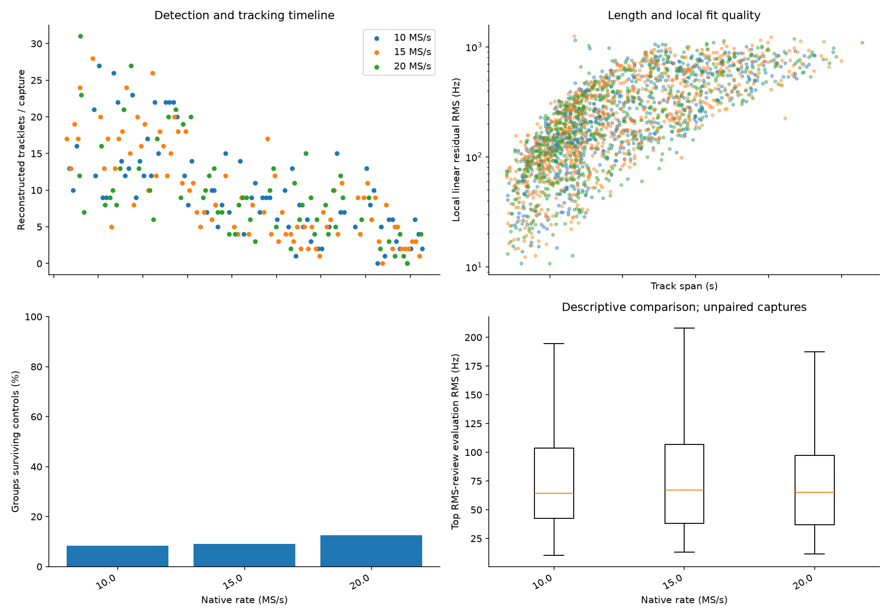

# Adaptive scanning: 48-hour operational and scientific review

Window: **September 18, 2026 01:38 UTC through September 20, 2026 01:38 UTC**. The cohort contains 218 published captures from radio `104000bac4950008230026001b440a003a`, RX0. Production and remote main were at `8191d5b94d09283a2424ba7c301ec358a2177192` during verification.

**All 218 captures have current GLRT and tracking products, with all 2,519 expected PNGs served correctly. Scientific coverage is less complete: 1,227 eligible hypothesis groups remain deferred by the four-comparison-per-capture limit.** A completed analysis job therefore does not mean every eligible group received the production catalogue comparison and controls.

The [full quantitative report](2026_09_20_adaptive_48h_audit/report.md) contains the complete 218-session inventory, channel and duration comparisons, rejection reasons, near misses, candidate examples, and links to every per-track review. Its accompanying CSVs and compressed JSON preserve the observations behind these conclusions.

## Publication and freshness

Two captures were still finishing when the audit began. Their standard analysis completed and tracking ran through the existing processing queue; both were then re-audited. No new queue or RF campaign was introduced.

| Product | Expected and verified | Verification |
|---|---:|---|
| Standard analysis JSON | 218 | Production API and capture/metrics digest bindings |
| Tracking JSON | 218 | Production API matches current persisted product |
| Standard GLRT PNGs | 654 | Three per capture, HTTP content type, image decode, SHA-256 |
| Trajectory overview PNGs | 428 | Two for each of 214 captures with trajectories |
| Per-track 3×2 review PNGs | 1,437 | Eligible-track inventory, manifest digest, 2250×2100 dimensions |
| Missing or corrupt expected PNGs | **0** | Full production artifact sweep |

Four captures have no qualifying trajectory and correctly have no trajectory PNG. Tracks below catalogue eligibility do not get a 3×2 catalogue review under the current policy. These are explicit pipeline outcomes, not missing files.

Browser checks also opened one capture at each sample rate and verified every tracking image loaded, including the 3×2 images. The [browser evidence](2026_09_20_adaptive_48h_audit/browser-verification.json) records those sessions and dimensions. This is a representative DOM check plus exhaustive API verification, not a manual browser inspection of all 218 pages.

## Rate comparison

| Sample rate | Captures | Tracks | Median capture duty | Median top-candidate evaluation RMS | Production comparisons passing controls |
|---|---:|---:|---:|---:|---:|
| 10 MS/s | 74 | 750 | 85.52% | 64.43 Hz | 21 / 254, 8.27% |
| 15 MS/s | 84 | 813 | 85.52% | 67.03 Hz | 24 / 264, 9.09% |
| 20 MS/s | 60 | 588 | 85.44% | 65.04 Hz | 24 / 191, 12.57% |

There is **no demonstrated large Doppler-residual improvement from 20 MS/s** in these observations. Its higher control-survival fraction has broad, overlapping capture-bootstrap intervals with the other rates. The rates observed different passes, and the window includes 61 mixed-sideband captures and 157 single-sideband captures. The detailed report stratifies that policy change. Neither sample rate nor scan policy was tested on identical signals.

CH2 lower produced the most tracks per 1,000 recorded visits: 6.13, compared with 3.78 for CH3 upper. This is useful operationally but cannot establish intrinsic channel sensitivity: adaptive selection, visibility, signal activity and antenna response all affect the result.

## What the residuals establish

The 2,151 reconstructed tracklets include 1,437 meeting the 14-observation, 7-second catalogue eligibility threshold. Of the 709 production comparisons attempted, 69 pass the implemented controls, spread across 48 captures. Counts across hypotheses are not counts of distinct satellites.

The RMS evidence is often strong: in **1,376 of 1,437 reviews**, the fit-selected top candidate also beats its runner-up on randomized evaluation observations. Median runner/top RMS ratios range from 7.42 to 8.68 across rates. An illustrative accepted comparison is NORAD 66626 in `scan-fw-0a4527c2676967c7`, CH2 upper, 33.83 seconds: evaluation RMS **36.56 Hz versus 3,503.63 Hz**, a 95.83× separation.

However, production and review figures choose different leaders in **235 of 695 comparable rows**. The review uses residual RMS while production uses uncertainty-aware likelihood and its controls. This discrepancy needs to be made explicit in the UI and investigated with a shared candidate/fit implementation. It is not evidence that every visually good association is wrong, nor that every RMS winner is independently identified.

The most common rejection is a materially better radio-polynomial control: 627 rows. Wrong-time controls and time-shift boundary hits also occur frequently; rejection counts overlap. These diagnose limitations of discrimination/calibration under the current model. They are not a measured false-identification rate.

Systematic curvature in a runner-up residual is useful evidence against that candidate's orbit fit. A rigorous follow-up should compare that smooth mismatch with the top candidate's remaining scatter and correlation. This audit inventories every numerical review and ranking; it does not claim to have classified the residual shape of all 1,437 plots by eye or established a calibrated identity probability.

## Why four captures have no track

The extraction policy requires at least eight observations, four seconds of span, and consecutive gaps no larger than four seconds. Reprojection of the retained GLRT inputs gives the following explanation. Gap-connected runs are an upper bound on usable support: they still need to satisfy frequency consistency.

| Capture | Rate | Projected candidates | Best relevant support | Explanation |
|---|---:|---:|---|---|
| `scan-fw-88c811720604bec2` | 10 MS/s | 44 | CH4 upper: six observations / 4.49 s | Observations split into runs; none reaches eight |
| `scan-fw-cb4cac90f26d4fde` | 15 MS/s | 4 | Isolated observations | Insufficient support |
| `scan-fw-59eb77da051c1124` | 10 MS/s | 3 | Isolated observations | Insufficient support |
| `scan-fw-81f8d9d684a738b6` | 20 MS/s | 17 | CH3 lower: seven observations / 8.56 s | One observation below extraction minimum |

[Full reprojection evidence](2026_09_20_adaptive_48h_audit/no-track-diagnostics.json) preserves all lanes and runs. There are also 201 reconstructed tracks close to catalogue eligibility, defined here as at least 12 observations and five seconds but failing 14/7. Their complete ledger separates count and duration failures.

Two presentation defects were found: the no-trajectory exception path reports `projected_candidate_count=0` even when reprojection finds candidates, and the no-eligible-groups UI explanation still says 20 observations / 20 seconds instead of 14 / 7. Neither should be used to infer the real threshold or absence of detections. These defects are documented here, not changed by this report.

## Operational issue outside the completed cohort

The spool-transfer service was failed during review: `FileExistsError: scan-fw-b08277b4adf9a155` aborted an import batch. This does not invalidate the 218 published captures, but it prevents a claim that the entire acquisition-to-publication process is healthy. The follow-up should compare manifests for an already-imported session, acknowledge identical imports safely, isolate actual conflicts, and continue unrelated transfers. It must not blindly remove originals.

Selection is by publication timestamp. Unpublished captures and failed acquisition attempts are outside this inventory. An approximately 85.5% within-capture duty is therefore not an 85.5% operational uptime measurement.

## Prioritized improvements

1. **Complete catalogue coverage through the existing queue.** Replace permanent per-capture deferral with resumable per-group work, deduplicated by input digest and analysis policy. Acceptance: all eligible groups eventually receive a terminal scored or explicitly unscorable outcome, while capture and standard analysis continue.
2. **Unify scientific evidence presented to the user.** Reuse candidate propagation and nuisance fits, and expose RMS, likelihood, controls and disposition together. Regression cases should include ranking disagreements and very strongly separated accepted examples from this cohort.
3. **Make import retries idempotent.** Test identical existing imports, conflicting imports, interruption after copy, and subsequent independent imports. Confirm originals are removed only after the authorized durable-copy conditions succeed.
4. **Correct diagnostic counts and threshold text.** Preserve projected counts on the no-track path and derive explanations from actual analysis policy. Test all four no-track fixtures above without changing scientific golden fixtures.
5. **Investigate sparse recovery with retained data.** Start with the seven-observation CH3 case and the 201 near-eligibility tracks. Test linking and extra retained probes against false-association controls before relaxing thresholds globally.
6. **Measure residual structure and calibration.** Add smooth mismatch, residual scatter and temporal correlation diagnostics, investigate ±5-second boundary fits, and improve firmware UTC/counter authority. Keep these diagnostics distinct from satellite identity claims until calibrated.
7. **Run a paired bandwidth study.** Analyze the same retained native IQ with consistent filtering, decimation and probe schedules. This can separate bandwidth effects from visibility and scheduling changes.

## PSS, timing and previous reports

PSS is not part of the standard per-capture pipeline audited here. There are no new PSS precision measurements in this report. The [September 18 PSS timing report](2026_09_18_multirate_scanner_pss_timing.md) measured a different cohort and found approximately microsecond conditional repeatability with unresolved pilot-only false-positive controls. The [earlier multirate tracking report](2026_09_18_sixteen_hour_rx0_multirate_pss_glrt_tle.md) used an older timing/association policy; its acceptance counts are not a controlled comparison with this window.

Doppler residual RMS in Hz does not directly measure frame-start timing, receiver UTC accuracy, or location accuracy. No truth-labelled satellite inventory exists for this cohort, so true detection recall and missed-satellite counts remain unknown.

## Reproducibility

The companion tools are `tools/audit_adaptive_window.py`, `tools/report_adaptive_window_audit.py`, and `tools/inspect_adaptive_no_tracks.py`. Six component tests cover eligibility boundaries, PNG integrity/dimensions and exact four-second gap handling. The full report includes all session, track, comparison and review ledgers, the compressed audit JSON, and four aggregate figures. Runtime science thresholds were not modified for this audit.
