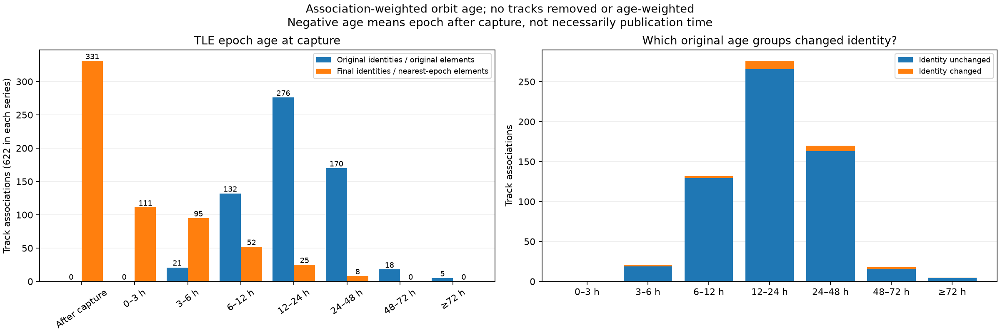

# What changed the RMS: reassociation, not orbit-age rejection

The full-cohort replay retains all **622 track episodes / 21,702 observations**.
It changes **26 candidate satellite identities**; 596 are unchanged. It does
not discard observations or weight them by orbital-element age. The position
fit already uses a robust loss with a 250 Hz scale, reducing the influence of
large training residuals. That same residual-based treatment is used before
and after reassociation; it is not a new age-based weighting policy. Reported
held-out RMS is ordinary residual RMS, not the robust objective value.

## Controlled example

Recording `scan-fw-6f09c0e970553e7b`, episode
`sha256:32f3730e72492b0a71d2eb80f494b91fa2b91169c6c6954587a550ff84d921d6`,
contains 35 observations. All three comparisons below use the same inferred
receiver position (the pre-reassociation nearest-epoch all-track fixed-clock
solution), RF observations, randomized partition, and zero clock correction.
Only the satellite identity and orbital elements change. Each model profiles
its source frequency offset on training observations; no held-out refitting.

| Candidate and orbit | Epoch age at capture | Training RMS | Held-out RMS |
|---|---:|---:|---:|
| Original NORAD 64323, original elements | 59.76 h | 329.5 Hz | 244.7 Hz |
| NORAD 64323, refreshed elements | 4.83 h | 18,453.7 Hz | 17,887.5 Hz |
| Reassociated NORAD 63468, nearest-epoch elements | 8.31 h | 54.1 Hz | 35.6 Hz |

The refreshed orbit no longer supports the old identity for this measured
track. Searching the full updated catalogue finds a different candidate that
fits well, even though its elements are older than the refreshed original
candidate's elements. None of those 35 samples was removed. These are candidate
identities conditional on the inferred receiver position, not independently
confirmed satellite identities.

The often-quoted **794 → 87 Hz** all-observation held-out improvement compares
the intermediate updated-orbit/frozen-identity fit with the reassociated fit.
It does not compare the original causal pipeline directly with the final fit.
Large residuals in a few mismatched associations strongly affect ordinary RMS
because residuals are squared. The original causal all-track fixed-clock fit
had approximately 166 Hz held-out RMS.

## Distribution of element age at observation

Age is **capture start UTC minus the TLE epoch**, not download age or time when
the offline analysis ran. Counts weight each track association equally; they
are not counts of unique satellites, TLE files, or individual observations.
Intervals include the lower boundary and exclude the upper boundary.

| Element epoch relative to capture | Original associations | Final associations | Original-bin identities changed |
|---|---:|---:|---:|
| After capture (negative age) | 0 | 331 | 0 |
| 0–3 h before | 0 | 111 | 0 |
| 3–6 h before | 21 | 95 | 2 |
| 6–12 h before | 132 | 52 | 3 |
| 12–24 h before | 276 | 25 | 10 |
| 24–48 h before | 170 | 8 | 7 |
| 48–72 h before | 18 | 0 | 3 |
| ≥72 h before | 5 | 0 | 1 |
| **Total** | **622** | **622** | **26** |

Original median age: **20.52 h**. Final median absolute epoch distance:
**3.30 h**. Of the 331 final epochs after capture, all are explicitly
retrospective choices; an element epoch is nevertheless distinct from its
publication/collection time. Even an epoch before capture may have been
collected afterward. This table does not establish real-time availability.

Older original elements do not automatically cause reassociation. For example,
163 of 170 original associations in the 24–48 h bin retain their identities,
whereas two of 21 in the 3–6 h bin change. These counts are descriptive and
do not establish a calibrated age/error relationship or an exclusion rule.

## Reproduction

`tools/report_association_orbit_age.py` reads the frozen full-reranking artifact,
bracketing-epoch audit, pre-reassociation inference, and original RF evidence.
It validates parent identity and TLE identity, parses final winning TLE epochs,
and recomputes the example with a fixed position. It performs no position fit
and reads no true receiver coordinate.

[Distribution, per-track ages, controlled example and source hashes](2026_09_20_association_orbit_age/distribution.json).
