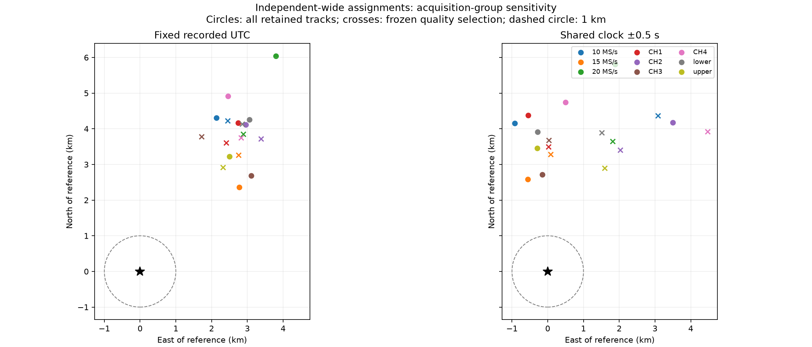

# The recent positioning bias is shared across acquisition groups

All 36 acquisition-group fits remain north of the actual antenna. None achieves
sub-kilometre accuracy. This extends the [independent wide-region experiment](2026_09_20_recent_independent_wide_position.md)
by splitting its frozen satellite assignments by sample rate, channel, and edge.
It provides no basis for blaming or disabling one capture path.

Each group is fitted with fixed recorded UTC and with one shared correction
bounded to ±0.5 s. Both the full retained cohort and the parent's frozen quality
selection are reported. Satellite identities are inherited from the full wide
search, not reselected within each subgroup. The supplied antenna coordinate is
used only for the following evaluation. Group membership uses metadata, never
distance to that reference.

| Group | All episodes | Fixed UTC error (m) | Shared-clock error (m) | Selected episodes | Selected fixed error (m) | Selected shared-clock error (m) |
|---|---:|---:|---:|---:|---:|---:|
| 10 MS/s | 223 | 4,810 | 4,255 | 63 | 4,879 | 5,342 |
| 15 MS/s | 238 | 3,642 | 2,644 | 69 | 4,271 | 3,286 |
| 20 MS/s | 161 | 7,136 | 6,103 | 58 | 4,807 | 4,075 |
| CH1 | 167 | 4,992 | 4,417 | 48 | 4,341 | 3,500 |
| CH2 | 161 | 5,063 | 5,448 | 49 | 5,028 | 3,962 |
| CH3 | 150 | 4,108 | 2,716 | 51 | 4,153 | 3,680 |
| CH4 | 144 | 5,501 | 4,768 | 42 | 4,693 | 5,948 |
| Lower | 340 | 5,239 | 3,920 | 113 | 5,025 | 4,172 |
| Upper | 282 | 4,076 | 3,472 | 77 | 3,726 | 3,309 |

These are overlapping partitions, not independent replications. Different rates
and channels sample different satellites, times, and geometries. The lower error
for 15 MS/s does not establish that 15 MS/s is intrinsically more accurate; using
the known location to choose it would leak evaluation information into inference.

The northward displacement spans approximately 2.36–6.05 km across all fits.
Within the selected fixed-UTC fits, all four channels are particularly similar:
3.61–3.78 km north. This makes a common timing/measurement/orbit or geometric
effect a more useful next target than rejecting a single channel. It does not
identify which shared effect is responsible.

Every fit converged. Training/evaluation partitions and segment frequency-offset
handling are unchanged from the parent. Subgroup membership is independent of
evaluation residuals; no threshold was tuned to obtain a favourable position.
The shared-clock cases retain the deliberately broad diagnostic ±0.5 s limit;
the parent's separate manifest-bracket-constrained results remain the physical
timing comparison.

Reproduction uses `tools/diagnose_wide_capture_groups.py` with `--run`,
`--evidence`, and a fresh `--output`; it does not accept a reference location.
`tools/report_wide_capture_groups.py` subsequently accepts `--inference`,
`--reference`, and a fresh `--output` to evaluate and render the sealed results.
The metadata join test checks identity-based assignment, mixed-edge preservation,
and refusal of missing members. Existing fitter tests cover physical recovery
and evaluation isolation. No production scanner changes were made.

- [All fits and source digests](2026_09_20_capture_group_positioning/inference.json)
- [Evaluation coordinates and distances](2026_09_20_capture_group_positioning/evaluation.json)
- [Artifact hashes](2026_09_20_capture_group_positioning/sha256.json)
