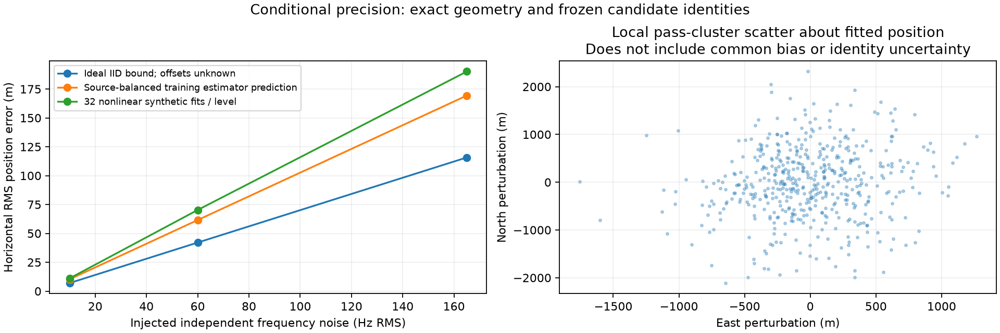
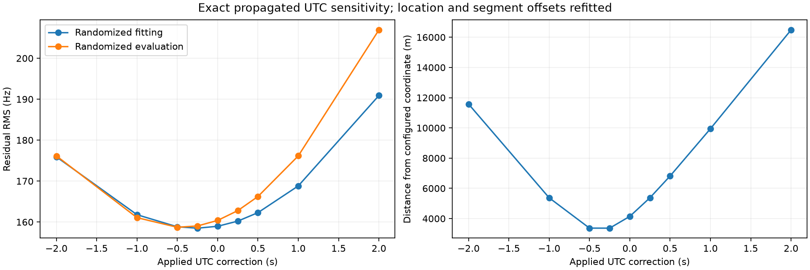
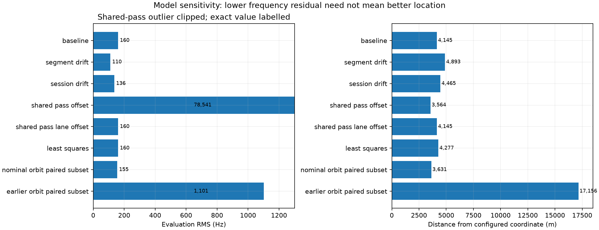
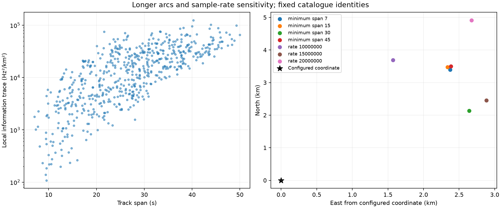

# Three directions toward better Doppler-only location

This extends the [48-hour sky/location study](2026_09_20_sky_48h_location.md) using its frozen **599 tracks / 20,937 observations** from the September 18–20 recordings. No new RF was collected and production analysis was not changed.

**The 4.14 km displacement is far larger than this geometry's ideal independent-noise limit. However, none of the tested modelling changes provides a justified correction that removes it.** Timing is influential, catalogue predictions are influential, and the real residuals are strongly correlated. More flexible frequency fits can make the residuals smaller while making location worse.

The baseline reproduces the previous position to within 0.1 m: **37.889545°, −122.451058°**, 4,144.9 m from the configured coordinate. Satellite identities and the selected track set are frozen from the previous FoV-assisted search. This is a **conditional local error-budget study**, not another search from the Denver prior and not independent confirmation of those identities. Local numerical searches use a ±99 km neighbourhood around the configured coordinate; that coordinate is also the synthetic generating point and the real-data comparison reference. Its surveyed accuracy has not been established.

All real and synthetic fits retain the deterministic randomized 60/40 observation partition. Frequency nuisance parameters and location use fitting observations only. There is no chronological held-out TLE comparison. Exploring several models on one dataset makes their evaluation statistics descriptive, not a new independent validation after model selection.

## 1. What precision could the existing geometry support?

Perfect synthetic Doppler, generated at the actual observation times with the selected satellite states and arbitrary per-segment frequency offsets, recovers its generating location to **less than 0.01 m**, starting 25 km away. This checks solver self-consistency. It does not independently validate TLE accuracy or common errors shared by synthesis and fitting.

The information calculation projects out unknown segment offsets before estimating east/north precision. It assumes exact satellite identities, orbits, UTC, fixed altitude and independent Gaussian frequency errors.

| Independent observation noise | Ideal all-observation horizontal RMS bound | Predicted source-balanced fitting estimator RMS | Measured synthetic RMS, 32 nonlinear trials |
|---|---:|---:|---:|
| 10 Hz | 7.0 m | 10.3 m | 11.1 m |
| 60 Hz | 42.1 m | 61.6 m | 70.3 m |
| 165 Hz | 115.7 m | 169.4 m | 190.2 m |

The first column is a controlled noise assumption, not an estimate that all real errors are white. The ideal bound uses every observation; the operational-style fit uses only the fitting partition, source-balanced weights and a robust objective. Their bounds should therefore differ. Thirty-two trials characterize scale, not precise tail probabilities.



At 60 Hz, the all-observation bound changes from **42.1 m** to **72.4 m** when a shared UTC error is also unknown, and to **67.9 m** when each segment has an unknown linear drift. With frequency offsets hypothetically known, it would be **1.64 m**. The latter is an optimistic information comparison, not a promise of metre-level positioning with these radios.

Actual residuals have median within-track lag-one correlation **0.79**. A local robust-estimator sandwich calculation clustered into **450 candidate passes** gives about **872 m horizontal RMS scatter** around the fitted position. The plotted 500 Gaussian multiplier draws are linearized pass-score perturbations, not 500 complete global searches or a calibrated confidence region. Clusters are defined by fixed candidate identity and observed-support gaps no larger than 120 s; they can still share orbit or receiver errors. Common bias and identity errors are not included. This estimate must not be read as absolute accuracy around a point already displaced by 4.14 km.

Controlled single-realization injections further illustrate the distinction: an unmodelled +0.25 s timestamp shift produces 1.69 km displacement, and +0.5 s produces 3.38 km. Random pass-specific drift with 1 and 10 Hz/s standard deviations produces about 41 and 365 m respectively, using the same random pattern at two amplitudes. A synthetic independent 100 m satellite-position perturbation per pass produces only about 7 m after averaging. That last experiment holds velocities fixed and is not a dynamically consistent ephemeris-error model; it demonstrates averaging of independent perturbations, not the accuracy of real TLEs.

## 2. Which modelling assumptions explain the displacement?

### Timing

For each tested UTC correction, satellite states are propagated again, including Earth rotation, then location and segment offsets are refitted. The tested range is a sensitivity experiment, not an assertion that the actual clock has a ±2 s error.

| Applied UTC correction | Pooled randomized-evaluation RMS | Distance from configured coordinate |
|---|---:|---:|
| −1.00 s | 161.1 Hz | 5.37 km |
| −0.50 s | 158.7 Hz | 3.37 km |
| −0.25 s | 159.0 Hz | 3.36 km |
| 0 s | 160.4 Hz | 4.14 km |
| +0.50 s | 166.2 Hz | 6.82 km |
| +1.00 s | 176.2 Hz | 9.95 km |



The −0.5 s model changes the east displacement from +2.37 km to −1.00 km, but leaves **+3.22 km northward displacement**. One shared timing correction cannot explain the full error in this sweep. The small residual improvement is insufficient reason to apply that correction without timing evidence.

### Frequency behaviour and orbit selection

| Model | Pooled randomized-evaluation RMS | Distance from configured coordinate |
|---|---:|---:|
| Baseline, one constant per segment | 160.4 Hz | 4.14 km |
| One additional receiver drift per scan | 135.9 Hz | 4.46 km |
| Independent drift per segment | 110.4 Hz | 4.89 km |
| Non-robust source-balanced least squares | 160.4 Hz | 4.28 km |
| Nominal TLEs, paired 505-track subset | 155.0 Hz | 3.63 km |
| Earlier-epoch TLEs, same 505 tracks | 1,100.9 Hz | 17.16 km |



For the orbit comparison, each alternative comes from an earlier collected snapshot, has an earlier element epoch than the nominal TLE, and precedes the recording. The median element-epoch difference is **23.54 hours**. This is an age/snapshot sensitivity experiment, not an uncertainty distribution or an alternative precise-orbit product. After removing segment constants, the two predicted frequency shapes differ by **1,052.5 Hz pooled RMS**. Bad older elements, manoeuvres or catalogue differences may contribute; this does not establish the nominal TLE error.

Using the finite difference of propagated ECEF positions instead of reported ECEF velocities changes the fitted location by only about **0.3 m**, and changes offset-removed predictions by **0.025 Hz RMS**. That tested velocity convention is not a plausible source of the kilometre-scale discrepancy. Existing independent analytic Earth-rotation/range-rate tests also pass. The timestamp binding and RF normalization have not thereby been independently calibrated.

The report's original RMS was **segment-balanced**: 163.29 Hz fitting / 164.64 Hz evaluation. This audit reproduces both and also reports **pooled observation RMS**: 158.96 / 160.39 Hz. Tables and model plots here use the pooled statistic consistently; both are saved in JSON. They are different weightings, not a pipeline discrepancy.

## 3. Can complete passes and longer arcs improve things?

The 599 selected tracks cluster into 450 fixed-identity pass hypotheses. Enforcing a single frequency offset across every channel of a pass produces **78,541 Hz** pooled evaluation RMS. Cross-channel offsets cannot be discarded. Keeping separate pass/channel/sideband offsets leaves 599 distinct groups and exactly reproduces the baseline: this selected representative set provides no extra same-lane offset-sharing opportunities under the declared 120 s gap rule.

This tests two explicit grouping assumptions. It is not a reconstruction of discarded fragments from every original GLRT candidate, and no new coherent cross-channel tracks are asserted.

| Minimum track span | Tracks retained | Distance from configured coordinate | Pooled evaluation RMS |
|---|---:|---:|---:|
| 7 s | 599 | 4.14 km | 160.4 Hz |
| 15 s | 512 | 4.19 km | 161.6 Hz |
| 30 s | 222 | 3.39 km | 156.5 Hz |
| 45 s | 18 | 4.23 km | 146.1 Hz |



The 222 tracks at least 30 s long contribute **64.4% of the unweighted projected position-information trace** while representing 37.1% of tracks. That suggests longer trajectories deserve attention, but the trace is not a calibrated information fraction under correlated errors or the robust estimator. The 30 s subset's smaller configured-site discrepancy is exploratory; selecting that cutoff because it approaches the reference would introduce location-dependent tuning.

Eight refits, each withholding a different pass cluster fold from the fit, remain **3.90–4.64 km** from the configured coordinate. These are pass-removal stability diagnostics; no withheld chronological observations are used to rank TLEs. The baseline error is not explained by a single fold. The 10/15/20 MS/s subsets reproduce the earlier approximately 4.01/3.79/5.59 km discrepancies. They observe different passes, so these numbers do not rank intrinsic sample-rate performance.

## What to do next

1. **Audit actual device-to-UTC binding using its recorded authority and timing logs.** The timing sensitivity is measured and large, but the data do not justify applying an arbitrary −0.5 s correction. Look for scan-specific timing patterns as well as a shared bias.
2. **Diagnose orbit/association contributions by spacecraft and element age.** Keep nominal causal TLEs as the baseline. Seek independent orbit evidence before fitting flexible per-satellite corrections; otherwise those corrections can absorb receiver-position error.
3. **Revisit original GLRT fragments for longer same-lane arcs.** Preserve channel/sideband offsets and test continuity before sharing offsets. The present representative export cannot supply those missing fragments. Prefer complementary pass directions and report pass-cluster uncertainty.

No tested alternative is being promoted as a corrected location model. The useful result is a concrete separation: **tens to hundreds of metres of conditional white-noise precision, much larger correlated scatter, and an unresolved systematic displacement of kilometres**. The next work should target timing authority and orbit/association consistency rather than increasing sample rate or adding unconstrained drift parameters.

## Reproduction and validation

- Numerical component: [`doppler_error_budget.py`](../src/leo/analysis/research/doppler_error_budget.py).
- Experiment runner: [`study_doppler_error_budget.py`](../tools/study_doppler_error_budget.py).
- [Full results](2026_09_20_doppler_error_budget/results.json), [input provenance and assignments](2026_09_20_doppler_error_budget/inputs.json), [frozen propagated states](2026_09_20_doppler_error_budget/states.npz), [artifact hashes](2026_09_20_doppler_error_budget/sha256.json).

```bash
OPENBLAS_NUM_THREADS=1 OMP_NUM_THREADS=1 PYTHONPATH=src \
uv run --no-project --with scipy --with matplotlib --with sgp4 \
  --with pydantic --with pyyaml tools/study_doppler_error_budget.py \
  --evidence /tmp/leo-sky-position-48h/evidence-v2 \
  --polish reports/2026_09_20_sky_48h_location/fov-polish.json \
  --output /tmp/fresh-doppler-error-budget
```

The evidence directory is the original frozen export from the preceding report. Exact source/TLE digests are retained; no current catalogue downloads are substituted. Cached reruns use `--reuse-states` and verify parent, source, catalogue and cached-state hashes. Frozen numerical states also retain measured frequencies, randomized partitions, session, pass, rate and lane arrays so the local numerical experiments can be reproduced without repropagation. Research-only SciPy is supplied by the isolated command environment; production dependencies are unchanged.

**40 targeted tests pass**, including six new nuisance-projection/information tests, regional fitting, randomized partition provenance and independent analytic frame/range-rate checks. New tests first failed because the numerical module was absent, then passed after implementation. Static checks pass. Figures are ordinary programmatic Matplotlib PNGs.
