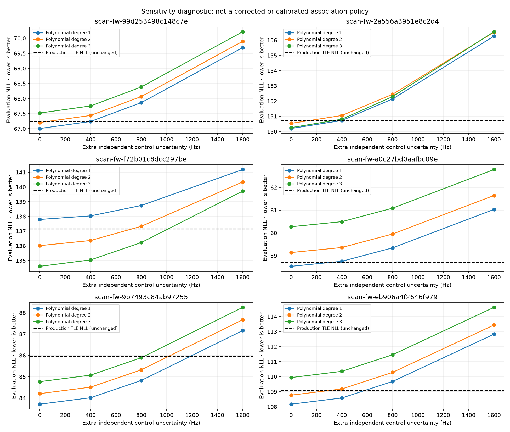
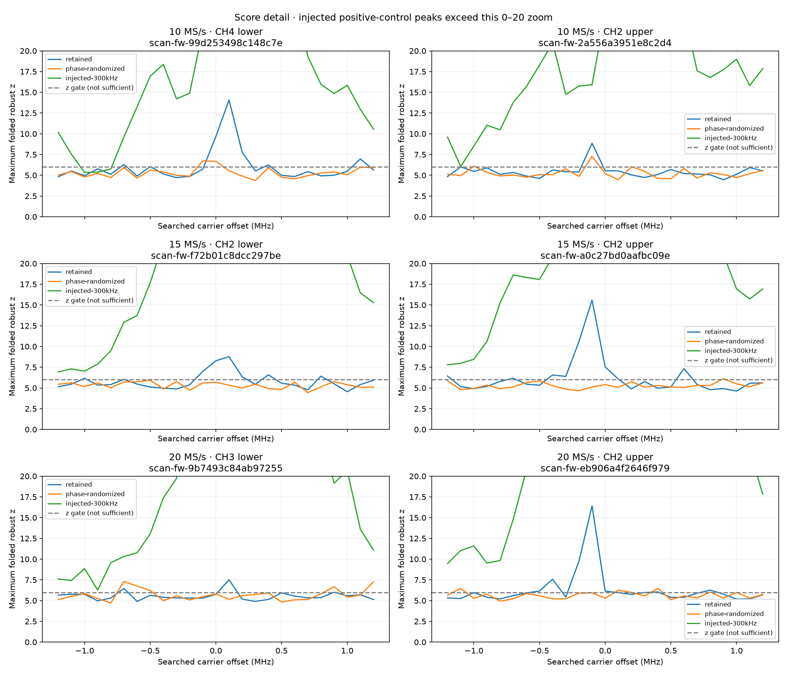

# Debugging failed associations and PSS versus frequency

This follow-up uses the [frozen 218-capture audit](2026_09_20_adaptive_48h_review.md), September 18–20, 2026. No RF was collected. Production acceptance rules were not relaxed or deployed during this investigation.

**There are two concrete problems: association likelihood is strongly influenced by its uncertainty model, and the PSS replay had a retained-visit indexing bug. PSS also needs stronger detection controls; a denser frequency search alone is insufficient.**

## Association failure inventory

Of 709 attempted comparisons, 640 recommend abstention. In 281 cases the polynomial-control rejection is the only reason. In total, 627 have that reason, 180 fail the −500-second control, 176 fail the +500-second control, 164 touch the time-shift boundary, and 69 fail leader persistence/rank stability. Reasons overlap. The separate 1,227 deferred hypothesis groups have not failed a scientific comparison: the four-group work cap stopped them from being scored.

All comparison rows are preserved in [association-evidence.json](2026_09_20_association_pss_debug/association-evidence.json). For deeper replay I selected, within each rate/sideband pair, the failed association with the largest top-versus-runner evaluation RMS ratio. These six cases intentionally test conspicuous contradictions between fit quality and disposition; they are not an unbiased estimate of general performance.

## Reproduced failures despite excellent orbit residuals

The current production observation partition and polynomial scores were reconstructed from retained GLRT evidence. All six polynomial NLL values match the published values within 1e−7. No chronological split was introduced; the existing deterministic randomized partition was reproduced.

| Capture suffix | MS/s / side | Top NORAD | Top TLE evaluation RMS, Hz | Runner RMS, Hz | Control evaluation RMS, Hz | Production TLE NLL | Control NLL |
|---|---|---:|---:|---:|---:|---:|---:|
| `99d253498c148c7e` | 10 lower | 67356 | 25.53 | 3,111.11 | 143.29 | 67.247 | 67.006 |
| `2a556a3951e8c2d4` | 10 upper | 65884 | 48.92 | 2,980.16 | 395.98 | 150.749 | 150.201 |
| `f72b01c8dcc297be` | 15 lower | 61069 | 35.99 | 5,341.76 | 54.52 | 137.149 | 134.605 |
| `a0c27bd0aafbc09e` | 15 upper | 100056 | 20.08 | 2,990.69 | 145.66 | 58.697 | 58.533 |
| `9b7493c84ab97255` | 20 lower | 69127 | 30.73 | 4,021.01 | 176.23 | 85.968 | 83.710 |
| `eb906a4f2646f979` | 20 upper | 69668 | 29.01 | 1,657.81 | 124.01 | 109.098 | 108.171 |

Lower NLL wins. The control column is the degree selected by minimum evaluation NLL, not minimum RMS. TLE RMS comes from the current review fit; the production and review leaders agree in these six cases. Differences in nuisance-fit weighting remain a reason to share one implementation rather than treating the RMS and NLL columns as identical estimators.

Each case fails **only** the polynomial-control gate. Therefore “abstain” here does not mean the runner-up satellite fits better. Your observation about strong top-candidate separation is supported by these measurements.

### Why the worse residual wins the likelihood comparison

The source projection assigns every observation uncertainty

`sqrt(400² + (15,000 × UTC_bracket_width_seconds / 2)²)` Hz,

then scales it to the canonical RF. These cases have UTC brackets of 200.8–215.8 ms and observation uncertainties of approximately **1,559–1,689 Hz**. A capture-wide timestamp uncertainty is thus represented as independent per-observation frequency variance. That overwhelms the observed tens-of-Hz orbit residuals. A shared timestamp error should instead produce a correlated error through the Doppler derivative; for a short nearly linear arc, much of it resembles the already-fitted constant CFO offset.

TLE likelihood additionally includes prediction uncertainty `hypot(400 Hz, 1,000 Hz/day × element_age_days)`. The polynomial comparator has measurement uncertainty and coefficient uncertainty, but no matching orbit-error term. Gaussian NLL includes both normalized residual error and the covariance log determinant. A broad TLE prediction can therefore lose to a narrower polynomial prediction despite fitting the measurements better. The formula is mathematically coherent; the problem is interpreting this uncalibrated predictive-model contest as evidence against satellite identity.

A controlled calculation preserves exactly the same 31.01 Hz residual vector and changes only prediction sigma from zero to 400 Hz: NLL worsens from **78.325 to 97.235**, although the normalized residual penalty improves. This isolates the covariance effect without changing satellites or data.

On the actual six cases, adding a 400 Hz independent uncertainty term to the polynomial sensitivity calculation removes its material-advantage rejection in three cases, without improving its residual fit. This is **not a proposed fix**: padding a comparator until it passes would be arbitrary. The sensitivity demonstrates that these dispositions depend materially on uncertainty assumptions. We did not recompute the true candidate-specific orbit covariance or claim that the sensitivity curves are calibrated fair comparisons.

[Exact replay and all degree scores](2026_09_20_association_pss_debug/covariance-replay.json) include the observation sigmas, partitions' evaluation counts, RMS, log determinants and Mahalanobis terms.

### Better association design

1. Separate **catalogue discrimination** from **absolute model adequacy**. Display the winning orbit, runner separation, residual structure and calibration warnings independently. A polynomial fitting a short smooth Doppler arc well is not itself evidence of a different satellite.
2. Fit shared clock and receiver-offset nuisance terms jointly, or use their correlated covariance. Estimate short-term measurement scatter from retained observations. Do not shrink uncertainty merely to improve acceptance.
3. Represent orbit uncertainty with a justified temporal structure. An epoch-dependent independent error on every observation is a poor proxy for a smooth orbit-model error. Calibrate on synthetic orbit perturbations and independently corroborated passes.
4. Rank and plot the same candidates using the same fit implementation. Report both RMS and likelihood, including their covariance assumptions, when the rankings differ.
5. Select polynomial complexity using fitting data or calibrate the complete selection procedure. The current gate chooses the best of three polynomial evaluation scores, an additional selection advantage that needs to be included in calibration.
6. Retain wrong-time controls as diagnostics and calibrate their decision role using the entire search procedure. Short arcs with free offsets and time shifts can match multiple smooth curves; a shifted-catalogue winner is not automatically a disproof of the nominal satellite.

## PSS replay: a verified indexing defect

`AdaptiveHopIqReader.read_visit_ci16()` accepts a **retained ordinal**. Firmware event `visit_index` can contain gaps. The older multi-rate replay grouped and read visits using that event ID as if it were the ordinal.

In `scan-fw-f72b01c8dcc297be`, the intended lower-sideband visit is retained ordinal **768**, firmware event **769**. Reading ordinal 769 instead selected an upper-sideband visit. This can make a frequency/sideband investigation analyze different IQ than intended.

The frozen cohort has **39 captures with sparse event IDs**, affecting 47,286 retained positions after gaps. These are potentially misaddressed positions, not a claim that all were previously processed incorrectly. Standard scanner PSS is not enabled, and this finding does not establish that every historical PSS report is affected.

The multi-rate replay now selects by retained ordinal, preserves the actual firmware event ID in output, and checks the returned event against the selected receipt. It also refuses legacy cached results or a different source-manifest binding; aggregation requires the corrected visit policy. Regression fixtures cover sparse IDs and stale caches. [Inventory](2026_09_20_association_pss_debug/sparse-event-inventory.json).

## PSS versus carrier frequency and bandwidth

For each of the six tracks, the corrected replay selects the nearest retained same-channel/same-sideband visit to the track midpoint. It analyzes its first continuous **20 ms**, searching −1.2 to +1.2 MHz in 100 kHz steps. Each case has two controls: phase-randomized IQ preserving the exact periodogram, and a synthetic PSS injection at +300 kHz. The injection uses a finer template quadrature but the same waveform family, so it verifies search operation, not independent waveform correctness. Actual passbands are modeled as ideal rectangular responses, not calibrated analogue filters.

| MS/s / side | Best real offset, kHz | Best real z | Best randomized-control z | Qualifying frequency hypotheses: real / randomized | Old 200 kHz-bank maximum z |
|---|---:|---:|---:|---:|---:|
| 10 lower | +100 | 14.07 | 6.73 | 7 / 2 | 9.68 |
| 10 upper | −100 | 8.86 | 7.29 | 2 / 3 | 5.63 |
| 15 lower | +100 | 8.77 | 5.94 | 8 / 0 | 8.28 |
| 15 upper | −100 | 15.59 | 6.12 | 9 / 1 | 10.58 |
| 20 lower | +100 | 7.51 | 7.31 | 3 / 5 | 5.77 |
| 20 upper | −100 | 16.42 | 6.47 | 7 / 4 | 9.74 |

The old-bank values are the 200 kHz-spaced subset of the same new replay, so this frequency-grid comparison is paired. Both the 10-upper and 20-lower cases fail every old-bank hypothesis but qualify on the 100 kHz bank. A finer bank can recover candidate modes, while also increasing the number of statistical trials.

The detail plot clips the injected positive-control peaks above 20 to show the real/control separation. The [full-scale plot](2026_09_20_association_pss_debug/pss-frequency-controls.png) preserves those peaks.

All six positive controls peak at the injected +300 kHz. Nevertheless, **five of six phase-randomized controls also produce qualifying candidates**. The robust-z value is a folded-score statistic, not a calibrated Gaussian significance or false-alarm probability. A single surrogate per case cannot establish a population false-alarm rate. It does establish that the current gates are insufficient to verify PSS presence in this diagnostic replay.

The real maxima are near +100 kHz for lower and −100 kHz for upper. That systematic side dependence is worth investigating for template/passband response or pilot leakage; it is not yet proof of a receiver calibration error or the correct satellite CFO. Per-hypothesis scores and overlap widths are saved in the six session JSONs. The frequency coordinate is receiver-relative PSS CFO, not the normalized 11.2 GHz GLRT Doppler or the fitted TLE constant offset.

### Why 20 MS/s does not double useful PSS bandwidth

The receiver centers in these visits are ±115.1953125 MHz from their PSS channel references. At zero CFO, the ideal intersections with the ±120 MHz PSS channel are:

| Native rate | Observable PSS-channel width | Ratio to 10 MS/s |
|---|---:|---:|
| 10 MS/s | 9.8046875 MHz | 1.00 |
| 15 MS/s | 12.3046875 MHz | 1.25 |
| 20 MS/s | 14.8046875 MHz | 1.51 |

Increasing symmetric receiver bandwidth at an edge spends part of the extra bandwidth outside the PSS channel. CFO changes the overlap further, as recorded in every hypothesis. These widths are geometric bounds; signal-weighted bandwidth and real filter response determine timing information. They do not predict a fixed 1.51× timing gain.

## Recommended next experiment and fix order

First retain the ordinal fix and invalidate/replay any affected cached PSS jobs. Next, use a coarse-to-fine PSS search with thresholds calibrated for the **whole bank**, multiple phase-randomized/noise/pilot-only controls, and known-delay/frequency injections. Validate PSS-specific waveform structure beyond frame-period consistency. Prefer longer retained visits and repeated same-lane observations after the bounded diagnostic establishes the failure mode.

For associations, build a shared residual/likelihood evaluator with clock-correlated uncertainty, then replay these six contradictions plus accepted, ambiguous, wrong-time and intentionally mismatched cases. Require that improvements recover known injected identities without simply increasing all acceptance rates. Do not deploy a blanket gate removal or covariance inflation to force these examples to pass.

Evidence and reproduction scripts: `tools/debug_association_pss_frequency.py`, `tools/debug_association_covariance.py`, and the corrected `tools/replay_multirate_scanner_pss.py`. The complete numeric replay is in [the evidence directory](2026_09_20_association_pss_debug/selected-cases.json). All changes are offline analysis tools; no production scientific disposition was overwritten.
