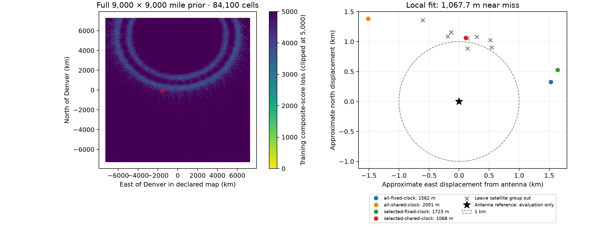

# Fresh 9,000-mile-wide Doppler search: 1,067.7 m near miss

The fresh search independently selected the correct geographic region and
reached **37.8585817804° N, 122.4843823874° W**, **1,067.7 m** from the
user-confirmed antenna coordinate. This does **not** satisfy the sub-kilometre
goal. Exact SGP4 propagation at the inferred clock correction reproduces the
position to less than a millimetre, so interpolation is not the explanation.



## What was independent

The search used the archived September 7 eight-hour corpus: **24 scans and 502
RF episodes**. This is a fresh search of that historical corpus, not a new RF
collection and not the current 48-hour corpus. Its initial region was a
**9,000 × 9,000 statute mile square centered on Denver**, represented by the
declared spherical azimuthal-equidistant map. The first grid evaluated all
**84,100 cells** at about 50 km spacing.

The input exporter retained only RF observations, source grouping, UTC metadata,
and causal TLE snapshots. No known observer location, previous candidate IDs,
or measured field-of-view constraint entered the search. The only elevation
cut was the configured horizon allowance of −1°. All new partitions were
randomized by source track ID. Frequency offsets, candidate choice, geographic
mode selection, and quality selection used fitting data only.

Three separated fitting-score modes were refined at approximately 5 km, then
0.5 km. The coarse winner exceeded the next separated mode by 2,978.9 composite
score units. That is evidence of separation in this particular search objective,
**not calibrated posterior odds or a geographic confidence interval**.

## Continuous refinement

The final grid's fitting-selected identities were frozen. The initial gate
retained 484 episodes / 1,051 source segments / 22,196 observations using
signal weight ≥0.95 and fitting RMS ≤500 Hz. The policy specified before this
fresh run then retained episodes with ≥15 s support and fitting RMS ≤100 Hz,
keeping the longest episode per satellite per scan. This produced **86 episodes,
216 source segments, and 4,789 observations**.

Each source segment has its own constant frequency offset. The shared-clock
models also fit one UTC correction, bounded to ±0.5 s. The baseline altitude is
zero. No free per-track slope or polynomial is fitted.

| Model | Fitting RMS | Random evaluation RMS | Shared UTC correction | Horizontal error |
|---|---:|---:|---:|---:|
| All retained episodes, fixed clock | 148.03 Hz | 172.79 Hz | 0 s | 1,562.0 m |
| All retained episodes, shared clock | 142.18 Hz | 167.89 Hz | −0.4759 s | 2,051.0 m |
| Quality-selected episodes, fixed clock | 80.09 Hz | 93.39 Hz | 0 s | 1,723.1 m |
| Quality-selected episodes, shared clock | 79.62 Hz | 92.71 Hz | −0.2255 s | **1,067.7 m** |

The last model is about **1,062 m north and 112 m east** of the reference.
Removing each of eight deterministic satellite groups gives errors from
**897.0 to 1,486.5 m**. The favorable removal is not selected as the answer.
The persistence of the northward displacement suggests a systematic component,
but this experiment does not identify its cause.

The earlier 967.9 m conditional replay inherited historical candidate identities.
Its apparent sub-kilometre result did not reproduce in this fully fresh search.
Both results remain recorded in the [matched-cohort report](2026_09_20_matched_positioning.md).

## Height and association checks

Allowing receiver altitude to be fitted over −500 to 5,000 m gives:

| Model | Fitted altitude | Horizontal error |
|---|---:|---:|
| All episodes, fixed clock | −115.1 m | 1,476.7 m |
| All episodes, shared clock | −169.7 m | 1,947.5 m |
| Quality-selected, fixed clock | 94.5 m | 1,794.3 m |
| Quality-selected, shared clock | 102.1 m | 1,265.5 m |

The last model was also checked using exact orbit propagation. Fitting altitude
does not explain or remove the remaining horizontal bias. No measured antenna
altitude was supplied, and these fitted heights are not independent height
measurements.

A follow-up catalogue pass re-evaluated every candidate using all fitting
observations at the refined position and −0.2255 s correction. It changed or
added 15 assignments relative to the first fit; seven of those were newly
retained episodes. Repeating the same local policy yielded **1,083.4 m**, with
86 selected episodes and a −0.2226 s clock correction. Merely refreshing the
frozen identities therefore did not cross the target either. This follow-up
uses the inferred position, never the antenna reference.

## Evidence and reproduction

The actual coordinate **37.84903264307456°, −122.4856541910174°** was read only
by evaluation after the inference file was sealed. All distances in this report
refer to that coordinate. Survey uncertainty and antenna altitude remain
unspecified.

- [Inference, assignments, and satellite-removal fits](2026_09_20_fresh_wide_position/inference.json)
- [Evaluation receipt](2026_09_20_fresh_wide_position/evaluation.json)
- [Height experiment](2026_09_20_fresh_wide_position/height-inference.json)
- [Refreshed catalogue inference](2026_09_20_fresh_wide_position/rerank-inference.json)
- [Coarse result](2026_09_20_fresh_wide_position/coarse/result.json)
- [Fine result](2026_09_20_fresh_wide_position/fine/result.json)
- [Source provenance](2026_09_20_fresh_wide_position/inputs.json)
- [Artifact digests](2026_09_20_fresh_wide_position/sha256.json)

The full coarse and fine accumulated score maps, grids, configuration, and
scan histories are included. Per-scan score-array digests and input digests are
retained; the much larger per-scan whole-region arrays remain in the runtime
run directories and can be regenerated. Propagated states for the local replay
are included. Original RF exports and TLE snapshots are already in
`reports/figures/2026_09_07_eight_hour_scan_pnt`.

Use the project scientific development environment with one BLAS thread:

```bash
export OPENBLAS_NUM_THREADS=1 OMP_NUM_THREADS=1 PYTHONPATH=src
python tools/prepare_randomized_positioning.py \
  --source reports/figures/2026_09_07_eight_hour_scan_pnt \
  --output /tmp/wide-evidence
python tools/study_adaptive_sky_position.py search \
  --evidence /tmp/wide-evidence --output /tmp/wide50 \
  --spacing-km 50 --workers 8 --max-per-partition 6
python tools/refine_regional_grid.py --run /tmp/wide50 \
  --output /tmp/points5.json --modes 3 --divisions 10
python tools/study_adaptive_sky_position.py search \
  --evidence /tmp/wide-evidence --output /tmp/wide5 \
  --points /tmp/points5.json --spacing-km 5 --workers 8 --max-per-partition 6
python tools/refine_regional_grid.py --run /tmp/wide5 \
  --output /tmp/points05.json --modes 3 --divisions 10
python tools/study_adaptive_sky_position.py search \
  --evidence /tmp/wide-evidence --output /tmp/wide05 \
  --points /tmp/points05.json --spacing-km 0.5 --workers 8 --max-per-partition 6
python tools/polish_randomized_wide_mode.py --run /tmp/wide05 \
  --evidence /tmp/wide-evidence --output /tmp/wide-polish
python tools/replay_wide_height.py --run /tmp/wide-polish \
  --evidence /tmp/wide-evidence --output /tmp/wide-height.json
```

The coarse stage took about 64 minutes on eight workers; each refinement grid
took roughly a minute. The active positioning goal remains unachieved.
