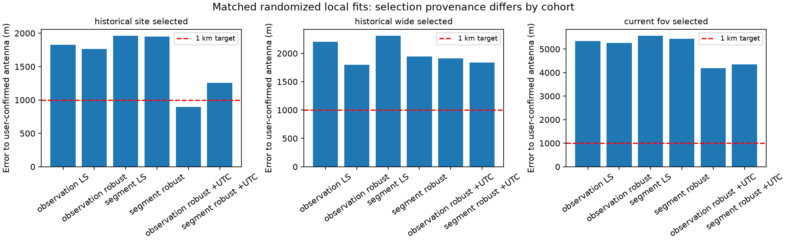

# Corrected antenna reference and matched positioning replays

On September 20 the user confirmed that **all scanner data was collected at 37.84903264307456°, −122.4856541910174°**. The [evaluation authority](evaluation/2026_09_20_scanner_antenna_reference.json) records that coordinate separately from inference. Altitude and survey uncertainty were not supplied.

The scanner configuration used in several previous reports is **1,290.33 m away**. Those reports' distances to the configured coordinate are not distances to the actual antenna. Their frozen outputs remain available, but this correction supersedes their interpretation as absolute location accuracy.

## Corrected historical claims

| Existing fit | Previously reported distance to configured site | Distance to user-confirmed antenna |
|---|---:|---:|
| September 7 pooled nominal TLE fit | 669 m | **1,758 m** |
| Same cohort, robust nominal fit | 674 m | **1,854 m** |
| Same cohort, configured-site orbit calibration | 292 m | **1,579 m** |
| September 20 FoV-assisted fit | 4,145 m | **5,433 m** |

The earlier continental study used a user-provided coordinate within a few metres of the newly confirmed point, so its roughly 1.8 km result remains essentially unchanged. The 669 m and 292 m results do **not** demonstrate sub-km accuracy at the actual antenna. Orbit calibration in the latter used the incorrect configured coordinate, not the confirmed antenna coordinate.

Historical ENU outputs were transformed back through their original ECEF frame and compared in the confirmed antenna's tangent frame. New latitude/longitude outputs use great-circle horizontal separation. These definitions differ negligibly at these distances relative to the discrepancy under discussion.

## Matched replay, without supplying the antenna coordinate to inference

The new replay compares three cohorts with nominal causal TLEs, fixed ellipsoid height zero, separate source frequency offsets and the same continuous geographic model:

1. Historical site-selected identities: the exact selected episodes from the 19-scan experiment, with selection provenance retained.
2. Historical wide-search identities: all 493 assignments retained by the 5,000 km continental local fit.
3. Current FoV-selected identities: the September 20 599-track cohort.

All new fitting/evaluation partitions are deterministic randomized partitions. Old identities remain frozen; their original selection used different policies and partitions. New evaluation RMS is consequently a descriptive comparison conditional on those inherited identities, not a wholly fresh validation of selection. The original 669 m output is re-evaluated from its saved fit, not regenerated using chronological TLE evaluation.

Each cohort is refitted with observation-balanced versus source-balanced residuals and ordinary versus robust loss. Starting coordinates come from the associated broad-search result. The local replay never reads the new evaluation-coordinate file. Synthetic tests check physical position recovery and that arbitrary changes to evaluation frequencies cannot change the fitted position.

| Cohort | Observation-balanced robust nominal | Source-balanced robust nominal |
|---|---:|---:|
| Historical site-selected | 1,767 m | 1,951 m |
| Historical wide-selected | 1,798 m | 1,945 m |
| Current FoV-selected | 5,257 m | 5,433 m |

Changing weights alone does not resolve the current bias.

## Joint UTC experiments

A separate diagnostic jointly fits location and a single UTC correction bounded to ±0.5 s, using fitting observations only. Satellite ECEF positions and velocities are quadratically interpolated between exact propagations at −0.5, 0 and +0.5 s. Synthetic analytic-orbit tests recover an injected 0.2 s shift and the generating location. Real-data clock values require exact-propagation confirmation before promotion, and the bound does not assert actual clock authority.

| Cohort / observation-balanced robust fit | Inferred UTC correction | Error to antenna |
|---|---:|---:|
| Historical site-selected | −0.279 s | **895 m** |
| Historical wide-selected | −0.493 s | 1,909 m |
| Current FoV-selected | −0.336 s | 4,195 m |

The 895 m result remains conditional on site-selected identities. The broad-selected population does not achieve sub-km through this adjustment alone; its source-balanced alternative reaches the clock bound. A fitted time shift can absorb orbital/model error and is not proof of a clock fault.

## Training-only selection experiment on the wide-search population

We declared a small diagnostic grid before evaluating its coordinates: minimum support 15 s; nominal training RMS caps 100, 200 or 500 Hz; all passing episodes versus one longest episode per satellite per scan; with or without joint UTC. The episode RMS uses only fitting residuals. No confirmed antenna coordinate is read by this selection code, and all twelve results are retained.

The **100 Hz / longest-per-satellite / joint-UTC** variant retains **85 episodes**, infers **−0.211 s**, and estimates **37.8569103794°, −122.4809649017°**, **967.9 m from the confirmed antenna**. The same selected episodes with UTC fixed give 1,888.5 m. The other tested variants give 1,242.9–2,096.8 m. This is a promising exploratory candidate, not sufficient completion of a fresh wide-region positioning demonstration:

- It inherits identities from the earlier continental run.
- The successful policy is now apparent after comparing multiple reported variants with the reference.
- The clock correction lacks independent timing confirmation. An additional exact-SGP4 refit at the fitting-selected correction reproduces the 967.9 m candidate; the interpolation is not responsible for that result.
- Its margin below 1 km is only 32 m; stability and reference uncertainty matter.

A new full **9,000 × 9,000 mile Denver-centred search**, with 50 km whole-region spacing, was therefore launched from RF-only exports. It receives no receiver coordinate, prior satellite IDs or learned FoV. It uses 24 archived scans, 502 RF episodes, randomized partitions, six fitting and six evaluation samples per source where available, and eight software workers. The next requirement is to carry the declared selection/refinement method through that fresh result and verify the final error and sensitivity, then transfer any justified improvement to the current 48-hour cohort. The wide-region goal remains active; this report does not claim it achieved.

## Reproduction and artifacts

- [`compare_positioning_cohorts.py`](../tools/compare_positioning_cohorts.py): extracts the two historical cohorts, checks TLE digests, randomizes partitions, and fits all weighting/timing variants.
- [`report_matched_positioning.py`](../tools/report_matched_positioning.py): reads the evaluation coordinate only after hashing completed inference and generates the comparison plot.
- [`replay_position_selection.py`](../tools/replay_position_selection.py): runs the twelve training-only selection variants without a location reference.
- [`prepare_randomized_positioning.py`](../tools/prepare_randomized_positioning.py): explicitly whitelists RF evidence and causal TLE metadata, dropping observer/candidate fields before the new search.
- [Sealed matched inference](2026_09_20_matched_positioning/inference.json), [reference evaluation](2026_09_20_matched_positioning/evaluation.json), and [all selection variants](2026_09_20_matched_positioning/selection-inference.json).

The complete commands and source digests are in [reproduction metadata](2026_09_20_matched_positioning/reproduction.json). SciPy is now an explicit development dependency for research solver tests; it is not a new production runtime dependency. **43 targeted tests pass**, including evaluation isolation, synthetic joint clock/location recovery, RF-only export, and selection isolation. Production capture settings and catalogue acceptance gates are unchanged.
